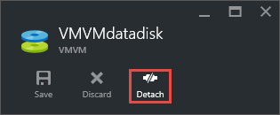

<!-- Ibiza portal: tested -->

<properties
	pageTitle="从 Windows VM 分离数据磁盘 | Azure"
	description="了解如何从使用 Resource Manager 部署模型的 Azure 中的虚拟机分离磁盘。"
	services="virtual-machines-windows"
	documentationCenter=""
	authors="cynthn"
	manager="timlt"
	editor=""
	tags="azure-service-management"/>

<tags
	ms.service="virtual-machines-windows"
	ms.date="06/02/2016"
	wacn.date="07/11/2016"/>

# 如何从 Windows 虚拟机分离数据磁盘

当你不再需要附加到虚拟机的数据磁盘时，你可以轻松地分离它。这将从虚拟机中删除磁盘，但不会从存储中删除它。

> [AZURE.WARNING] 如果你分离磁盘，它将不会自动删除。如果你订阅了高级存储，则将继续承担该磁盘的存储费用。有关详细信息，请参阅[使用高级存储时的定价和计费方式](/documentation/articles/storage-premium-storage/#pricing-and-billing)。

若果你希望再次使用磁盘上的现有数据，可以将其重新附加到相同的虚拟机或另一个虚拟机。

## 使用门户分离数据磁盘

1. 在门户中心中，选择“虚拟机”。

2. 选择具有要分离的数据磁盘的虚拟机，然后单击“所有设置”。

3. 在“设置”边栏选项卡中，选择“磁盘”。

4. 在“磁盘”边栏选项卡中，选择要分离的数据磁盘。

5. 在该数据磁盘的边栏选项卡中，单击“分离”。

	

磁盘保留在存储中，但不再附加到虚拟机。

## 使用 PowerShell 分离数据磁盘

在此示例中，第一个命令将获取使用 Get-AzureRmVM cmdlet 的 **RG11** 资源组中名为 **MyVM07** 的虚拟机。该命令在 **$VirtualMachine** 变量中存储虚拟机。

第二个命令将从虚拟机中删除名为 DataDisk3 的数据磁盘。

最后一个命令将更新虚拟机的状态以完成数据磁盘删除过程。

	$VirtualMachine = Get-AzureRmVM -ResourceGroupName "RG11" -Name "MyVM07" 
	Remove-AzureRmVMDataDisk -VM $VirtualMachine -Name "DataDisk3"
	Update-AzureRmVM -ResourceGroupName "RG11" -Name "MyVM07" -VM $VirtualMachine

有关详细信息，请参阅 [Remove-AzureRmVMDataDisk](https://msdn.microsoft.com/zh-cn/library/mt603614.aspx)

## 后续步骤

如果你想重新使用数据磁盘，只需将它[附加到另一台 VM](/documentation/articles/virtual-machines-windows-attach-disk-portal/)

<!---HONumber=Mooncake_0704_2016-->