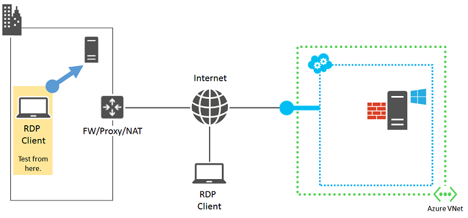
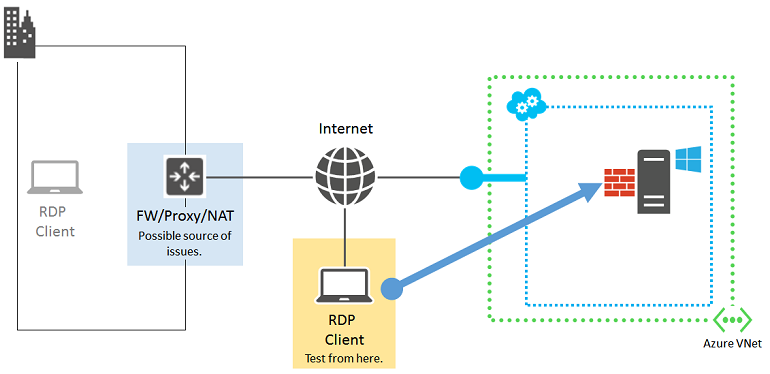
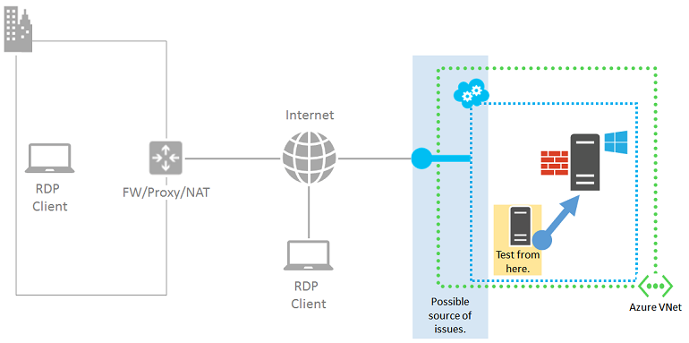
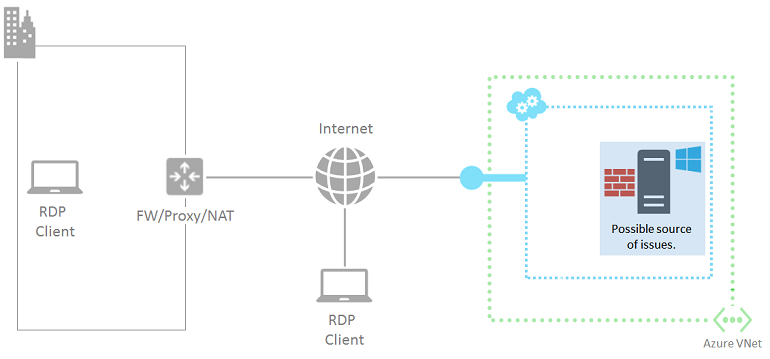

<properties
	pageTitle="详细的远程桌面疑难解答 | Azure"
	description="查看详细的疑难解答步骤，了解如何处理无法在 Azure 中连接到 Windows 虚拟机的远程桌面问题"
	services="virtual-machines-windows"
	documentationCenter=""
	authors="iainfoulds"
	manager="timlt"
	editor=""
	tags="top-support-issue,azure-service-management,azure-resource-manager"
	keywords="无法连接到远程桌面, 远程桌面故障排除, 远程桌面无法连接, 远程桌面错误, 远程桌面故障排除, 远程桌面问题"/>  

<tags
	ms.service="virtual-machines-windows"
	ms.workload="infrastructure-services"
	ms.tgt_pltfrm="vm-windows"
	ms.devlang="na"
	ms.topic="support-article"
	ms.date="12/20/2016"
	wacn.date="03/01/2017"
	ms.author="iainfou"/>  

# 详细故障排除步骤：针对 Azure 中到 Windows VM 的远程桌面连接问题

本文提供详细的故障排除步骤，用于为基于 Windows 的 Azure 虚拟机诊断和修复复杂的远程桌面错误。

> [AZURE.IMPORTANT] 若要排除更常见的远程桌面错误，请务必先阅读[远程桌面的基本故障排除文章](/documentation/articles/virtual-machines-windows-troubleshoot-rdp-connection/)，然后再继续。

可能会出现远程桌面错误消息，其不同于[基本远程桌面故障排除指南](/documentation/articles/virtual-machines-windows-troubleshoot-rdp-connection/)中介绍的所有特定错误消息。请按照这些步骤确定远程桌面 (RDP) 客户端为何无法连接到 Azure VM 上的 RDP 服务。

[AZURE.INCLUDE [了解部署模型](../../includes/learn-about-deployment-models-both-include.md)]

如果你对本文中的任何观点存在疑问，可以联系 [MSDN Azure 和 CSDN Azure](/support/forums/) 上的 Azure 专家。或者，你也可以提出 Azure 支持事件。请转到 [Azure 支持站点](/support/contact/)并单击“获取支持”。有关使用 Azure 支持的信息，请阅读 [Azure 支持常见问题](/support/faq/)。

## 远程桌面连接的组件

以下是 RDP 连接所涉及的组件：

  

继续前，可能会有助于回想自上次远程桌面成功连接到 VM 后发生的变化。例如：

- 更改了 VM 的公共 IP 地址或包含 VM 的云服务（也称为虚拟 IP 地址 [VIP](https://en.wikipedia.org/wiki/Virtual_IP_address)）。RDP 失败的原因可能是 DNS 客户端缓存仍使用旧的 IP 地址注册 DNS 名称。请刷新 DNS 客户端缓存，并尝试重新连接 VM。或者，尝试直接使用新 VIP 进行连接。
- 当前使用第三方应用程序管理远程桌面连接，而不是使用 Azure 门户生成的连接。验证应用程序配置是否包含适用于远程桌面流量的 TCP 端口。可以通过在 [Azure 门户](https://portal.azure.cn)中单击 VM 的“设置”>“终结点”来检查经典虚拟机的此端口。

## 预备步骤

在继续进行详细故障排除前，

- 在 Azure 经典管理门户或 Azure 门户中，通过虚拟机的状态检查是否有任何明显问题。
- 按照[基本故障排除指南中常见 RDP 错误的快速修复步骤](/documentation/articles/virtual-machines-windows-troubleshoot-rdp-connection/#quick-troubleshooting-steps)进行操作。

在执行这些步骤后，尝试通过远程桌面重新连接到 VM。

## 详细故障排除步骤

由于以下源出现问题，远程桌面客户端可能无法访问 Azure VM 上的远程桌面服务：

- [远程桌面客户端计算机](#source-1-remote-desktop-client-computer)
- [组织 Intranet 边缘设备](#source-2-organization-intranet-edge-device)
- [云服务终结点和访问控制列表 (ACL)](#source-3-cloud-service-endpoint-and-acl)
- [网络安全组](#source-4-network-security-groups)
- [基于 Windows 的 Azure VM](#source-5-windows-based-azure-vm)

## 来源 1：远程桌面客户端计算机

验证计算机是否可以与本地另一台基于 Windows 的计算机建立远程桌面连接。

  

如果不能，请检查计算机上的以下设置：

- 阻止远程桌面流量的本地防火墙设置。
- 阻止远程桌面连接的本地安装的客户端代理软件。
- 阻止远程桌面连接的本地安装的网络监视软件。
- 阻止远程桌面连接的其他类型的安全软件，该软件监视流量或允许/禁止特定类型的流量。

针对上述所有情况，请暂时禁用可疑软件，然后尝试通过远程桌面连接到本地计算机。如果可以通过这种方式找出实际原因，请与网络管理员合作更正软件设置，以允许远程桌面连接。

## 来源 2：整理 Intranet 边缘设备

验证直接连接到 Internet 的计算机是否可以与 Azure 虚拟机建立远程桌面连接。

  

如果没有直接连接到 Internet 的计算机，则可以在资源组或云服务中创建新的 Azure 虚拟机并使用它进行测试。有关详细信息，请参阅[在 Azure 中创建运行 Windows 的虚拟机](/documentation/articles/virtual-machines-windows-hero-tutorial/)。在测试后，可以删除该虚拟机和资源组或云服务。

如果可以与直接连接到 Internet 的计算机建立远程桌面连接，检查组织的 Intranet 边缘设备中是否有以下问题：

- 内部防火墙阻止 HTTPS 连接到 Internet。
- 代理服务器阻止远程桌面连接。
- 边缘网络设备上运行的入侵检测或网络监视软件阻止远程桌面连接。

与网络管理员合作更正组织 Intranet 边缘设备的设置，以允许与 Internet 建立基于 HTTPS 的远程桌面连接。

## 来源 3：云服务终结点和 ACL

对于使用经典部署模型创建的 VM，验证同一云服务或虚拟网络中的其他 Azure VM 能否与 Azure VM 建立远程桌面连接。

  

> [AZURE.NOTE] 对于在资源管理器中创建的虚拟机，请跳转到[来源 4：网络安全组](#source-4-network-security-groups)。

如果同一云服务或虚拟网络中没有其他虚拟机，可自行创建。执行[创建在 Azure 中运行 Windows 的虚拟机](/documentation/articles/virtual-machines-windows-hero-tutorial/)中的步骤。测试完成后，删除测试虚拟机。

如果可以通过远程桌面连接到同一云服务或虚拟网络中的虚拟机，请检查以下设置：

- 目标 VM 上远程桌面通信的终结点配置：终结点的专用 TCP 端口必须与 VM 的远程桌面服务正在侦听的 TCP 端口（默认值为 3389）匹配。
- 目标 VM 上远程桌面通信终结点的 ACL：ACL 可根据源 IP 地址，指定允许或拒绝从 Internet 传入的流量。错误配置 ACL 可能会阻止传入远程桌面流量到达终结点。检查 ACL 以确保允许从代理服务器或其他边缘服务器的公共 IP 地址传入的流量。有关详细信息，请参阅[什么是网络访问控制列表 (ACL)？](/documentation/articles/virtual-networks-acl/)

要检查终结点是否是问题的源，删除当前终结点，然后创建新终结点，并选择范围 49152-65535 中的随机端口作为外部端口号。有关详细信息，请参阅[如何对虚拟机设置终结点](/documentation/articles/virtual-machines-windows-classic-setup-endpoints/)。

## 来源 4：网络安全组

使用网络安全组可以对允许的入站和出站流量进行更好的控制。你可以创建跨 Azure 虚拟网络中的子网和云服务的规则。检查你的网络安全组规则，以确保允许来自 Internet 的远程桌面流量：

- 请在 Azure 门户中选择你的 VM
- 单击“所有设置”|“网络接口”，然后选择你的网络接口。
- 单击“所有设置”|“网络安全组”，然后选择你的网络安全组。
- 单击“所有设置”|“入站安全规则”，并确保 TCP 端口 3389 上有允许 RDP 的规则。
	- 如果尚无规则，请单击“添加”创建规则。输入 **TCP** 作为协议，然后输入 **3389** 用作目标端口范围。
	- 确保将操作设置为“允许”，然后单击“确定”保存新的入站规则。

有关详细信息，请参阅[什么是网络安全组 (NSG)？](/documentation/articles/virtual-networks-nsg/)

## 来源 5：基于 Windows 的 Azure VM

  

使用 [Azure IaaS (Windows) 诊断程序包](https://home.diagnostics.support.microsoft.com/SelfHelp?knowledgebaseArticleFilter=2976864)查看失败是否是因 Azure 虚拟机本身导致。如果此诊断程序包无法解决**与 Azure VM 的 RDP 连接（需重启）**问题，请按照[本文](/documentation/articles/virtual-machines-windows-reset-rdp/)中的说明操作。本文会重置虚拟机上的远程桌面服务：

- 启用“远程桌面”Windows 防火墙默认规则（TCP 端口 3389）。
- 通过将 HKLM\\System\\CurrentControlSet\\Control\\Terminal Server\\fDenyTSConnections 注册表值设置为 0，启用远程桌面连接。

尝试从计算机重新连接。如果仍无法通过远程桌面连接，请检查是否存在以下可能问题：

- 远程桌面服务未在目标 VM 上运行。
- 远程桌面服务未在 TCP 端口 3389 上侦听。
- Windows 防火墙或其他本地防火墙使用阻止远程桌面通信的出站规则。
- Azure 虚拟机上运行的入侵检测或网络监视软件阻止远程桌面连接。

对于使用经典部署模型创建的 VM，可以使用与 Azure 虚拟机的远程 Azure PowerShell 会话。首先，需要安装虚拟机托管云服务的证书。转到[为 Azure 虚拟机配置安全远程 PowerShell 访问](http://gallery.technet.microsoft.com/scriptcenter/Configures-Secure-Remote-b137f2fe)，并将 **InstallWinRMCertAzureVM.ps1** 脚本文件下载到本地计算机。

接下来，安装 Azure PowerShell（如果尚未安装）。请参阅[如何安装和配置 Azure PowerShell](https://docs.microsoft.com/powershell/azureps-cmdlets-docs)。

接下来，打开 Azure PowerShell 命令提示符，并将当前文件夹更改为 **InstallWinRMCertAzureVM.ps1** 脚本文件所在的位置。若要运行 Azure PowerShell 脚本，必须设置正确的执行策略。运行 **Get-ExecutionPolicy** 命令，以确定当前的策略级别。有关设置相应级别的信息，请参阅 [Set-ExecutionPolicy](https://technet.microsoft.com/zh-cn/library/hh849812.aspx)。

接下来，填写 Azure 订阅名称、云服务名称和虚拟机名称（删除 < and > 字符），然后运行这些命令。

	$subscr="<Name of your Azure subscription>"
	$serviceName="<Name of the cloud service that contains the target virtual machine>"
	$vmName="<Name of the target virtual machine>"
	.\InstallWinRMCertAzureVM.ps1 -SubscriptionName $subscr -ServiceName $serviceName -Name $vmName

可以从 **Get-AzureSubscription** 命令显示的 _SubscriptionName_ 属性获取正确的订阅名称。可以从 Get-AzureVM 命令显示的 ServiceName 列中获取虚拟机的云服务名称。

检查是否有新的证书。打开当前用户的“证书”管理单元，然后在“受信任的根证书颁发机构\\证书”文件夹中查找。在“颁发给”列中应显示包含云服务的 DNS 名称的证书（示例：cloudservice4testing.chinacloudapp.cn）。

接下来，使用以下命令启动远程 Azure PowerShell 会话。

	$uri = Get-AzureWinRMUri -ServiceName $serviceName -Name $vmName
	$creds = Get-Credential
	Enter-PSSession -ConnectionUri $uri -Credential $creds

输入有效的管理员凭据后，应显示类似以下 Azure PowerShell 提示符的信息：

	[cloudservice4testing.chinacloudapp.cn]: PS C:\Users\User1\Documents>

此提示的第一部分是包含目标 VM 的云服务名称，可能与于“cloudservice4testing.chinacloudapp.cn”不同。现在，可对此云服务发出 Azure PowerShell 命令来调查上述问题并更正配置。

### 手动更正远程桌面服务侦听 TCP 端口

如果无法针对**与 Azure VM 的 RDP 连接（需重启）**问题运行 [Azure IaaS (Windows) 诊断程序包](https://home.diagnostics.support.microsoft.com/SelfHelp?knowledgebaseArticleFilter=2976864)，请在远程 Azure PowerShell 会话提示符下运行此命令。

	Get-ItemProperty -Path "HKLM:\System\CurrentControlSet\Control\Terminal Server\WinStations\RDP-Tcp" -Name "PortNumber"

PortNumber 属性显示当前端口号。如果需要，可使用此命令将远程桌面端口号更改回其默认值 (3389)。

	Set-ItemProperty -Path "HKLM:\System\CurrentControlSet\Control\Terminal Server\WinStations\RDP-Tcp" -Name "PortNumber" -Value 3389

使用此命令验证是否已将端口更改为 3389。

	Get-ItemProperty -Path "HKLM:\System\CurrentControlSet\Control\Terminal Server\WinStations\RDP-Tcp" -Name "PortNumber"

使用此命令退出远程 Azure PowerShell 会话。

	Exit-PSSession

验证 Azure VM 的远程桌面终结点是否也使用 TCP 端口 3398 作为其内部端口。重启 Azure VM，并重新尝试远程桌面连接。

## 其他资源

[Azure IaaS (Windows) 诊断程序包](https://home.diagnostics.support.microsoft.com/SelfHelp?knowledgebaseArticleFilter=2976864)

[如何为 Windows 虚拟机重置密码或远程桌面服务](/documentation/articles/virtual-machines-windows-reset-rdp/)

[如何安装和配置 Azure PowerShell](https://docs.microsoft.com/powershell/azureps-cmdlets-docs)

[对基于 Linux 的 Azure 虚拟机的 Secure Shell (SSH) 连接进行故障排除](/documentation/articles/virtual-machines-linux-troubleshoot-ssh-connection/)

[对在 Azure 虚拟机上运行的应用程序的访问进行故障排除](/documentation/articles/virtual-machines-windows-troubleshoot-app-connection/)

<!---HONumber=Mooncake_Quality_Review_1202_2016-->