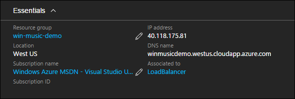
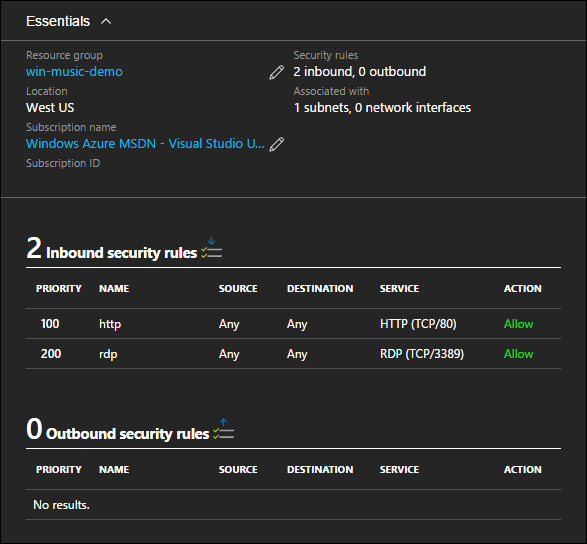

<properties
    pageTitle="Azure Resource Manager 模板中的访问权限和安全性 | Azure"
    description="Azure 虚拟机 DotNet Core 教程"
    services="virtual-machines-windows"
    documentationcenter="virtual-machines"
    author="neilpeterson"
    manager="timlt"
    editor="tysonn"
    tags="azure-resource-manager" />  

<tags
    ms.assetid="e671fc45-5e4d-40fd-aac5-290892713cc0"
    ms.service="virtual-machines-windows"
    ms.devlang="na"
    ms.topic="article"
    ms.tgt_pltfrm="vm-windows"
    ms.workload="infrastructure-services"
    ms.date="11/21/2016"
    wacn.date=""
    ms.author="nepeters" />  

# Azure Resource Manager 模板中的访问权限和安全性
可能需要通过 Internet 或与 Azure 建立的 VPN/Express Route 连接才能访问托管在 Azure 中的应用程序。在音乐应用商店应用程序示例中，网站通过公共 IP 地址在 Internet 上提供访问。建立访问方式后，应该保护对应用程序的连接，以及对虚拟机资源本身的访问。这种访问安全性是通过网络安全组提供的。

本文档详细说明如何在示例 Azure Resource Manager 模板中保护音乐应用商店应用程序。所有依赖项和独特配置都已突出显示。为了获得最佳体验，请将一个解决方案实例预先部署到 Azure 订阅，然后将它与 Azure Resource Manager 模板配合运行。可以在 [Windows 上的音乐应用商店部署](https://github.com/Microsoft/dotnet-core-sample-templates/tree/master/dotnet-core-music-windows)中找到完整模板。

## 公共 IP 地址
若要提供对 Azure 资源的公共访问，可以使用公共 IP 地址。可以使用静态或动态 IP 地址来配置公共 IP 地址。如果使用动态地址，当虚拟机被停止和解除分配时，系统将删除该地址。当计算机重新启动时，系统可能为它分配不同的公共 IP 地址。若要防止 IP 地址更改，可以使用保留 IP 地址。

可通过使用 Visual Studio 中的“添加新资源向导”或者在模板中插入有效 JSON，将公共 IP 地址添加到 Azure Resource Manager 模板中。

单击以下链接可查看 Resource Manager 模板中的 JSON 示例 – [公共 IP 地址](https://github.com/Microsoft/dotnet-core-sample-templates/blob/master/dotnet-core-music-windows/azuredeploy.json#L110)。

>[AZURE.NOTE] 必须修改下载的模板，以适应 Azure 中国云环境。例如，替换某些终结点（将“blob.core.windows.net”替换为“blob.core.chinacloudapi.cn”，将“cloudapp.azure.com”替换为“chinacloudapp.cn”，将“database.windows.net”替换为“database.chinacloudapi.cn”）；更改某些不受支持的 VM 映像；更改某些不受支持的 VM 大小。

    {
      "apiVersion": "2015-06-15",
      "type": "Microsoft.Network/publicIPAddresses",
      "name": "[variables('publicIpAddressName')]",
      "location": "[resourceGroup().location]",
      "dependsOn": [],
      "tags": {
        "displayName": "public-ip"
      },
      "properties": {
        "publicIPAllocationMethod": "Dynamic",
        "dnsSettings": {
          "domainNameLabel": "[parameters('publicipaddressDnsName')]"
        }
      }
    }

公共 IP 地址可与虚拟网络适配器或负载均衡器关联。在本示例中，由于音乐应用商店网站的负载在多个虚拟机之间均衡，因此公共 IP 地址已附加到负载均衡器。

单击以下链接可查看 Resource Manager 模板中的 JSON 示例 – [公共 IP 地址与负载均衡器的关联](https://github.com/Microsoft/dotnet-core-sample-templates/blob/master/dotnet-core-music-windows/azuredeploy.json#L211)。

    "frontendIPConfigurations": [
      {
        "properties": {
          "publicIPAddress": {
            "id": "[resourceId('Microsoft.Network/publicIPAddresses', variables('publicIpAddressName'))]"
          }
        },
        "name": "LoadBalancerFrontend"
      }
    ]

Azure 门户预览中显示的公共 IP 地址。请注意，公共 IP 地址与负载均衡器而不是虚拟机关联。本系列教程的下一篇文档详细介绍了网络负载均衡器。

  

有关 Azure 公共 IP 地址的详细信息，请参阅 [Azure 中的 IP 地址](/documentation/articles/virtual-network-ip-addresses-overview-arm/)。

## 网络安全组
与 Azure 资源建立访问后，应该对此访问进行限制。对于 Azure 虚拟机，可以使用网络安全组来实现保护访问的目的。在音乐应用商店应用程序示例中，除了通过端口 80 进行的 http 访问和通过端口 3389 进行的 RDP 访问以外，所有对虚拟机的访问都受到限制。可通过使用 Visual Studio 中的“添加新资源向导”或者在模板中插入有效 JSON，将网络安全组添加到 Azure Resource Manager 模板中。

单击以下链接可查看 Resource Manager 模板中的 JSON 示例 – [网络安全组](https://github.com/Microsoft/dotnet-core-sample-templates/blob/master/dotnet-core-music-windows/azuredeploy.json#L57)。

    {
      "apiVersion": "2016-03-30",
      "type": "Microsoft.Network/networkSecurityGroups",
      "name": "[variables('networkSecurityGroup')]",
      "location": "[resourceGroup().location]",
      "tags": {
        "displayName": "network-security-group"
      },
      "properties": {
        "securityRules": [
          {
            "name": "http",
            "properties": {
              "description": "http endpoint",
              "protocol": "Tcp",
              "sourcePortRange": "*",
              "destinationPortRange": "80",
              "sourceAddressPrefix": "*",
              "destinationAddressPrefix": "*",
              "access": "Allow",
              "priority": 100,
              "direction": "Inbound"
            }
          },
          ........<truncated> 
        ]
      }
    },

在本示例中，网络安全组与虚拟网络资源中声明的子网对象关联。

单击以下链接可查看 Resource Manager 模板中的 JSON 示例 – [网络安全组与虚拟网络的关联](https://github.com/Microsoft/dotnet-core-sample-templates/blob/master/dotnet-core-music-windows/azuredeploy.json#L143)。

    "subnets": [
      {
        "name": "[variables('subnetName')]",
        "properties": {
          "addressPrefix": "10.0.0.0/24",
          "networkSecurityGroup": {
            "id": "[resourceId('Microsoft.Network/networkSecurityGroups', variables('networkSecurityGroup'))]"
          }
        }
      }
    ]

Azure 门户预览中的网络安全组如下所示。请注意，NSG 可与子网和/或网络接口关联。在本例中，NSG 与子网关联。在此配置中，入站规则应用到与子网连接的所有虚拟机。

  

有关网络安全组的深入信息，请参阅[什么是网络安全组](/documentation/articles/virtual-networks-nsg/)。

## 后续步骤

[步骤 3 - Azure Resource Manager 模板的可用性和缩放](/documentation/articles/virtual-machines-windows-dotnet-core-4-availability-scale/)

<!---HONumber=Mooncake_1212_2016-->