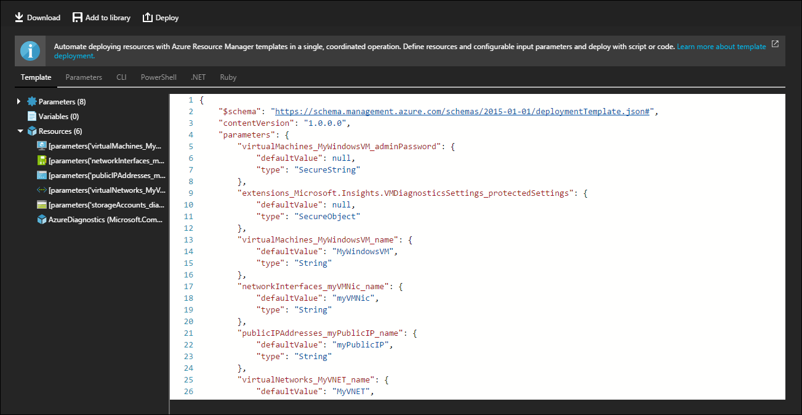

<properties
    pageTitle="导出包含 VM 扩展的 Azure 资源组 | Azure"
    description="导出包含虚拟机扩展的 Resource Manager 模板。"
    services="virtual-machines-windows"
    documentationcenter=""
    author="neilpeterson"
    manager="timlt"
    editor=""
    tags="azure-resource-manager" />
<tags
    ms.assetid="7f4e2ca6-f1c7-4f59-a2cc-8f63132de279"
    ms.service="virtual-machines-windows"
    ms.devlang="na"
    ms.topic="article"
    ms.tgt_pltfrm="vm-windows"
    ms.workload="infrastructure-services"
    ms.date="12/05/2016"
    wacn.date="01/13/2017"
    ms.author="nepeters" />  

# 导出包含 VM 扩展的资源组

可以将 Azure 资源组导出到新的 Resource Manager 模板，然后重新部署该模板。导出过程会对现有资源进行解释，并创建一个 Resource Manager 模板，该模板在部署后会生成类似的资源组。针对包含虚拟机扩展的资源组使用资源组导出选项时，需考虑多个事项，例如扩展兼容性和受保护设置。

本文档详细介绍在使用虚拟机扩展（包括支持的扩展的列表）时如何实施资源组导出过程，以及如何处理受保护的数据。

## 支持的虚拟机扩展

提供多种虚拟机扩展。并非所有扩展都可以使用“自动化脚本”功能导出到 Resource Manager 模板中。如果某个虚拟机扩展不受支持，则需通过手动方式将其重新放置到导出的模板中。

以下扩展可以使用自动化脚本功能导出。

| 分机 |||
|---|---|---|
| 针对 Linux 进行的 OS 修补 | VM 快照 Linux| Docker 扩展 |
| Bg 信息 | DSC 扩展 | Trend Micro DSA |
| 自定义脚本 | IaaS 反恶意软件 | 自定义脚本扩展 |
| IaaS 诊断 | 适用于 Linux 的 VM 访问权限 | 适用于 Linux 的自定义脚本 |
| 适用于 Linux 的 VM 访问权限 | Linux 诊断 | VM 快照 |

## 导出资源组

若要将资源组导出到可重用模板中，请完成以下步骤：

1. 登录到 Azure 门户预览
2. 在“中心”菜单上，单击“资源组”
3. 从列表中选择目标资源组
4. 在“资源组”边栏选项卡中，单击“自动化脚本”

  

Azure Resource Manager 自动化脚本生成一个 Resource Manager 模板、一个参数文件以及多个示例部署脚本（例如 PowerShell 和 Azure CLI）。目前可以使用下载按钮下载导出的模板、将其作为新模板添加到模板库，或使用部署按钮重新对其进行部署。

## 配置受保护的设置

许多 Azure 虚拟机扩展包括受保护的设置配置，用于加密敏感数据（例如凭据和配置字符串）。受保护的设置不可通过自动化脚本导出。可以根据需要将受保护的设置重新插入到导出的模板中。

### 步骤 1 - 删除模板参数

导出资源组时，会创建单个模板参数，为导出的受保护设置提供值。可以删除此参数。若要删除此参数，可通过参数列表查找并删除看起来类似于此 JSON 示例的参数。

    "extensions_extensionname_protectedSettings": {
        "defaultValue": null,
        "type": "SecureObject"
    }

### 步骤 2 - 获取受保护设置属性

由于每个受保护的设置都有一组必需的属性，因此需收集这些属性的列表。可以在 [Azure Resource Manager schema on GitHub](https://raw.githubusercontent.com/Azure/azure-resource-manager-schemas/master/schemas/2015-08-01/Microsoft.Compute.json)（GitHub 上的 Azure Resource Manager 架构）中查找受保护设置配置的每个参数。此架构仅包括本文档概述部分列出的扩展的参数集。

从架构存储库中搜索所需的扩展（在本示例中为 `IaaSDiagnostics`）。找到扩展的 `protectedSettings` 对象以后，记下每个参数。以 `IaasDiagnostic` 扩展为例，所需参数为 `storageAccountName`、`storageAccountKey` 和 `storageAccountEndPoint`。

    "protectedSettings": {
        "type": "object",
        "properties": {
            "storageAccountName": {
                "type": "string"
            },
            "storageAccountKey": {
                "type": "string"
            },
            "storageAccountEndPoint": {
                "type": "string"
            }
        },
        "required": [
            "storageAccountName",
            "storageAccountKey",
            "storageAccountEndPoint"
        ]
    }

### 步骤 3 - 重新创建受保护的配置

在导出的模板中，搜索 `protectedSettings` 并将导出的受保护设置对象替换为新的对象，其中包括所需的扩展参数以及每个参数的值。

以 `IaasDiagnostic` 扩展为例，新的受保护设置配置将如以下示例所示：

    "protectedSettings": {
        "storageAccountName": "[parameters('storageAccountName')]",
        "storageAccountKey": "[parameters('storageAccountKey')]",
        "storageAccountEndPoint": "https://core.chinacloudapi.cn"
    }

最终的扩展资源看起来类似于以下 JSON 示例：

    {
        "name": "Microsoft.Insights.VMDiagnosticsSettings",
        "type": "extensions",
        "location": "[resourceGroup().location]",
        "apiVersion": "[variables('apiVersion')]",
        "dependsOn": [
            "[concat('Microsoft.Compute/virtualMachines/', variables('vmName'))]"
        ],
        "tags": {
            "displayName": "AzureDiagnostics"
        },
        "properties": {
            "publisher": "Microsoft.Azure.Diagnostics",
            "type": "IaaSDiagnostics",
            "typeHandlerVersion": "1.5",
            "autoUpgradeMinorVersion": true,
            "settings": {
                "xmlCfg": "[base64(concat(variables('wadcfgxstart'), variables('wadmetricsresourceid'), variables('vmName'), variables('wadcfgxend')))]",
                "storageAccount": "[parameters('existingdiagnosticsStorageAccountName')]"
            },
            "protectedSettings": {
                "storageAccountName": "[parameters('storageAccountName')]",
                "storageAccountKey": "[parameters('storageAccountKey')]",
                "storageAccountEndPoint": "https://core.chinacloudapi.cn"
            }
        }
    }

如果使用模板参数提供属性值，则需创建这些参数。为受保护的设置值创建模板参数时，请确保使用 `SecureObject` 参数类型，以便保护敏感值。如需详细了解如何使用参数，请参阅[创作 Azure Resource Manager 模板](/documentation/articles/resource-group-authoring-templates/)。

以 `IaasDiagnostic` 扩展为例，将在 Resource Manager 模板的参数部分创建以下参数。

    "storageAccountName": {
        "defaultValue": null,
        "type": "SecureObject"
    },
    "storageAccountKey": {
        "defaultValue": null,
        "type": "SecureObject"
    }

目前可以使用任何模板部署方法部署此模板。

<!---HONumber=Mooncake_0109_2017-->