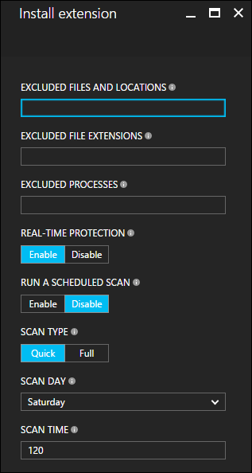

<!-- need to be verified -->

<properties
    pageTitle="虚拟机扩展和功能 | Azure"
    description="了解可为 Azure 虚拟机提供的扩展，这些虚拟机扩展按它们提供或改进的功能进行分组。"
    services="virtual-machines-windows"
    documentationcenter=""
    author="neilpeterson"
    manager="timlt"
    editor=""
    tags="azure-service-management,azure-resource-manager" />
<tags 
    ms.assetid="999d63ee-890e-432e-9391-25b3fc6cde28"
    ms.service="virtual-machines-windows"
    ms.devlang="na"
    ms.topic="article"
    ms.tgt_pltfrm="vm-windows"
    ms.workload="infrastructure-services"
    ms.date="12/08/2016"
    wacn.date="01/20/2017"
    ms.author="nepeters" />

# 关于虚拟机扩展和功能

Azure 虚拟机扩展是小型应用程序，可在Azure 虚拟机上提供部署后配置和自动化任务。例如，如果虚拟机要求安装软件、防病毒保护或 Docker 配置，便可以使用 VM 扩展来完成这些任务。可以使用 Azure CLI、PowerShell、Resource Manager 模板和 Azure 门户预览运行 Azure VM 扩展。扩展可与新虚拟机部署捆绑在一起，或者针对任何现有系统运行。

本文档提供虚拟机扩展的概述、使用 Azure 虚拟机扩展的先决条件，以及有关如何检测、管理和删除虚拟机扩展的指南。由于有许多 VM 扩展可用，每个扩展可能具有唯一的配置，因此本文档提供通用信息。扩展特定的详细信息可在每个特定于单个扩展的文档中找到。

## 用例和示例

有许多不同的 Azure VM 扩展可用，每个都有特定用例。一些示例用例包括：

- 使用适用于 Windows 的 DSC 扩展将 PowerShell 所需状态配置应用于虚拟机。有关详细信息，请参阅 [Azure Desired State configuration extension](/documentation/articles/virtual-machines-windows-extensions-dsc-overview/)（Azure Desired State Configuration 扩展）。
- 使用 Datadog 扩展配置 Azure 基础结构监视功能。有关详细信息，请参阅 [Datadog 博客](https://www.datadoghq.com/blog/introducing-azure-monitoring-with-one-click-datadog-deployment/)。
- 使用 Chef 配置 Azure 虚拟机。有关详细信息，请参阅[使用 Chef 自动执行 Azure 虚拟机部署](/documentation/articles/virtual-machines-windows-chef-automation/)。

除了进程特定的扩展外，自定义脚本扩展也可用于 Windows 和 Linux 虚拟机。适用于 Windows 的自定义脚本扩展允许在虚拟机上运行任何 PowerShell 脚本。在设计需要本机 Azure 工具无法提供的配置的 Azure 部署时，这很有用。有关详细信息，请参阅 [Windows VM 自定义脚本扩展](/documentation/articles/virtual-machines-windows-extensions-customscript/)。

若要完成在端到端应用程序部署中使用 VM 扩展的示例，请查看[将应用程序自动部署到 Azure 虚拟机](/documentation/articles/virtual-machines-windows-dotnet-core-1-landing/)。

## 先决条件

每个虚拟机扩展可能都有其自己的一组先决条件。例如，Docker VM 扩展有支持的 Linux 分发的先决条件。特定于扩展的文档中详细介绍了单个扩展的要求。

### Azure VM 代理
Azure VM 代理可管理 Azure 虚拟机与 Azure 结构控制器之间的交互。VM 代理负责部署和管理 Azure 虚拟机的许多功能层面，包括运行 VM 扩展。Azure VM 代理预先安装在 Azure 库映像上，并可安装在支持的操作系统上。

若要了解支持的操作系统和安装说明，请参阅 [Azure 虚拟机代理](/documentation/articles/virtual-machines-windows-classic-agents-and-extensions/)。

## 发现 VM 扩展
有许多不同的 VM 扩展可与 Azure 虚拟机配合使用。若要查看完整列表，请使用 Azure Resource Manager PowerShell 模块运行以下命令。运行此命令时请确保指定所需的位置。

    Get-AzureRmVmImagePublisher -Location ChinaNorth | `
    Get-AzureRmVMExtensionImageType | ` 
    Get-AzureRmVMExtensionImage | Select Type, Version

## 运行 VM 扩展

Azure 虚拟机扩展可以在现有虚拟机上运行，当需要在已部署的 VM 上进行配置更改或恢复连接时，这很有用。VM 扩展还可以与 Azure Resource Manager 模板部署捆绑。将扩展与 Resource Manager 模板配合使用使 Azure 虚拟机可进行部署和配置，而无需部署后干预。

可使用以下方法针对现有虚拟机运行扩展。

### PowerShell

存在多个用于运行单个扩展的 PowerShell 命令。若要查看列表，请运行以下 PowerShell 命令：

    get-command Set-AzureRM*Extension* -Module AzureRM.Compute

这提供类似如下的输出：

    CommandType     Name                                               Version    Source
    -----------     ----                                               -------    ------
    Cmdlet          Set-AzureRmVMAccessExtension                       2.2.0      AzureRM.Compute
    Cmdlet          Set-AzureRmVMADDomainExtension                     2.2.0      AzureRM.Compute
    Cmdlet          Set-AzureRmVMAEMExtension                          2.2.0      AzureRM.Compute
    Cmdlet          Set-AzureRmVMBackupExtension                       2.2.0      AzureRM.Compute
    Cmdlet          Set-AzureRmVMBginfoExtension                       2.2.0      AzureRM.Compute
    Cmdlet          Set-AzureRmVMChefExtension                         2.2.0      AzureRM.Compute
    Cmdlet          Set-AzureRmVMCustomScriptExtension                 2.2.0      AzureRM.Compute
    Cmdlet          Set-AzureRmVMDiagnosticsExtension                  2.2.0      AzureRM.Compute
    Cmdlet          Set-AzureRmVMDiskEncryptionExtension               2.2.0      AzureRM.Compute
    Cmdlet          Set-AzureRmVMDscExtension                          2.2.0      AzureRM.Compute
    Cmdlet          Set-AzureRmVMExtension                             2.2.0      AzureRM.Compute
    Cmdlet          Set-AzureRmVMSqlServerExtension                    2.2.0      AzureRM.Compute

以下示例使用自定义脚本扩展从 GitHub 存储库将脚本下载到目标虚拟机上，然后运行该脚本。有关 VM 访问扩展的详细信息，请参阅[自定义脚本扩展概述](/documentation/articles/virtual-machines-windows-extensions-customscript/)。

    Set-AzureRmVMCustomScriptExtension -ResourceGroupName "myResourceGroup" `
        -VMName "myVM" -Name "myCustomScript" `
        -FileUri "https://raw.githubusercontent.com/neilpeterson/nepeters-azure-templates/master/windows-custom-script-simple/support-scripts/Create-File.ps1" `
        -Run "Create-File.ps1" -Location "China North"

在此示例中，VM 访问扩展用于重置 Windows 虚拟机的管理密码。有关 VM 访问扩展的详细信息，请参阅[重置 Windows VM 中的远程桌面服务](/documentation/articles/virtual-machines-windows-reset-rdp/)。

    $cred=Get-Credential

    Set-AzureRmVMAccessExtension -ResourceGroupName "myResourceGroup" -VMName "myVM" -Name "myVMAccess" `
        -Location ChinaNorth -UserName $cred.GetNetworkCredential().Username `
        -Password $cred.GetNetworkCredential().Password -typeHandlerVersion "2.0"

`Set-AzureRmVMExtension` 命令可用作“捕获全部”命令或用于启动任何 VM 扩展的常规命令。有关详细信息，请参阅 [Set-AzureRmVMExtension 参考](https://msdn.microsoft.com/zh-cn/library/mt603745.aspx)。

### Azure 门户预览

可通过 Azure 门户预览将 VM 扩展应用到现有虚拟机。为此，请选择“虚拟机”-“扩展”，然后单击“添加”。执行此操作后，将提供可用扩展的列表。选择所需的扩展，显示一个用于配置的向导。

下图显示从 Azure 门户预览安装 Microsoft 反恶意软件扩展。

  

### Azure Resource Manager 模板

VM 扩展可添加到 Azure Resource Manager 模板，并在部署模板的过程中执行。使用模板部署扩展对于创建完全配置的 Azure 部署很有用。例如，以下 JSON 取自一个 Resource Manager 模板，该模板将在每个 VM 上部署一组负载均衡虚拟机、一个 Azure SQL 数据库并安装一个 .Net Core 应用程序。VM 扩展负责安装软件。

可以在[此处](https://github.com/Microsoft/dotnet-core-sample-templates/tree/master/dotnet-core-music-windows)找到完整 Resource Manager 模板。

>[AZURE.NOTE] 必须修改下载的模板，以适应 Azure 中国云环境。例如，替换某些终结点（将“blob.core.windows.net”替换为“blob.core.chinacloudapi.cn”，将“cloudapp.azure.com”替换为“chinacloudapp.cn”，将“database.windows.net”替换为“database.chinacloudapi.cn”）；更改某些不受支持的 VM 映像；更改某些不受支持的 VM 大小。

    {
        "apiVersion": "2015-06-15",
        "type": "extensions",
        "name": "config-app",
        "location": "[resourceGroup().location]",
        "dependsOn": [
        "[concat('Microsoft.Compute/virtualMachines/', variables('vmName'),copyindex())]",
        "[variables('musicstoresqlName')]"
        ],
        "tags": {
        "displayName": "config-app"
        },
        "properties": {
        "publisher": "Microsoft.Compute",
        "type": "CustomScriptExtension",
        "typeHandlerVersion": "1.4",
        "autoUpgradeMinorVersion": true,
        "settings": {
            "fileUris": [
            "https://raw.githubusercontent.com/Microsoft/dotnet-core-sample-templates/master/dotnet-core-music-windows/scripts/configure-music-app.ps1"
            ]
        },
        "protectedSettings": {
            "commandToExecute": "[concat('powershell -ExecutionPolicy Unrestricted -File configure-music-app.ps1 -user ',parameters('adminUsername'),' -password ',parameters('adminPassword'),' -sqlserver ',variables('musicstoresqlName'),'.database.chinacloudapi.cn')]"
        }
        }
    }

有关详细信息，请参阅[使用 Windows VM 扩展创作 Azure Resource Manager 模板](/documentation/articles/virtual-machines-windows-extensions-authoring-templates/)。

## 保护 VM 扩展数据

运行 VM 扩展时，可能需要提供敏感信息，例如凭据、存储帐户名称和存储帐户访问密钥。许多 VM 扩展包括用于对数据进行加密，并且仅在目标虚拟机内对数据进行解密的受保护配置。每个扩展都有特定的受保护配置架构，将在特定于扩展的文档中详细介绍每个配置架构。

以下示例演示了适用于 Windows 的自定义脚本扩展的实例。请注意，要执行的命令包含一组凭据。在此示例中，不会加密要执行的命令。

    {
        "apiVersion": "2015-06-15",
        "type": "extensions",
        "name": "config-app",
        "location": "[resourceGroup().location]",
        "dependsOn": [
        "[concat('Microsoft.Compute/virtualMachines/', variables('vmName'),copyindex())]",
        "[variables('musicstoresqlName')]"
        ],
        "tags": {
        "displayName": "config-app"
        },
        "properties": {
        "publisher": "Microsoft.Compute",
        "type": "CustomScriptExtension",
        "typeHandlerVersion": "1.4",
        "autoUpgradeMinorVersion": true,
        "settings": {
            "fileUris": [
            "https://raw.githubusercontent.com/Microsoft/dotnet-core-sample-templates/master/dotnet-core-music-windows/scripts/configure-music-app.ps1"
            ],
            "commandToExecute": "[concat('powershell -ExecutionPolicy Unrestricted -File configure-music-app.ps1 -user ',parameters('adminUsername'),' -password ',parameters('adminPassword'),' -sqlserver ',variables('musicstoresqlName'),'.database.chinacloudapi.cn')]"
        }
        }
    }

将“要执行的命令”属性移到受保护配置可保护执行字符串。

    {
        "apiVersion": "2015-06-15",
        "type": "extensions",
        "name": "config-app",
        "location": "[resourceGroup().location]",
        "dependsOn": [
        "[concat('Microsoft.Compute/virtualMachines/', variables('vmName'),copyindex())]",
        "[variables('musicstoresqlName')]"
        ],
        "tags": {
        "displayName": "config-app"
        },
        "properties": {
        "publisher": "Microsoft.Compute",
        "type": "CustomScriptExtension",
        "typeHandlerVersion": "1.4",
        "autoUpgradeMinorVersion": true,
        "settings": {
            "fileUris": [
            "https://raw.githubusercontent.com/Microsoft/dotnet-core-sample-templates/master/dotnet-core-music-windows/scripts/configure-music-app.ps1"
            ]
        },
        "protectedSettings": {
            "commandToExecute": "[concat('powershell -ExecutionPolicy Unrestricted -File configure-music-app.ps1 -user ',parameters('adminUsername'),' -password ',parameters('adminPassword'),' -sqlserver ',variables('musicstoresqlName'),'.database.chinacloudapi.cn')]"
        }
        }
    }

## 排查 VM 扩展的问题

每个 VM 扩展都有特定于扩展的故障排除步骤。例如，使用自定义脚本扩展时，可在运行该扩展的本地虚拟机上找到脚本执行详细信息。任何特定于扩展的故障排除步骤均在特定于扩展的文档中详细说明。

以下故障排除步骤适用于所有虚拟机扩展。

### 查看扩展状态

针对虚拟机运行虚拟机扩展后，使用以下 PowerShell 命令返回扩展状态。请将示例参数名称替换为你自己的值。`Name` 参数采用执行时提供给扩展的名称。

    Get-AzureRmVMExtension -ResourceGroupName myResourceGroup -VMName myVM -Name myExtensionName

输出与下面类似：

    ResourceGroupName       : myResourceGroup
    VMName                  : myVM
    Name                    : myExtensionName
    Location                : chinanorth
    Etag                    : null
    Publisher               : Microsoft.Azure.Extensions
    ExtensionType           : DockerExtension
    TypeHandlerVersion      : 1.0
    Id                      : /subscriptions/mySubscriptionIS/resourceGroups/myResourceGroup/providers/Microsoft.Compute/virtualMachines/myVM/extensions/myExtensionName
    PublicSettings          : 
    ProtectedSettings       :
    ProvisioningState       : Succeeded
    Statuses                :
    SubStatuses             :
    AutoUpgradeMinorVersion : False
    ForceUpdateTag          :

此外，还可以在 Azure 门户预览中找到扩展执行状态。若要查看扩展的状态，请选择“虚拟机”>“扩展”>选择所需的扩展。

### 重新运行 VM 扩展 

在某些情况下，可能需要重新运行虚拟机扩展。这可以通过删除扩展，然后使用所选执行方法重新运行扩展来实现。若要删除扩展，请使用 Azure PowerShell 模块运行以下命令。请将示例参数名称替换为你自己的值。

    Remove-AzureRmVMExtension -ResourceGroupName myResourceGroup -VMName myVM -Name myExtensionName

此外，还可以使用 Azure 门户预览来删除扩展。为此，请选择“虚拟机”>“扩展”>所需的扩展>“卸载”。

## 常见 VM 扩展参考
| 扩展名称 | 说明 | 更多信息 |
| --- | --- | --- |
| 适用于 Windows 的自定义脚本扩展 |针对 Azure 虚拟机运行脚本 |[适用于 Windows 的自定义脚本扩展](/documentation/articles/virtual-machines-windows-extensions-customscript/) |
| 适用于 Windows 的 DSC 扩展 |PowerShell DSC（所需状态配置）扩展。 |[适用于 Windows 的 DSC 扩展](/documentation/articles/virtual-machines-windows-extensions-dsc-overview/) |
| Azure 诊断扩展 |管理 Azure 诊断 |[Azure 诊断扩展](https://azure.microsoft.com/blog/windows-azure-virtual-machine-monitoring-with-wad-extension/) |
| Azure VM 访问扩展 |管理用户和凭据 |[适用于 Linux 的 VM 访问扩展](https://azure.microsoft.com/blog/using-vmaccess-extension-to-reset-login-credentials-for-linux-vm/) |

<!---HONumber=Mooncake_0116_2017-->
<!--Update_Description: add VM Extension Data Protection-->