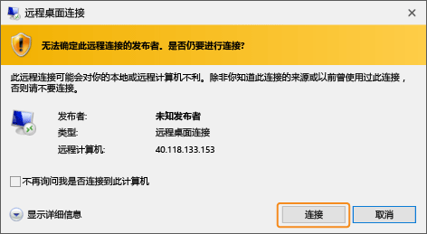
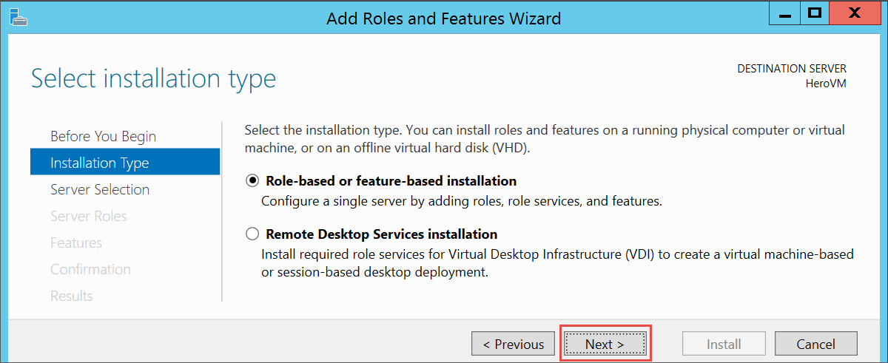
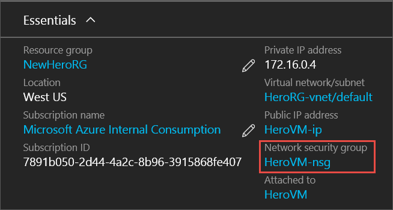
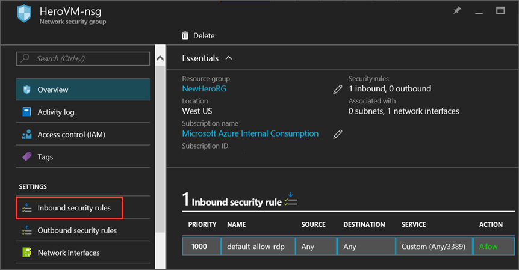
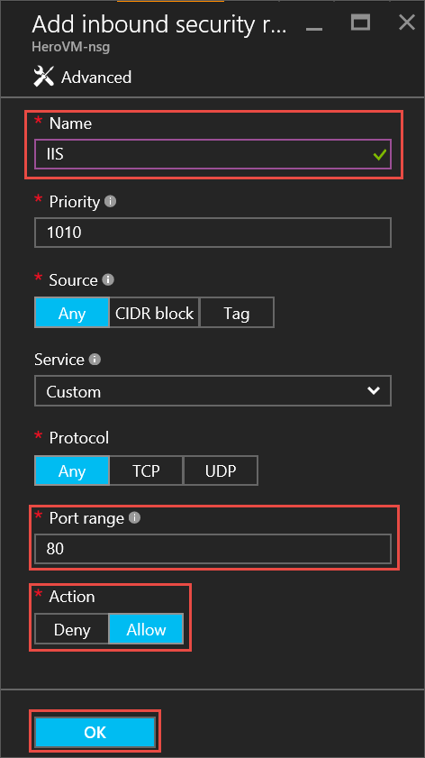
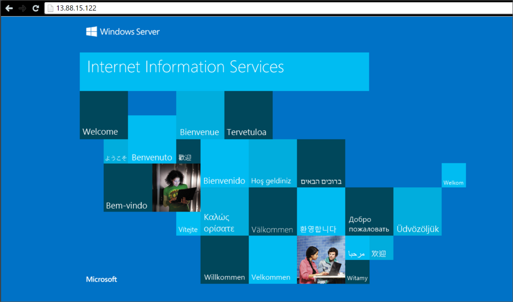

<properties
	pageTitle="在第一个 Windows VM 上安装 IIS | Azure"
	description="通过使用 Azure 门户安装 IIS 并打开端口 80，体验第一个 Windows 虚拟机。"
	keywords=""
	services="virtual-machines-windows"
	documentationCenter=""
	authors="cynthn"
	manager="timlt"
	editor=""
	tags="azure-resource-manager"/>  

<tags
	ms.service="virtual-machines-windows"
	ms.workload="infrastructure-services"
	ms.tgt_pltfrm="vm-windows"
	ms.devlang="na"
	ms.topic="article"
	ms.date="09/06/2016"
	wacn.date="10/17/2016"
	ms.author="cynthn"/>  

# 体验在 Windows VM 上安装角色
	
在第一个虚拟机 (VM) 启动并正常运行之后，可以接着安装软件和服务。本教程将使用 Windows Server VM 上的服务器管理器安装 IIS。然后，使用 Azure 门户为 IIS 流量打开端口 80，创建网络安全组 (NSG)。

如果尚未创建第一个 VM，应先返回 [Create your first Windows virtual machine in the Azure portal](/documentation/articles/virtual-machines-windows-hero-tutorial/)（在 Azure 门户中创建第一个 Windows 虚拟机），然后继续学习本教程。

## 确保 VM 正在运行

1. 打开 [Azure 门户](https://portal.azure.cn)。
2. 在中心菜单中，单击“虚拟机”。从列表中选择虚拟机。
3. 如果状态为“已停止(已解除分配)”，请单击 VM“概要”边栏选项卡上的“启动”按钮。如果状态为“正在运行”，可以转到下一步。

## 连接到虚拟机并登录

1.	在中心菜单中，单击“虚拟机”。从列表中选择虚拟机。

3. 在虚拟机边栏选项卡上，单击“连接”。随后将创建并下载远程桌面协议文件（.rdp 文件），该文件类似于用于连接计算机的快捷方式。你可以将此文件保存到桌面以便于访问。**打开**此文件以连接到 VM。

	  

4. 此时将出现 .rdp 来自未知发布者的警告。这是一般警报。在“远程桌面”窗口中，单击“连接”以继续。

	  

5. 在“Windows 安全性”窗口中，键入创建 VM 时创建的本地帐户的用户名和密码。以 *vmname*&#92;*username* 的格式输入用户名，然后单击“确定”。

	  

 	
6.	此时将出现警告，指出无法验证证书。这是一般警报。单击“是”以验证虚拟机的 ID 并完成登录。

	  

如果在尝试连接时遇到故障，请参阅 [Troubleshoot Remote Desktop connections to a Windows-based Azure Virtual Machine](/documentation/articles/virtual-machines-windows-troubleshoot-rdp-connection/)（对基于 Windows 的 Azure 虚拟机的远程桌面连接进行故障排除）。

## 在 VM 上安装 IIS

现已登录 VM，接下来请安装一个服务器角色，以便进行更多的体验。

1. 打开“服务器管理器”（如果尚未打开）。单击“启动”菜单，然后单击“服务器管理器”。
2. 在“服务器管理器”的左窗格中，选择“本地服务器”。
3. 在菜单中，选择“管理”>“添加角色和功能”。
4. 在“添加角色和功能向导”的“安装类型”页上，选择“基于角色或基于功能的安装”，然后单击“下一步”。

	  

5. 从服务器池中选择 VM，然后单击“下一步”。
6. 在“服务器角色”页上，选择“Web 服务器(IIS)”。

	  

7. 在有关添加 IIS 所需功能的弹出窗口中，确保已选择“包括管理工具”，然后单击“添加功能”。弹出窗口关闭时，请在向导中单击“下一步”。

	  

8. 在功能页上，单击“下一步”。
9. 在“Web 服务器角色(IIS)”页上，单击“下一步”。
10. 在“角色服务”页上，单击“下一步”。
11. 在“确认”页上，单击“安装”。
12. 安装完成后，在向导中单击“关闭”。

## 打开端口 80 

为使 VM 能够通过端口 80 接收入站流量，需将一个入站规则添加到网络安全组。

1. 打开 [Azure 门户](https://portal.azure.cn)。
2. 在“虚拟机”中，选择创建的 VM。
3. 在虚拟机设置中，选择“网络接口”，然后选择现有的网络接口。

	  

4. 在网络接口的“概要”中，单击“网络安全组”。

	  

5. 在 NSG 的“概要”边栏选项卡中，应有一个现有的 **default-allow-rdp** 默认输入规则用于登录 VM。稍后要添加另一个允许 IIS 流量的入站规则。单击“入站安全规则”。

	  

6. 在“入站安全规则”中，单击“添加”。

	  

7. 在“入站安全规则”中，单击“添加”。在端口范围中键入 **80**，确保已选择“允许”。完成后，单击“确定”。

	  

 
有关 NSG、入站和出站规则的详细信息，请参阅 [Allow external access to your VM using the Azure portal](/documentation/articles/virtual-machines-windows-nsg-quickstart-portal/)（使用 Azure 门户对 VM 实现外部访问）。
 
## 连接到默认 IIS 网站

1. 在 Azure 门户中，单击“虚拟机”，然后选择 VM。
2. 在“概要”边栏选项卡中，复制“公共 IP 地址”。

	  

2. 打开浏览器，在地址栏中键入类似于下面的公共 IP 地址：http://<公共 IP 地址>，然后单击 **Enter** 转到该地址。
3. 浏览器应会打开默认的 IIS 网页，如下所示：

	  

    

## 后续步骤

- 还可以体验[将数据磁盘附加到](/documentation/articles/virtual-machines-windows-attach-disk-portal/)虚拟机。数据磁盘可为虚拟机提供更多存储空间。

<!---HONumber=Mooncake_1010_2016-->