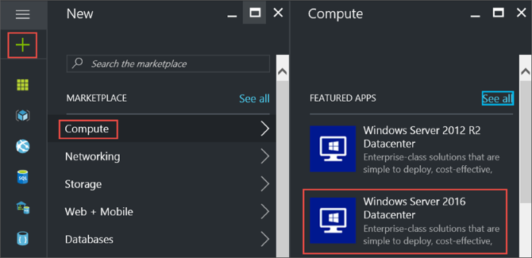
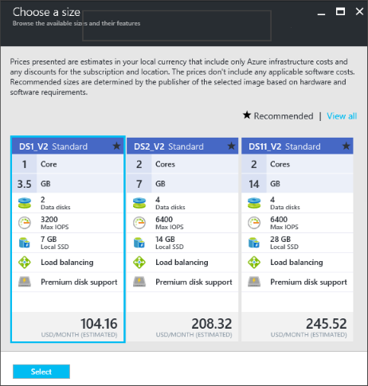

<properties
	pageTitle="创建第一个 Windows VM | Azure"
	description="了解如何使用 Azure 门户预览创建第一个 Windows 虚拟机。"
	keywords="Windows 虚拟机,创建虚拟机,虚拟计算机,设置虚拟机"
	services="virtual-machines-windows"
	documentationCenter=""
	authors="cynthn"
	manager="timlt"
	editor=""
	tags="azure-resource-manager"/>  

<tags
	ms.service="virtual-machines-windows"
	ms.workload="infrastructure-services"
	ms.tgt_pltfrm="vm-windows"
	ms.devlang="na"
	ms.topic="hero-article"
	ms.date="11/16/2016"
	wacn.date="12/30/2016"
	ms.author="cynthn"/>  

# 在 Azure 门户预览中创建第一个 Windows 虚拟机

本教程介绍如何通过 Azure 门户预览在数分钟内轻松地创建 Windows 虚拟机 (VM)。

如果没有 Azure 订阅，可在开始前创建一个[试用帐户](/pricing/1rmb-trial/)。

## 从应用商店中选择 VM 映像

我们将使用 Windows Server 2012 R2 Datacenter 映像作为示例，但这只是 Azure 提供的众多映像的其中一个。

1. 登录到 [Azure 门户预览](https://portal.azure.cn)。

2. 在“中心”菜单上，单击“新建”>“虚拟机”>“Windows Server 2012 R2 Datacenter”。

	  

3. 在“Windows Server 2012 R2 Datacenter”边栏选项卡上，确保在“选择部署模型”中选择“Resource Manager”。单击“创建”。

	  

## 创建 Windows 虚拟机

选择映像后，即可使用默认设置并快速创建虚拟机。

1. 在“基本信息”边栏选项卡上，输入虚拟机的**名称**。名称必须为 1-15 个字符，不能包含特殊字符。

2. 输入用于在 VM 上创建本地帐户的**用户名**和强**密码**。该本地帐户用于登录和管理 VM。

	密码的长度必须为 8 到 123 个字符，并且必须符合以下四个复杂性要求中的三个要求：1 个小写字符、1 个大写字符、1 个数字和 1 个特殊字符。查看有关[用户名和密码要求](/documentation/articles/virtual-machines-windows-faq/#what-are-the-username-requirements-when-creating-a-vm)的更多信息。

3. 选择现有的[资源组](/documentation/articles/resource-group-overview/#resource-groups)，或键入新资源组的名称。键入 Azure 数据中心的**位置**，例如**中国北部**。

4. 完成后，单击“确定”转到下一部分。

	  

	
5. 选择 VM [大小](/documentation/articles/virtual-machines-windows-sizes/)，然后单击“选择”继续。

	  

6. 在“设置”边栏选项卡上，可以更改存储和网络选项。就本教程来说，可以接受默认设置。如果选择了支持它的虚拟机大小，则可以通过选择“磁盘类型”中的“高级(SSD)”来试用 Azure 高级存储。完成更改后，单击“确定”。

	  

7. 单击“摘要”以查看你的选择。看到“验证通过”消息后，单击“确定”。

	  

8. 当 Azure 创建虚拟机时，可以在“中心”菜单的“虚拟机”中跟踪进度。

##  连接到虚拟机并登录

1.	在中心菜单中，单击“虚拟机”。

2.	从列表中选择虚拟机。

3. 在虚拟机边栏选项卡上，单击“连接”。随后将创建并下载远程桌面协议文件（.rdp 文件），该文件类似于用于连接计算机的快捷方式。你可以将此文件保存到桌面以便于访问。**打开**此文件以连接到 VM。

	  

4. 此时将出现 .rdp 来自未知发布者的警告。这是一般警报。在“远程桌面”窗口中，单击“连接”以继续。

	  

5. 在“Windows 安全性”窗口中，键入创建 VM 时创建的本地帐户的用户名和密码。以 *vmname*&#92;*username* 的格式输入用户名，然后单击“确定”。

	  

 	
6.	此时将出现警告，指出无法验证证书。这是一般警报。单击“是”以验证虚拟机的 ID 并完成登录。

	  

如果在尝试连接时遇到故障，请参阅 [Troubleshoot Remote Desktop connections to a Windows-based Azure Virtual Machine](/documentation/articles/virtual-machines-windows-troubleshoot-rdp-connection/)（对基于 Windows 的 Azure 虚拟机的远程桌面连接进行故障排除）。

现在可以像使用任何其他服务器一样使用该虚拟机。

## 可选：停止 VM

如果你并未真正在使用 VM，最好将它停止，以免产生费用。直接单击“停止”，然后单击“是”。

  

	
准备好再次使用 VM 时，只需单击“启动”按钮即可将它重新启动。

## 后续步骤

- [安装 IIS](/documentation/articles/virtual-machines-windows-hero-role/) 即可试用新的 VM。本教程还介绍如何使用网络安全组 (NSG) 对传入 Web 流量打开端口 80。

- 也可以[使用 PowerShell 创建 Windows VM](/documentation/articles/virtual-machines-windows-ps-create/) 或[使用 Azure CLI 创建 Linux 虚拟机](/documentation/articles/virtual-machines-linux-quick-create-cli/)。

- 如果对部署自动化感兴趣，请参阅 [Create a Windows virtual machine by using a Resource Manager template](/documentation/articles/virtual-machines-windows-ps-template/)（使用 Resource Manager 模板创建 Windows 虚拟机）。

<!---HONumber=Mooncake_Quality_Review_1118_2016-->