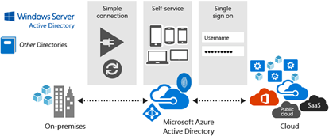

<properties
    pageTitle="使用 Azure Active Directory 的 HPC Pack 群集 | Azure"
    description="了解如何将 Azure 中的 HPC Pack 2016 群集与 Azure Active Directory 集成"
    services="virtual-machines-windows"
    documentationcenter=""
    author="dlepow"
    manager="timlt" />
<tags
    ms.assetid="9edf9559-db02-438b-8268-a6cba7b5c8b7"
    ms.service="virtual-machines-windows"
    ms.devlang="na"
    ms.topic="article"
    ms.tgt_pltfrm="vm-multiple"
    ms.workload="big-compute"
    ms.date="11/14/2016"
    wacn.date="01/20/2017"
    ms.author="danlep" />  

# 使用 Azure Active Directory 管理 Azure 中的 HPC Pack 群集
[Microsoft HPC Pack 2016](https://technet.microsoft.com/zh-cn/library/cc514029) 支持在 Azure 中部署 HPC Pack 群集的管理员将其与 [Azure Active Directory](/documentation/services/identity/) (Azure AD) 集成。

请按照本文中的步骤执行以下高级别任务：
* 手动将 HPC Pack 群集与 Azure AD 租户集成
* 在 Azure 的 HPC Pack 群集中管理和计划作业

将 HPC Pack 群集解决方案与 Azure AD 集成时按照标准步骤集成其他应用程序和服务。本文假定你熟悉 Azure AD 中的基本用户管理。有关详细信息和背景资料，请参阅 [Azure Active Directory 文档](/documentation/services/identity/)以及以下部分。

## 集成的好处

Azure Active Directory (Azure AD) 是基于多租户云的目录和标识管理服务，可提供对云解决方案的单一登录 (SSO) 访问。

HPC Pack 群集与 Azure AD 集成可帮助用户实现以下目标：

* 从 HPC Pack 群集中删除传统的 Active Directory 域控制器。这可以帮助减少维护群集的成本（如果这对于业务是不必要的）并加速执行部署过程。
* 利用 Azure AD 带来的以下好处：
    *   单一登录
    *   对 Azure 中的 HPC Pack 群集使用本地 AD 标识

      

## 先决条件
* **在 Azure 虚拟机中部署的 HPC Pack 2016 群集** - 需要获得头节点的 DNS 名称和群集管理员的凭据才能完成本文中的步骤。

    > [AZURE.NOTE]
    在 HPC Pack 2016 之前的 HPC Pack 版本中不支持 Azure Active Directory 集成。

* **客户端计算机** - 需要有可运行 HPC Pack 客户端实用工具的 Windows 或 Windows Server 客户端计算机。如果只想使用 HPC Pack Web 门户或 REST API 来提交作业，则可以使用自选的任意客户端计算机。

* **HPC Pack 客户端实用工具** - 使用 Microsoft 下载中心提供的免费安装包在客户端计算机上安装 HPC Pack 客户端实用工具。

## 步骤 1：将 HPC 群集服务器注册到 Azure AD 租户
1. 登录 [Azure 经典管理门户](https://manage.windowsazure.cn)。
2. 在左侧菜单中单击“Active Directory”，然后单击订阅中所需的目录。你必须有权访问该目录中的资源。
3. 单击“用户”，并确保有用户帐户已创建或已配置。
4. 单击“应用程序”>“添加”，然后单击“添加我的组织正在开发的应用程序”。在向导中输入以下信息：
    * **名称** - HPCPackClusterServer
    * **类型** - 选择“Web 应用程序和/或 Web API”
    * **登录 URL** - 示例的基 URL，默认情况下为 `https://hpcserver`
    * **应用 ID URI** - `https://<Directory_name>/<application_name>`。将 `<Directory_name`> 替换为 Azure AD 租户的完整名称（例如 `hpclocal.partner.onmschina.cn`），并将 `<application_name>` 替换为以前选择的名称。

5. 添加应用后，单击“配置”。配置以下属性：
    * 对于“应用程序属于多租户型”，选择“是”
    * 对于“访问应用需要进行用户分配”，选择“是”。

6. 单击“保存”。完成保存后，单击“管理清单”。此操作将下载应用程序的清单 JavaScript 对象表示法 (JSON) 文件。通过找到 `appRoles` 设置并将添加以下应用程序角色来编辑下载的清单：

        "appRoles": [
            {
            "allowedMemberTypes": [
                "User",
                "Application"
            ],
            "displayName": "HpcAdminMirror",
            "id": "61e10148-16a8-432a-b86d-ef620c3e48ef",
            "isEnabled": true,
            "description": "HpcAdminMirror",
            "value": "HpcAdminMirror"
            },
            {
            "allowedMemberTypes": [
                "User",
                "Application"
            ],
            "description": "HpcUsers",
            "displayName": "HpcUsers",
            "id": "91e10148-16a8-432a-b86d-ef620c3e48ef",
            "isEnabled": true,
            "value": "HpcUsers"
            }
        ],

7. 保存文件。然后在门户中，单击“管理清单”>“上载清单”。然后，可以上载编辑的清单。
8. 单击“用户”，选择用户，然后单击“分配”。将一个可用角色（HpcUsers 或 HpcAdminMirror）分配给用户。对目录中的其他用户重复此步骤。有关群集用户的背景信息，请参阅 [管理群集用户] (https://technet.microsoft.com/zh-cn/library/ff919335(v=ws.11).aspx)。

## 步骤 2：将 HPC 群集客户端注册到 Azure AD 租户

1. 登录 [Azure 经典管理门户](https://manage.windowsazure.cn)。
2. 在左侧菜单中单击“Active Directory”，然后单击订阅中所需的目录。你必须有权访问该目录中的资源。
3. 单击“应用程序”>“添加”，然后单击“添加我的组织正在开发的应用程序”。在向导中输入以下信息：

    * **名称** - HPCPackClusterClient
    * **类型** - 选择“本机客户端应用程序”
    * **重定向 URI** - `http://hpcclient`

4. 添加应用后，单击“配置”。复制“客户端 ID”值并将其保存。稍后在配置应用程序时将需要此值。

5. 在“针对其他应用程序的权限”中，单击“添加应用程序”。搜索并添加 HpcPackClusterServer 应用程序（在步骤 1 中创建）。

6. 在“委派权限”下拉列表中，选择“访问 HpcClusterServer”。然后单击“保存”。

## 步骤 3：配置 HPC 群集

1. 连接到 Azure 中的 HPC Pack 2016 头节点。

2. 启动 HPC PowerShell。

3. 运行以下命令：

        Set-HpcClusterRegistry -SupportAAD true -AADInstance https://login.chinacloudapi.cn/ -AADAppName HpcClusterServer -AADTenant <your AAD tenant name> -AADClientAppId <client ID> -AADClientAppRedirectUri http://hpcclient

    其中

    * `AADTenant` 指定 Azure AD 租户名称，例如 `hpclocal.partner.onmschina.cn`
    * `AADClientAppId` 指定在步骤 2 中创建的应用的客户端 ID。

4. 重新启动 HpcSchedulerStateful 服务。

    在具有多个头节点的群集中，可以在头节点上运行以下 PowerShell 命令，切换 HpcSchedulerStateful 服务的主副本：

        Connect-ServiceFabricCluster

        Move-ServiceFabricPrimaryReplica -ServiceName "fabric:/HpcApplication/SchedulerStatefulService"

## 步骤 4：从客户端管理和提交作业

若要在计算机上安装 HPC Pack 客户端实用工具，请从 Microsoft 下载中心下载 HPC Pack 2016 安装程序文件（完整安装）。开始安装时，请选择针对 **HPC Pack 客户端实用工具**的安装选项。

若要准备客户端计算机，请在客户端计算机上安装在 HPC 群集安装过程中使用的证书。使用标准 Windows 证书管理过程将公共证书安装到“证书 - 当前用户”>“受信任根证书颁发机构”存储。

现在可以运行 HPC Pack 命令或通过 HPC Pack 作业管理器 GUI 使用 Azure AD 帐户提交和管理群集作业。有关作业提交选项，请参阅[将 HPC 作业提交到 Azure 中的 HPC Pack 群集](/documentation/articles/virtual-machines-windows-hpcpack-cluster-submit-jobs/#step-3-run-test-jobs-on-the-cluster)。

> [AZURE.NOTE]
首次尝试连接到 Azure 中的 HPC Pack 群集时，将显示弹出窗口。输入用于登录的 Azure AD 凭据。然后缓存令牌。除非身份验证更改或已清除缓存令牌，否则以后连接 Azure 中的群集时将使用缓存令牌。
>
  
例如，完成前面的步骤后，可以从本地客户端查询作业，如下所示：

    Get-HpcJob -State All -Scheduler https://<Azure load balancer DNS name> -Owner <Azure AD account>

## 与 Azure AD 集成的用于提交作业的有用 cmdlet 

### 管理本地令牌缓存

HPC Pack 2016 提供两个新的 HPC PowerShell cmdlet 来管理本地令牌缓存。这些 cmdlet 可用于以非交互方式提交作业。请参阅以下示例：

    Remove-HpcTokenCache

    $SecurePassword = "<password>" | ConvertTo-SecureString -AsPlainText -Force

    Set-HpcTokenCache -UserName <AADUsername> -Password $SecurePassword -scheduler https://<Azure load balancer DNS name> 

### 设置用于使用 Azure AD 帐户提交作业的凭据 

有时，你可能想要以 HPC 群集用户的身份运行作业（对于已加入域的 HPC 群集，以域用户的身份运行；对于未加入域的 HPC 群集，以头节点上某个本地用户的身份运行）。

1. 使用以下命令以设置凭据：

        $localUser = "<username>"

        $localUserPassword="<password>"

        $secpasswd = ConvertTo-SecureString $localUserPassword -AsPlainText -Force

        $mycreds = New-Object System.Management.Automation.PSCredential ($localUser, $secpasswd)

        Set-HpcJobCredential -Credential $mycreds -Scheduler https://<Azure load balancer DNS name>

2. 然后提交作业，如下所示。作业/任务在计算节点的 $localUser 下运行。

        $emptycreds = New-Object System.Management.Automation.PSCredential ($localUser, (new-object System.Security.SecureString))
        ...
        $job = New-HpcJob -Scheduler https://<Azure load balancer DNS name>

        Add-HpcTask -Job $job -CommandLine "ping localhost" -Scheduler https://<Azure load balancer DNS name>

        Submit-HpcJob -Job $job -Scheduler https://<Azure load balancer DNS name> -Credential $emptycreds

    如果使用 `Submit-HpcJob` 时未指定 `-Credential`，则作业或任务在本地映射为 Azure AD 帐户的用户下运行。（HPC 群集创建的本地用户与用于运行任务的 Azure AD 帐户同名。）
    
3. 为 Azure AD 帐户设置扩展的数据。使用 Azure AD 帐户在 Linux 节点上运行 MPI 作业时，这种做法十分有用。

    * 为 Azure AD 帐户本身设置扩展的数据

            Set-HpcJobCredential -Scheduler https://<Azure load balancer DNS name> -ExtendedData <data> -AadUser

    * 设置扩展的数据和 HPC 群集的运行方式用户

            Set-HpcJobCredential -Credential $mycreds -Scheduler https://<Azure load balancer DNS name> -ExtendedData <data>

<!---HONumber=Mooncake_0116_2017-->
<!--Update_Description: Add AAD support for MPI Job-->