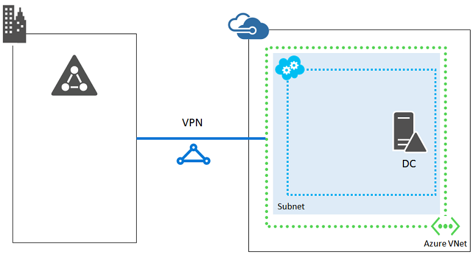

<properties
	pageTitle="网络基础结构准则 | Azure"
	description="了解用于在 Azure 基础结构服务中部署虚拟网络的关键设计和实施准则。"
	documentationCenter=""
	services="virtual-machines-windows"
	authors="iainfoulds"
	manager="timlt"
	editor=""
	tags="azure-resource-manager"/>  

<tags
	ms.service="virtual-machines-windows"
	ms.workload="infrastructure-services"
	ms.tgt_pltfrm="vm-windows"
	ms.devlang="na"
	ms.topic="article"
	ms.date="09/08/2016"
	wacn.date="10/24/2016"
	ms.author="iainfou"/>  

# 网络基础结构准则

[AZURE.INCLUDE [virtual-machines-windows-infrastructure-guidelines-intro](../../includes/virtual-machines-windows-infrastructure-guidelines-intro.md)]

本文着重于了解 Azure 内虚拟网络的必要计划步骤，以及现有本地环境之间的连接性。

## 虚拟网络的实施准则

决策：

- 你需要使用哪种类型的虚拟网络来托管 IT 工作负荷或基础结构（仅限云还是跨界）？
- 对于跨界虚拟网络，你现在需要多少地址空间来托管子网和 VM 以及用于将来的合理扩展？
- 你是要创建集中式虚拟网络，还是针对每个资源组创建单个虚拟网络？

任务：

- 为要创建的虚拟网络定义地址空间。
- 定义子网集和每个子网的地址空间。
- 对于跨界虚拟网络，定义虚拟网络中的 VM 需要访问的本地位置的本地网络地址空间集。
- 与本地网络团队合作，确保在创建跨界虚拟网络时配置适当的路由。
- 使用命名约定创建虚拟网络。

## 虚拟网络

需要通过虚拟网络来支持虚拟机 (VM) 之间的通信。与物理网络一样，可以定义子网、自定义 IP 地址、DNS 设置、安全筛选以及负载均衡。通过使用[站点到站点 VPN](/documentation/articles/vpn-gateway-topology/) 或 [Express Route 线路](/documentation/articles/expressroute-introduction/)，可以将 Azure 虚拟网络连接到本地网络。你可以了解有关[虚拟网络及其组件](/documentation/articles/virtual-networks-overview/)的详细信息。

通过使用资源组，可以灵活地设计虚拟网络组件。VM 可以连接到其资源组之外的虚拟网络。常见的设计方法就是创建可由一般小组管理且包含核心网络基础结构的集中式资源组，并将 VM 及其应用程序部署到单独的资源组。此方法允许应用程序所有者访问包含其 VM 的资源组，而无需开放对更多虚拟网络资源的配置访问。

## 站点连接

### 仅限云的虚拟网络
如果本地用户和计算机无需持续连接到 Azure 虚拟网络中的 VM，则虚拟网络设计将相当直观：

  

此方法通常用于面向 Internet 的工作负荷，如基于 Internet 的 Web 服务器。你可以使用 RDP 或点到站点 VPN 连接来管理这些 VM。

由于仅限 Azure 的虚拟网络未连接到你的本地网络，因此它们可以使用专用 IP 地址空间的任何部分，即使已在本地使用相同的专用空间也是一样。

### 跨界虚拟网络
如果本地用户和计算机需要持续连接到 Azure 虚拟网络中的 VM，则可创建跨界虚拟网络。使用 ExpressRoute 或站点到站点 VPN 连接将其连接到本地网络。

  

在此配置中，Azure 虚拟网络实质上是你的本地网络基于云的扩展。

由于跨界虚拟网络会连接到你的本地网络，因此它们必须使用组织所用地址空间的一部分，且该部分必须是唯一的。与不同公司位置将分配有一个特定 IP 子网相同，Azure 会随着扩展网络成为另一个位置。

若要允许将数据包从跨界虚拟网络传输到你的本地网络，必须配置相关的本地地址前缀集作为虚拟网络的本地网络定义的一部分。根据虚拟网络的地址空间和相关的本地位置集，本地网络中可以有多个地址前缀。

可以将仅限云的虚拟网络转换为跨界虚拟网络，但这很可能需要为虚拟网络地址空间和 Azure 资源重新分配 IP。因此，在分配 IP 子网时，请仔细考虑虚拟网络是否需要连接到本地网络。

## 子网
子网允许用户组织相关资源，不管是以逻辑方式（例如，一个子网用于关联到同一个应用程序的 VM）还是以物理方式（例如，每个资源组一个子网）。还可以使用子网隔离技术提高安全性。

对于跨界虚拟网络，应该使用用于本地资源的相同约定来设计子网。**Azure 始终使用每个子网地址空间的前三个 IP 地址**。若要确定子网所需的地址数，首先需要计算目前所需的 VM 数。估计未来的增长，然后使用下表来确定子网的大小。

所需的 VM 数 | 所需的主机位数 | 子网的大小
--- | --- | ---
1-3 | 3 | /29
4-11 | 4 | /28
12-27 | 5 | /27
28-59 | 6 | /26
60-123 | 7 | /25

> [AZURE.NOTE] 对于普通的本地子网，具有 n 个主机位的子网的最大主机地址数为 2n - 2 个。对于 Azure 子网，具有 n 个主机位的子网的最大主机地址数为 2n - 5 个（2 + 3 作为 Azure 在每个子网上使用的地址数）。

如果选择的子网大小太小，将需要对子网中的 VM 重新分配 IP 并重新进行部署。

## 网络安全组
可以使用网络安全组，将筛选规则应用到流经虚拟网络的流量。可以生成精细的筛选规则来保护虚拟网络环境、控制入站和出站流量、源和目标 IP 范围、允许的端口，等等。网络安全组可以应用于虚拟网络内的子网，或直接应用于给定的虚拟网络接口。建议在虚拟网络上使用某个级别的网络安全组来筛选流量。你可以了解有关[网络安全组](/documentation/articles/virtual-networks-nsg/)的详细信息。

## 附加网络组件
与本地物理网络基础结构一样，Azure 虚拟网络除了子网和 IP 地址之外，还可以包含更多组件。在设计应用程序基础结构时，你可能会想引入以下某些附加组件：

- [VPN 网关](/documentation/articles/vpn-gateway-about-vpngateways/) - 将 Azure 虚拟网络连接到其他 Azure 虚拟网络，或者通过站点到站点 VPN 连接连接到本地网络。为专用、安全的连接实现 Express Route 连接。还可以使用点到站点 VPN 连接提供用户直接访问。
- [负载均衡器](/documentation/articles/load-balancer-overview/) — 根据需要为外部和内部流量提供流量负载均衡。
- [应用程序网关](/documentation/articles/application-gateway-introduction/) - 应用程序层的 HTTP 负载均衡，可为 Web 应用程序提供一些其他的好处，而不是部署 Azure Load Balancer。
- [流量管理器](/documentation/articles/traffic-manager-overview/) — 基于 DNS 的流量分配，以将最终用户定向到最接近的可用应用程序终结点，让你可以在不同地区的 Azure 数据中心之外托管应用程序。

## 后续步骤

[AZURE.INCLUDE [virtual-machines-windows-infrastructure-guidelines-next-steps](../../includes/virtual-machines-windows-infrastructure-guidelines-next-steps.md)]

<!---HONumber=Mooncake_1017_2016-->