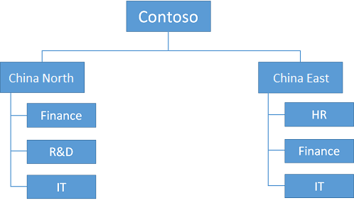
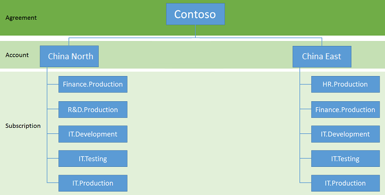

<properties
	pageTitle="订阅和帐户准则 | Azure"
	description="了解 Azure 中订阅和帐户的关键设计和实施准则。"
	documentationCenter=""
	services="virtual-machines-windows"
	authors="iainfoulds"
	manager="timlt"
	editor=""
	tags="azure-resource-manager"/>

<tags
	ms.service="virtual-machines-windows"
	ms.date="06/30/2016"
	wacn.date="08/08/2016"/>

# 订阅和帐户准则

[AZURE.INCLUDE [virtual-machines-windows-infrastructure-guidelines-intro](../../includes/virtual-machines-windows-infrastructure-guidelines-intro.md)]

本文重点介绍如何随环境和用户群的增长实行订阅和帐户管理。

## 订阅和帐户的实施准则

决策：

- 你需要使用哪一组订阅和帐户来托管你的 IT 工作负荷或基础结构？
- 你将如何细分层次结构以适应你的组织？

任务：

- 按照将从订阅级别进行管理来定义逻辑组织层次结构。
- 定义所需帐户和每个帐户下的订阅以匹配此逻辑层次结构。
- 使用命名约定创建订阅和帐户集。

## 订阅和帐户

要使用 Azure，需要一个或多个 Azure 订阅。虚拟机 (VM) 或虚拟网络等资源存在于这些订阅中。

- 企业客户通常具有企业许可登记表，该表是层次结构中的最顶层资源并与一个或多个帐户相关联。
- 对于没有企业许可登记表的使用者和客户，最顶层资源是帐户。
- 订阅关联到帐户，并且每个帐户可以有一个或多个订阅。订阅级别的 Azure 记录计费信息。

由于两个层次结构级别在订阅/帐户关系上的限制，根据计费要求调整帐户和订阅的命名约定至关重要。例如，如果一家全球性公司使用 Azure，他们可以选择每个区域建立一个帐户，并在区域级别管理订阅。

例如，你可能会使用此结构。

按照同一示例，如果某一区域决定将多个订阅关联到一个特定组，则命名约定应引入相应方法来对帐户或订阅名称的额外项进行编码。此组织允许窜改计费数据以在计费报告期间生成新的层次结构级别。

该组织可以如下所示。

Microsoft 通过可下载的文件为企业协议中的单个帐户或所有帐户提供详细的计费信息。你可以通过合适的方式处理此文件，例如，使用 Microsoft Excel 来处理。此过程将引入数据、对将多个级别的层次结构编码为单独列的资源进行分区，并使用数据透视表或 PowerPivot 提供动态报告功能。

##  后续步骤

[AZURE.INCLUDE [virtual-machines-windows-infrastructure-guidelines-next-steps](../../includes/virtual-machines-windows-infrastructure-guidelines-next-steps.md)]

<!---HONumber=Mooncake_0801_2016-->