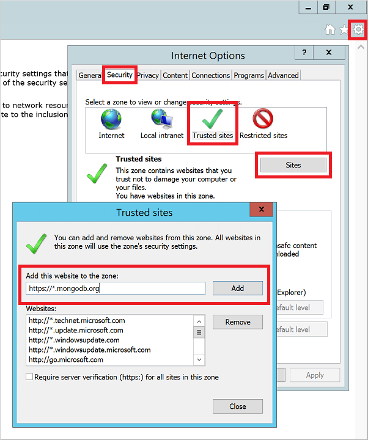
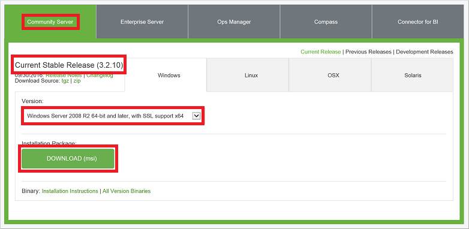
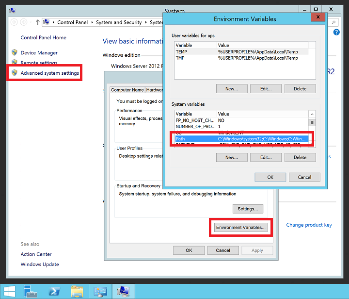

<properties
	pageTitle="在 Windows VM 上安装 MongoDB | Azure"
	description="了解如何在使用 Resource Manager 部署模型创建的、运行 Windows Server 2012 R2 的 Azure VM 上安装 MongoDB。"
	services="virtual-machines-windows"
	documentationCenter=""
	authors="iainfoulds"
	manager="timlt"
	editor=""/>  

<tags
	ms.service="virtual-machines-windows"
	ms.workload="infrastructure-services"
	ms.tgt_pltfrm="vm-windows"
	ms.devlang="na"
	ms.topic="article"
	ms.date="10/04/2016"
	wacn.date="11/21/2016"
    ms.author="iainfou"/>  

# 在 Azure 中的 Windows VM 上安装和配置 MongoDB
[MongoDB](http://www.mongodb.org) 是一个流行的开源、高性能 NoSQL 数据库。本文逐步讲解如何在 Azure 中的 Windows Server 2012 R2 虚拟机 (VM) 上安装和配置 MongoDB。也可以[在 Azure 中的 Linux VM 上安装 MongoDB](/documentation/articles/virtual-machines-linux-install-mongodb/)。

## 先决条件

在安装和配置 MongoDB 之前，需要创建一个 VM，并且最好将一个磁盘添加到该 VM。请参阅以下文章创建 VM 并向其添加数据磁盘：

- [Create a Windows Server VM using the Azure portal Preview](/documentation/articles/virtual-machines-windows-hero-tutorial/)（使用 Azure 门户预览创建 Windows Server VM）或 [Create a Windows Server VM using Azure PowerShell](/documentation/articles/virtual-machines-windows-ps-create/)（使用 Azure PowerShell 创建 Windows Server VM）
- [Attach a data disk to a Windows Server VM using the Azure portal Preview](/documentation/articles/virtual-machines-windows-attach-disk-portal/)（使用 Azure 门户预览将数据磁盘附加到 Windows Server VM）或 [Attach a data disk to a Windows Server VM using Azure PowerShell](https://msdn.microsoft.com/zh-cn/library/mt603673.aspx)（使用 Azure PowerShell 将数据磁盘附加到 Windows Server VM）
	
使用远程桌面[登录到 Windows Server VM](/documentation/articles/virtual-machines-windows-connect-logon/)，开始安装和配置 MongoDB。

## 安装 MongoDB

> [AZURE.IMPORTANT] 默认情况下，不启用 MongoDB 安全功能，例如身份验证和 IP 地址绑定。在将 MongoDB 部署到生产环境之前，应启用安全功能。有关详细信息，请参阅 [MongoDB Security and Authentication](http://www.mongodb.org/display/DOCS/Security+and+Authentication)（MongoDB 安全性和身份验证）。

1. 使用远程桌面连接到 VM 后，请在 VM 上从“开始”菜单打开 Internet Explorer。

2. 当 Internet Explorer 首次打开时，请选择“使用推荐的安全性、隐私和兼容性设置”，然后单击“确定”。

3. 默认情况下已启用 Internet Explorer 增强的安全性配置。将 MongoDB 网站添加到允许的站点列表：

	- 选择右上角的“工具”按钮。
	- 在“Internet 选项”中，选择“安全”选项卡，然后选择“可信站点”图标。
	- 单击“站点”按钮。将 \_https://*.mongodb.org_ 添加到受信任的站点列表，然后关闭对话框。

	  

4. 浏览到“MongoDB - 下载”页 (http://www.mongodb.org/downloads)。

5. 默认情况下，应已选择“社区服务器”版本和 Windows Server 2008 R2 64 位及更高版本的最新稳定版本。若要下载安装程序，请单击“下载(msi)”按钮：

	  

	下载完成后，请运行安装程序。

6. 阅读并接受许可协议。出现提示时，请选择“完整”安装。

7. 在最后一个屏幕上，单击“安装”。

## 配置 VM 和 MongoDB

1. MongoDB 安装程序不会更新路径变量。如果路径变量中不包含 MongoDB `bin` 位置，则每次使用 MongoDB 可执行文件时都需要指定完整路径。若要将位置添加到路径变量，请执行以下操作：

	- 右键单击“开始”菜单，然后选择“系统”。
	- 依次单击“高级系统设置”和“环境变量”。
	- 在“系统变量”下，选择“路径”，然后单击“编辑”。

	  

	将路径添加到 MongoDB `bin` 文件夹。MongoDB 通常安装在 `C:\Program Files\MongoDB` 中。检查 VM 上的安装路径。以下示例将默认的 MongoDB 安装位置添加到 `PATH` 变量：

		;C:\Program Files\MongoDB\Server\3.2\bin

	> [AZURE.NOTE] 请务必添加前置分号 (`;`)，指明要将一个位置添加到 `PATH` 变量。

2. 在数据磁盘上创建 MongoDB 数据和日志目录。在“开始”菜单中，选择“命令提示符”。以下示例在 F: 驱动器中创建目录：

		mkdir F:\MongoData
		mkdir F:\MongoLogs

3. 使用以下命令启动 MongoDB 实例，并相应地调整数据和日志目录的路径：

		mongod --dbpath F:\MongoData\ --logpath F:\MongoLogs\mongolog.log

	MongoDB 可能需要几分钟来分配日志文件和开始侦听连接。当 `mongod.exe` 服务器启动和分配日志文件时，所有日志消息将定向到 *F:\\MongoLogs\\mongolog.log* 文件。

	> [AZURE.NOTE] 运行 MongoDB 实例时，命令提示符的焦点将保留在此任务上。将命令提示符窗口保持打开状态，以便继续运行 MongoDB。或者，如下一步骤的详述，将 MongoDB 作为服务安装。

4. 为获得更健全的 MongoDB 体验，请将 `mongod.exe` 作为服务安装。创建服务意味着不需要每次使用 MongoDB 时都要运行命令提示符。按如下所示创建服务，并相应地调整数据和日志目录的路径：

		mongod --dbpath F:\MongoData\ --logpath F:\MongoLogs\mongolog.log `
			--logappend  --install

	上述命令创建一个名为“MongoDB”的服务，其描述为“Mongo DB”。也可以指定以下参数：

	- `--dbpath` 选项指定数据目录的位置。
	- 必须使用 `--logpath` 选项指定日志文件，因为正在运行的服务不会在命令窗口中显示输出。
	- `--logappend` 选项指定重新启动服务时，会将输出追加到现有日志文件。

    若要启动 MongoDB 服务，请运行以下命令：

		net start MongoDB

	有关创建 MongoDB 服务的详细信息，请参阅 [Configure a Windows Service for MongoDB](https://docs.mongodb.com/manual/tutorial/install-mongodb-on-windows/#mongodb-as-a-windows-service)（为 MongoDB 配置 Windows 服务）。

## 测试 MongoDB 实例

以单一实例的形式运行 MongoDB 或将它安装为服务后，可以开始创建并使用数据库。若要启动 MongoDB 管理 shell，请从“开始”菜单打开另一个命令提示符窗口并输入以下命令：

	mongo  

可以使用 `db` 命令列出数据库。按如下所示插入一些数据：

	db.foo.insert( { a : 1 } )

按如下所示搜索数据：

	db.foo.find()

输出类似于以下示例：

	{ "_id" : "ObjectId("57f6a86cee873a6232d74842"), "a" : 1 }

按如下所示退出 `mongo` 控制台：

	exit

## 配置防火墙和网络安全组规则
安装并运行 MongoDB 后，请在 Windows 防火墙中打开一个端口，以便能够远程连接到 MongoDB。若要创建一个新的入站规则以允许 TCP 端口 27017，请打开管理 PowerShell 提示符并输入以下命令：

	New-NetFirewallRule -DisplayName "Allow MongoDB" -Direction Inbound `
		-Protocol TCP -LocalPort 27017 -Action Allow

也可以使用“具有高级安全性的 Windows 防火墙”图形管理工具创建该规则。创建一个新的入站规则以允许 TCP 端口 27017。

如有需要，创建一个网络安全组规则，以允许从现有 Azure 虚拟网络子网外部访问 MongoDB。可以使用 [Azure 门户预览](/documentation/articles/virtual-machines-windows-nsg-quickstart-portal/)或 [Azure PowerShell](/documentation/articles/virtual-machines-windows-nsg-quickstart-powershell/) 创建网络安全组规则。与创建 Windows 防火墙规则时一样，允许通过 TCP 端口 27017 连接到 MongoDB VM 的虚拟网络接口。

> [AZURE.NOTE] TCP 端口 27017 是 MongoDB 使用的默认端口。可以在启动 `mongod.exe` 时使用 `--port` 参数手动更改此端口，或者通过某个服务更改此端口。如果更改了端口，请确保在前面的步骤中更新 Windows 防火墙和网络安全组规则。

## 后续步骤
本教程已介绍如何在 Windows VM 上安装和配置 MongoDB。现在，可以遵循 [MongoDB 文档](https://docs.mongodb.com/manual/)中的高级主题访问 Windows VM 上的 MongoDB。

<!---HONumber=Mooncake_1114_2016-->