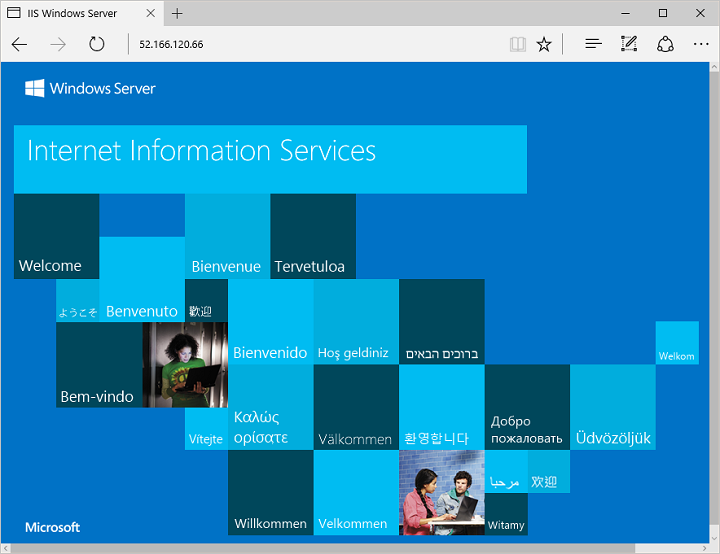

<properties
    pageTitle="教程 - 在 Azure VM 上生成高可用性应用程序 | Azure"
    description="了解如何在 Azure 中使用负载均衡器在 3 个 Windows VM 之间创建高可用性和安全性的应用程序"
    services="virtual-machines-windows"
    documentationcenter="virtual-machines"
    author="davidmu1"
    manager="timlt"
    editor="tysonn"
    tags="azure-resource-manager" />
<tags
    ms.assetid=""
    ms.service="virtual-machines-windows"
    ms.devlang="na"
    ms.topic="article"
    ms.tgt_pltfrm="vm-windows"
    ms.workload="infrastructure"
    ms.date="03/30/2017"
    wacn.date="05/15/2017"
    ms.author="davidmu"
    ms.translationtype="Human Translation"
    ms.sourcegitcommit="457fc748a9a2d66d7a2906b988e127b09ee11e18"
    ms.openlocfilehash="b2ff5040288ca0b9850c11f900610ac177fa4df4"
    ms.contentlocale="zh-cn"
    ms.lasthandoff="05/05/2017" />

# 在 Azure 中的 Windows 虚拟机上生成负载均衡的高可用性应用程序

在本教程中，你将创建高可用性应用程序，以适应维护事件。 该应用使用 1 个负载均衡器、1 个可用性集和 3 个 Windows 虚拟机 (VM)。 本教程将安装 IIS，尽管可以使用本教程通过相同的高可用性组件和准则部署其他应用程序框架。 

## 步骤 1 - Azure 先决条件

若要完成本教程，请确保已安装最新的 [Azure PowerShell](https://docs.microsoft.com/zh-cn/powershell/azureps-cmdlets-docs/) 模块。

首先，使用 Login-AzureRmAccount -EnvironmentName AzureChinaCloud 命令登录到 Azure 订阅，并按屏幕说明操作。

    Login-AzureRmAccount -EnvironmentName AzureChinaCloud

Azure 资源组是在其中部署和管理 Azure 资源的逻辑容器。 创建任何其他 Azure 资源前，需要使用 [New-AzureRmResourceGroup](https://docs.microsoft.com/zh-cn/powershell/resourcemanager/AzureRM.Resources/v2.0.3/new-azurermresourcegroup) 创建一个资源组。 以下示例在 `chinanorth` 区域中创建一个名为 `myResourceGroup` 的资源组： 

    New-AzureRmResourceGroup -ResourceGroupName myResourceGroup -Location chinanorth

## 步骤 2 - 创建可用性集

可以在逻辑容错和更新域之间创建虚拟机。 每个逻辑域都是基础 Azure 数据中心中的硬件的一部分。 创建两个或多个 VM 时，将在这些域中分配计算和存储资源。 如果硬件组件需要维护，此分配将维护应用的可用性。 可用性集可用于定义这些逻辑容错和更新域。

使用 [New-AzureRmAvailabilitySet](https://docs.microsoft.com/zh-cn/powershell/resourcemanager/azurerm.compute/v2.8.0/new-azurermavailabilityset) 创建一个可用性集。 以下示例创建一个名为 `myAvailabilitySet` 的可用性集：

    $availabilitySet = New-AzureRmAvailabilitySet `
      -ResourceGroupName myResourceGroup `
      -Name myAvailabilitySet `
      -Location chinanorth `
      -Managed `
      -PlatformFaultDomainCount 3 `
      -PlatformUpdateDomainCount 2

## 步骤 3 - 创建负载均衡器

Azure 负载均衡器使用负载均衡器规则将流量分配到一组定义的 VM。 运行状况探测器监视每个 VM 上的给定端口，并仅将流量分配给可操作的 VM。

### 创建公共 IP 地址

若要在 Internet 上访问你的应用，请为负载均衡器分配公共 IP 地址。 使用 [New-AzureRmPublicIpAddress](https://docs.microsoft.com/zh-cn/powershell/resourcemanager/azurerm.network/v3.6.0/new-azurermpublicipaddress) 创建一个公共 IP 地址。 下例创建名为 `myPublicIP` 的公共 IP 地址：

    $pip = New-AzureRmPublicIpAddress `
      -ResourceGroupName myResourceGroup `
      -Location chinanorth `
      -AllocationMethod Static `
      -Name myPublicIP

### 创建负载均衡器

使用 [New-AzureRmLoadBalancerFrontendIpConfig](https://docs.microsoft.com/zh-cn/powershell/resourcemanager/azurerm.network/v3.6.0/new-azurermloadbalancerfrontendipconfig) 创建一个前端 IP 地址。 下例创建一个名为 `myFrontEndPool` 的前端 IP 地址： 

    $frontendIP = New-AzureRmLoadBalancerFrontendIpConfig -Name myFrontEndPool -PublicIpAddress $pip

使用 [New-AzureRmLoadBalancerBackendAddressPoolConfig](https://docs.microsoft.com/zh-cn/powershell/resourcemanager/azurerm.network/v3.6.0/new-azurermloadbalancerbackendaddresspoolconfig) 创建一个后端地址池。 以下示例创建一个名为 `myBackEndPool` 的后端地址池：

    $backendPool = New-AzureRmLoadBalancerBackendAddressPoolConfig -Name myBackEndPool

现在，使用 [New-AzureRmLoadBalancer](https://docs.microsoft.com/zh-cn/powershell/resourcemanager/azurerm.network/v3.6.0/new-azurermloadbalancer) 创建负载均衡器。 下例使用 `myPublicIP` 地址创建一个名为 `myLoadBalancer` 的负载均衡器：

    $lb = New-AzureRmLoadBalancer `
      -ResourceGroupName myResourceGroup `
      -Name myLoadBalancer `
      -Location chinanorth `
      -FrontendIpConfiguration $frontendIP `
      -BackendAddressPool $backendPool

### 创建运行状况探测

若要允许负载均衡器监视应用的状态，可以使用运行状况探测器。 运行状况探测器基于其对运行状况检查的响应，从负载均衡器中动态添加或删除 VM。 默认情况下，在 15 秒时间间隔内发生两次连续的故障后，将从负载均衡器分布中删除 VM。

使用 [Add-AzureRmLoadBalancerProbeConfig](https://docs.microsoft.com/zh-cn/powershell/resourcemanager/azurerm.network/v3.6.0/add-azurermloadbalancerprobeconfig) 创建一个运行状况探测。 下例创建一个 `myHealthProbe` 运行状况探测器，用于监视每个 VM：

    Add-AzureRmLoadBalancerProbeConfig -Name myHealthProbe `
      -LoadBalancer $lb `
      -Protocol tcp `
      -Port 80 `
      -IntervalInSeconds 15 `
      -ProbeCount 2

### 创建负载均衡器规则

负载均衡器规则用于定义将流量分配给 VM 的方式。

使用 [Add-AzureRmLoadBalancerRuleConfig](https://docs.microsoft.com/zh-cn/powershell/resourcemanager/AzureRM.Network/v3.6.0/add-azurermloadbalancerruleconfig) 创建一个负载均衡器规则。 下例创建一个名为 `myLoadBalancerRule` 的负载均衡器规则并平衡端口 `80` 上的流量：

    Add-AzureRmLoadBalancerRuleConfig -Name myLoadBalancerRule `
      -LoadBalancer $lb `
      -FrontendIpConfiguration $lb.FrontendIpConfigurations[0] `
      -BackendAddressPool $lb.BackendAddressPools[0] `
      -Protocol Tcp `
      -FrontendPort 80 `
      -BackendPort 80

使用 [Set-AzureRmLoadBalancer](https://docs.microsoft.com/zh-cn/powershell/resourcemanager/azurerm.network/v3.6.0/set-azurermloadbalancer) 更新负载均衡器：

    Set-AzureRmLoadBalancer -LoadBalancer $lb

## 步骤 4 - 配置网络

每个 VM 都有一个或多个连接到某个虚拟网络的虚拟网络接口卡 (NIC)。 该虚拟网络基于定义的访问规则筛选流量，确保安全。

### 创建虚拟网络

首先，使用 [New-AzureRmVirtualNetworkSubnetConfig](https://docs.microsoft.com/zh-cn/powershell/resourcemanager/azurerm.network/v3.6.0/new-azurermvirtualnetworksubnetconfig) 配置子网。 以下示例创建名为 `mySubnet` 的子网：

    $subnetConfig = New-AzureRmVirtualNetworkSubnetConfig -Name mySubnet -AddressPrefix 192.168.1.0/24

若要为 VM 提供网络连接，请使用 [New-AzureRmVirtualNetwork](https://docs.microsoft.com/zh-cn/powershell/resourcemanager/azurerm.network/v3.6.0/new-azurermvirtualnetwork) 创建虚拟网络。 以下示例创建包含 `mySubnet` 的一个名为 `myVnet` 的虚拟网络：

    $vnet = New-AzureRmVirtualNetwork `
      -ResourceGroupName myResourceGroup `
      -Location chinanorth `
      -Name myVnet `
      -AddressPrefix 192.168.0.0/16 `
      -Subnet $subnetConfig

### 配置网络安全

Azure [网络安全组](/documentation/articles/virtual-networks-nsg/) (NSG) 控制一个或多个虚拟机的入站和出站流量。 网络安全组规则允许或拒绝特定端口上或端口范围内的网络流量。 这些规则还可包括源地址前缀，这样只有源自预定义源的流量才可与虚拟机进行通信。

若要允许 Web 流量到达你的应用，请使用 [New-AzureRmNetworkSecurityRuleConfig](https://docs.microsoft.com/zh-cn/powershell/resourcemanager/azurerm.network/v3.6.0/new-azurermnetworksecurityruleconfig) 创建网络安全组规则。 以下示例创建一个名为 `myNetworkSecurityGroupRule` 的网络安全组规则：

    $nsgRule = New-AzureRmNetworkSecurityRuleConfig `
      -Name myNetworkSecurityGroupRule `
      -Protocol Tcp `
      -Direction Inbound `
      -Priority 1001 `
      -SourceAddressPrefix * `
      -SourcePortRange * `
      -DestinationAddressPrefix * `
      -DestinationPortRange 80 `
      -Access Allow

使用 [New-AzureRmNetworkSecurityGroup](https://docs.microsoft.com/zh-cn/powershell/resourcemanager/azurerm.network/v3.6.0/new-azurermnetworksecuritygroup) 创建网络安全组。 下例创建一个名为 `myNetworkSecurityGroup` 的 NSG：

    $nsg = New-AzureRmNetworkSecurityGroup `
      -ResourceGroupName myResourceGroup `
      -Location chinanorth `
      -Name myNetworkSecurityGroup `
      -SecurityRules $nsgRule

使用 [Set-AzureRmVirtualNetworkSubnetConfig](https://docs.microsoft.com/zh-cn/powershell/resourcemanager/azurerm.network/v3.6.0/set-azurermvirtualnetworksubnetconfig) 将网络安全组添加到子网：

    Set-AzureRmVirtualNetworkSubnetConfig -VirtualNetwork $vnet `
      -Name mySubnet `
      -NetworkSecurityGroup $nsg `
      -AddressPrefix 192.168.1.0/24

使用 [Set-AzureRmVirtualNetwork](https://docs.microsoft.com/zh-cn/powershell/resourcemanager/azurerm.network/v3.6.0/set-azurermvirtualnetwork) 更新虚拟网络：

    Set-AzureRmVirtualNetwork -VirtualNetwork $vnet

### 创建虚拟网络接口卡

负载均衡器使用虚拟 NIC 资源（而不是实际的 VM）运行。 虚拟 NIC 连接到负载均衡器后会被附加到 VM。

使用 [New-AzureRmNetworkInterface](https://docs.microsoft.com/zh-cn/powershell/resourcemanager/azurerm.network/v3.6.0/new-azurermnetworkinterface) 创建虚拟 NIC。 以下示例创建三个虚拟 NIC。 （你在以下步骤中为应用创建的每个 VM 各使用一个虚拟 NIC）：

    for ($i=1; $i -le 3; $i++)
    {
       New-AzureRmNetworkInterface -ResourceGroupName myResourceGroup `
         -Name myNic$i `
         -Location chinanorth `
         -Subnet $vnet.Subnets[0] `
         -LoadBalancerBackendAddressPool $lb.BackendAddressPools[0]
    }

## 步骤 5 - 创建虚拟机

所有基础组件准备就绪后，现在可以创建高可用性 VM 以运行你的应用。 

使用 [Get-Credential](https://msdn.microsoft.com/powershell/reference/5.1/microsoft.powershell.security/Get-Credential) 获取虚拟机上管理员帐户所需的用户名和密码：

    $cred = Get-Credential

使用 [New-AzureRmVMConfig](https://docs.microsoft.com/zh-cn/powershell/resourcemanager/azurerm.compute/v2.8.0/new-azurermvmconfig)、[Set-AzureRmVMOperatingSystem](https://docs.microsoft.com/zh-cn/powershell/resourcemanager/azurerm.compute/v2.8.0/set-azurermvmoperatingsystem)、[Set-AzureRmVMSourceImage](https://docs.microsoft.com/zh-cn/powershell/resourcemanager/azurerm.compute/v2.8.0/set-azurermvmsourceimage)、[Set-AzureRmVMOSDisk](https://docs.microsoft.com/zh-cn/powershell/resourcemanager/azurerm.compute/v2.8.0/set-azurermvmosdisk)、[Add-AzureRmVMNetworkInterface](https://docs.microsoft.com/zh-cn/powershell/resourcemanager/azurerm.compute/v2.8.0/add-azurermvmnetworkinterface) 和 [New-AzureRmVM](https://docs.microsoft.com/zh-cn/powershell/resourcemanager/azurerm.compute/v2.8.0/new-azurermvm) 创建 VM。 下例创建三个 VM：

    for ($i=1; $i -le 3; $i++)
    {
       $vm = New-AzureRmVMConfig -VMName myVM$i -VMSize Standard_D1 -AvailabilitySetId $availabilitySet.Id
       $vm = Set-AzureRmVMOperatingSystem -VM $vm -Windows -ComputerName myVM$i -Credential $cred -ProvisionVMAgent -EnableAutoUpdate
       $vm = Set-AzureRmVMSourceImage -VM $vm -PublisherName MicrosoftWindowsServer -Offer WindowsServer -Skus 2016-Datacenter -Version latest
       $vm = Set-AzureRmVMOSDisk -VM $vm -Name myOsDisk$i -StorageAccountType StandardLRS -DiskSizeInGB 128 -CreateOption FromImage -Caching ReadWrite
       $nic = Get-AzureRmNetworkInterface -ResourceGroupName myResourceGroup -Name myNic$i
       $vm = Add-AzureRmVMNetworkInterface -VM $vm -Id $nic.Id
       New-AzureRmVM -ResourceGroupName myResourceGroup -Location chinanorth -VM $vm
    }

创建和配置这三个 VM 需要几分钟时间。 在每个 VM 上运行应用时，负载均衡器运行状况探测器会自动检测。 应用运行后，负载均衡器规则将开始分布流量。

### 安装应用 

Azure 虚拟机扩展用于自动执行虚拟机配置任务（例如安装应用程序和配置操作系统）。 [适用于 Windows 的自定义脚本扩展](/documentation/articles/virtual-machines-windows-extensions-customscript/)用于在虚拟机上运行任何 PowerShell 脚本。 此脚本可存储于 Azure 存储、任何可访问的 HTTP 终结点或者嵌入自定义脚本扩展配置中。 使用自定义脚本扩展时，Azure VM 代理管理脚本执行。

使用 [Set-AzureRmVMExtension](https://docs.microsoft.com/zh-cn/powershell/resourcemanager/azurerm.compute/v2.8.0/set-azurermvmextension) 安装自定义脚本扩展。 此扩展运行 `powershell Add-WindowsFeature Web-Server` 来安装 IIS webserver：

    for ($i=1; $i -le 3; $i++)
    {
       Set-AzureRmVMExtension -ResourceGroupName myResourceGroup `
         -ExtensionName IIS `
         -VMName myVM$i `
         -Publisher Microsoft.Compute `
         -ExtensionType CustomScriptExtension `
         -TypeHandlerVersion 1.4 `
         -SettingString '{"commandToExecute":"powershell Add-WindowsFeature Web-Server"}' `
         -Location chinanorth
    }

### 测试应用程序

使用 [Get-AzureRmPublicIPAddress](https://docs.microsoft.com/zh-cn/powershell/resourcemanager/azurerm.network/v3.6.0/get-azurermpublicipaddress) 获取负载均衡器的公共 IP 地址。 以下示例获取前面创建的 `myPublicIP` 的 IP 地址：

    Get-AzureRmPublicIPAddress -ResourceGroupName myResourceGroup -Name myPublicIP | select IpAddress

将公共 IP 地址输入到 Web 浏览器中。 如果具有 NSG 规则，将显示默认 IIS 网站。 

## 步骤 6 - 管理任务

建议对运行应用的 VM 执行维护，例如安装 OS 更新。 若要应对应用增加的流量，建议添加更多 VM。 本部分演示了如何在负载均衡器中删除或添加 VM。 

### 从负载均衡器中删除 VM

通过重置网络接口卡的 LoadBalancerBackendAddressPools 属性，可从后端地址池删除 VM。

使用 [Get-AzureRmNetworkInterface](https://docs.microsoft.com/zh-cn/powershell/resourcemanager/azurerm.network/v3.6.0/get-azurermnetworkinterface) 获取网络接口卡：

    $nic = Get-AzureRmNetworkInterface -ResourceGroupName myResourceGroup -Name myNic2

将网络接口卡的 LoadBalancerBackendAddressPools 属性设置为 $null：

    $nic.Ipconfigurations[0].LoadBalancerBackendAddressPools=$null

更新网络接口卡：

    Set-AzureRmNetworkInterface -NetworkInterface $nic

### 将 VM 添加到负载均衡器

执行 VM 维护后，或如果需要扩展容量，请将 VM 的 NIC 添加到负载均衡器的后端地址池。

获取负载均衡器：

    $lb = Get-AzureRMLoadBalancer -ResourceGroupName myResourceGroup -Name myLoadBalancer 

将负载均衡器的后端地址池添加到网络接口卡：

    $nic.IpConfigurations[0].LoadBalancerBackendAddressPools=$lb.BackendAddressPools[0]

更新网络接口卡：

    Set-AzureRmNetworkInterface -NetworkInterface $nic

## 后续步骤

示例 - [Azure 虚拟机 PowerShell 示例脚本](/documentation/articles/virtual-machines-windows-powershell-samples/)