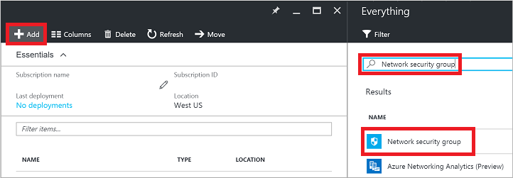
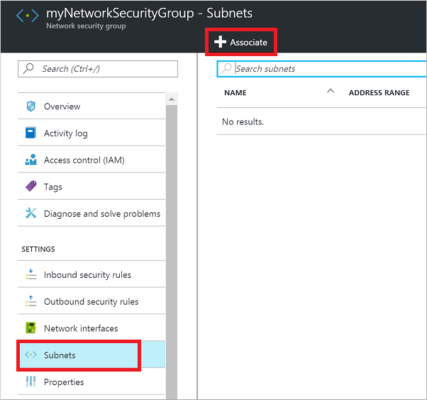
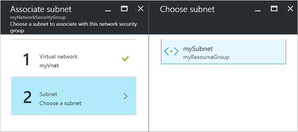

<!-- Ibiza portal: tested -->

<properties
   pageTitle="使用门户实现对 VM 的外部访问 | Azure"
   description="了解如何打开端口/创建终结点，以便允许在 Azure 门户预览中使用资源管理器部署模型访问 VM"
   services="virtual-machines-windows"
   documentationCenter=""
   authors="iainfoulds"
   manager="timlt"
   editor=""/>

<tags
   ms.service="virtual-machines-windows"
   ms.devlang="na"
   ms.topic="article"
   ms.tgt_pltfrm="vm-windows"
   ms.workload="infrastructure-services"
   ms.date="08/08/2016"
   wacn.date="12/16/2016"
   ms.author="iainfou"/>

# 使用 Azure 门户预览实现对 VM 的外部访问
[AZURE.INCLUDE [virtual-machines-common-nsg-quickstart](../../includes/virtual-machines-common-nsg-quickstart.md)]

## 快速命令
也可以[通过 Azure PowerShell 执行这些步骤](/documentation/articles/virtual-machines-windows-nsg-quickstart-powershell/)。

首先，创建网络安全组。在门户中选择一个资源组，单击“添加”，然后搜索并选择“网络安全组”：

输入网络安全组的名称，然后选择一个位置：

选择新的网络安全组。接着创建一条入站规则：

提供新规则的名称。注意，默认情况下已输入端口 80。向网络安全组添加其他规则时，可以在此处更改源、协议和目标：

最后一步是将网络安全组与子网或特定网络接口相关联。将网络安全组与子网相关联：

选择虚拟网络，然后选择相应的子网：

现在，你已经创建了网络安全组、创建了允许端口 80 上的流量的入站规则，并将网关安全组与子网进行了关联。可以通过端口 80 访问与该子网连接的任何 VM。

##  有关网络安全组的详细信息
利用此处的快速命令，可以设置并让流量流向 VM。网络安全组提供许多出色的功能和粒度，让用户控制对资源的访问。请参阅[创建网络安全组和 ACL 规则](/documentation/articles/virtual-networks-create-nsg-arm-ps/)了解更多信息。

也可以将网络安全组和 ACL 规则定义为 Azure Resource Manager 模板的一部分。深入了解[使用模板创建网络安全组](/documentation/articles/virtual-networks-create-nsg-arm-template/)。

如果需要使用端口转发将唯一的外部端口映射至 VM 上的内部端口，则需要使用负载均衡器和网络地址转换 (NAT) 规则。例如，用户可能想对外公开 TCP 端口 8080，然后让流量定向到 VM 上的 TCP 端口 80。 你可以学习关于[创建面向 Internet 的负载均衡器](/documentation/articles/load-balancer-get-started-internet-arm-ps/).

## 后续步骤
在本示例中，我们创建了一个简单的允许 HTTP 流量的规则。下列文章更介绍了有关创建更详细环境的信息：

- [Azure Resource Manager 概述](/documentation/articles/resource-group-overview/)
- [什么是网络安全组 (NSG)？](/documentation/articles/virtual-networks-nsg/)
- [负载均衡器的 Azure 资源管理器概述](/documentation/articles/load-balancer-arm/) 

<!---HONumber=Mooncake_Quality_Review_1202_2016-->