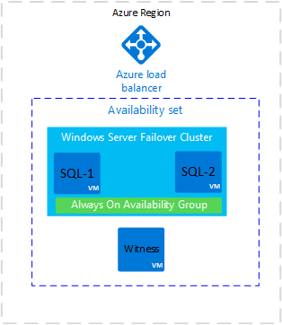
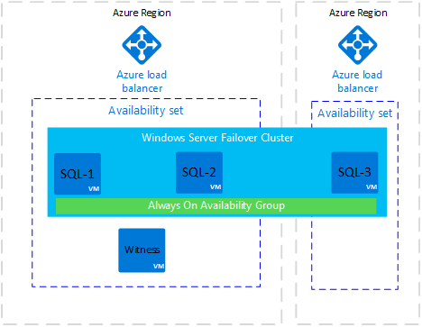
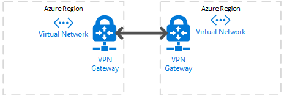
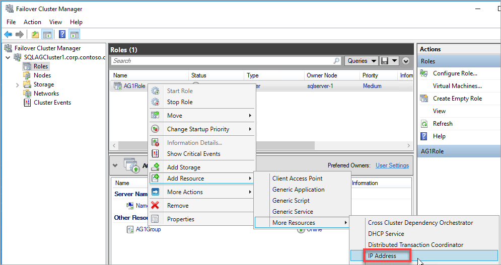
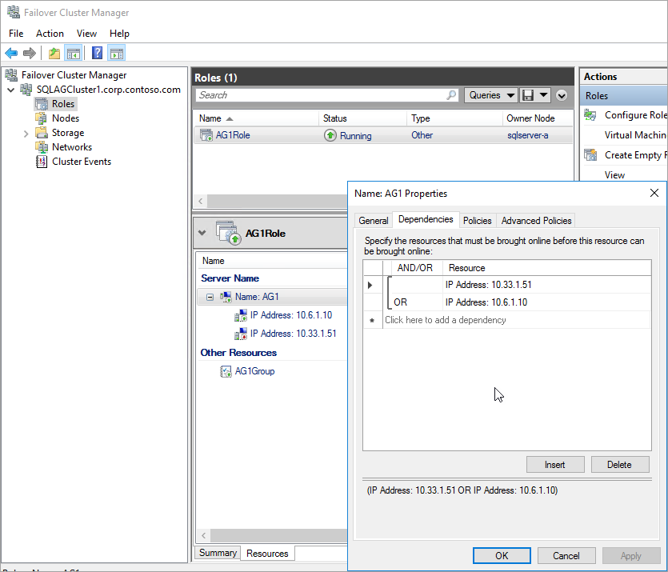

<properties
    pageTitle="SQL Server 可用性组 - Azure 虚拟机 - 灾难恢复 | Azure"
    description="本文介绍如何使用不同区域中的副本在 Azure 虚拟机上配置 SQL Server Always On 可用性组。"
    services="virtual-machines"
    documentationCenter="na"
    authors="MikeRayMSFT"
    manager="jhubbard"
    editor="monicar"
    tags="azure-service-management" />
<tags
    ms.assetid="388c464e-a16e-4c9d-a0d5-bb7cf5974689"
    ms.service="virtual-machines-windows"
    ms.devlang="na"
    ms.custom="na"
    ms.topic="article"
    ms.tgt_pltfrm="vm-windows-sql-server"
    ms.workload="iaas-sql-server"
    ms.date=""
    wacn.date="03/01/2017"
    ms.author="mikeray" />

# 在不同区域中的 Azure 虚拟机上创建 SQL Server Always On 可用性组

本文介绍如何在远程 Azure 位置中的 Azure 虚拟机上配置 SQL Server Always On 可用性组副本。使用此配置可为灾难恢复提供支持。

本文适用于处于 Resource Manager 模式的 Azure 虚拟机。

下图显示了 Azure 虚拟机上可用性组的常见部署：

在此部署中，所有虚拟机位于一个 Azure 区域。在 SQL-1 和 SQL-2 上，可以使用自动故障转移为可用性组副本配置同步提交。可以使用[可用性组模板或教程](/documentation/articles/virtual-machines-windows-portal-sql-availability-group-overview/)构建此体系结构。

如果无法访问 Azure 区域，此体系结构将很容易停机。为了解决此漏洞，可在不同的 Azure 区域添加一个副本。下图显示了新体系结构的大致形式：

上图显示了名为 SQL-3 的新虚拟机。SQL-3 位于不同的 Azure 区域中。SQL-3 已添加到 Windows Server 故障转移群集。SQL-3 可以托管可用性组副本。最后，请注意，SQL-3 所在的 Azure 区域具有一个新的 Azure 负载均衡器。

>[AZURE.NOTE]
如果同一区域中有多个虚拟机，则需要创建 Azure 可用性集。如果区域中只有一个虚拟机，则不需要可用性集。只能在创建虚拟机时将虚拟机放入可用性集。如果虚拟机已在可用性集中，以后可为附加的副本添加虚拟机。

在此体系结构中，远程区域中的副本通常配置了异步提交可用性模式和手动故障转移模式。

如果可用性组副本位于不同 Azure 区域中的 Azure 虚拟机上，则每个区域需要：

* 一个虚拟网络网关
* 一个虚拟网络网关连接

下图显示了数据中心之间的网络通信方式。

## 创建远程副本

若要在远程数据中心创建副本，请执行以下步骤：

1. [在新区域中创建虚拟网络](/documentation/articles/virtual-networks-create-vnet-arm-pportal/)

1. [使用 Azure 门户预览配置 VNet 到 VNet 连接](/documentation/articles/vpn-gateway-howto-vnet-vnet-resource-manager-portal/)。

    >[AZURE.NOTE]
    在某些情况下，可能需要使用 PowerShell 创建 VNet 到 VNet 连接。例如，如果使用不同的 Azure 帐户，则无法在门户中配置该连接。对于这种情况，请参阅[使用 Azure 门户预览配置 VNet 到 VNet 连接](/documentation/articles/vpn-gateway-vnet-vnet-rm-ps/)。

1. [在新区域中创建域控制器](/documentation/articles/active-directory-new-forest-virtual-machine/)。

    如果主站点中的域控制器不可用，此域控制器可提供身份验证。

1. [在新区域中创建 SQL Server 虚拟机](/documentation/articles/virtual-machines-windows-portal-sql-server-provision/)。

1. [在新区域中的网络上创建 Azure 负载均衡器](/documentation/articles/virtual-machines-windows-portal-sql-alwayson-availability-groups-manual/#configure-internal-load-balancer)。

    此负载均衡器必须：
   
    - 与新虚拟机位于同一网络和子网中。
    - 对可用性组侦听器使用静态 IP 地址。
    - 包括后端池，该池只由负载均衡器所在同一区域中的虚拟机构成。
    - 使用特定于 IP 地址的 TCP 端口探测。
    - 具有特定于同一区域中 SQL Server 的负载均衡规则。

1. [向新 SQL Server 添加故障转移群集功能](/documentation/articles/virtual-machines-windows-portal-sql-availability-group-prereq/#add-failover-cluster-features-to-both-sql-servers)

1. [将新 SQL Server 加入域](/documentation/articles/virtual-machines-windows-portal-sql-availability-group-prereq/#joinDomain)。

1. [将新 SQL Server 服务帐户设置为使用域帐户](/documentation/articles/virtual-machines-windows-portal-sql-availability-group-prereq/#setServiceAccount)。

1. [将新 SQL Server 添加到 Windows Server 故障转移群集](/documentation/articles/virtual-machines-windows-portal-sql-availability-group-tutorial/#addNode)。

1. 在群集上创建 IP 地址资源。

    可在故障转移群集管理器中创建 IP 地址资源。右键单击可用性组角色，然后依次单击“添加资源”、“更多资源”、“IP 地址”。

      

    按如下所示配置此 IP 地址：
   
    - 使用远程数据中心内的网络。
    - 从新的 Azure 负载均衡器分配 IP 地址。

1. 在 SQL Server 配置管理器中，[启用 Always On 可用性组](http://msdn.microsoft.com/zh-cn/library/ff878259.aspx)。

1. [在新 SQL Server 上打开防火墙端口](/documentation/articles/virtual-machines-windows-portal-sql-availability-group-prereq/#a-nameendpoint-firewall-configure-the-firewall-on-each-sql-server)。

    需要打开的端口号取决于环境。打开镜像终结点和 Azure 负载均衡器运行状况探测的端口。

1. [将副本添加到新 SQL Server 上的可用性组](http://msdn.microsoft.com/zh-cn/library/hh213239.aspx)。

    对于远程 Azure 区域中的副本，请将它设置为使用手动故障转移进行异步复制。

1. 将该 IP 地址资源添加为侦听器客户端接入点（网络名称）群集的依赖项。

    以下屏幕截图显示了正确配置的 IP 地址群集资源：

      

    >[AZURE.IMPORTANT]
    该群集资源组包含这两个 IP 地址。这两个 IP 地址是侦听器客户端接入点的依赖项。在群集依赖项配置中使用 **OR** 运算符。

1. [在 PowerShell 中设置群集参数](/documentation/articles/virtual-machines-windows-portal-sql-availability-group-tutorial/#setparam)。

    >[AZURE.IMPORTANT]
    使用在新区域中的负载均衡器上配置的 IP 地址和探测端口运行 PowerShell 脚本。

## 设置多个子网的连接

远程数据中心内的副本是可用性组的一部分，但位于不同的子网。如果此副本成为主副本，可能会发生应用程序连接超时。多子网部署中的本地可用性组也存在相同的行为。若要允许从客户端应用程序建立连接，请更新客户端连接，或者在群集网络名称资源上配置名称解析缓存。

最好是将客户端连接字符串更新为设置 `MultiSubnetFailover=Yes`。请参阅 [Connecting With MultiSubnetFailover](http://msdn.microsoft.com/zh-cn/library/gg471494#Anchor_0)（使用 MultiSubnetFailover 进行连接）。

如果无法修改连接字符串，可以配置名称解析缓存。请参阅 [Connection Timeouts in Multi-subnet Availability Group](http://blogs.msdn.microsoft.com/alwaysonpro/2014/06/03/connection-timeouts-in-multi-subnet-availability-group/)（多子网可用性组中的连接超时）。

## 故障转移到远程区域 

若要测试侦听器与远程区域之间的连接，可将副本故障转移到远程区域。尽管副本是异步的，但故障转移存在丢失数据的可能性。若要故障转移并防止丢失数据，请将可用性模式更改为同步，将故障转移模式设置为自动。使用以下步骤：

1. 在“对象资源管理器”中，连接到托管主副本的 SQL Server 实例。
1. 在“AlwaysOn 可用性组”\>“可用性组”下面，右键单击你的可用性组，然后单击“属性”。
1. 在“常规”页上的“可用性副本”下面，将 DR 站点中的辅助副本设置为使用“同步提交”可用性模式和“自动”故障转移模式。
1. 如果在主副本所在的同一个站点中创建了辅助副本用于实现高可用性，请将此副本设置为“异步提交”和“手动”。
1. 单击“确定”。
1. 在“对象资源管理器”中，右键单击该可用性组，然后单击“显示仪表板”。
1. 在仪表板中，验证 DR 站点中的副本是否已同步。
1. 在“对象资源管理器”中，右键单击该可用性组，然后单击“故障转移...”。SQL Server Management Studio 将打开一个向导来故障转移 SQL Server。
1. 单击“下一步”，选择 DR 站点中的 SQL Server 实例。再次单击“下一步”。
1. 连接到 DR 站点的 SQL Server 实例，然后单击“下一步”。
1. 在“摘要”页上检查设置，然后单击“完成”。

测试连接后，将主副本移回主数据中心，将可用性模式设置回其正常运行的设置。下表显示了本文档所述体系结构的正常运行的设置：

| 位置 | 服务器实例 | 角色 | 可用性模式 | 故障转移模式
| ----- | ----- | ----- | ----- | ----- 
| 主数据中心 | SQL-1 | 主要 | 同步 | 自动
| 主数据中心 | SQL-2 | 辅助 | 同步 | 自动
| 辅助或远程数据中心 | SQL-3 | 辅助 | 异步 | 手动

### 有关计划内和强制手动故障转移的详细信息

有关详细信息，请参阅以下主题：

- [执行可用性组的计划内手动故障转移 \(SQL Server\)](http://msdn.microsoft.com/zh-cn/library/hh231018.aspx)
- [执行可用性组的强制手动故障转移 \(SQL Server\)](http://msdn.microsoft.com/zh-cn/library/ff877957.aspx)

## 其他链接

* [Always On 可用性组](http://msdn.microsoft.com/zh-cn/library/hh510230.aspx)
* [Azure 虚拟机](/documentation/services/virtual-machines/windows/)
* [Azure 负载均衡器](/documentation/articles/virtual-machines-windows-portal-sql-alwayson-availability-groups-manual/#configure-internal-load-balancer)
* [Azure 可用性集](/documentation/articles/virtual-machines-windows-manage-availability/)

<!---HONumber=Mooncake_0213_2017-->