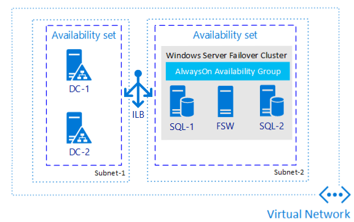

<properties
    pageTitle="SQL Server 可用性组 - Azure 虚拟机 - 概述 | Azure"
    description="本文介绍 Azure 虚拟机上的 SQL Server 可用性组。"
    services="virtual-machines"
    documentationCenter="na"
    authors="MikeRayMSFT"
    manager="jhubbard"
    editor="monicar"
    tags="azure-service-management" />
<tags
    ms.assetid="601eebb1-fc2c-4f5b-9c05-0e6ffd0e5334"
    ms.service="virtual-machines-windows"
    ms.devlang="na"
    ms.custom="na"
    ms.topic="article"
    ms.tgt_pltfrm="na"
    ms.workload="infrastructure-services"
    ms.date="12/28/2016"
    wacn.date="02/20/2017"
    ms.author="mikeray" />

# Azure 虚拟机上的 SQL Server AlwaysOn 可用性组简介 #

本文介绍 Azure 虚拟机上的 SQL Server 可用性组。

Azure 虚拟机上的 AlwaysOn 可用性组类似于本地的 AlwaysOn 可用性组。有关详细信息，请参阅 [AlwaysOn 可用性组 \(SQL Server\)](http://msdn.microsoft.com/zh-cn/library/hh510230.aspx)。

下图阐述了 Azure 虚拟机中完整 SQL Server 可用性组的各个部分。

  

Azure 虚拟机中可用性组的主要区别是，Azure 虚拟机需要[负载均衡器](/documentation/articles/load-balancer-overview/)。负载均衡器保存可用性组侦听器的 IP 地址。如果有多个可用性组，则每个组都需要一个侦听器。一个负载均衡器可以支持多个侦听器。

若要准备在 Azure 虚拟机上生成 SQL Server 可用性组，请参阅这些教程。

## 自动从模板创建可用性组

[在 Azure VM 中自动配置 Always On 可用性组 - Resource Manager](/documentation/articles/virtual-machines-windows-portal-sql-alwayson-availability-groups-manual/)

## 在 Azure 门户预览中手动创建可用性组

还可以自行创建虚拟机，不需模板。首先完成先决条件，然后创建可用性组。请参阅以下主题：

- [在 Azure 虚拟机上配置 SQL Server AlwaysOn 可用性组的先决条件](/documentation/articles/virtual-machines-windows-portal-sql-availability-group-prereq/)

- [创建 AlwaysOn 可用性组来提高可用性和实现灾难恢复](/documentation/articles/virtual-machines-windows-portal-sql-availability-group-tutorial/)

## 配置负载均衡器

[为可用性组侦听器创建负载均衡器](/documentation/articles/virtual-machines-windows-portal-sql-ps-alwayson-int-listener/)。

<!---HONumber=Mooncake_0213_2017-->