<properties
    pageTitle="SQL Server 可用性组 - Azure 虚拟机 - 教程 | Azure"
    description="本教程介绍如何在 Azure 虚拟机上创建 SQL Server Always On 可用性组。"
    services="virtual-machines"
    documentationCenter="na"
    authors="MikeRayMSFT"
    manager="jhubbard"
    editor="monicar"
    tags="azure-service-management" />
<tags
    ms.assetid="08a00342-fee2-4afe-8824-0db1ed4b8fca"
    ms.service="virtual-machines-sql"
    ms.devlang="na"
    ms.custom="na"
    ms.topic="article"
    ms.tgt_pltfrm="vm-windows-sql-server"
    ms.workload="iaas-sql-server"
    ms.date="01/10/2016"
    wacn.date="02/20/2017"
    ms.author="mikeray" />

# 创建 Always On 可用性组来提高可用性和实现灾难恢复

本教程介绍如何在 Azure 虚拟机上创建 SQL Server Always On 可用性组。整个教程将在两个 SQL Server 上创建包含数据库副本的可用性组。

**估计所需时间**：如果满足先决条件，完成本教程大约需要 30 分钟。

下图演示了在本教程中生成的项目。

  

## 先决条件

本教程假设读者对 SQL Server Always On 可用性组有一个基本的了解。如需详细信息，请参阅 [Overview of Always On Availability Groups \(SQL Server\)](http://msdn.microsoft.com/zh-cn/library/ff877884.aspx)（Always On 可用性组概述 \(SQL Server\)）。

下表列出了在开始学习本教程之前需要满足的先决条件：

| |要求 |说明 |
|----- |----- |----- |
| | 两个 SQL Server | - 在 Azure 可用性集中   - 在单个域中   - 装有故障转移群集功能 |
| | Windows Server | 用于群集见证的文件共享 |  
| |SQL Server 服务帐户 | 域帐户 |
| |SQL Server 代理服务帐户 | 域帐户 |  
| |打开防火墙端口 | SQL Server：为默认实例打开 **1433**   - 数据库镜像终结点：**5022** 或任何可用端口   - Azure 负载均衡器探测：**59999** 或任何可用端口 |
| |添加故障转移群集功能 | 两个 SQL Server 都需要此功能 |
| |安装域帐户 | - 每个 SQL Server 上的本地管理员帐户   - 每个 SQL Server 实例的 SQL Server sysadmin 固定服务器角色的成员 |

在开始学习本教程之前，需要[满足在 Azure 虚拟机中创建 Always On 可用性组的先决条件](/documentation/articles/virtual-machines-windows-portal-sql-availability-group-prereq/)。如果已满足这些先决条件，可转到[创建群集](#CreateCluster)。

<!--**Procedure**: *This is the first "step". Make titles H2's and short and clear - H2's appear in the right pane on the web page and are important for navigation.*-->

## 创建群集

满足先决条件后，第一步是创建包含两个 SQL Sever 和一个见证服务器的 Windows Server 故障转移群集。

1. 使用在两个 SQL Server 上和见证服务器上充当管理员的域帐户通过 RDP 连接到第一个 SQL Server。

    >[AZURE.TIP]
    如果已完成[预备文档](/documentation/articles/virtual-machines-windows-portal-sql-availability-group-prereq/)，则已创建名为 **CORP\\Install** 的帐户。请使用此帐户。

2. 在“服务器管理器”仪表板中，选择“工具”，然后单击“故障转移群集管理器”。
3. 在左窗格中，右键单击“故障转移群集管理器”，然后单击“创建群集”。
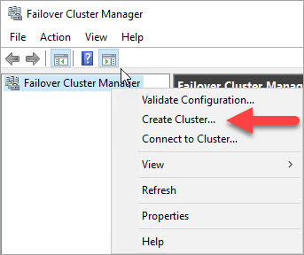
4. 在“创建群集向导”中，使用下表中的设置完成向导的每个页面，创建一个单节点群集：

    | Page | 设置 |
    | --- | --- |
    | 开始之前 |使用默认值 |
    | 选择服务器 |在“输入服务器名称”中键入第一个 SQL Server 的名称，然后单击“添加”。 |
    | 验证警告 |选择“否。不需要 Microsoft 对该群集的支持，因此不希望运行验证测试。单击‘下一步’时，继续创建群集。” |
    | 用于管理群集的访问点 |在“群集名称”中键入群集名称，例如 **SQLAGCluster1**。|
    | 确认 |除非你使用的是存储空间，否则请使用默认值。请参阅此表后面的备注。 |

### 设置群集 IP 地址

1. 在“故障转移群集管理器”中，向下滚动到“群集核心资源”并展开群集详细信息。你应看到“名称”和“IP 地址”资源都处于“已失败”状态。不能将 IP 地址资源联机，原因是为该群集分配的 IP 地址与计算机本身的地址相同，因此这是一个重复地址。

2. 右键单击失败的“IP 地址”资源，然后单击“属性”。

    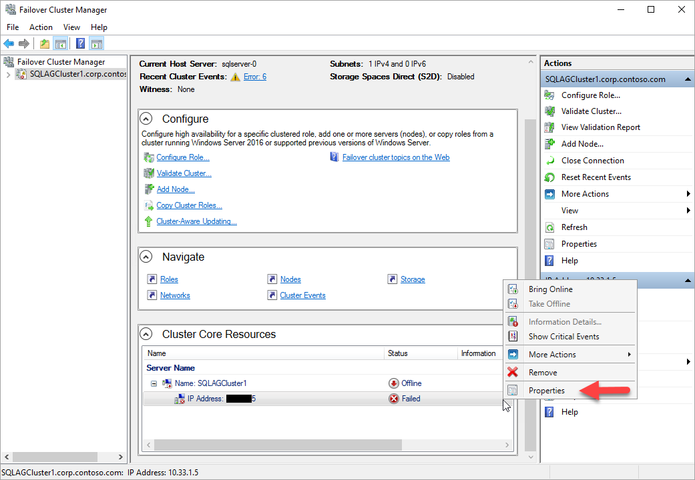  

3. 选择“静态 IP 地址”，在“地址”文本框中指定 SQL Server 所在的子网中可用的地址。然后，单击“确定”。
4. 在“群集核心资源”部分中，右键单击群集名称，然后单击“联机”。然后等待两个资源都已联机。当该群集名称资源联机时，它会用新的 AD 计算机帐户更新 DC 服务器。稍后将使用此 AD 帐户来运行可用性组群集服务。

### 将另一个 SQL Server 添加到群集

将另一个 SQL Server 添加到群集。

1. 在浏览器树中，右键单击该群集，然后单击“添加节点”。

    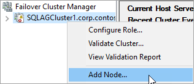  

1. 在“添加节点向导”中，单击“下一步”。在“选择服务器”页中添加第二个 SQL Server。在“输入服务器名称”中键入服务器名称，然后单击“添加”。完成后，单击“下一步”。

1. 在“验证警告”页上，单击“否”（在生产方案中，你应执行验证测试）。然后，单击“下一步”。

8. 如果使用存储空间，请在“确认”页中清除“将所有符合条件的存储添加到群集中”复选框。

    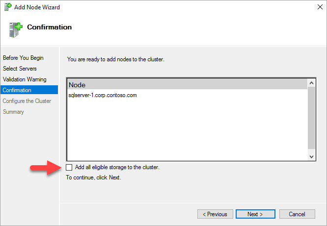  

    >[AZURE.WARNING]
    如果使用存储空间并且未取消选中“将所有符合条件的存储添加到群集中”，Windows 将在组建群集的过程中分离虚拟磁盘。因此，会导致在从群集中删除存储空间并使用 PowerShell 重新附加之前，磁盘管理器或资源管理器中不会显示这些磁盘。存储空间会将多个磁盘分组到存储池。有关详细信息，请参阅[存储空间](https://technet.microsoft.com/zh-cn/library/hh831739)。

1. 单击“下一步”。

1. 单击“完成”。

    故障转移群集管理器将显示群集包含三个节点，并将这些节点列在“节点”容器中。

10. 从远程桌面会话注销。

### 添加群集仲裁文件共享

在本示例中，Windows 群集使用文件共享来创建群集仲裁。本教程使用“节点和文件共享多数”仲裁。有关详细信息，请参阅 [Understanding Quorum Configurations in a Failover Cluster](http://technet.microsoft.com/zh-cn/library/cc731739.aspx)（了解故障转移群集中的仲裁配置）。

1. 使用远程桌面会话连接到文件共享见证成员服务器。

1. 在“服务器管理器”中单击“工具”。打开“计算机管理”。

1. 单击“共享文件夹”。

1. 右键单击“共享”，然后单击“新建共享...”。

    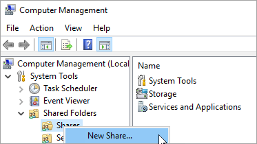  

    使用“创建共享文件夹向导”创建共享。

1. 在“文件夹路径”中，单击“浏览”并找到或创建共享文件夹的路径。单击**“下一步”**。

1. 在“名称、说明和设置”中，检查共享名称和路径。单击**“下一步”**。

1. 在“共享文件夹权限”中，设置“自定义权限”。单击“自定义...”。

1. 在“自定义权限”中，单击“添加...”。

1. 确保用于创建群集的帐户拥有完全控制权限。

    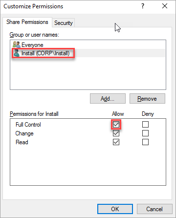  

1. 单击“确定”。

1. 在“共享文件夹权限”中，单击“完成”。再次单击“完成”。

1. 从服务器注销

### 配置群集仲裁

接下来设置群集仲裁。

1. 使用远程桌面连接到第一个群集节点。

1. 在“故障转移群集管理器”中，右键单击该群集，指向“更多操作”，然后单击“配置群集仲裁设置...”。

    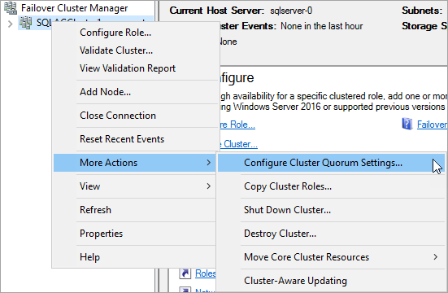  

1. 在“配置群集仲裁向导”中单击“下一步”。

1. 在“选择仲裁配置选项”中，选择“选择仲裁见证”，然后单击“下一步”。

1. 在“选择仲裁见证”中，单击“配置文件共享见证”。

    >[AZURE.TIP]
    Windows Server 2016 支持云见证。如果选择此类见证，则不需要文件共享见证。有关详细信息，请参阅 [Deploy a cloud witness for a Failover Cluster](http://technet.microsoft.com/windows-server-docs/failover-clustering/deploy-cloud-witness)（为故障转移群集部署云见证）。本教程使用早期操作系统支持的文件共享见证。

1. 在“配置文件共享见证”中，键入所创建的共享的路径。单击**“下一步”**。

1. 在“确认”屏幕中检查设置。单击**“下一步”**。

1. 单击“完成”。

现已使用文件共享见证配置群集核心资源。

## 启用可用性组

接下来，启用“AlwaysOn 可用性组”功能。在两个 SQL Server 上执行这些步骤。

1. 从“开始”菜单，启动 **SQL Server 配置管理器**。
2. 在浏览器树中，单击“SQL Server 服务”，右键单击“SQL Server \(MSSQLSERVER\)”服务，然后单击“属性”。
3. 单击“AlwaysOn 高可用性组”选项卡，选择“启用 AlwaysOn 可用性组”，如下所示：

    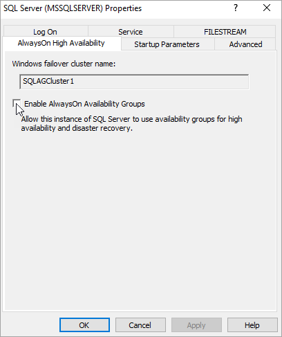  

4. 单击“应用”。在弹出对话框中单击“确定”。

5. 重新启动 SQL Server 服务。

对另一个 SQL Server 重复上述步骤。

<!-----------------
## Open firewall for the database mirroring endpoint

Each instance of SQL Server that participates in an Availability Group requires a database mirroring endpoint. This endpoint is a TCP port for the instance of SQL Server that is used to synchronize the database replicas in the Availability Groups on that instance.

On both SQL Servers, open the firewall for the TCP port for the database mirroring endpoint.

1. On the first SQL Server **Start** screen, launch **Windows Firewall with Advanced Security**.
2. In the left pane, select **Inbound Rules**. On the right pane, click **New Rule**.
3. For **Rule Type**, choose **Port**.
1. For the port, specify TCP and choose an unused TCP port number. For example, type *5022* and click **Next**.

    >[AZURE.NOTE]
    >For this example, we're using TCP port 5022. You can use any available port.

5. In the **Action** page, keep **Allow the connection** selected and click **Next**.
6. In the **Profile** page, accept the default settings and click **Next**.
7. In the **Name** page, specify a rule name, such as **Default Instance Mirroring Endpoint** in the **Name** text box, then click **Finish**.

Repeat these steps on the second SQL Server.
-------------------------->

## 在第一个 SQL Server 上创建数据库

1. 使用充当 sysadmin 固定服务器角色成员的域帐户启动 RDP 文件，与第一个 SQL Server 建立连接。
1. 打开 SQL Server Management Studio 并连接到第一个 SQL Server。
7. 在“对象资源管理器”中，右键单击“数据库”，然后单击“新建数据库”。
8. 在“数据库名称”中，键入 **MyDB1**，然后单击“确定”。

### 创建备份共享

1. 在第一个 SQL Server 上的“服务器管理器”中，单击“工具”。打开“计算机管理”。

1. 单击“共享文件夹”。

1. 右键单击“共享”，然后单击“新建共享...”。

      

    使用“创建共享文件夹向导”创建共享。

1. 在“文件夹路径”中，单击“浏览”并找到或创建数据库备份共享文件夹的路径。单击**“下一步”**。

1. 在“名称、说明和设置”中，检查共享名称和路径。单击**“下一步”**。

1. 在“共享文件夹权限”中，设置“自定义权限”。单击“自定义...”。

1. 在“自定义权限”中，单击“添加...”。

1. 确保两个服务器的 SQL Server 和 SQL Server 代理服务帐户拥有完全控制权限。

    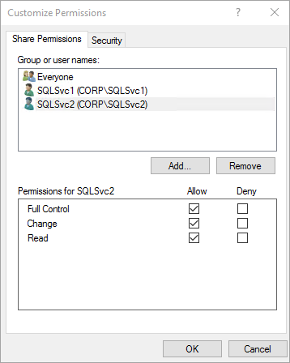  

1. 单击“确定”。

1. 在“共享文件夹权限”中，单击“完成”。再次单击“完成”。

### 创建数据库的完整备份

需要备份新数据库才能初始化日志链。如果未创建新数据库的备份，则无法将它包含在可用性组中。

1. 在“对象资源管理器”中右键单击数据库，指向“任务...”，然后单击“备份”。

1. 单击“确定”，在默认备份位置创建完整备份。

## 创建可用性组
现在，可以使用以下步骤配置可用性组：

* 在第一个 SQL Server 上创建数据库。
* 获取数据库的完整备份和事务日志备份
* 使用 **NORECOVERY** 选项将完整备份和日志备份还原到第二个 SQL Server
* 通过同步提交、自动故障转移和可读辅助副本来创建可用性组 \(**AG1**\)

### 创建可用性组：

1. 通过远程桌面会话连接到第一个 SQL Server。在 SSMS 的“对象资源管理器”中，右键单击“AlwaysOn 高可用性”，然后单击“新建可用性组向导”。

    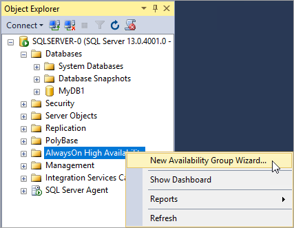  

2. 在“简介”页上，单击“下一步”。在“指定可用性组名称”页上的“可用性组名称”中，键入可用性组的名称（例如 **AG1**）。单击“下一步”。

    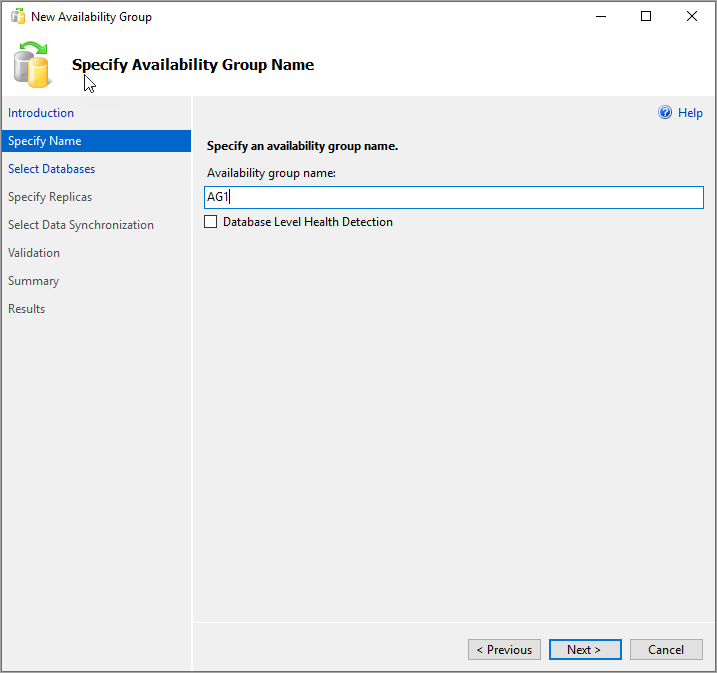  

3. 在“选择数据库”页中选择你的数据库，然后单击“下一步”。

    >[AZURE.NOTE]
    这些数据库满足可用性组的先决条件，因为已经对目标主副本至少执行了一次完整备份。

    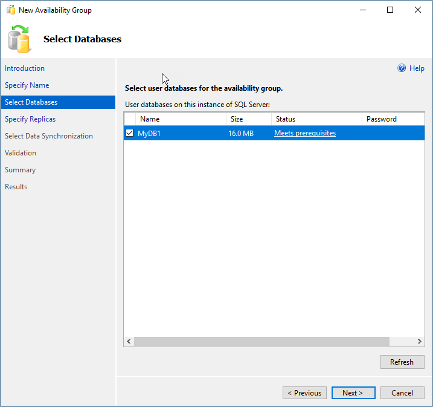  

4. 在“指定副本”页上，单击“添加副本”。

    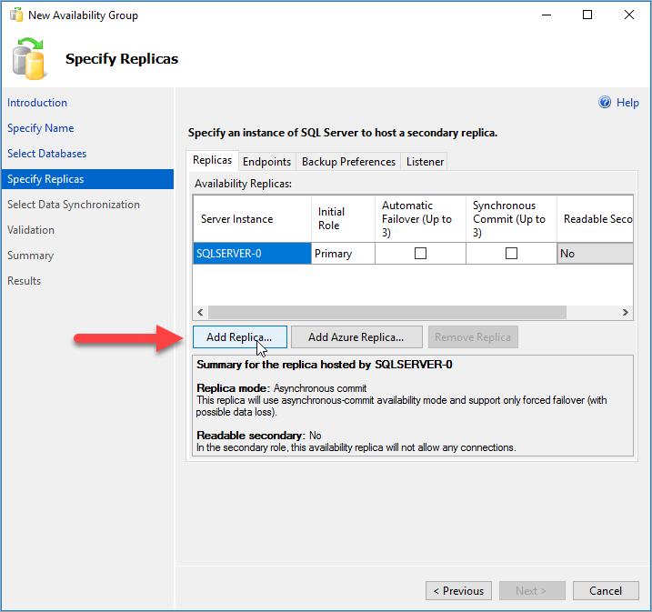  

5. 此时会弹出“连接到服务器”对话框。在“服务器名称”中键入第二个服务器的名称。单击“连接”。

    返回“指定副本”页，此时“可用性副本”中应会列出第二个服务器。按如下所示配置副本。

    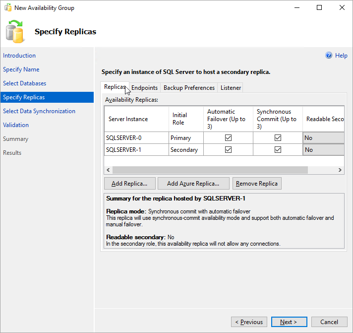  

6. 单击“终结点”，查看此可用性组的数据库镜像终结点。使用设置[数据库镜像终结点的防火墙规则](/documentation/articles/virtual-machines-windows-portal-sql-availability-group-prereq/#endpoint-firewall)时所用的同一端口。

    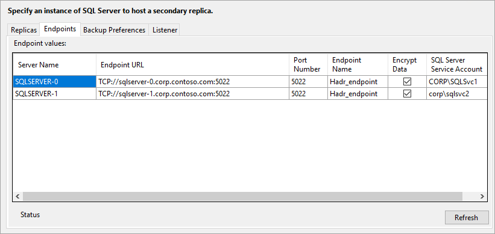  

8. 在“选择初始数据同步”页中，选择“完全”并指定共享网络位置。对于位置，请使用[创建的备份共享](#backupshare)。在本示例中为 \**\\\\\<First SQL Server\>\\Backup\**。单击“下一步”。

    >[AZURE.NOTE]
    完全同步创建第一个 SQL Server 实例上的数据库的完整备份，并将其还原到第二个实例。对于大型数据库，不建议使用完全同步，因为这可能需要花费很长时间。手动创建数据库备份并使用 `NO RECOVERY` 还原它可减少同步时间。如果在配置可用性组之前已使用 `NO RECOVERY` 在第二个 SQL Server 上还原数据库，请选择“仅联接”。如果想要在配置可用性组之后创建备份，请选择“跳过初始数据同步”。

    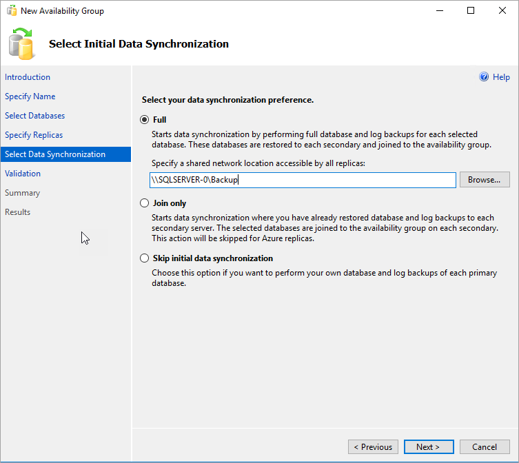  

9. 在“验证”页中，单击“下一步”。此页应与下图类似：

    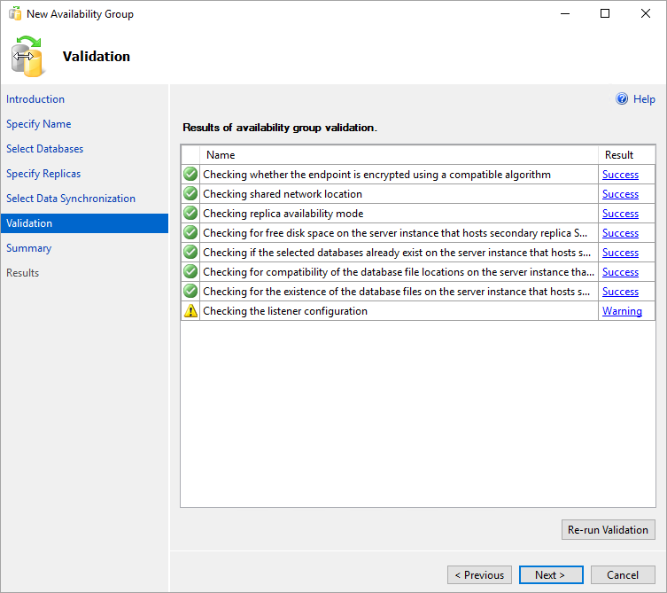  

	>[AZURE.NOTE]
	由于尚未配置可用性组侦听器，因此会出现侦听器配置警告。可以忽略此警告，因为在 Azure 虚拟机上，需要在创建 Azure 负载均衡器之后才能创建侦听器。

10. 在“摘要”页中单击“完成”，然后等待向导配置完新的可用性组。在“进度”页上，可单击“更多详细信息”以查看详细进度。完成向导操作后，请检查“结果”页，确认可用性组已成功创建。

     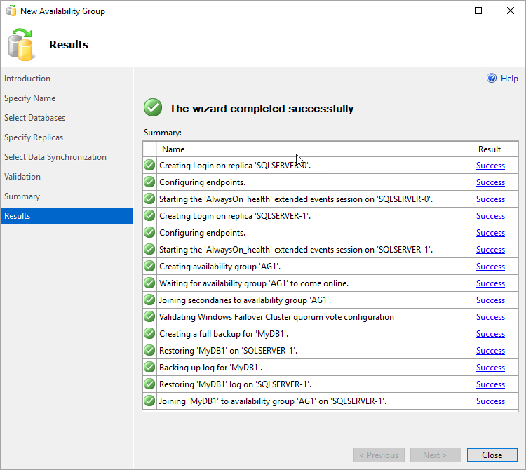  

11. 单击“关闭”退出向导。

### 检查可用性组

1. 在“对象资源管理器”中，展开“AlwaysOn 高可用性”，然后展开“可用性组”。现在，应会在此容器中看到新的可用性组。右键单击该可用性组，然后单击“显示仪表板”。

    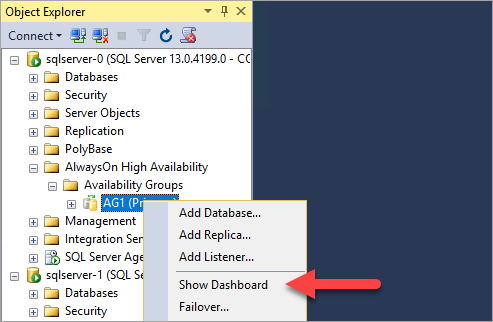  

    “AlwaysOn 仪表板”应如下所示。

    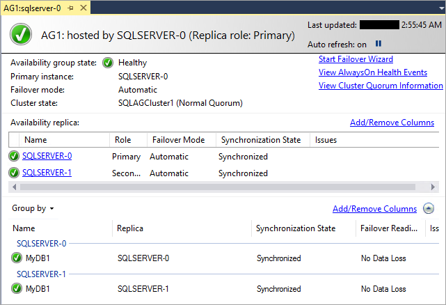  

    你可以查看副本、每个副本的故障转移模式以及同步状态。

2. 在“故障转移群集管理器”中单击你的群集。选择“角色”。使用的可用性组名称是群集上的角色。可用性组未使用客户端连接的 IP 地址，因为尚未配置侦听器。将在创建 Azure 负载均衡器后配置侦听器。

    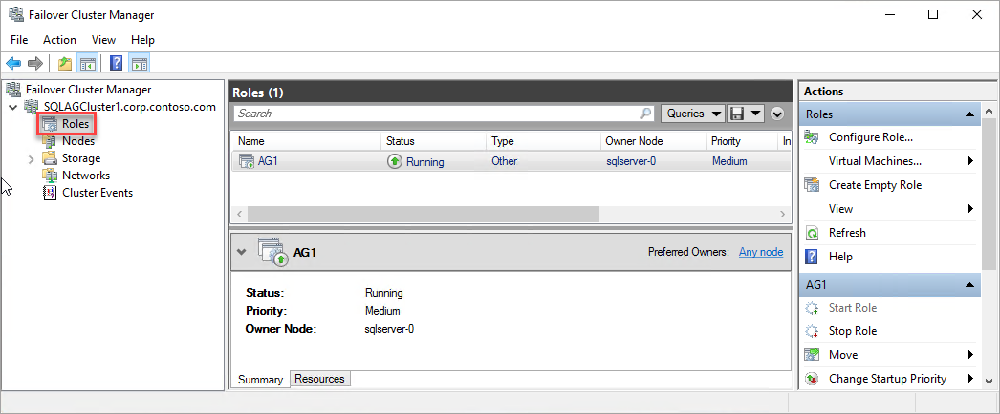  

    > [AZURE.WARNING]
    请勿尝试从故障转移群集管理器对可用性组进行故障转移。所有故障转移操作都应在 SSMS 中的 **AlwaysOn 仪表板**内进行。有关详细信息，请参阅[将 WSFC 故障转移群集管理器用于可用性组的限制](https://msdn.microsoft.com/zh-cn/library/ff929171.aspx)。
    >

此时，已在两个 SQL Server 实例上创建了包含副本的可用性组。可在实例之间移动可用性组。由于没有创建侦听器，目前无法连接到可用性组。在 Azure 虚拟机中，侦听器需要负载均衡器。下一步是在 Azure 中创建负载均衡器。

## 创建 Azure 负载均衡器

在 Azure 虚拟机上， SQL Server 可用性组需要负载均衡器。负载均衡器保存可用性组侦听器的 IP 地址。本部分概述如何在 Azure 门户预览中创建负载均衡器。

1. 在 Azure 门户预览中，转到 SQL Server 所在的资源组，然后单击“+ 添加”。
2. 搜索“负载均衡器”。选择 Microsoft 发布的负载均衡器。

    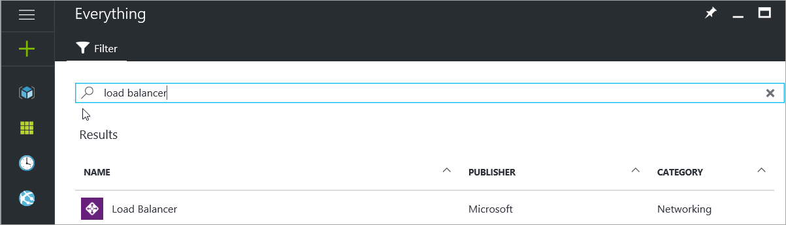  

1.  单击“创建”。
3. 配置负载均衡器的以下参数。

    | 设置 | 字段 |
    | --- | --- |
    | **名称** |为负载均衡器使用文本名称，例如 **sqlLB**。 |
    | **方案** |内部 |
    | **虚拟网络** |使用虚拟网络的名称。 |
    | **子网** |使用虚拟机所在的子网的名称。 |
    | **IP 地址分配** |静态 |
    | **IP 地址** |使用子网中的可用地址。 |
    | **订阅** |使用虚拟机所在的同一个订阅。 |
    | **位置** |使用虚拟机所在的同一个位置。 |

    Azure 门户预览边栏选项卡应如下所示：

    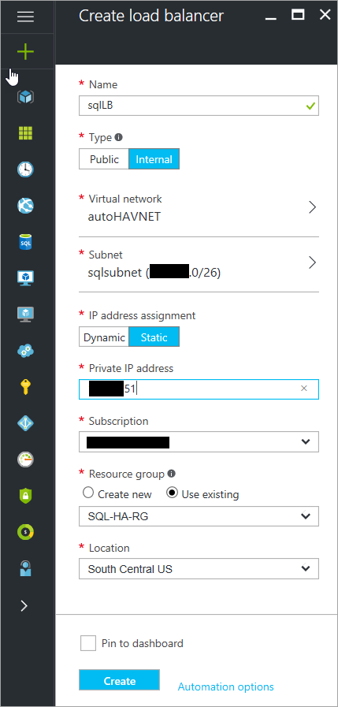  

1. 单击“创建”创建负载均衡器。

## 配置负载均衡器

若要配置负载均衡器，需要创建后端池、探测，并设置负载均衡规则。请在 Azure 门户预览中执行这些操作。

### 添加后端池

1. 在 Azure 门户预览中，转到你的可用性组。可能需要刷新视图才能看到新建的负载均衡器。

    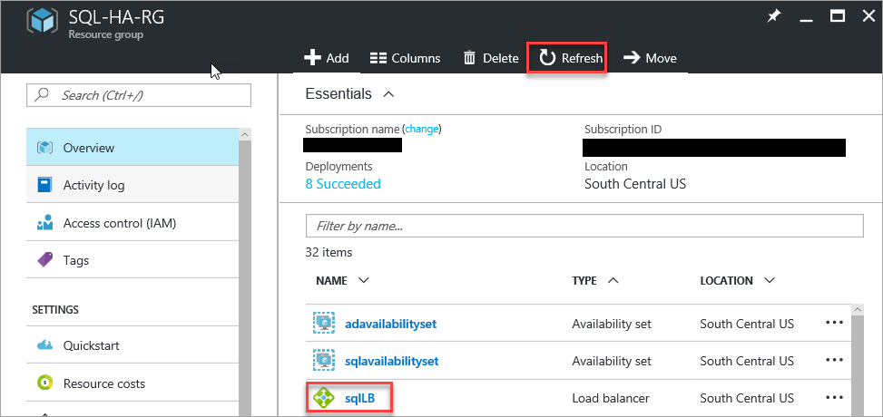  

1. 单击负载均衡器，单击“后端池”，然后单击“+ 添加”。按如下所示设置后端池：

    | 设置 | 说明 | 示例
    | --- | --- |---
    | **名称** | 键入文本名称 | SQLLBBE
    | **可用性集** | 使用 SQL Server VM 所在的可用性集的名称 | sqlAvailabilitySet |
    | **虚拟机** |两个 Azure SQL Server VM 名称 | sqlserver-0、sqlserver-1

1. 键入后端池的名称。

1. 单击“+ 添加虚拟机”。

1. 对于可用性集，请选择 SQL Server 所在的可用性集。

1. 对于虚拟机，请包含这两个 SQL Server。不要包含文件共享见证服务器。所做的选择应如下图所示：

    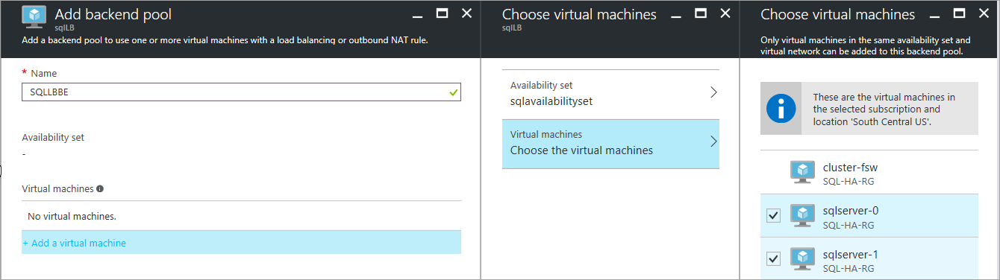  

1. 单击“确定”创建后端池。

### 设置探测

1. 单击负载均衡器，单击“运行状况探测”，然后单击“+ 添加”。

1. 按如下所示设置运行状况探测：

    | 设置 | 说明 | 示例
    | --- | --- |---
    | **名称** | 文本 | SQLAlwaysOnEndPointProbe |
    | **协议** | 选择 TCP | TCP |
    | **端口** | 任何未使用的端口 | 59999 |
    | **时间间隔** | 尝试探测的间隔时间，以秒为单位 |5 |
    | **不正常阈值** | 在将虚拟机视为不正常之前，探测必须连续失败的次数。 | 2 |

1. 单击“确定”设置运行状况探测。

### 设置负载均衡规则

1. 单击负载均衡器，单击“负载均衡规则”，然后单击“+ 添加”。

1. 按如下所示设置负载均衡规则。
    | 设置 | 说明 | 示例
    | --- | --- |---
    | **名称** | 文本 | SQLAlwaysOnEndPointListener |
    | **前端 IP 地址** | 选择地址 |使用创建负载均衡器时所创建的地址。 |
    | **协议** | 选择 TCP |TCP |
    | **端口** | 使用 SQL Server 实例的端口 | 1433 |
    | **后端端口** | 如果为直接服务器返回设置了“浮动 IP”，将不使用此字段 | 1433 |
    | **探测** |为探测指定的名称 | SQLAlwaysOnEndPointProbe |
    | **会话持久性** | 下拉列表 | **无** |
    | **空闲超时** | 将 TCP 连接保持打开的分钟数 | 4 |
    | **浮动 IP \(直接服务器返回\)** | |Enabled |

    > [AZURE.WARNING]
    直接服务器返回是在创建过程中设置的，无法更改。

1. 单击“确定”设置负载均衡规则。

## 配置侦听器

下一步是在故障转移群集上配置可用性组侦听器。

> [AZURE.NOTE]
本教程说明如何创建单个侦听器，该侦听器只使用一个 ILB IP 地址。若要创建使用一个或多个 IP 地址的一个或多个侦听器，请参阅[创建可用性组侦听器和负载均衡器 \| Azure](/documentation/articles/virtual-machines-windows-portal-sql-ps-alwayson-int-listener/)。
>
>

[AZURE.INCLUDE [ag-listener-configure](../../includes/virtual-machines-ag-listener-configure.md)]

## 设置侦听器端口

在 SQL Server Management Studio 中设置侦听器端口。

1. 启动 SQL Server Management Studio 并连接到主副本。

1. 导航到“AlwaysOn 高可用性”\|“可用性组”\|“可用性组侦听器”。

1. 你现在应看到在故障转移群集管理器中创建的侦听器名称。右键单击侦听器名称，然后单击“属性”。

1. 在“端口”框中，通过使用先前使用过的 $EndpointPort 为可用性组侦听器指定端口号（默认值为 1433），然后单击“确定”。

现在，Resource Manager 模式下运行的 Azure 虚拟机中便有了一个 SQL Server 可用性组。

## 测试与侦听器的连接

若要测试连接，请执行以下操作：

1. 通过 RDP 连接到同一虚拟网络中不拥有副本的 SQL Server。可以使用群集中的另一个 SQL Server。

1. 使用 **sqlcmd** 实用工具测试连接。例如，以下脚本通过侦听器与 Windows 身份验证来与主副本建立 **sqlcmd** 连接：

        sqlmd -S <listenerName> -E

    如果侦听器使用的端口不是默认端口 \(1433\)，请在连接字符串中指定该端口。例如，以下 sqlcmd 命令连接到位于端口 1435 的侦听器：

        sqlcmd -S <listenerName>,1435 -E

    SQLCMD 连接将自动连接到托管主副本的 SQL Server 实例。

> [AZURE.TIP]
确保指定的端口已在两个 SQL Server 的防火墙上打开。这两个服务器需要所用 TCP 端口的入站规则。有关详细信息，请参阅 [Add or Edit Firewall Rule](http://technet.microsoft.com/zh-cn/library/cc753558.aspx)（添加或编辑防火墙规则）。
>
>

<!--**Notes**: *Notes provide just-in-time info: A Note is "by the way" info, an Important is info users need to complete a task, Tip is for shortcuts. Don't overdo*.-->

<!--**Procedures**: *This is the second "step." They often include substeps. Again, use a short title that tells users what they'll do*. *("Configure a new web project.")*-->

<!--**UI**: *Note the format for documenting the UI: bold for UI elements and arrow keys for sequence. (Ex. Click **File > New > Project**.)*-->

<!--**Screenshot**: *Screenshots really help users. But don't include too many since they're difficult to maintain. Highlight areas you are referring to in red.*-->

<!--**No. of steps**: *Make sure the number of steps within a procedure is 10 or fewer. Seven steps is ideal. Break up long procedure logically.*-->

<!--**Next steps**: *Reiterate what users have done, and give them interesting and useful next steps so they want to go on.*-->

## 后续步骤

- [将 IP 地址添加到第二个可用性组的负载均衡器](/documentation/articles/virtual-machines-windows-portal-sql-ps-alwayson-int-listener/#Add-IP)。

<!---HONumber=Mooncake_0213_2017-->