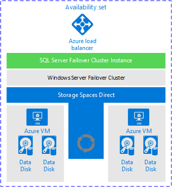
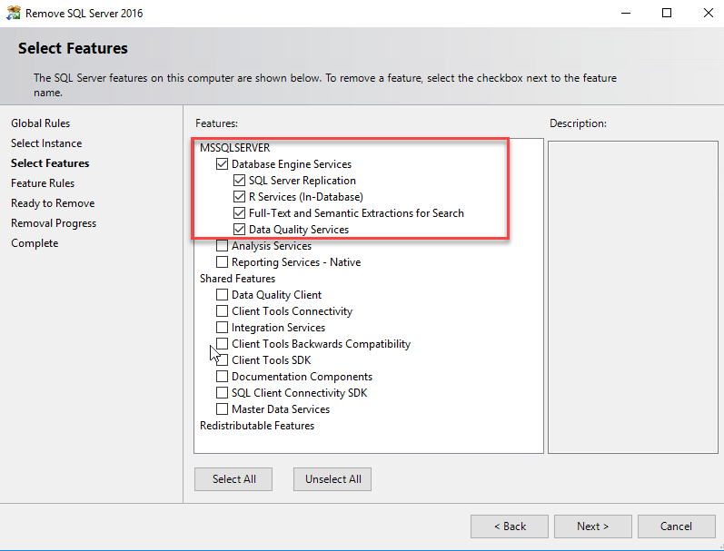
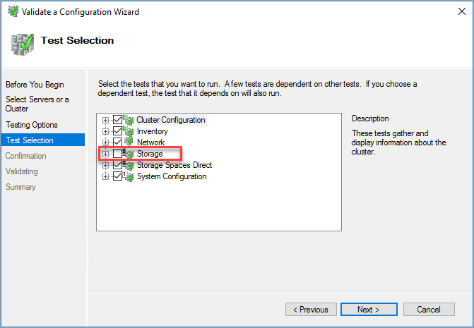
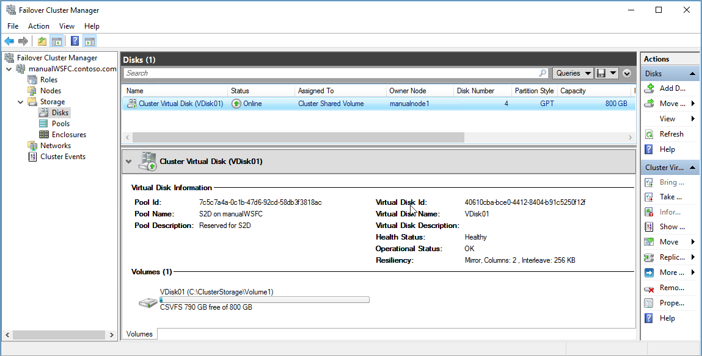
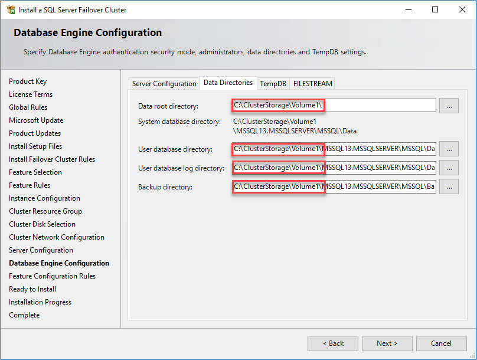
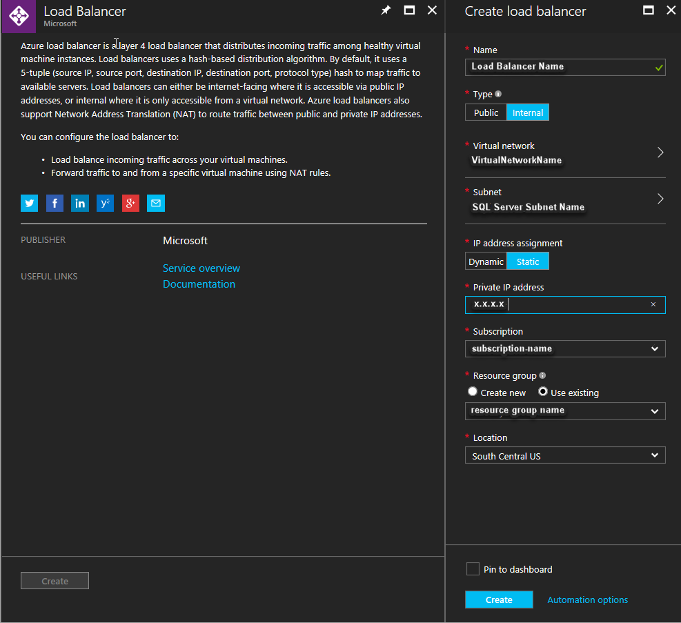
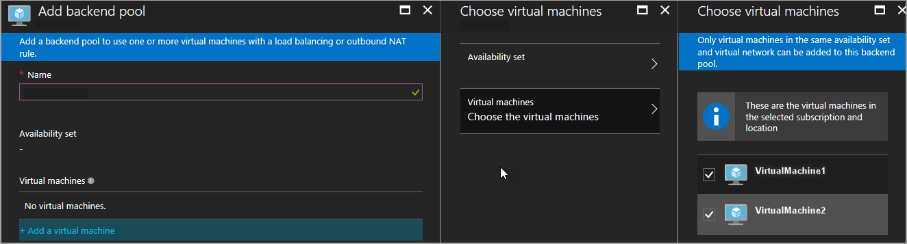

<properties
    pageTitle="SQL Server FCI - Azure 虚拟机 | Azure"
    description="本文介绍如何在 Azure 虚拟机上创建 SQL Server 故障转移群集实例。"
    services="virtual-machines"
    documentationCenter="na"
    authors="MikeRayMSFT"
    manager="jhubbard"
    editor="monicar"
    tags="azure-service-management" />
<tags
    ms.assetid="9fc761b1-21ad-4d79-bebc-a2f094ec214d"
    ms.service="virtual-machines-windows"
    ms.devlang="na"
    ms.custom="na"
    ms.topic="article"
    ms.tgt_pltfrm="vm-windows-sql-server"
    ms.workload="iaas-sql-server"
    ms.date="01/11/2017"
    wacn.date="04/06/2017"
    ms.author="mikeray" />  

# 在 Azure 虚拟机上配置 SQL Server 故障转移群集实例

本文介绍如何在 Resource Manager 模型中的 Azure 虚拟机上创建 SQL Server 故障转移群集实例 (FCI)。此解决方案使用 [Windows Server 2016 Datacenter Edition 存储空间直通 (S2D)](http://technet.microsoft.com/windows-server-docs/storage/storage-spaces/storage-spaces-direct-overview) 作为基于软件的虚拟 SAN，在 Windows 群集中的节点 (Azure VM) 之间同步存储（数据磁盘）。S2D 是 Windows Server 2016 中的新增功能。

下图显示了 Azure 虚拟机上的完整解决方案：

  

上图显示了：

- Windows Server 故障转移群集 (WSFC) 中的两个 Azure 虚拟机。位于 WSFC 中的虚拟机也称为*群集节点*或*节点*。
- 每个虚拟机包含两个或更多个数据磁盘。
- S2D 同步数据磁盘上的数据，并以存储池的形式提供同步的存储。
- 存储池向 WSFC 提供群集共享卷 (CSV)。
- SQL Server FCI 群集角色为数据驱动器使用 CSV。
- 用于保存 SQL Server FCI IP 地址的 Azure 负载均衡器。
- Azure 可用性集保存所有资源。

    >[AZURE.NOTE]
    图中的所有 Azure 资源位于同一资源组中。

有关 S2D 的详细信息，请参阅 [Windows Server 2016 Datacenter Edition 存储空间直通 (S2D)](http://technet.microsoft.com/windows-server-docs/storage/storage-spaces/storage-spaces-direct-overview)。

S2D 支持两种类型的体系结构 - 聚合与超聚合。本文档中所述的体系结构为超聚合。超聚合基础结构将存储放置在托管群集应用程序的相同服务器上。在此体系结构中，存储位于每个 SQL Server FCI 节点上。

### 示例 Azure 模板

可以在 Azure 中基于模板创建整个解决方案。GitHub [Azure 快速入门模板](https://github.com/MSBrett/azure-quickstart-templates/tree/master/sql-server-2016-fci-existing-vnet-and-ad)中提供了一个模板示例。此示例不是针对任何特定工作负荷设计的，也没有针对任何特定工作负荷进行测试。运行该模板可以使用与域连接的 S2D 存储创建 SQL Server FCI。可以评估该模板，并根据用途对其进行修改。

## 开始之前

在继续下一步之前，需要掌握一些知识并做好一些准备工作。

### 要了解的事项
应该对以下技术有实际的了解：

- [Windows 群集技术](http://technet.microsoft.com/zh-cn/library/hh831579.aspx)
-  [SQL Server 故障转移群集实例](http://msdn.microsoft.com/zh-cn/library/ms189134.aspx)。

另外，应该对以下技术有大致的了解：

- [Windows Server 2016 中使用存储空间直通的超聚合解决方案](http://technet.microsoft.com/windows-server-docs/storage/storage-spaces/hyper-converged-solution-using-storage-spaces-direct)
- [Azure 资源组](/documentation/articles/resource-group-portal/)

### 准备工作

在遵循本文中的说明之前，应事先做好以下准备：

- 一个 Azure 订阅。
- Azure 虚拟机上的 Windows 域。
- 有权在 Azure 虚拟机中创建对象的帐户。
- 能够为以下组件提供足够 IP 地址空间的 Azure 虚拟网络和子网：
    - 两个虚拟机。
    - WSFC IP 地址。
    - 每个 FCI 的 IP 地址。
- 在 Azure 网络中配置的、指向域控制器的 DNS。

满足这些先决条件后，可以继续构建 WSFC。第一步是创建虚拟机。

## 步骤 1：创建虚拟机

1. 使用订阅登录到 [Azure 门户预览](http://portal.azure.cn)。

1. [创建 Azure 可用性集](/documentation/articles/virtual-machines-windows-create-availability-set/)。

    可用性集可将各个容错域和更新域中的虚拟机分组。可用性集确保应用程序不会受到单一故障点（例如网络交换机或服务器机架电源装置）的影响。

    如果尚未为虚拟机创建资源组，请在创建 Azure 可用性集时执行该操作。若要使用 Azure 门户预览创建可用性集，请执行以下步骤：

    - 在 Azure 门户预览中，单击“+”打开 Azure 应用商店。搜索“可用性集”。
    - 单击“可用性集”。
    - 单击“创建”。
    - 在“创建可用性集”边栏选项卡中设置以下值：
        - **名称**：可用性集的名称。
        - **订阅**：你的 Azure 订阅。
        - **资源组**：如果想要使用现有的组，请单击“使用现有项”并从下拉列表中选择该组。否则，请选择“新建”并键入组的名称。
        - **位置**：设置要在其中创建虚拟机的位置。
        - **容错域**：使用默认值 (3)。
        - **更新域**：使用默认值 (5)。
    - 单击“创建”创建可用性集。

1. 在可用性集中创建虚拟机。

    在 Azure 可用性集中预配两个 SQL Server 虚拟机。有关说明，请参阅[在 Azure 门户预览中预配 SQL Server 虚拟机](/documentation/articles/virtual-machines-windows-portal-sql-server-provision/)。

    将两个虚拟机放在以下位置：
   
    - 可用性集所在的同一个 Azure 资源组中。
    - 域控制器所在的同一个网络中。
    - 能够为两个虚拟机提供足够 IP 地址空间的子网中，以及最终可能要在此群集上使用的所有 FCI 中。
    - Azure 可用性集中。

        >[AZURE.IMPORTANT]
        创建虚拟机后无法设置或更改可用性集。

    从 Azure 应用商店中选择一个映像。可以使用同时包含 Windows Server 和 SQL Server 或者只包含 Windows Server 的应用商店映像。有关详细信息，请参阅 [Azure 虚拟机上的 SQL Server 概述](/documentation/articles/virtual-machines-windows-sql-server-iaas-overview/)
   
    Azure 库中的正式 SQL Server 映像包含已安装的 SQL Server 实例，以及 SQL Server 安装软件和所需的密钥。
   
    根据 SQL Server 许可证的付费方式选择正确的映像：

    - **按使用量付费许可方式**：这些映像的每分钟费用包括 SQL Server 许可费：
        - **Windows Server Datacenter 2016 上的 SQL Server 2016 Enterprise**
        - **Windows Server Datacenter 2016 上的 SQL Server 2016 Standard**
        - **Windows Server Datacenter 2016 上的 SQL Server 2016 Developer**

    >[AZURE.IMPORTANT]
    创建虚拟机后，请删除预装的独立 SQL Server 实例。配置 WSFC 和 S2D 之后，将要使用预装的 SQL Server 媒体来创建 SQL Server FCI。

    或者，可以使用只包含操作系统的 Azure 应用商店映像。选择一个 **Windows Server 2016 Datacenter** 映像，并在配置 WSFC 和 S2D 后安装 SQL Server FCI。此映像不包含 SQL Server 安装媒体。将安装媒体放在可以针对每个服务器运行 SQL Server 安装的位置。

1. Azure 在创建虚拟机之后，将使用 RDP 连接到每个虚拟机。

    首次使用 RDP 连接到虚拟机时，计算机将询问是否允许在网络上发现此 PC。单击**“是”**。

1. 如果使用某个基于 SQL Server 的虚拟机映像，请删除 SQL Server 实例。

    - 在“程序和功能”中，右键单击“Microsoft SQL Server 2016 (64 位)”，然后单击“卸载/更改”。
    - 单击“删除”。
    - 选择默认实例。
    - 删除“数据库引擎服务”下的所有功能。不要删除“共享功能”。参阅下图：

          

    - 单击“下一步”，然后单击“删除”。

1. 打开防火墙端口。
   
    在每个虚拟机上的 Windows 防火墙中打开以下端口。

    | 目的 | TCP 端口 | 说明
    | ------ | ------ | ------
    | SQL Server | 1433 | SQL Server 的默认实例正常使用的端口。如果使用了库中的某个映像，此端口会自动打开。 
    | 运行状况探测 | 59999 | 任何打开的 TCP 端口。在后面的步骤中，需要将负载均衡器[运行状况探测](#probe)和群集配置为使用此端口。  

1. 将存储添加到虚拟机。有关详细信息，请参阅[添加存储](/documentation/articles/storage-premium-storage/)。

    这两个虚拟机至少需要两个数据磁盘。

    附加原始磁盘 - 非 NTFS 格式化磁盘。
    >[AZURE.NOTE]
    如果附加 NTFS 格式化的磁盘，只能启用不带磁盘合格性检查的 S2D。
   
    将至少两个高级存储（SSD 磁盘）附加到每个 VM。建议至少附加 P30 (1 TB) 磁盘。

    将主机缓存设置为“只读”。

    在生产环境中使用的存储容量取决于工作负荷。本文中所述的值适用于演示和测试。

1. [将虚拟机添加到现有的域](/documentation/articles/virtual-machines-windows-portal-sql-availability-group-prereq/#joinDomain)。

创建并配置虚拟机后，可以配置 WSFC。

## 步骤 2：使用 S2D 配置 Windows Server 故障转移群集 (WSFC)

下一步是使用 S2D 配置 WSFC。此步骤包括以下子步骤：

1. 添加 Windows 故障转移群集功能
1. 验证群集
1. 创建 WSFC
1. 创建云见证
1. 添加存储

### 添加 Windows 故障转移群集功能

1. 若要开始，请使用属于本地管理员的成员并且有权在 Active Directory 中创建对象的域帐户，通过 RDP 连接到第一个虚拟机。使用此帐户完成余下的配置。

1. [将故障转移群集功能添加到每个虚拟机](/documentation/articles/virtual-machines-windows-portal-sql-availability-group-prereq/#add-failover-cluster-features-to-both-sql-servers)。

    若要通过 UI 安装故障转移群集功能，请在两个虚拟机上执行以下步骤。
    - 单击“服务器管理器”中单击“管理”，然后单击“添加角色和功能”。
    - 在“添加角色和功能向导”中，单击“下一步”，直到出现“选择功能”。
    - 在“选择功能”中，单击“故障转移群集”。请包含所有所需的功能和管理工具。单击“添加功能”。
    - 单击“下一步”，然后单击“完成”安装这些功能。

    若要使用 PowerShell 安装故障转移群集功能，请在某个虚拟机上通过管理员 PowerShell 会话运行以下脚本。

        $nodes = ("<node1>","<node2>")
        Invoke-Command  $nodes {Install-WindowsFeature Failover-Clustering -IncludeAllSubFeature -IncludeManagementTools}

特此指出，后续步骤遵循了 [Windows Server 2016 中使用存储空间直通的超聚合解决方案](http://technet.microsoft.com/windows-server-docs/storage/storage-spaces/hyper-converged-solution-using-storage-spaces-direct#step-3-configure-storage-spaces-direct)中“步骤 3”下面的说明。

### 验证群集

本指南参考了[验证群集](http://technet.microsoft.com/windows-server-docs/storage/storage-spaces/hyper-converged-solution-using-storage-spaces-direct#step-31-run-cluster-validation)中的说明。

使用 UI 或 PowerShell 验证群集。

若要使用 UI 验证群集，请在某个虚拟机中执行以下步骤。

1. 在“服务器管理器”中单击“工具”，然后单击“故障转移群集管理器”。
1. 在“故障转移群集管理器”中单击“操作”，然后单击“验证配置...”。
1. 单击“下一步”。
1. 在“选择服务器或群集”中，键入两个虚拟机的名称。
1. 在“测试选项”中，选择“仅运行选择的测试”。单击**“下一步”**。
1. 在“测试选择”中，包含除“存储”以外的所有测试。参阅下图：

      

   
1. 单击“下一步”。
1. 在“确认”中，单击“下一步”。

“验证配置向导”将运行验证测试。

若要使用 PowerShell 验证群集，请在某个虚拟机上通过管理员 PowerShell 会话运行以下脚本。

       Test-Cluster -Node ("<node1>","<node2>") -Include "Storage Spaces Direct", "Inventory", "Network", "System Configuration"

验证群集后，创建 WSFC。

### 创建 WSFC

本指南参考了[创建 WSFC](http://technet.microsoft.com/windows-server-docs/storage/storage-spaces/hyper-converged-solution-using-storage-spaces-direct#step-32-create-a-cluster)。

若要创建 WSFC，需要提供：
- 成为群集节点的虚拟机的名称。
- WSFC 的名称。使用有效值
- WSFC 的 IP 地址。可以使用群集节点所在的同一 Azure 虚拟网络和子网中未使用的 IP 地址。

以下 PowerShell 可创建 WSFC。使用节点的名称（虚拟机名称）以及 Azure VNET 中可用的 IP 地址更新脚本：

    New-Cluster -Name <WSFC-Name> -Node ("<node1>","<node2>") -StaticAddress <n.n.n.n> -NoStorage

### 创建云见证

云见证是 Azure 存储 Blob 中存储的新型群集仲裁见证。使用云见证就无需单独使用一个 VM 来托管见证共享。

1. [为 WSFC 创建云见证](http://technet.microsoft.com/windows-server-docs/failover-clustering/deploy-cloud-witness)。

1. 创建 Blob 容器。

1. 保存访问密钥和容器 URL。

1. 配置 WSFC 群集仲裁见证。请参阅 [在用户界面中配置仲裁见证](http://technet.microsoft.com/windows-server-docs/failover-clustering/deploy-cloud-witness#to-configure-cloud-witness-as-a-quorum-witness)。

### 添加存储

S2D 的磁盘需是空的，不包含分区或其他数据。若要清除磁盘，请遵循[此指南中的步骤](http://technet.microsoft.com/windows-server-docs/storage/storage-spaces/hyper-converged-solution-using-storage-spaces-direct#step-34-clean-disks)。
   
1. [启用存储空间直通 (S2D)](http://technet.microsoft.com/windows-server-docs/storage/storage-spaces/hyper-converged-solution-using-storage-spaces-direct#step-35-enable-storage-spaces-direct)。

    以下 PowerShell 可启用存储空间直通。

        Enable-ClusterS2D

    现在，“故障转移群集管理器”中会显示存储池。

1. [创建卷](http://technet.microsoft.com/windows-server-docs/storage/storage-spaces/hyper-converged-solution-using-storage-spaces-direct#step-36-create-volumes)。

    S2D 中的某个功能可自动创建存储池（如果已启用此功能）。接下来，可以创建卷。PowerShell cmdlet `New-Volume` 可自动完成卷的创建过程，包括格式化、添加到群集，以及创建群集共享卷 (CSV)。以下示例创建一个 800 千兆字节 (GB) 的 CSV。

        New-Volume -StoragePoolFriendlyName S2D* -FriendlyName VDisk01 -FileSystem CSVFS_REFS -Size 800GB

    完成此命令后，800 GB 卷将装载为群集资源。该卷位于 `C:\ClusterStorage\Volume1`。

    下图显示了包含 S2D 的群集共享卷：

      

## 步骤 3：测试 WSFC 故障转移

在故障转移群集管理器中，验证是否可将存储资源移到另一个群集节点。如果可以使用“故障转移群集管理器”连接到 WSFC 并且可在两个不同的节点之间移动存储，则可以配置 FCI。

## 步骤 4：创建 SQL Server FCI

配置 WSFC 和所有群集组件（包括存储）后，可以创建 SQL Server FCI。

1. 使用 RDP 连接到第一个虚拟机。

1. 在“故障转移群集管理器”中，确保所有群集核心资源位于第一个虚拟机上。如有必要，请将所有资源移到此虚拟机。

1. 找到安装媒体。如果虚拟机使用某个 Azure 应用商店映像，该媒体将位于 `C:\SQLServer_<version number>_Full`。单击“设置”。

1. 在“SQL Server 安装中心”中单击“安装”。

1. 单击“新建 SQL Server 故障转移群集安装”。遵照向导中的说明安装 SQL Server FCI。

    FCI 数据目录需位于群集存储中。使用 S2D 时，该存储不是共享磁盘，而是每个服务器上的卷的装入点。S2D 将在两个节点之间同步该卷。该卷以群集共享卷的形式提供给群集。使用数据目录的 CSV 装入点。

      

1. 完成向导中的操作后，安装程序将在第一个节点上安装 SQL Server FCI。

1. 安装程序在第一个节点上成功安装 FCI 后，请使用 RDP 连接到第二个节点。

1. 打开“SQL Server 安装中心”。单击“安装”。

1. 单击“将节点添加到 SQL Server 故障转移群集”。遵照向导中的说明安装 SQL Server 并将此服务器添加到 FCI。

    >[AZURE.NOTE]
    如果使用了包含 SQL Server 的 Azure 应用商店库映像，该映像已随附 SQL Server 工具。如果未使用此映像，需单独安装 SQL Server 工具。请参阅 [Download SQL Server Management Studio (SSMS)](http://msdn.microsoft.com/zh-cn/library/mt238290.aspx)（下载 SQL Server Management Studio (SSMS)）。

## 步骤 5：创建 Azure 负载均衡器

在 Azure 虚拟机上，群集使用负载均衡器来保存每次都需要位于一个群集节点上的 IP 地址。在此解决方案中，负载均衡器保存 SQL Server FCI 的 IP 地址。

[创建并配置 Azure 负载均衡器](/documentation/articles/virtual-machines-windows-portal-sql-availability-group-tutorial/#configure-internal-load-balancer)。

### 在 Azure 门户预览中创建负载均衡器

若要创建负载均衡器，请执行以下操作：

1. 在 Azure 门户预览中，转到虚拟机所在的资源组。

1. 单击“+ 添加”。在应用商店中搜索“负载均衡器”。单击“负载均衡器”。

1. 单击“创建”。

1. 为负载均衡器配置以下属性：

    - **名称**：标识负载均衡器的名称。
    - **类型**：负载均衡器可以是公共或专用的。专用负载均衡器可从同一 VNET 内部访问。大多数 Azure 应用程序可以使用专用负载均衡器。如果应用程序需要通过 Internet 直接访问 SQL Server，请使用公共负载均衡器。
    - **虚拟网络**：虚拟机所在的同一网络。
    - **子网**：虚拟机所在的同一子网。
    - **专用 IP 地址**：分配给 SQL Server FCI 群集网络资源的同一 IP 地址。
    - **订阅**：你的 Azure 订阅。
    - **资源组**：使用你的虚拟机所在的同一资源组。
    - **位置**：使用你的虚拟机所在的同一 Azure 位置。参阅下图：

      

  
### 配置负载均衡器后端池 

1. 返回到虚拟机所在的 Azure 资源组，找到新的负载均衡器。可能需要在资源组中刷新视图。单击该负载均衡器。

1. 在负载均衡器边栏选项卡中，单击“后端池”。

1. 单击“+ 添加”添加后端池。

1. 键入后端池的名称。

1. 单击“添加虚拟机”。

1. 在“选择虚拟机”边栏选项卡中，单击“选择可用性集”。

1. 选择 SQL Server 虚拟机所放到的可用性集。

1. 在“选择虚拟机”边栏选项卡中，单击“选择虚拟机”。

    Azure 门户预览应如下图所示：

      

1. 在“选择虚拟机”边栏选项卡中单击“选择”。

1. 单击“确定”两次。

### 配置负载均衡器运行状况探测

1. 在负载均衡器边栏选项卡中，单击“运行状况探测”。

1. 单击“+ 添加”。

1. 在“添加运行状况探测”边栏选项卡中，设置运行状况探测参数：

    - **名称**：运行状况探测的名称。
    - **协议**：TCP。
    - **端口**：设置为可用的 TCP 端口。此端口需是打开的防火墙端口。使用在防火墙中为运行状况探测设置的[同一端口](#ports)。
    - **间隔**：5 秒。
    - **不正常阈值**：2 次连续失败。

1. 单击“确定”。

### 设置负载均衡规则

1. 在负载均衡器边栏选项卡中，单击“负载均衡规则”。

1. 单击“+ 添加”。

1. 设置负载均衡规则参数：

    - **名称**：负载均衡规则的名称。
    - **前端 IP 地址**：使用 SQL Server FCI 群集网络资源的 IP 地址。
    - **端口**：设置为 SQL Server FCI TCP 端口。默认实例端口为 1433。
    - **后端端口**：此值使用的端口与启用“浮动 IP (直接服务器返回)”时使用的“端口”值相同。
    - **后端池**：使用前面配置的后端池名称。
    - **运行状况探测**：使用前面配置的运行状况探测。
    - **会话持久性**：无。
    - **空闲超时(分钟)**：4。
    - **浮动 IP (直接服务器返回)**：已启用

1. 单击“确定”。

## 步骤 6：为探测配置群集

在 PowerShell 中设置群集探测端口参数。

若要设置群集探测端口参数，请在环境中更新以下脚本中的变量。

       $ClusterNetworkName = "<Cluster Network Name>" # the cluster network name (Use Get-ClusterNetwork on Windows Server 2012 of higher to find the name).
       $IPResourceName = "IP Address Resource Name" # the IP Address cluster resource name.
       $ILBIP = "<10.0.0.x>" # the IP Address of the Internal Load Balancer (ILB). This is the static IP address for the load balancer you configured in the Azure portal preview.
       [int]$ProbePort = <59999>
   
       Import-Module FailoverClusters

       Get-ClusterResource $IPResourceName | Set-ClusterParameter -Multiple @{"Address"="$ILBIP";"ProbePort"=$ProbePort;"SubnetMask"="255.255.255.255";"Network"="$ClusterNetworkName";"EnableDhcp"=0}

## 步骤 7：测试 FCI 故障转移

测试 FCI 的故障转移以验证群集功能。执行以下步骤：

1. 使用 RDP 连接到 SQL Server FCI 群集节点之一。

1. 打开“故障转移群集管理器”。单击“角色”。观察哪个节点拥有 SQL Server FCI 角色。

1. 右键单击“SQL Server FCI”角色。

1. 单击“移动”，然后单击“最佳节点”。

“故障转移群集管理器”将显示该角色及其资源已脱机。然后资源将会移动，并在另一个节点上联机。

### 测试连接

若要测试连接，请登录到同一虚拟网络中的另一个虚拟机。打开“SQL Server Management Studio”并连接到 SQL Server FCI 名称。

>[AZURE.NOTE]
如果需要，可以[下载 SQL Server Management Studio](http://msdn.microsoft.com/zh-cn/library/mt238290.aspx)。

## 限制
Azure 虚拟机上的 FCI 不支持 Microsoft 分布式事务处理协调器 (DTC)，因为负载均衡器不支持 RPC 端口。

## 另请参阅

[Setup S2D with remote desktop (Azure)](http://technet.microsoft.com/windows-server-docs/compute/remote-desktop-services/rds-storage-spaces-direct-deployment)（使用远程桌面设置 S2D (Azure)）

[Hyper-converged solution with storage spaces direct](http://technet.microsoft.com/windows-server-docs/storage/storage-spaces/hyper-converged-solution-using-storage-spaces-direct)（包含存储空间直通的超聚合解决方案）

[Storage Space Direct Overview](http://technet.microsoft.com/windows-server-docs/storage/storage-spaces/storage-spaces-direct-overview)（存储空间直通概述）

[SQL Server support for S2D](https://blogs.technet.microsoft.com/dataplatforminsider/2016/09/27/sql-server-2016-now-supports-windows-server-2016-storage-spaces-direct/)（S2D 的 SQL Server 支持）

<!---HONumber=Mooncake_0313_2017-->