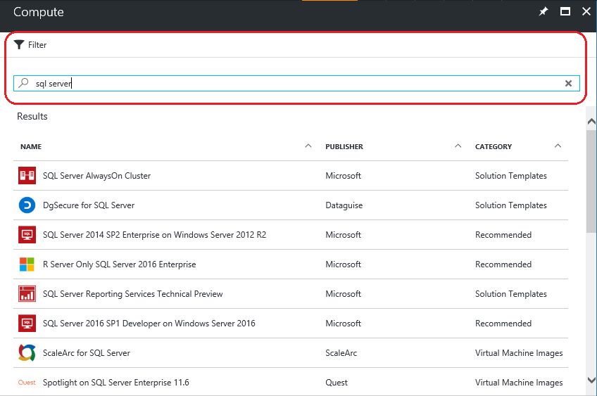
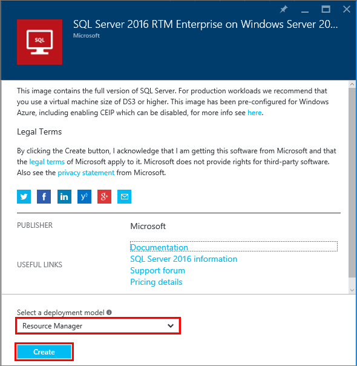
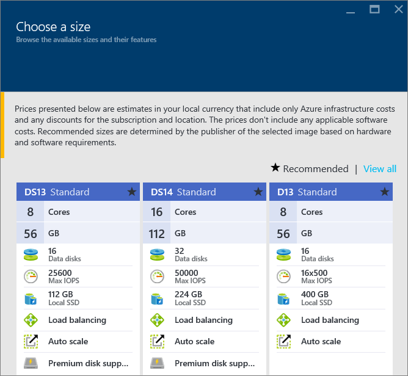
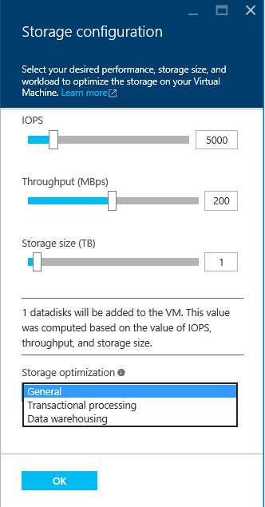
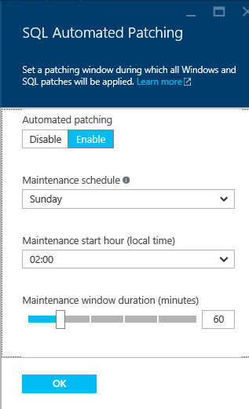
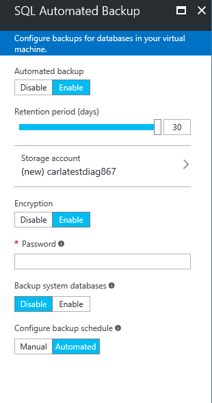

<properties
    pageTitle="预配 SQL Server 虚拟机 | Azure"
    description="使用门户在 Azure 中创建并连接到 SQL Server 虚拟机。本教程使用 Resource Manager 模式。"
    services="virtual-machines-windows"
    documentationcenter="na"
    author="rothja"
    editor=""
    manager="jhubbard"
    tags="azure-resource-manager" />
<tags
    ms.assetid="1aff691f-a40a-4de2-b6a0-def1384e086e"
    ms.service="virtual-machines-windows"
    ms.devlang="na"
    ms.topic="hero-article"
    ms.tgt_pltfrm="vm-windows-sql-server"
    ms.workload="infrastructure-services"
    ms.date="02/28/2017"
    wacn.date="04/27/2017"
    ms.author="jroth" />  

# 在 Azure 门户预览中预配 SQL Server 虚拟机
> [AZURE.SELECTOR]
- [门户](/documentation/articles/virtual-machines-windows-portal-sql-server-provision/)
- [PowerShell](/documentation/articles/virtual-machines-windows-ps-sql-create/)

本端到端教程说明如何使用 Azure 门户预览来预配运行 SQL Server 的虚拟机。

Azure 虚拟机 (VM) 库包括几种内含 Microsoft SQL Server 的映像。只需单击几下鼠标，就可从库中选择一个 SQL VM 映像，并将其预配到你的 Azure 环境中。

在本教程中，您将：

* [从库中选择 SQL VM 映像](#select-a-sql-vm-image-from-the-gallery)
* [配置和创建 VM](#configure-the-vm)
* [使用远程桌面打开 VM](#open-the-vm-with-remote-desktop)
* [远程连接到 SQL Server](#connect-to-sql-server-remotely)

##  从库中选择 SQL VM 映像
1. 使用帐户登录到 [Azure 门户预览](https://portal.azure.cn)。
   
    > [AZURE.NOTE]
    如果你没有 Azure 帐户，请访问 [Azure 试用](/pricing/1rmb-trial/)。
    > 
    > 
2. 在 Azure 门户预览中单击“新建”。该门户将打开“新建”边栏选项卡。SQL Server VM 资源位于应用商店的“计算”组中。
3. 在“新建”边栏选项卡中，单击“计算”，然后单击“全部查看”。
4. 在“筛选器”文本框中，键入 SQL Server，然后按 Enter 键。

      

5. 查看可用的 SQL Server 模板。
6. 每个模板均可标识 SQL Server 版本和操作系统。从列表中选择这些映像之一。然后查看详细信息边栏选项卡，了解虚拟机映像的说明。

7. 在“选择部署模型”下面，验证是否已选择“Resource Manager”。对于新虚拟机，建议使用“Resource Manager”部署模型。单击“创建”。
   
      

##  配置 VM
有五个用于配置 SQL Server 虚拟机的边栏选项卡。

| 步骤 | 说明 |
| --- | --- |
| **基础知识** |[配置基本设置](#1-configure-basic-settings) |
| **大小** |[选择虚拟机大小](#2-choose-virtual-machine-size) |
| **设置** |[配置可选功能](#3-configure-optional-features) |
| **SQL Server 设置** |[配置 SQL Server 设置](#4-configure-sql-server-settings) |
| **摘要** |[查看摘要](#5-review-the-summary) |

##  1.配置基本设置
在“基本信息”边栏选项卡中提供以下信息：

* 输入唯一的虚拟机**名称**。
* 指定 VM 上本地管理员帐户的**用户名**。此帐户还将被添加到 SQL Server **sysadmin** 固定服务器角色。
* 提供一个强**密码**。
* 如果有多个订阅，验证该订阅是否是新 VM 的正确订阅。
* 在“资源组”框中，键入新资源组的名称。此外，若要使用现有的资源组，请单击“使用现有项”。资源组是 Azure（虚拟机、存储帐户、虚拟网络等）中相关资源的集合。
  
    > [AZURE.NOTE]
    如果你只是测试或了解 Azure 中的 SQL Server 部署，使用新的资源组很有帮助。测试完成后，删除资源组会自动删除 VM 和与该资源组相关联的所有资源。有关资源组的详细信息，请参阅 [Azure Resource Manager 概述](/documentation/articles/resource-group-overview/)。
    > 
    > 
* 选择此部署的**位置**。
* 单击“确定”保存设置。
  
      

##  2.选择虚拟机大小
执行“大小”设置步骤时，请在“选择大小”边栏选项卡中选择虚拟机大小。边栏选项卡最初将根据你选择的模板显示建议的计算机大小。系统还会估算每月运行 VM 的费用。

  

对于生产工作负荷，建议选择可支持[高级存储](/documentation/articles/storage-premium-storage/)的虚拟机大小。如果不需要该级别的性能，请使用“全部查看”按钮来查看所有计算机大小选项。例如，可以将较小的计算机大小用于开发或测试环境。

> [AZURE.NOTE]
有关虚拟机大小的详细信息，请参阅[虚拟机大小](/documentation/articles/virtual-machines-windows-sizes/)。有关 SQL Server VM 大小的考虑事项，请参阅 [SQL Server 在 Azure 虚拟机中的性能最佳实践](/documentation/articles/virtual-machines-windows-sql-performance/)。
> 
> 

选择计算机大小，然后单击“选择”。

##  3.配置可选功能
在“设置”边栏选项卡中，为虚拟机配置 Azure 存储空间、网络和监视。

* 在“存储”下面，为“磁盘类型”指定“标准”或“高级(SSD)”。对于生产型工作负荷，建议使用高级存储。

> [AZURE.NOTE]
如果对不支持高级存储的计算机大小选择“高级(SSD)”，计算机大小会自动更改。
> 
> 

* 在“存储帐户”下面，可以接受自动预配的存储帐户名称。还可以单击“存储帐户”以选择现有帐户和配置存储帐户类型。默认情况下，Azure 将创建具有本地冗余存储空间的新存储帐户。有关存储选项的详细信息，请参阅 [Azure 存储空间复制](/documentation/articles/storage-redundancy/)。
* 在“网络”下面，可以接受自动填充的值。也可以单击每个功能来手动配置**虚拟网络**、**子网**、**公共 IP 地址**和**网络安全组**。对于本教程，请保留默认值。
* 默认情况下，Azure 会对为 VM 指定的同一个存储帐户启用“监视”功能。你可以在此处更改这些设置。
* 在“可用性集”下指定可用性集。在本教程中，可以选择“无”。如果你计划设置 SQL AlwaysOn 可用性组，可以对可用性进行配置，避免重新创建虚拟机。有关详细信息，请参阅[管理虚拟机的可用性](/documentation/articles/virtual-machines-windows-manage-availability/)。

配置完这些设置后，请单击“确定”。

##  4.配置 SQL Server 设置
在“SQL Server 设置”边栏选项卡上，配置 SQL Server 的特定设置和优化。可以为 SQL Server 配置的设置包括以下各项。

| 设置 |
| --- |
| [连接](#connectivity) |
| [身份验证](#authentication) |
| [存储配置](#storage-configuration) |
| [自动修补](#automated-patching) |
| [自动备份](#automated-backup) |
| [Azure 密钥保管库集成](#azure-key-vault-integration) |
| [R Services](#r-services) |

###  连接
在“SQL 连接”下，指定要对此 VM 上的 SQL Server 实例进行的访问类型。对于本教程，请选择“公共(Internet)”以允许从 Internet 上的计算机或服务连接到 SQL Server。选择此选项以后，Azure 会自动将防火墙和网络安全组配置为允许在端口 1433 上通信。

  

若要通过 Internet 连接到 SQL Server，还必须启用下一部分中所述的“SQL Server 身份验证”。

> [AZURE.NOTE]
该功能可以向 SQL Server VM 添加更多网络通信限制。为此，可以在创建 VM 后编辑网络安全组。有关详细信息，请参阅[什么是网络安全组 (NSG)？](/documentation/articles/virtual-networks-nsg/)
> 
> 

如果你不希望启用通过 Internet 连接到数据库引擎这一功能，可选择以下选项之一：

* **本地(仅限 VM 内部)**：仅允许从 VM 内部连接到 SQL Server。
* **专用(虚拟网络内部)**：允许从同一虚拟网络中的虚拟机或服务连接到 SQL Server。

> [AZURE.NOTE]
SQL Server Express 版本的虚拟机映像不会自动启用 TCP/IP 协议。即使对公共和专用连接选项也是如此。对于 Express 版本，必须在创建 VM 后使用 SQL Server 配置管理器来手动启用 TCP/IP 协议。
> 
> 

一般情况下，选择方案允许的最严格连接可提高安全性。但是，通过网络安全组规则和 SQL/Windows 身份验证的所有选项都是安全的。

**端口**：默认为 1433。你可以指定其他端口号。有关详细信息，请参阅[连接到 SQL Server 虚拟机 (Resource Manager) | Azure](/documentation/articles/virtual-machines-windows-sql-connect/)。

###  身份验证
如果需要 SQL Server 身份验证，请在“SQL 身份验证”下单击“启用”。

  

> [AZURE.NOTE]
如果你计划通过 Internet 来访问 SQL Server（即“公共”连接选项），则必须在此处启用 SQL 身份验证。对 SQL Server 进行公共访问需要使用 SQL 身份验证。
> 
> 

如果启用 SQL Server 身份验证，请指定“登录名”和“密码”。此用户名已配置为 SQL Server 身份验证登录名和 **sysadmin** 固定服务器角色的成员。请参阅[选择身份验证模式](http://msdn.microsoft.com/zh-cn/library/ms144284.aspx)，了解有关身份验证模式的详细信息。

如果未启用 SQL Server 身份验证，可以在 VM 上使用本地管理员帐户连接到 SQL Server 实例。

###  存储配置
单击“存储配置”以便指定存储要求。

  

> [AZURE.NOTE]
如果选择了标准存储，则此选项不可用。自动存储优化只适用于高级存储。
> 
> 

你可以将要求指定为每秒输入/输出操作数 (IOPs)、吞吐量（MB/秒）以及总存储大小。可使用可调缩放性配置这些值。门户将根据这些要求自动计算磁盘数。

默认情况下，Azure 会对存储进行优化，以满足 5000 IOPs、200 MB 吞吐量和 1 TB 存储空间这样的要求。可根据工作负荷更改这些存储设置。在“存储优化目标”下，选择以下选项之一：

* **常规**：默认设置，支持大多数工作负荷。
* **事务处理**：针对传统数据库 OLTP 工作负荷优化存储。
* **数据仓库**：针对分析和报告工作负荷优化存储。

> [AZURE.NOTE]
滑块上的上限根据所选虚拟机大小的不同而异。
> 
> 

###  自动修补
**自动修补**：默认处于启用状态。Azure 可以通过自动修补来自动修补 SQL Server 和操作系统。指定进行维护的具体日期（星期几）、时间和时长。Azure 会在维护时段进行修补。维护时段计划使用 VM 的时间区域设置。如果不希望 Azure 自动修补 SQL Server 和操作系统，请单击“禁用”。

  

有关详细信息，请参阅 [Azure 虚拟机中 SQL Server 的自动修补](/documentation/articles/virtual-machines-windows-sql-automated-patching/)。

###  自动备份
在“自动备份”下启用针对所有数据库的自动数据库备份。默认情况下，自动备份处于禁用状态。

启用 SQL 自动备份以后，即可进行以下配置：

* 备份保留期（天）
* 用于备份的存储帐户
* 备份的加密选项和密码
* 备份系统数据库
* 配置备份计划

若要加密备份，请单击“启用”。然后指定**密码**。Azure 创建一个证书来加密备份，并使用指定的密码来保护该证书。

  

 有关详细信息，请参阅[针对 Azure 虚拟机中 SQL Server 的自动备份](/documentation/articles/virtual-machines-windows-sql-automated-backup/)。

###  Azure 密钥保管库集成
若要将安全密码存储在 Azure 中进行加密，请先单击“Azure 密钥保管库集成”，然后单击“启用”。

  

下表列出了配置 Azure 密钥保管库集成所需的参数。

| 参数 | 说明 | 示例 |
| --- | --- | --- |
| **密钥保管库 URL** |密钥保管库的位置。 |https://contosokeyvault.vault.azure.cn/  
 |
| **主体名称** |Azure Active Directory 服务主体名称。该名称也称为客户端 ID。 |fde2b411-33d5-4e11-af04eb07b669ccf2 |
| **主体密码** |Azure Active Directory 服务主体密码。该密码也称为客户端密码。 |9VTJSQwzlFepD8XODnzy8n2V01Jd8dAjwm/azF1XDKM= |
| **凭据名称** |**凭据名称**：AKV 集成在 SQL Server 内创建一个凭据，使 VM 具有对密钥保管库的访问权限。为此凭据选择一个名称。 |mycred1 |

有关详细信息，请参阅[为 Azure VM 上的 SQL Server 配置 Azure 密钥保管库集成](/documentation/articles/virtual-machines-windows-ps-sql-keyvault/)。

配置完 SQL Server 设置后，单击“确定”。

###  R Services
在 SQL Server 2016 Enterprise 版本中，可以选择启用 [SQL Server R Services](https://msdn.microsoft.com/zh-cn/library/mt604845.aspx)。然后能够通过 SQL Server 2016 使用高级分析。在“SQL Server 设置”边栏选项卡单击“启用”。

  

> [AZURE.NOTE]
对于非 2016 Enterprise 版本的 SQL Server 映像，启用 R Services 的选项处于禁用状态。
> 
> 

##  5.查看摘要
在“摘要”边栏选项卡上查看摘要，然后单击“确定”以创建为此 VM 指定的 SQL Server、资源组和资源。

可以从 Azure 门户预览监视部署情况。屏幕顶部的“通知”按钮显示部署的基本状态。

> [AZURE.NOTE]
为了让你了解部署时间，我已使用默认设置将一个 SQL VM 部署到中国东部区域。此测试部署总共花费了 26 分钟才完成。但是根据你所在的区域和选择的设置，你花费的部署时间会更长或更短。
> 
> 

##  使用远程桌面打开 VM
使用以下步骤通过远程桌面连接到虚拟机：

1. 构建 Azure VM 后，该 VM 的图标将显示在 Azure 仪表板上。也可以通过浏览现有虚拟机找到该 VM。单击新的 SQL 虚拟机。显示虚拟机详细信息的“虚拟机”边栏选项卡。
2. 在“虚拟机”边栏选项卡的顶部，单击“连接”。
3. 浏览器将为 VM 下载 RDP 文件。打开该 RDP 文件。
4. “远程桌面连接”会通知你，无法识别此远程连接的发布者。单击“连接”以继续。
5. 在**“Windows 安全性”**对话框中，单击**“使用另一帐户”**。
6. 对于“用户名”键入 **\<user name\>**，其中 \<user name\> 是配置 VM 时指定的用户名。必须在姓名前添加初始反斜杠。
7. 键入前面为此 VM 配置的**密码**，然后单击“确定”进行连接。
8. 如果另一个“远程桌面连接”对话框询问是否要连接，请单击“是”。

连接到 SQL Server 虚拟机以后，即可启动 SQL Server Management Studio 并使用本地管理员凭据通过 Windows 身份验证进行连接。如果已启用 SQL Server 身份验证，也可以使用在预配期间配置的 SQL 登录名和密码来配合 SQL 身份验证进行连接。

通过访问计算机，可以根据要求直接更改计算机和 SQL Server 设置。例如，可以配置防火墙设置或更改 SQL Server 配置设置。

##  远程连接到 SQL Server
在本教程中，我们选择了虚拟机的“公共”访问权限和“SQL Server 身份验证”。这些设置将虚拟机自动配置为允许任何客户端通过 Internet 来与 SQL Server 建立连接（假设这些客户端可提供正确的 SQL 登录名）。

> [AZURE.NOTE]
如果你没有在预配过程中选择“公共”，则需执行其他步骤才能通过 Internet 访问 SQL Server 实例。有关详细信息，请参阅[连接到 SQL Server 虚拟机](/documentation/articles/virtual-machines-windows-sql-connect/)。
> 
> 

以下部分说明了如何通过 Internet 从不同的计算机连接到 VM 上的 SQL Server 实例。

> [AZURE.INCLUDE [连接到 VM Resource Manager 中的 SQL Server](../../includes/virtual-machines-sql-server-connection-steps-resource-manager.md)]
> 
> 

## 后续步骤
有关在 Azure 中使用 SQL Server 的其他信息，请参阅 [Azure 虚拟机上的 SQL Server](/documentation/articles/virtual-machines-windows-sql-server-iaas-overview/) 和[常见问题](/documentation/articles/virtual-machines-windows-sql-server-iaas-faq/)。

有关 Azure 虚拟机上的 SQL Server 视频概述，请观看 [Azure VM 是 SQL Server 2016 的最佳平台](https://channel9.msdn.com/Events/DataDriven/SQLServer2016/Azure-VM-is-the-best-platform-for-SQL-Server-2016)。

<!---HONumber=Mooncake_0313_2017-->
<!--Update_Description: wording update-->