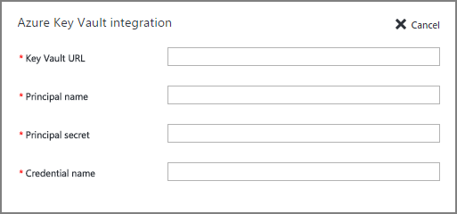

<properties
    pageTitle="为 Azure VM (Resource Manager) 上的 SQL Server 配置 Azure 密钥保管库集成"
    description="了解如何自动配置用于 Azure 密钥保管库的 SQL Server 加密。本主题说明如何将 Azure 密钥保管库集成用于通过 Resource Manager 创建的 SQL Server 虚拟机。"
    services="virtual-machines-windows"
    documentationcenter=""
    author="rothja"
    manager="jhubbard"
    editor=""
    tags="azure-service-management" />
<tags
    ms.assetid="cd66dfb1-0e9b-4fb0-a471-9deaf4ab4ab8"
    ms.service="virtual-machines-windows"
    ms.devlang="na"
    ms.topic="article"
    ms.tgt_pltfrm="vm-windows-sql-server"
    ms.workload="infrastructure-services"
    ms.date="10/25/2016"
    wacn.date="02/20/2017"
    ms.author="jroth" />  

# 为 Azure VM \(Resource Manager\) 上的 SQL Server 配置 Azure 密钥保管库集成
> [AZURE.SELECTOR]
- [资源管理器](/documentation/articles/virtual-machines-windows-ps-sql-keyvault/)
- [经典](/documentation/articles/virtual-machines-windows-classic-ps-sql-keyvault/)

## 概述
SQL Server 加密功能多种多样，包括[透明数据加密 \(TDE\)](https://msdn.microsoft.com/zh-cn/library/bb934049.aspx)、[列级加密 \(CLE\)](https://msdn.microsoft.com/zh-cn/library/ms173744.aspx) 和[备份加密](https://msdn.microsoft.com/zh-cn/library/dn449489.aspx)。这些加密形式要求你管理和存储用于加密的加密密钥。Azure 密钥保管库 \(AKV\) 服务专用于在一个高度可用的安全位置改进这些密钥的安全性和管理。[SQL Server 连接器](http://www.microsoft.com/download/details.aspx?id=45344)使 SQL Server 能够使用 Azure 密钥保管库中的这些密钥。

如果在本地计算机上运行 SQL Server，请[按照此处的步骤从本地 SQL Server 计算机访问 Azure 密钥保管库](https://msdn.microsoft.com/zh-cn/library/dn198405.aspx)。但对于 Azure VM 中的 SQL Server，你可以通过使用 *Azure 密钥保管库集成*功能节省时间。

启用此功能后，它会自动安装 SQL Server 连接器、配置 EKM 提供程序以访问 Azure 密钥保管库，并创建凭据以使你能够访问保管库。在前面提到的本地文档列出的步骤中，你可以看到此功能自动完成步骤 2 和步骤 3。你仍需手动执行的唯一操作是创建密钥保管库和密钥。之后，将自动进行 SQL VM 的整个设置。在此功能完成设置后，你可以执行 T-SQL 语句，以按照通常的方式加密你的数据库或备份。

[AZURE.INCLUDE [AKV 集成准备](../../includes/virtual-machines-sql-server-akv-prepare.md)]

## 启用和配置 AKV 集成
为现有 VM 预配或配置 AKV 集成时可以启用该集成。

### 新的 VM
如果要使用 Resource Manager 预配新的 SQL Server 虚拟机，Azure 门户预览提供了启用 Azure Key Vault 集成的步骤。Azure 密钥保管库功能仅适用于 SQL Server 的企业版、开发人员版和评估版。

  

有关预配的详细演练，请参阅 [Provision a SQL Server virtual machine in the Azure Portal Preview](/documentation/articles/virtual-machines-windows-portal-sql-server-provision/)（在 Azure 门户预览中预配 SQL Server 虚拟机）。

### 现有 VM
对于现有的 SQL Server 虚拟机，请选择你的 SQL Server 虚拟机。然后选择“设置”边栏选项卡的“SQL Server 配置”部分。

  

在“SQL Server 配置”边栏选项卡的“自动密钥保管库集成”部分中，单击“编辑”按钮。

  

完成后，单击“SQL Server 配置”边栏选项卡底部的“确定”按钮，以保存更改。

> [AZURE.NOTE]
你还可以使用模板配置 AKV 集成。有关详细信息，请参阅 [Azure quickstart template for Azure Key Vault integration](https://github.com/Azure/azure-quickstart-templates/tree/master/101-vm-sql-existing-keyvault-update)（用于 Azure 密钥保管库集成的 Azure 快速入门模板）。
> 
> 

[AZURE.INCLUDE [AKV 集成后续步骤](../../includes/virtual-machines-sql-server-akv-next-steps.md)]

<!---HONumber=Mooncake_0213_2017-->
<!--Update_Description: wording update-->