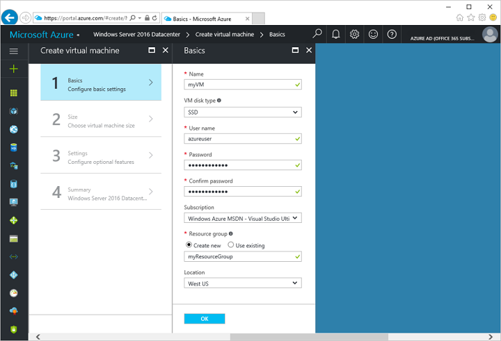

<properties
    pageTitle="Azure 快速入门 - 创建 Windows VM 门户 | Azure"
    description="Azure 快速入门 - 创建 Windows VM 门户"
    services="virtual-machines-windows"
    documentationcenter="virtual-machines"
    author="neilpeterson"
    manager="timlt"
    editor="tysonn"
    tags="azure-resource-manager" />
<tags
    ms.assetid=""
    ms.service="virtual-machines-windows"
    ms.devlang="na"
    ms.topic="hero-article"
    ms.tgt_pltfrm="vm-windows"
    ms.workload="infrastructure"
    ms.date="04/13/2017"
    wacn.date="05/15/2017"
    ms.author="nepeters"
    ms.translationtype="Human Translation"
    ms.sourcegitcommit="457fc748a9a2d66d7a2906b988e127b09ee11e18"
    ms.openlocfilehash="5303691c5caa9bf286bc664aadae9fa54a4ac0ef"
    ms.contentlocale="zh-cn"
    ms.lasthandoff="05/05/2017" />

# 使用 Azure 门户预览创建 Windows 虚拟机

可以通过 Azure 门户预览创建 Azure 虚拟机。 此方法提供一个基于浏览器的用户界面，用于创建和配置虚拟机和所有相关的资源。 此快速入门介绍了如何使用 Azure 门户预览创建虚拟机。 部署完成后，我们将连接到服务器并安装 IIS。

如果没有 Azure 订阅，可在开始前创建一个[试用帐户](/pricing/1rmb-trial/)。

## 登录 Azure

通过 http://portal.azure.cn 登录到 Azure 门户预览。

## 创建虚拟机

2. 单击 Azure 门户预览左上角的“新建”按钮。

3. 从“新建”边栏选项卡中选择“计算”，从“计算”边栏选项卡中选择“Windows Server 2016 Datacenter”，然后单击“创建”按钮。

4. 填写虚拟机“基本信息”表单。 在此处输入的用户名和密码用于登录到虚拟机。 对于“资源组”，请创建一个新的资源组。 资源组是在其中创建并集中管理 Azure 资源的逻辑容器。 完成后，单击“确定”。

      

5. 为 VM 选择大小并单击“选择”。 

6. 设置保留默认值，然后单击“确定”。

7. 在摘要页上，单击“确定”以开始虚拟机部署。

8. 若要监视部署状态，请单击虚拟机。 可以在 Azure 门户预览仪表板上或者通过从左侧菜单中选择“虚拟机”来找到该 VM。 创建 VM 后，状态将从“正在部署”更改为“正在运行”。

## 为 Web 流量打开端口 80 

若要允许 IIS 的流量，需要为 Web 流量打开端口 80。 此步骤将介绍如何创建网络安全组 (NSG) 规则，以允许端口 80 上的入站连接。

1. 在虚拟机边栏选项卡的“基本信息”部分，单击**资源组**的名称。
2. 在资源组的边栏选项卡中，单击资源列表中的“网络安全组”。 NSG 名称应为 VM 名称后面追加“-nsg”。
3. 单击“入站安全规则”标题，打开入站规则列表。 此时列表中应会出现一条适用于 RDP 的规则。
4. 单击“+ 添加”，打开“添加入站安全规则”边栏选项卡。
5. 在“名称”中，键入 **IIS**。 请确保将“端口范围”设置为 80，将“操作”设置为“允许”。 单击 **“确定”**。

## 连接到虚拟机

在部署完成后，创建到虚拟机的远程桌面连接。

1. 单击虚拟机边栏选项卡上的“连接”按钮。 此时会创建和下载远程桌面协议文件（.rdp 文件）。

     

2. 若要连接到 VM，请打开下载的 RDP 文件。 出现提示时，请单击“连接”。 在 Mac 上，你需要一个 RDP 客户端，例如 Mac 应用商店提供的这个[远程桌面客户端](https://itunes.apple.com/us/app/microsoft-remote-desktop/id715768417?mt=12)。

3. 输入在创建虚拟机时指定的用户名和密码，然后单击“确定”。

4. 你可能会在登录过程中收到证书警告。 单击“是”或“继续”继续进行连接。

## 使用 PowerShell 安装 IIS

在虚拟机上打开 PowerShell 提示符并运行以下命令，以便安装 IIS 并启用本地防火墙规则，使之允许 Web 通信：

    Install-WindowsFeature -name Web-Server -IncludeManagementTools

## 查看 IIS 欢迎页

IIS 已安装，并且现在已从 Internet 打开 VM 上的端口 80 - 你可以使用所选的 Web 浏览器查看默认的 IIS 欢迎页。 从 VM 的边栏选项卡中获取**公共 IP 地址**，并使用它访问默认网页。 

 

## 删除虚拟机

不再需要资源组、虚拟机和所有相关的资源时，可将其删除。 为此，请从虚拟机边栏选项卡中选择该资源组，然后单击“删除”。

## 后续步骤

[安装角色和配置防火墙教程](/documentation/articles/virtual-machines-windows-hero-role/)

[浏览 VM 部署 CLI 示例](/documentation/articles/virtual-machines-windows-cli-samples/)