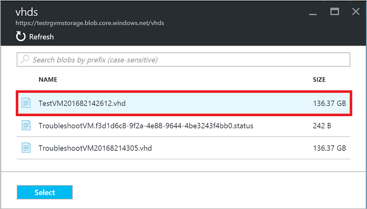
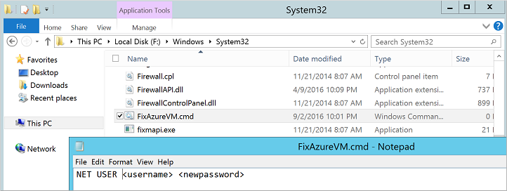
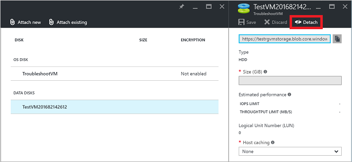

<properties
   pageTitle="在未安装 Azure 来宾代理的情况下重置本地 Windows 密码 | Azure"
   description="如何在 Azure 来宾代理未安装或者未在 VM 上正常运行的情况下重置本地 Windows 用户帐户密码"
   services="virtual-machines-windows"
   documentationCenter=""
   authors="iainfoulds"
   manager="timlt"
   editor=""/>  

<tags
   ms.service="virtual-machines-windows"
   ms.devlang="na"
   ms.topic="article"
   ms.tgt_pltfrm="vm-windows"
   ms.workload="infrastructure-services"
   ms.date="10/05/2016"
   wacn.date="11/21/2016"
   ms.author="iainfou"/>  

# 如何重置 Azure VM 的本地 Windows 密码
如果已安装 Azure 来宾代理，可以使用 [Azure 门户预览或 Azure PowerShell](/documentation/articles/virtual-machines-windows-reset-rdp/) 重置 Azure 中 VM 的本地 Windows 密码。此方法是重置 Azure VM 密码的主要方法。如果遇到了 Azure 来宾代理无响应的问题，或者上载自定义映像后无法安装，可以手动重置 Windows 密码。本文详细说明如何通过将源 OS 虚拟磁盘附加到另一个 VM 来重置本地帐户密码。

> [AZURE.WARNING] 只有在万不得已的情况下才使用此过程。始终应该先尝试使用 [Azure 门户预览或 Azure PowerShell](/documentation/articles/virtual-machines-windows-reset-rdp/) 重置密码。

## 过程概述
无法访问 Azure 来宾代理时，针对 Azure 中的 Windows VM 执行本地密码重置的核心步骤如下：

- 删除源 VM虚拟磁盘将会保留。
- 将源 VM 的 OS 磁盘附加到 Azure 订阅中的另一个 VM。此 VM 称为故障排除 VM。
- 使用故障排除 VM 在源 VM 的 OS 磁盘上创建一些配置文件。
- 从故障排除 VM 中分离源 VM 的 OS 磁盘。
- 在 Resource Manager 模板中使用原始虚拟磁盘创建一个 VM。
- 新 VM 启动时，创建的配置文件将会更新所需用户的密码。

## 详细步骤
在执行以下步骤之前，始终应该尝试使用 [Azure 门户预览或 Azure PowerShell](/documentation/articles/virtual-machines-windows-reset-rdp/) 来重置密码。在开始之前，请确保备份 VM。

1. 在 Azure 门户预览中删除受影响的 VM。删除 VM 只会删除元数据，以及 Azure 中对该 VM 的引用。删除 VM 时，将会保留虚拟磁盘：

    - 在 Azure 门户预览中选择该 VM，然后单击“删除”：

      

2. 将源 VM 的 OS 磁盘附加到故障排除 VM。故障排除 VM 必须与源 VM 的 OS 磁盘位于同一区域（例如 `China North`）：

    - 在 Azure 门户预览中选择故障排除 VM。单击“磁盘”|“附加现有磁盘”：

      

    选择“VHD 文件”，然后选择包含源 VM 的存储帐户：

      

    选择源容器。源容器通常为 *vhds*：

      

    选择要附加的 OS VHD。单击“选择”完成该过程：

      

3. 使用远程桌面连接到故障排除的 VM，确保源 VM 的 OS 磁盘可见：

    - 在 Azure 门户预览中选择故障排除 VM，然后单击“连接”。
    - 打开下载的 RDP 文件。输入故障排除 VM 的用户名和密码。
    - 在文件资源管理器中，找到附加的数据磁盘。如果源 VM 的 VHD 是附加到故障排除 VM 的唯一数据磁盘，它应该是 F: 驱动器：

      

4. 在源 VM 的驱动器上的 `\Windows\System32\GroupPolicy` 中创建 `gpt.ini`（如果存在 gpt.ini，请将它重命名为 gpt.ini.bak）：

    > [AZURE.WARNING] 切勿在 C:\\Windows（故障排除 VM 的 OS 驱动器）中意外创建以下文件。应该在源 VM 的、作为数据磁盘附加的 OS 驱动器中创建以下文件。

    - 将以下代码行添加到创建的 `gpt.ini` 文件中：

            [General]
            gPCFunctionalityVersion=2
            gPCMachineExtensionNames=[{42B5FAAE-6536-11D2-AE5A-0000F87571E3}{40B6664F-4972-11D1-A7CA-0000F87571E3}]
            Version=1

      

 
5. 在 `\Windows\System32\GroupPolicy\Machine\Scripts` 中创建 `scripts.ini`。确保隐藏的文件夹已显示。如果需要，请创建 `Machine` 或 `Scripts` 文件夹。

    - 将以下代码行添加到创建的 `scripts.ini` 文件：

            [Startup]
            0CmdLine=C:\Windows\System32\FixAzureVM.cmd
            0Parameters=

      

 
6. 在 `\Windows\System32` 中创建包含以下内容的 `FixAzureVM.cmd`，将 `<username>` 和 `<newpassword>` 替换为自己的值：

        NET USER <username> <newpassword>

      

    定义新密码时，必须符合针对 VM 配置的密码复杂性要求。

7. 在 Azure 门户预览中，从故障排除 VM 分离该磁盘：

    - 在 Azure 门户预览中选择故障排除 VM，然后单击“磁盘”。
    - 选择步骤 2 中附加的数据磁盘，然后单击“分离”：

      

8. 在创建 VM 之前，请获取源 OS 磁盘的 URI：

    - 在 Azure 门户预览中选择存储帐户，然后单击“Blob”。
    - 选择容器。源容器通常为 *vhds*：

      

    选择源 VM 的 OS VHD，然后单击“URL”名称旁边的“复制”按钮：

      

9. 从源 VM 的 OS 磁盘创建一个 VM：

    - 使用[此 Azure Resource Manager 模板](https://github.com/Azure/azure-quickstart-templates/tree/master/201-vm-specialized-vhd)从专用的 VHD 创建一个 VM。单击 `Deploy to Azure` 按钮打开 Azure 门户预览，其中填充了模板化详细信息。
    - 如果想要保留 VM 的所有先前设置，请选择“编辑模板”，提供现有的 VNet、子网、网络适配器或公共 IP。
    - 在 `OSDISKVHDURI` 参数文本框中，粘贴在上一步骤中获取的源 VHD 的 URI：

      

10. 运行新 VM 后，使用在 `FixAzureVM.cmd` 脚本中指定的新密码通过远程桌面连接到该 VM。

11. 在与新 VM 建立的远程会话中，删除以下文件以清理环境：

    - 从 %windir%\\System32 中
        - 删除 FixAzureVM.cmd
    - 从 %windir%\\System32\\GroupPolicy\\Machine\\ 中
        - 删除 scripts.ini
    - 从 %windir%\\System32\\GroupPolicy 中
        - 删除 gpt.ini（如果 gpt.ini 事先已存在并已重命名为 gpt.ini.bak，请将 .bak 文件改回 gpt.ini）

## 后续步骤
如果仍然无法使用远程桌面建立连接，请参阅 [RDP troubleshooting guide](/documentation/articles/virtual-machines-windows-troubleshoot-rdp-connection/)（RDP 故障排除指南）。[详细的 RDP 故障排除指南](/documentation/articles/virtual-machines-windows-detailed-troubleshoot-rdp/)探讨的是故障排除方法而不是具体的步骤。也可以通过[提出 Azure 支持请求](/support/contact/)来获得人工协助。

<!---HONumber=Mooncake_1114_2016-->