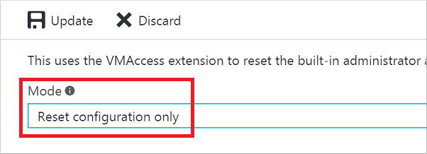

<properties
    pageTitle="在 Windows VM 上重置密码或远程桌面配置 | Azure"
    description="了解如何使用 Azure 门户预览或 Azure PowerShell 在 Windows VM 上重置帐户密码或远程桌面服务。"
    services="virtual-machines-windows"
    documentationcenter=""
    author="iainfoulds"
    manager="timlt"
    editor=""
    tags="azure-resource-manager"
    translationtype="Human Translation" />
<tags
    ms.assetid="45c69812-d3e4-48de-a98d-39a0f5675777"
    ms.service="virtual-machines-windows"
    ms.workload="infrastructure-services"
    ms.tgt_pltfrm="vm-windows"
    ms.devlang="na"
    ms.topic="article"
    ms.date="03/14/2017"
    wacn.date="04/17/2017"
    ms.author="iainfou"
    ms.sourcegitcommit="e0e6e13098e42358a7eaf3a810930af750e724dd"
    ms.openlocfilehash="3209a28ba34fad33289b2cb0b1cd7f90253a6047"
    ms.lasthandoff="04/06/2017" />

# 如何在 Windows VM 中重置远程桌面服务或其登录密码
如果无法连接到 Windows 虚拟机 (VM)，可以重置本地管理员密码或重置远程桌面服务配置。 可以使用 Azure 门户预览或 Azure PowerShell 中的 VM 访问扩展重置密码。 如果使用 PowerShell，请务必[安装和配置最新的 PowerShell 模块](https://docs.microsoft.com/zh-cn/powershell/azureps-cmdlets-docs)，并登录到 Azure 订阅。 也可以对[使用经典部署模型创建的 VM 执行这些步骤](/documentation/articles/virtual-machines-windows-classic-reset-rdp/)。

## 重置配置或凭据的方式
可以根据需要，通过多种不同的方式重置远程桌面服务和凭据：

- [使用 Azure 门户预览重置](#azure-portal)
- [使用 Azure PowerShell 进行重置](#vmaccess-extension-and-powershell)

## Azure 门户预览
若要展开门户菜单，请单击左上角的三个条形，然后单击“虚拟机” ：

### **重置本地管理员帐户密码**

选择 Windows 虚拟机，然后单击“支持 + 故障排除” > “重置密码”。 此时会显示密码重置边栏选项卡：

输入用户名和新密码，然后单击“更新”。 尝试重新连接到 VM。

### **重置远程桌面服务配置**

选择 Windows 虚拟机，然后单击“支持 + 故障排除” > “重置密码”。 此时会显示密码重置边栏选项卡。 

从下拉菜单中选择“仅重置配置”，然后单击“更新”。 尝试重新连接到 VM。

##  VMAccess 扩展和 PowerShell
请务必[安装和配置最新的 PowerShell 模块](https://docs.microsoft.com/zh-cn/powershell/azureps-cmdlets-docs)，并使用 `Login-AzureRmAccount -EnvironmentName AzureChinaCloud` cmdlet 登录到 Azure 订阅。

### **重置本地管理员帐户密码**
使用 [Set-AzureRmVMAccessExtension](https://msdn.microsoft.com/zh-cn/library/mt619447.aspx) PowerShell cmdlet 重置管理员密码或用户名。 按如下所示创建帐户凭据：

    $cred=Get-Credential

> [AZURE.NOTE] 
> 如果在 VM 上键入不同于当前本地管理员帐户的名称，则 VMAccess 扩展将重命名本地管理员帐户，将指定密码分配给该帐户，并发出远程桌面注销事件。 如果 VM 上的本地管理员帐户处于禁用状态，则 VMAccess 扩展将启用它。

以下示例将名为 `myResourceGroup` 的资源组中名为 `myVM` 的 VM 更新为指定凭据。

    Set-AzureRmVMAccessExtension -ResourceGroupName "myResourceGroup" -VMName "myVM" `
        -Name "myVMAccess" -Location ChinaNorth -UserName $cred.GetNetworkCredential().Username `
        -Password $cred.GetNetworkCredential().Password -typeHandlerVersion "2.0"

### **重置远程桌面服务配置**
使用 [Set-AzureRmVMAccessExtension](https://msdn.microsoft.com/zh-cn/library/mt619447.aspx) PowerShell cmdlet 重置对 VM 的远程访问。 以下示例在名为 `myResourceGroup` 的资源组中名为 `myVM` 的 VM 上重置名为 `myVMAccess` 的访问扩展：

    Set-AzureRmVMAccessExtension -ResourceGroupName "myResoureGroup" -VMName "myVM" `
        -Name "myVMAccess" -Location ChinaNorth -typeHandlerVersion "2.0 -ForceRerun

> [AZURE.TIP]
> 无论何时，一个 VM 只能有一个 VM 访问代理。 若要成功设置 VM 访问代理属性，可以使用 `-ForceRerun` 选项。 使用 `-ForceRerun` 时，请确保使用与前述命令使用的 VM 访问代理相同的名称。

如果仍然无法远程连接到虚拟机，请参阅 [Troubleshoot Remote Desktop connections to a Windows-based Azure virtual machine](/documentation/articles/virtual-machines-windows-troubleshoot-rdp-connection/)（对与基于 Windows 的 Azure 虚拟机的远程桌面连接进行故障排除），了解其他值得一试的步骤。

## 后续步骤
如果 Azure VM 访问扩展无响应，并且密码无法重置，可以[脱机重置本地 Windows 密码](/documentation/articles/virtual-machines-windows-reset-local-password-without-agent/)。 此方法是一个更高级的方案，需将问题 VM 的虚拟硬盘连接到另一个 VM。 请首先按照本文中所述的步骤操作，将脱机密码重置方法作为最后的选择。

[Azure VM 扩展和功能](/documentation/articles/virtual-machines-windows-extensions-features/)

[使用 RDP 或 SSH 连接到 Azure 虚拟机](/documentation/articles/virtual-machines-linux-azure-overview/)

[对与基于 Windows 的 Azure 虚拟机的远程桌面连接进行故障排除](/documentation/articles/virtual-machines-windows-troubleshoot-rdp-connection/)
<!--Update_Description: wording update-->