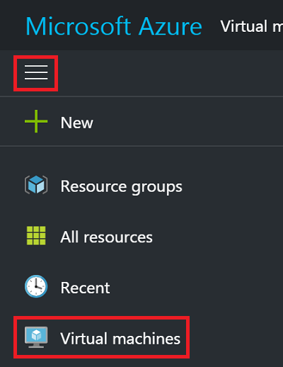
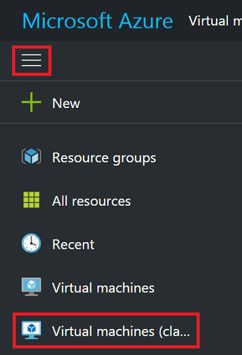
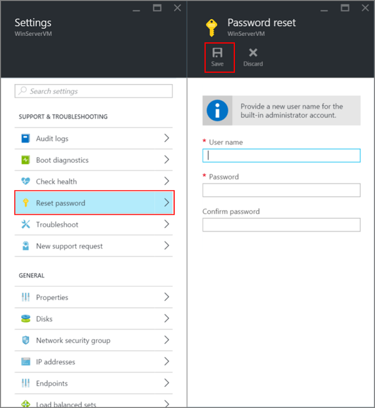

<properties
    pageTitle="在 Windows VM 上重置密码或远程桌面配置 | Azure"
    description="了解如何使用 Azure 门户预览或 Azure PowerShell 在 Windows VM 上重置帐户密码或远程桌面服务。"
    services="virtual-machines-windows"
    documentationcenter=""
    author="iainfoulds"
    manager="timlt"
    editor=""
    tags="azure-resource-manager" />
<tags
    ms.assetid="45c69812-d3e4-48de-a98d-39a0f5675777"
    ms.service="virtual-machines-windows"
    ms.workload="infrastructure-services"
    ms.tgt_pltfrm="vm-windows"
    ms.devlang="na"
    ms.topic="article"
    ms.date="11/28/2016"
    wacn.date="03/20/2017"
    ms.author="iainfou" />  

# 如何在 Windows VM 中重置远程桌面服务或其登录密码
[AZURE.INCLUDE [了解部署模型](../../includes/learn-about-deployment-models-both-include.md)]

如果无法连接到 Windows 虚拟机 (VM)，可以重置本地管理员密码或重置远程桌面服务配置。可以使用 Azure 门户预览或 Azure PowerShell 中的 VM 访问扩展重置密码。如果使用 PowerShell，请确保在工作计算机上安装最新的 PowerShell 模块，并登录到 Azure 订阅。有关详细步骤，请阅读 [How to install and configure Azure PowerShell](https://docs.microsoft.com/powershell/azureps-cmdlets-docs)（如何安装和配置 Azure PowerShell）。

> [AZURE.TIP]
可以使用以下命令检查安装的 PowerShell 版本：
>

> `Import-Module Azure, AzureRM; Get-Module Azure, AzureRM | Format-Table Name, Version`  

## 如何重置配置或凭据
可以根据需要，通过多种不同的方式重置远程桌面服务和凭据。对于使用 Resource Manager 部署模型创建的 VM：

- [使用 Azure 门户预览重置](#azure-portal---resource-manager)
- [使用 Azure PowerShell 重置](#vmaccess-extension-and-powershell---resource-manager)

对于使用经典部署模型创建的 VM：

- [使用 Azure 门户预览重置](#azure-portal---classic)
- [使用 Azure PowerShell 重置](#vmaccess-extension-and-powershell---classic)

##  Azure 门户预览 - Resource Manager
若要展开门户菜单，请单击左上角的三个条形，然后单击“虚拟机”：

  

选择 Windows 虚拟机，然后单击“支持 + 疑难解答”>“重置密码”。此时会显示密码重置边栏选项卡：

  

输入用户名和新密码，然后单击“保存”。尝试重新连接到 VM。

##  VMAccess 扩展和 PowerShell - Resource Manager
确保已安装 Azure PowerShell 1.0 版或更高版本，并且已使用 `Login-AzureRmAccount -EnvironmentName AzureChinaCloud` cmdlet 登录到帐户。

### **重置本地管理员帐户密码**
可以使用 [Set-AzureRmVMAccessExtension](https://msdn.microsoft.com/zh-cn/library/mt619447.aspx) PowerShell 命令重置管理员密码或用户名。

使用以下命令创建本地管理员帐户凭据：

    $cred=Get-Credential

如果键入不同于当前帐户的名称，以下 VMAccess 扩展命令将重命名本地管理员帐户，将密码分配到该帐户，并发出远程桌面注销事件。如果禁用本地管理员帐户，则 VMAccess 扩展将启用它。

使用 VM Access 扩展设置新凭据，如下所示：

    Set-AzureRmVMAccessExtension -ResourceGroupName "myResourceGroup" -VMName "myVM" `
        -Name "myVMAccess" -Location ChinaNorth -UserName $cred.GetNetworkCredential().Username `
        -Password $cred.GetNetworkCredential().Password -typeHandlerVersion "2.0"

将 `myResourceGroup`、`myVM`、`myVMAccess` 和 location 替换为与设置相关的值。

### **重置远程桌面服务配置**
可以使用 [Set-AzureRmVMExtension](https://msdn.microsoft.com/zh-cn/library/mt603745.aspx) 或 [Set-AzureRmVMAccessExtension](https://msdn.microsoft.com/zh-cn/library/mt619447.aspx) 重置对 VM 的远程访问，如下所示。（将 `myResourceGroup`、`myVM`、`myVMAccess` 和 location 替换为自己的值。）

    Set-AzureRmVMExtension -ResourceGroupName "myResourceGroup" -VMName "myVM" `
        -Name "myVMAccess" -ExtensionType "VMAccessAgent" -Location ChinaNorth `
        -Publisher "Microsoft.Compute" -typeHandlerVersion "2.0"

或者：

    Set-AzureRmVMAccessExtension -ResourceGroupName "myResoureGroup" -VMName "myVM" `
        -Name "myVMAccess" -Location ChinaNorth -typeHandlerVersion "2.0

> [AZURE.TIP]
这两个命令都会将新命名的 VM 访问代理添加到虚拟机。在任何时候，一个 VM 只能拥有一个 VM 访问代理。若要成功设置 VM 访问代理属性，使用 `Remove-AzureRmVMAccessExtension` 或 `Remove-AzureRmVMExtension` 删除之前设置的访问代理。
>
> 从 Azure PowerShell 1.2.2 版开始，如果将 `Set-AzureRmVMExtension` 与 `-ForceRerun` 选项结合使用，则无需执行此步骤。使用 `-ForceRerun` 时，请确保使用与前述命令设置的 VM 访问代理相同的名称。

如果仍无法远程连接到虚拟机，请参阅 [Troubleshoot Remote Desktop connections to a Windows-based Azure virtual machine](/documentation/articles/virtual-machines-windows-troubleshoot-rdp-connection/)（对与基于 Windows 的 Azure 虚拟机的远程桌面连接进行故障排除），了解更多尝试步骤。

##  Azure 门户预览 - 经典
对于使用经典部署模型创建的虚拟机，可以使用 [Azure 门户预览](https://portal.azure.cn)重置远程桌面服务。若要展开门户菜单，请单击左上角的三个条形，然后单击“虚拟机(经典)”：

  

选择 Windows 虚拟机，然后单击“重置远程...”。此时将显示以下用于重置远程桌面配置的对话框：

  

还可以重置本地管理员帐户的用户名和密码。从 VM 中单击“支持 + 疑难解答”>“重置密码”。此时会显示密码重置边栏选项卡：

  

输入新用户名和密码，然后单击“保存”。

##  VMAccess 扩展和 PowerShell - 经典
确保在虚拟机上安装 VM 代理。只要 VM 代理可用，就无需事先安装 VMAccess 扩展。使用以下命令验证是否已在虚拟机上安装 VM 代理。（分别将“myCloudService”和“myVM”替换为云服务和 VM 的名称。若要了解这些名称，可运行不带任何参数的 `Get-AzureVM`。）

    $vm = Get-AzureVM -ServiceName "myCloudService" -Name "myVM"
    write-host $vm.VM.ProvisionGuestAgent

如果 **write-host** 命令显示 **True**，则已安装 VM 代理。如果该命令显示 **False**，请参阅 Azure 博客文章 [VM 代理和扩展 - 第 2 部分](https://azure.microsoft.com/zh-cn/blog/vm-agent-and-extensions-part-2/)中的说明和下载链接。

如果使用门户创建虚拟机，检查 `$vm.GetInstance().ProvisionGuestAgent` 是否返回 **True**。如果不是，使用以下命令进行设置：

    $vm.GetInstance().ProvisionGuestAgent = $true

此命令可防止在后续步骤中运行 **Set-AzureVMExtension** 命令时出现以下错误：“在设置 IaaS VM Access 扩展前，必须对 VM 对象启用预配来宾代理。”

### **重置本地管理员帐户密码**
使用当前的本地管理员帐户名和新密码创建登录凭据，然后运行 `Set-AzureVMAccessExtension`，如下所示。

    $cred=Get-Credential
    Set-AzureVMAccessExtension -vm $vm -UserName $cred.GetNetworkCredential().Username `
        -Password $cred.GetNetworkCredential().Password  | Update-AzureVM

如果键入不同于当前帐户的名称，VMAccess 扩展将重命名本地管理员帐户，将密码分配到该帐户，并发出远程桌面注销命令。如果禁用本地管理员帐户，则 VMAccess 扩展将启用它。

这些命令也可重置远程桌面服务配置。

### **重置远程桌面服务配置**
若要重置远程桌面服务配置，请运行以下命令：

    Set-AzureVMAccessExtension -vm $vm | Update-AzureVM

VMAccess 扩展在虚拟机上运行两个命令：

    netsh advfirewall firewall set rule group="Remote Desktop" new enable=Yes

此命令启用允许传入远程桌面流量（使用 TCP 端口 3389）的内置 Windows 防火墙组。

    Set-ItemProperty -Path 'HKLM:\System\CurrentControlSet\Control\Terminal Server' -name "fDenyTSConnections" -Value 0

此命令将 fDenyTSConnections 注册表值设置为 0，以启用远程桌面连接。

## 后续步骤
如果 Azure VM 访问扩展未响应并且不能重置密码，则可以[脱机重置本地的 Windows 密码](/documentation/articles/virtual-machines-windows-reset-local-password-without-agent/)。此方法是一个更高级的方案，需将问题 VM 的虚拟硬盘连接到另一个 VM。请首先按照本文中所述的步骤操作，将脱机密码重置方法作为最后的选择。

[Azure VM 扩展和功能](/documentation/articles/virtual-machines-windows-extensions-features/)

[使用 RDP 或 SSH 连接到 Azure 虚拟机](/documentation/articles/virtual-machines-linux-azure-overview/)

[对与基于 Windows 的 Azure 虚拟机的远程桌面连接进行故障排除](/documentation/articles/virtual-machines-windows-troubleshoot-rdp-connection/)

<!---HONumber=Mooncake_0313_2017-->
<!--Update_Description: wording update-->