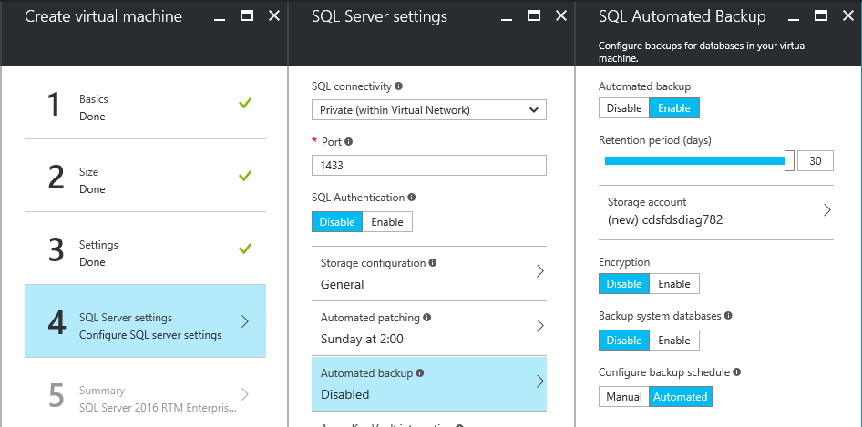
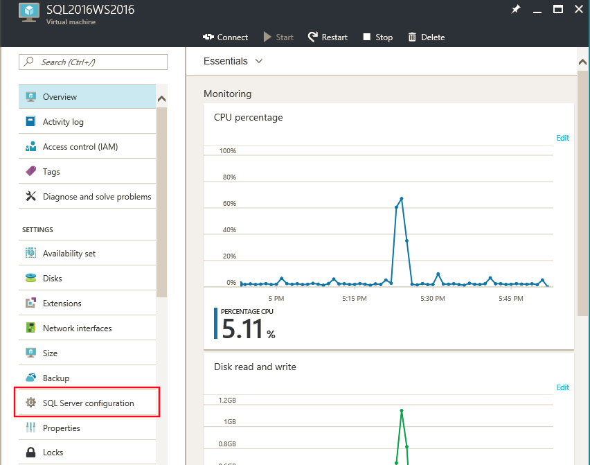
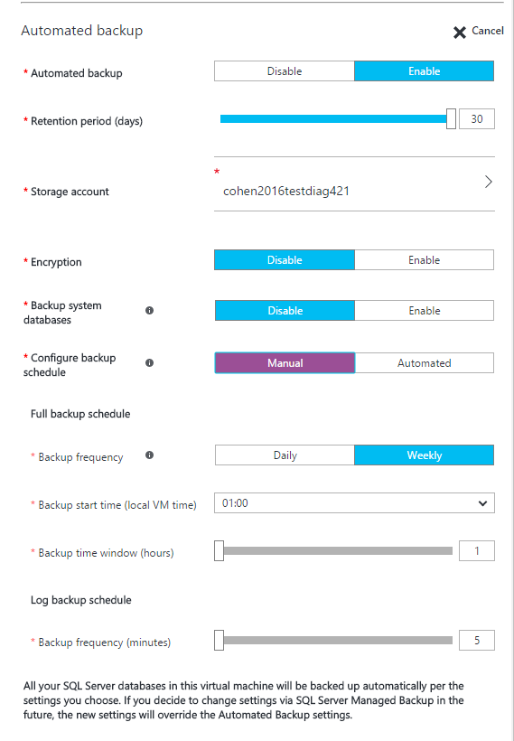

<properties
    pageTitle="适用于 SQL Server 2016 Azure 虚拟机的自动备份 v2 | Azure"
    description="介绍适用于 Azure 中运行的 SQL Server 2016 VM 的自动备份功能。 本文仅适用于使用 Resource Manager 的 VM。"
    services="virtual-machines-windows"
    documentationcenter="na"
    author="rothja"
    manager="jhubbard"
    editor=""
    tags="azure-resource-manager" />
<tags
    ms.assetid="ebd23868-821c-475b-b867-06d4a2e310c7"
    ms.service="virtual-machines-windows"
    ms.devlang="na"
    ms.topic="article"
    ms.tgt_pltfrm="vm-windows-sql-server"
    ms.workload="iaas-sql-server"
    ms.date="04/05/2017"
    wacn.date="05/15/2017"
    ms.author="jroth"
    ms.translationtype="Human Translation"
    ms.sourcegitcommit="457fc748a9a2d66d7a2906b988e127b09ee11e18"
    ms.openlocfilehash="caec67f979682a5968b4b8ee0043ddc96a25cb57"
    ms.contentlocale="zh-cn"
    ms.lasthandoff="05/05/2017" />

# 适用于 SQL Server 2016 Azure 虚拟机 (Resource Manager) 的自动备份 v2

自动备份 v2 在运行 SQL Server 2016 Standard、Enterprise 或 Developer 版本的 Azure VM 上自动为所有现有数据库和新数据库配置[到 Azure 的托管备份](https://msdn.microsoft.com/zh-cn/library/dn449496.aspx)。 这样，你便可以配置使用持久 Azure Blob 存储的定期数据库备份。 自动备份 v2 依赖于 [SQL Server IaaS 代理扩展](/documentation/articles/virtual-machines-windows-sql-server-agent-extension/)。

[AZURE.INCLUDE [learn-about-deployment-models](../../includes/learn-about-deployment-models-rm-include.md)]

## 先决条件
若要使用自动备份 v2，请查看以下先决条件：

**操作系统**：

- Windows Server 2012 R2
- Windows Server 2016

**SQL Server 版本**：

- SQL Server 2016 Standard
- SQL Server 2016 Enterprise
- SQL Server 2016 Developer

> [AZURE.IMPORTANT]
> 自动备份 v2 适用于 SQL Server 2016。 如果使用的是 SQL Server 2014，可以使用自动备份 v1 来备份数据库。 有关详细信息，请参阅 [Automated Backup for SQL Server 2014 Azure Virtual Machines](/documentation/articles/virtual-machines-windows-sql-automated-backup/)（适用于 SQL Server 2014 Azure 虚拟机的自动备份）。

**数据库配置**：

- 目标数据库必须使用完整恢复模式。
- 系统数据库不需要使用完整恢复模型。 但是，如果需要为模型或 MSDB 创建日志备份，则必须使用完整恢复模型。

有关对备份使用完整恢复模型产生的影响的详细信息，请参阅 [Backup Under the Full Recovery Model](https://technet.microsoft.com/zh-cn/library/ms190217.aspx)（使用完整恢复模型的备份）。

**Azure 部署模型**：

- Resource Manager

> [AZURE.NOTE]
> 自动备份依赖于 **SQL Server IaaS 代理扩展**。 当前的 SQL 虚拟机库映像默认添加此扩展。 有关详细信息，请参阅 [SQL Server IaaS 代理扩展](/documentation/articles/virtual-machines-windows-sql-server-agent-extension/)。

## 设置
下表描述了可为自动备份 v2 配置的选项。 实际配置步骤根据你使用的是 Azure 门户预览版还是 Azure Windows PowerShell 命令而有所不同。

### 基本设置

| 设置 | 范围（默认值） | 说明 |
| --- | --- | --- |
| **自动备份** | 启用/禁用（已禁用） | 为运行 SQL Server 2016 Standard 或 Enterprise 的 Azure VM 启用或禁用自动备份。 |
| **保留期** | 1-30 天（30 天） | 保留备份的天数。 |
| **存储帐户** | Azure 存储帐户 | 用于在 Blob 存储中存储自动备份文件的 Azure 存储帐户。 在此位置创建容器，用于存储所有备份文件。 备份文件命名约定包括日期、时间和数据库 GUID。 |
| **加密** |启用/禁用（已禁用） | 启用或禁用加密。 启用加密时，用于还原备份的证书将使用相同的命名约定存放在同一 **automaticbackup** 容器中的指定存储帐户内。 如果密码发生更改，将使用该密码生成新证书，但旧证书在备份之前仍会还原。 |
| **密码** |密码文本 | 加密密钥的密码。 仅当启用了加密时才需要此设置。 若要还原加密的备份，必须具有创建该备份时使用的正确密码和相关证书。 |

### 高级设置

| 设置 | 范围（默认值） | 说明 |
| --- | --- | --- |
| **系统数据库备份** | 启用/禁用（已禁用） | 如果启用，此功能还会备份系统数据库：Master、MSDB 和 Model。 对于 MSDB 和 Model 数据库，如果想要创建日志备份，请验证这些数据库是否处于完整恢复模式。 永远不会针对 Master 数据库创建日志备份。 此外，不会创建 TempDB 的备份。 |
| **备份计划** | 手动/自动（自动） | 默认情况下，系统会根据日志的增长速度自动确定备份计划。 用户可以使用手动备份计划来指定备份时段。 在这种情况下，备份始终只会按照指定的频率，在特定日期的指定时段内进行。 |
| **完整备份频率** | 每日/每周 | 完整备份的频率。 在这两种情况下，完整备份将在下一个计划时段内开始。 如果选择“每周”，备份可能会跨越好几天，直到所有数据库都已成功备份。 |
| **完整备份开始时间** | 00:00 - 23:00 (01:00) | 在给定的日期可以开始执行完整备份的时间。 |
| **完整备份时段** | 1 – 23 小时（1 小时） | 在给定的日期可以执行完整备份的时段持续时间。 |
| **日志备份频率** | 5 – 60 分钟（60 分钟） | 日志备份的频率。 |

## 了解完整备份频率
必须了解每日与每周完整备份之间的差别。 为此，我们将逐步讲解两个示例方案。

### 方案 1：每周备份
某个 SQL Server VM 包含一些很大的数据库。

在星期一，用户使用以下设置启用了自动备份 v2：

- 备份计划： **手动**
- 完整备份频率： **每周**
- 完整备份开始时间： **01:00**
- 完整备份时段： **1 小时**

这意味着，下一个可用备份时段为星期二凌晨 1 点，持续时间为 1 小时。 到时，自动备份将开始逐个备份数据库。 在此方案中，由于数据库非常大，完整备份将完成前几个数据库。 但是，一小时后，并非所有数据库都能得到备份。

如果发生这种情况，自动备份将在第二天，即星期三凌晨 1 点备份剩余的数据库，持续时间为 1 小时。 如果到时仍然无法备份所有数据库，它会在后一天的同一时间再次尝试备份。 在所有数据库都已成功备份之前，它会不断地执行此计划。

星期二又一次到来后，自动备份将再一次开始备份所有数据库。

此方案表明，自动备份只会在指定的时段内运行，每个数据库每周备份一次。 另外，如果在一天内无法完成所有备份，备份可能会跨越好几天。

### 方案 2：每日备份
某个 SQL Server VM 包含一些很大的数据库。

在星期一，用户使用以下设置启用了自动备份 v2：

- 备份计划：手动
- 完整备份频率：每日
- 完整备份开始时间：22:00
- 完整备份时段：6 小时

这意味着，下一个可用备份时段为星期一晚上 10 点，持续时间为 6 小时。 到时，自动备份将开始逐个备份数据库。

然后，在星期二的晚上 10 点，所有数据库的完整备份将再次开始，持续时间为 6 小时。

> [AZURE.IMPORTANT]
> 计划每日备份时，建议安排一个较宽的时段，确保在此时间范围内可以备份所有数据库。 有大量的数据要备份时，这种设置尤其重要。

## 门户中的配置
可以在预配期间或针对现有的 SQL Server 2016 VM 使用 Azure 门户预览版来配置自动备份 v2。 

### 新的 VM
在 Resource Manager 部署模型中创建新的 SQL Server 2016 虚拟机时，可以使用 Azure 门户预览版配置自动备份 v2。 

在“SQL Server 设置”边栏选项卡中，选择“自动备份”。 下面的 Azure 门户预览版屏幕截图显示了“SQL 自动备份”  边栏选项卡。

> [AZURE.NOTE]
> 自动备份 v2 默认已禁用。

若要了解上下文，请参阅有关[在 Azure 中预配 SQL Server 虚拟机](/documentation/articles/virtual-machines-windows-portal-sql-server-provision/)的完整主题。

### 现有 VM
对于现有的 SQL Server 虚拟机，请选择你的 SQL Server 虚拟机。 然后选择“设置”边栏选项卡的“SQL Server 配置”部分。

在“SQL Server 配置”边栏选项卡的“自动备份”部分，单击“编辑”按钮。

完成后，单击“SQL Server 配置”边栏选项卡底部的“确定”按钮保存更改。

当你首次启用自动备份时，Azure 将在后台配置 SQL Server IaaS 代理。 在此期间，Azure 门户预览版可能不会显示自动备份已配置。 请等待几分钟，以便安装和配置代理。 之后，Azure 门户预览版将显示新的设置。

## 使用 PowerShell 进行配置
可以使用 PowerShell 来配置自动备份 v2。 开始之前，必须：

- [下载并安装最新的 Azure PowerShell](http://aka.ms/webpi-azps)。
- 打开 Windows PowerShell 并将其关联到你的帐户。 可以遵循预配主题的[配置订阅](/documentation/articles/virtual-machines-windows-ps-sql-create/#configure-your-subscription)部分中的步骤执行此操作。

### 安装 SQL IaaS 扩展
如果通过 Azure 门户预览版预配了 SQL Server 虚拟机，应已安装 SQL Server IaaS 扩展。 可通过调用 **Get-AzureRmVM** 命令并检查 **Extensions** 属性，来确定是否为 VM 安装了该扩展。

    $vmname = "vmname"
    $resourcegroupname = "resourcegroupname"

    (Get-AzureRmVM -Name $vmname -ResourceGroupName $resourcegroupname).Extensions 

如果已安装 SQL Server IaaS 代理扩展，应会看到列出的“SqlIaaSAgent”或“SQLIaaSExtension”。 **ProvisioningState** 应显示“Succeeded”。 

如果未安装或未能预配该扩展，可使用以下命令来安装。 除了 VM 名称和资源组以外，还必须指定 VM 所在的区域 (**$region**)。

    $region = "EASTUS2"
    Set-AzureRmVMSqlServerExtension -VMName $vmname `
        -ResourceGroupName $resourcegroupname -Name "SQLIaasExtension" `
        -Version "1.2" -Location $region 

### 验证当前设置
如果在预配期间启用了自动备份，可以使用 PowerShell 检查当前配置。 运行 **Get-AzureRmVMSqlServerExtension** 命令并检查 **AutoBackupSettings** 属性：

    (Get-AzureRmVMSqlServerExtension -VMName $vmname -ResourceGroupName $resourcegroupname).AutoBackupSettings

应会看到类似于下面的输出：

    Enable                      : True
    EnableEncryption            : False
    RetentionPeriod             : 30
    StorageUrl                  : https://test.blob.core.chinacloudapi.cn/
    StorageAccessKey            :  
    Password                    : 
    BackupSystemDbs             : False
    BackupScheduleType          : Manual
    FullBackupFrequency         : WEEKLY
    FullBackupStartTime         : 2
    FullBackupWindowHours       : 2
    LogBackupFrequency          : 60

如果输出显示 **Enable** 设置为 **False**，则必须启用自动备份。 幸运的是，可通过相同的方式启用和配置自动备份。 有关信息，请参阅下一部分。

> [AZURE.NOTE] 
> 如果在进行更改后立即检查设置，看到的可能是旧配置值。 请等待几分钟再检查设置，确保更改已应用。

### 配置自动备份 v2
随时可以使用 PowerShell 来启用自动备份以及修改其配置和行为。 

首先，为备份文件选择或创建存储帐户。 以下脚本将选择一个存储帐户，或者创建一个存储帐户（如果不存在）。

    $storage_accountname = "yourstorageaccount"
    $storage_resourcegroupname = $resourcegroupname

    $storage = Get-AzureRmStorageAccount -ResourceGroupName $resourcegroupname `
        -Name $storage_accountname -ErrorAction SilentlyContinue
    If (-Not $storage)
        { $storage = New-AzureRmStorageAccount -ResourceGroupName $storage_resourcegroupname `
        -Name $storage_accountname -SkuName Standard_GRS -Location $region } 

> [AZURE.NOTE]
> 自动备份不支持在高级存储中存储备份，但可以从使用高级存储的 VM 磁盘创建备份。

然后，使用 **New-AzureRmVMSqlServerAutoBackupConfig** 命令启用并配置自动备份 v2 设置，以便在 Azure 存储帐户中存储备份。 在本示例中，备份设置为保留 10 天。 系统数据库备份已启用。 完整备份计划为每周运行，时段从 20:00 开始，持续两小时。 日志备份计划为每隔 30 分钟运行。 第二个命令 **Set-AzureRmVMSqlServerExtension**使用这些设置更新指定的 Azure VM。

    $autobackupconfig = New-AzureRmVMSqlServerAutoBackupConfig -Enable `
        -RetentionPeriodInDays 10 -StorageContext $storage.Context `
        -ResourceGroupName $storage_resourcegroupname -BackupSystemDbs `
        -BackupScheduleType Manual -FullBackupFrequency Weekly `
        -FullBackupStartHour 20 -FullBackupWindowInHours 2 `
        -LogBackupFrequencyInMinutes 30 

    Set-AzureRmVMSqlServerExtension -AutoBackupSettings $autobackupconfig `
        -VMName $vmname -ResourceGroupName $resourcegroupname 

可能需要花费几分钟来安装和配置 SQL Server IaaS 代理。 

若要启用加密，请修改上述脚本，使其将 **EnableEncryption** 参数连同 **CertificatePassword** 参数的密码（安全字符串）一起传递。 以下脚本启用上一示例中的自动备份设置，并添加加密。

    $password = "P@ssw0rd"
    $encryptionpassword = $password | ConvertTo-SecureString -AsPlainText -Force  

    $autobackupconfig = New-AzureRmVMSqlServerAutoBackupConfig -Enable `
        -EnableEncryption -CertificatePassword $encryptionpassword `
        -RetentionPeriodInDays 10 -StorageContext $storage.Context `
        -ResourceGroupName $storage_resourcegroupname -BackupSystemDbs `
        -BackupScheduleType Manual -FullBackupFrequency Weekly `
        -FullBackupStartHour 20 -FullBackupWindowInHours 2 `
        -LogBackupFrequencyInMinutes 30 

    Set-AzureRmVMSqlServerExtension -AutoBackupSettings $autobackupconfig `
        -VMName $vmname -ResourceGroupName $resourcegroupname

若要确认是否应用了这些设置，请 [检查自动备份配置](#verifysettings)。

### 禁用自动备份
若要禁用自动备份，请运行同一个脚本，但不要为 **New-AzureRmVMSqlServerAutoBackupConfig** 命令指定 **-Enable** 参数。 缺少 **-Enable** 参数将向该命令发出指示以禁用此功能。 与安装一样，可能需要花费几分钟时间来禁用自动备份。

    $autobackupconfig = New-AzureRmVMSqlServerAutoBackupConfig -ResourceGroupName $storage_resourcegroupname

    Set-AzureRmVMSqlServerExtension -AutoBackupSettings $autobackupconfig `
        -VMName $vmname -ResourceGroupName $resourcegroupname

### 示例脚本
以下脚本提供一组可自定义的变量，用来为 VM 启用和配置自动备份。 根据具体的情况，可能需要根据要求自定义该脚本。 例如，如果想要禁用系统数据库备份或启用加密，则必须更改该脚本。

    $vmname = "yourvmname"
    $resourcegroupname = "vmresourcegroupname"
    $region = "Azure region name such as EASTUS2"
    $storage_accountname = "storageaccountname"
    $storage_resourcegroupname = $resourcegroupname
    $retentionperiod = 10
    $backupscheduletype = "Manual"
    $fullbackupfrequency = "Weekly"
    $fullbackupstarthour = "20"
    $fullbackupwindow = "2"
    $logbackupfrequency = "30"

    # ResourceGroupName is the resource group which is hosting the VM where you are deploying the SQL IaaS Extension 

    Set-AzureRmVMSqlServerExtension -VMName $vmname `
        -ResourceGroupName $resourcegroupname -Name "SQLIaasExtension" `
        -Version "1.2" -Location $region

    # Creates/use a storage account to store the backups

    $storage = Get-AzureRmStorageAccount -ResourceGroupName $resourcegroupname `
        -Name $storage_accountname -ErrorAction SilentlyContinue
    If (-Not $storage)
        { $storage = New-AzureRmStorageAccount -ResourceGroupName $storage_resourcegroupname `
        -Name $storage_accountname -SkuName Standard_GRS -Location $region }

    # Configure Automated Backup settings

    $autobackupconfig = New-AzureRmVMSqlServerAutoBackupConfig -Enable `
        -RetentionPeriodInDays $retentionperiod -StorageContext $storage.Context `
        -ResourceGroupName $storage_resourcegroupname -BackupSystemDbs `
        -BackupScheduleType $backupscheduletype -FullBackupFrequency $fullbackupfrequency `
        -FullBackupStartHour $fullbackupstarthour -FullBackupWindowInHours $fullbackupwindow `
        -LogBackupFrequencyInMinutes $logbackupfrequency

    # Apply the Automated Backup settings to the VM

    Set-AzureRmVMSqlServerExtension -AutoBackupSettings $autobackupconfig `
        -VMName $vmname -ResourceGroupName $resourcegroupname

## 后续步骤
自动备份 v2 在 Azure VM 上配置托管备份。 因此，请务必[查看有关托管备份的文档](https://msdn.microsoft.com/zh-cn/library/dn449496.aspx)，了解其行为和影响。

可以在以下主题中找到针对 Azure VM 上的 SQL Server 的其他备份和还原指导：[Azure 虚拟机中 SQL Server 的备份和还原](/documentation/articles/virtual-machines-windows-sql-backup-recovery/)。

有关其他可用自动化任务的信息，请参阅 [SQL Server IaaS 代理扩展](/documentation/articles/virtual-machines-windows-sql-server-agent-extension/)。

有关在 Azure VM 中运行 SQL Server 的详细信息，请参阅 [Azure 虚拟机中的 SQL Server 概述](/documentation/articles/virtual-machines-windows-sql-server-iaas-overview/)。

<!--Update_Description: wording update-->