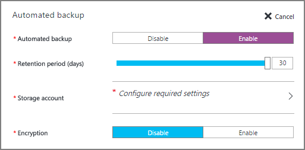

<properties
	pageTitle="SQL Server 虚拟机 (Resource Manager) 的自动备份 | Azure"
	description="介绍在使用 Resource Manager 的 Azure 虚拟机中运行的 SQL Server 的自动备份功能。"
	services="virtual-machines-windows"
	documentationCenter="na"
	authors="rothja"
	manager="jhubbard"
	editor=""
	tags="azure-resource-manager"/>
<tags
	ms.service="virtual-machines-windows"
	ms.devlang="na"
	ms.topic="article"
	ms.tgt_pltfrm="vm-windows-sql-server"
	ms.workload="infrastructure-services"
	ms.date="11/15/2016"
	wacn.date="12/30/2016"
	ms.author="jroth" />

# Azure 虚拟机 (Resource Manager) 中 SQL Server 的自动备份

> [AZURE.SELECTOR]
- [资源管理器](/documentation/articles/virtual-machines-windows-sql-automated-backup/)
- [经典](/documentation/articles/virtual-machines-windows-classic-sql-automated-backup/)

自动备份将在运行 SQL Server 2014 Standard 或 Enterprise 的 Azure VM 上，自动为所有现有数据库和新数据库配置[托管备份到 Azure](https://msdn.microsoft.com/zh-cn/library/dn449496.aspx)。这样，你便可以配置使用持久 Azure Blob 存储的定期数据库备份。自动备份依赖 [SQL Server IaaS 代理扩展](/documentation/articles/virtual-machines-windows-sql-server-agent-extension/)。

[AZURE.INCLUDE [了解部署模型](../../includes/learn-about-deployment-models-rm-include.md)] 经典部署模型。若要查看本文的经典版本，请参阅[在 Azure 虚拟机（经典）中对 SQL Server 进行自动备份](/documentation/articles/virtual-machines-windows-classic-sql-automated-backup/)。

## 先决条件

若要使用自动备份，请考虑以下先决条件：

**操作系统**：

- Windows Server 2012
- Windows Server 2012 R2

**SQL Server 版本**：

- SQL Server 2014 Standard
- SQL Server 2014 Enterprise

**数据库配置**：

- 目标数据库必须使用完整恢复模式

**Azure PowerShell**：

- 如果你打算使用 PowerShell 配置自动备份，请[安装最新的 Azure PowerShell 命令](/documentation/articles/powershell-install-configure/)。

>[AZURE.NOTE] 自动备份依赖 SQL Server IaaS 代理扩展。当前的 SQL 虚拟机库映像默认添加此扩展。有关详细信息，请参阅 [SQL Server IaaS 代理扩展](/documentation/articles/virtual-machines-windows-sql-server-agent-extension/)。

## 设置

下表描述了可为自动备份配置的选项。实际配置步骤根据你使用的是 Azure 门户预览还是 Azure Windows PowerShell 命令而有所不同。

|设置|范围（默认值）|说明|
|---|---|---|
|**自动备份**|启用/禁用（已禁用）|为运行 SQL Server 2014 Standard 或 Enterprise 的 Azure VM 启用或禁用自动备份。|
|**保留期**|1-30 天（30 天）|保留备份的天数。|
|**存储帐户**|Azure 存储帐户（为指定的 VM 创建的存储帐户）|用于在 Blob 存储中存储自动备份文件的 Azure 存储帐户。在此位置创建容器，用于存储所有备份文件。备份文件命名约定包括日期、时间和计算机名称。|
|**加密**|启用/禁用（已禁用）|启用或禁用加密。启用加密时，用于还原备份的证书使用相同的命名约定存放在同一 automaticbackup 容器中的指定存储帐户内。如果密码发生更改，将使用该密码生成新证书，但旧证书在备份之前仍会还原。|
|**密码**|密码文本（无）|加密密钥的密码。仅当启用了加密时才需要此设置。若要还原加密的备份，必须具有创建该备份时使用的正确密码和相关证书。|

## 门户中的配置
可以在预配期间或针对现有的 VM，使用 Azure 门户预览来配置自动备份。

### 新的 VM
在 Resource Manager 部署模型中创建新的 SQL Server 2014 虚拟机时，可以使用 Azure 门户预览配置自动备份。

在“SQL Server 设置”边栏选项卡中，选择“自动备份”。下面的 Azure 门户预览屏幕截图显示了“SQL 自动备份”边栏选项卡。

若要了解上下文，请参阅有关[在 Azure 中预配 SQL Server 虚拟机](/documentation/articles/virtual-machines-windows-portal-sql-server-provision/)的完整主题。

### 现有 VM
对于现有的 SQL Server 虚拟机，请选择你的 SQL Server 虚拟机。然后选择“设置”边栏选项卡的“SQL Server 配置”部分。

在“SQL Server 配置”边栏选项卡的“自动备份”部分，单击“编辑”按钮。

完成后，单击“SQL Server 配置”边栏选项卡底部的“确定”按钮，以保存你的更改。

当你首次启用自动备份时，Azure 将在后台配置 SQL Server IaaS 代理。在此期间，Azure 门户预览可能不会显示自动备份已配置。请等待几分钟，以便安装和配置代理。之后，Azure 门户预览将反映新设置。

>[AZURE.NOTE] 你也可以使用模板来配置自动备份。有关详细信息，请参阅 [Azure quickstart template for Automated Backup（用于自动备份的 Azure 快速入门模板）](https://github.com/Azure/azure-quickstart-templates/tree/master/101-vm-sql-existing-autobackup-update)。

## 使用 PowerShell 进行配置

在预配 SQL VM 后，使用 PowerShell 来配置自动备份。

在下面的 PowerShell 示例中，为现有 SQL Server 2014 VM 配置了自动备份。**AzureRM.Compute\\New-AzureVMSqlServerAutoBackupConfig** 命令将自动备份设置配置为在与虚拟机相关联的 Azure 存储帐户中存储备份。这些备份将保留 10 天。**Set-AzureRmVMSqlServerExtension** 命令使用这些设置更新指定的 Azure VM。

	$vmname = "vmname"
	$resourcegroupname = "resourcegroupname"
    $autobackupconfig = AzureRM.Compute\New-AzureVMSqlServerAutoBackupConfig -Enable -RetentionPeriodInDays 10 -ResourceGroupName $resourcegroupname

    Set-AzureRmVMSqlServerExtension -AutoBackupSettings $autobackupconfig -VMName $vmname -ResourceGroupName $resourcegroupname

可能需要花费几分钟来安装和配置 SQL Server IaaS 代理。

若要启用加密，请修改上述脚本，使其将 **EnableEncryption** 参数连同 **CertificatePassword** 参数的密码（安全字符串）一起传递。以下脚本启用上一示例中的自动备份设置，并添加加密。

	$vmname = "vmname"
	$resourcegroupname = "resourcegroupname"
	$password = "P@ssw0rd"
	$encryptionpassword = $password | ConvertTo-SecureString -AsPlainText -Force  
	$autobackupconfig = AzureRM.Compute\New-AzureVMSqlServerAutoBackupConfig -Enable -RetentionPeriod 10 -EnableEncryption -CertificatePassword $encryptionpassword -ResourceGroupName $resourcegroupname

	Set-AzureRmVMSqlServerExtension -AutoBackupSettings $autobackupconfig -VMName $vmname -ResourceGroupName $resourcegroupname

若要禁用自动备份，请对 **AzureRM.Compute\\New-AzureVMSqlServerAutoBackupConfig** 命令运行不带 **-Enable** 参数的同一个脚本。缺少 **-Enable** 参数将向该命令发出指示以禁用此功能。与安装一样，可能需要花费几分钟时间来禁用自动备份。

>[AZURE.NOTE] 删除 SQL Server IaaS 代理不会删除以前配置的自动备份设置。应该在禁用或卸载 SQL Server IaaS 代理之前禁用自动备份。

## 后续步骤

自动备份将在 Azure VM 上配置托管备份。因此，请务必[查看有关托管备份的文档](https://msdn.microsoft.com/zh-cn/library/dn449496.aspx)，以了解其行为和影响。

可以在以下主题中找到针对 Azure VM 上的 SQL Server 的其他备份和还原指导：[Azure 虚拟机中 SQL Server 的备份和还原](/documentation/articles/virtual-machines-windows-sql-backup-recovery/)。

有关其他可用自动化任务的信息，请参阅 [SQL Server IaaS 代理扩展](/documentation/articles/virtual-machines-windows-sql-server-agent-extension/)。

有关在 Azure VM 中运行 SQL Server 的详细信息，请参阅 [Azure 虚拟机中的 SQL Server 概述](/documentation/articles/virtual-machines-windows-sql-server-iaas-overview/)。

<!---HONumber=Mooncake_0808_2016-->