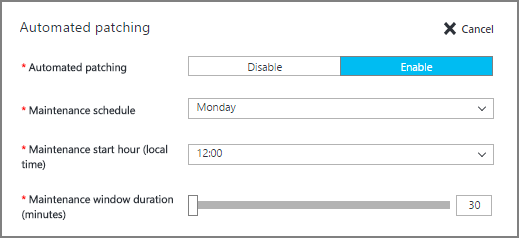

<properties
	pageTitle="对 SQL Server VM 进行自动修补 (Resource Manager) | Azure"
	description="介绍 Azure 中运行的、使用 Resource Manager 的 SQL Server 虚拟机的自动修补功能。"
	services="virtual-machines-windows"
	documentationCenter="na"
	authors="rothja"
	manager="jhubbard"
	editor=""
	tags="azure-resource-manager"/>
<tags
	ms.service="virtual-machines-windows"
	ms.date="05/18/2016"
	wacn.date="11/04/2016"/>

# Azure 虚拟机中 SQL Server 的自动修补 (Resource Manager)

> [AZURE.SELECTOR]
- [资源管理器](/documentation/articles/virtual-machines-windows-sql-automated-patching/)
- [经典](/documentation/articles/virtual-machines-windows-classic-sql-automated-patching/)

自动修补将为运行 SQL Server 的 Azure 虚拟机建立一个维护时段。只能在此维护时段内安装自动更新。对于 SQL Server，这可以确保在数据库的最佳可能时间发生系统更新和任何关联的重新启动。自动修补依赖 [SQL Server IaaS 代理扩展](/documentation/articles/virtual-machines-windows-sql-server-agent-extension/)。

[AZURE.INCLUDE [了解部署模型](../../includes/learn-about-deployment-models-rm-include.md)] 经典部署模型。若要查看本文的经典版本，请参阅[《Automated Patching for SQL Server in Azure Virtual Machines Classic》（在 Azure 虚拟机（经典）中对 SQL Server 进行自动修补）](/documentation/articles/virtual-machines-windows-classic-sql-automated-patching/)。

## 先决条件

若要使用自动修补，请考虑以下先决条件：

**操作系统**：

- Windows Server 2012
- Windows Server 2012 R2

**SQL Server 版本**：

- SQL Server 2012
- SQL Server 2014
- SQL Server 2016

**Azure PowerShell**：

- 如果你打算使用 PowerShell 配置自动修补，请[安装最新的 Azure PowerShell 命令](/documentation/articles/powershell-install-configure/)。

>[AZURE.NOTE] 自动修补依赖 SQL Server IaaS 代理扩展。当前的 SQL 虚拟机库映像默认添加此扩展。有关详细信息，请参阅 [SQL Server IaaS 代理扩展](/documentation/articles/virtual-machines-windows-sql-server-agent-extension/)。

## 设置

下表描述了可为自动修补配置的选项。实际配置步骤根据你使用的是 Azure 门户预览还是 Azure Windows PowerShell 命令而有所不同。

|设置|可能的值|说明|
|---|---|---|
|**自动修补**|启用/禁用（已禁用）|为 Azure 虚拟机启用或禁用自动修补。|
|**维护计划**|每天、星期一、星期二、星期三、星期四、星期五、星期六、星期日|为虚拟机下载和安装 Windows、SQL Server 和 Microsoft 更新的计划。|
|**维护开始时间**|0-24|更新虚拟机的本地开始时间。|
|**维护时段持续时间**|30-180|允许完成更新下载和安装的分钟数。|
|**修补程序类别**|重要说明|要下载并安装的更新类别。|

## 门户中的配置
可以在预配期间或针对现有的 VM，使用 Azure 门户预览来配置自动修补。

### 新的 VM
在 Resource Manager 部署模型中创建新的 SQL Server 虚拟机时，可以使用 Azure 门户预览配置自动修补。

在“SQL Server 设置”边栏选项卡中，选择“自动修补”。下面的 Azure 门户预览屏幕截图显示了“SQL 自动修补”边栏选项卡。

若要了解上下文，请参阅有关[在 Azure 中预配 SQL Server 虚拟机](/documentation/articles/virtual-machines-windows-portal-sql-server-provision/)的完整主题。

### 现有 VM
对于现有的 SQL Server 虚拟机，请选择你的 SQL Server 虚拟机。然后选择“设置”边栏选项卡的“SQL Server 配置”部分。

在“SQL Server 配置”边栏选项卡的“自动修补”部分，单击“编辑”按钮。

完成后，单击“SQL Server 配置”边栏选项卡底部的“确定”按钮，以保存你的更改。

当你首次启用自动修补时，Azure 将在后台配置 SQL Server IaaS 代理。在此期间，Azure 门户预览可能不会显示已配置自动修补。请等待几分钟，以便安装和配置代理。之后，Azure 门户预览将反映新设置。

>[AZURE.NOTE] 你也可以使用模板来配置自动修补。有关详细信息，请参阅[《Azure quickstart template for Automated Backup》（用于自动备份的 Azure 快速入门模板）](https://github.com/Azure/azure-quickstart-templates/tree/master/101-vm-sql-existing-autopatching-update)。

## 使用 PowerShell 进行配置

预配 SQL VM 后，使用 PowerShell 配置自动修补。

以下示例使用 PowerShell 在现有的 SQL Server VM 上配置自动修补。**AzureRM.Compute\\New-AzureVMSqlServerAutoPatchingConfig** 命令将为自动更新配置新的维护时段。

	$vmname = "vmname"
	$resourcegroupname = "resourcegroupname"
	$aps = AzureRM.Compute\New-AzureVMSqlServerAutoPatchingConfig -Enable -DayOfWeek "Thursday" -MaintenanceWindowStartingHour 11 -MaintenanceWindowDuration 120  -PatchCategory "Important"

    Set-AzureRmVMSqlServerExtension -AutoPatchingSettings $aps -VMName $vmname -ResourceGroupName $resourcegroupname

下表根据此示例描述了对目标 Azure VM 产生的实际效果：

|参数|效果|
|---|---|
|**DayOfWeek**|每个星期四安装修补程序。|
|**MaintenanceWindowStartingHour**|在上午 11:00 开始更新。|
|**MaintenanceWindowsDuration**|必须在 120 分钟内安装修补程序。根据开始时间，修补必须在下午 1:00 之前完成。|
|**PatchCategory**|此参数的唯一可能设置为“Important”。|

可能需要花费几分钟来安装和配置 SQL Server IaaS 代理。

若要禁用自动修补，请对 **AzureRM.Compute\\New-AzureVMSqlServerAutoPatchingConfig** 运行不带 **-Enable** 参数的同一个脚本。缺少 **-Enable** 参数将向该命令发出指示以禁用此功能。

## 后续步骤

有关其他可用自动化任务的信息，请参阅 [SQL Server IaaS 代理扩展](/documentation/articles/virtual-machines-windows-sql-server-agent-extension/)。

有关在 Azure VM 中运行 SQL Server 的详细信息，请参阅 [Azure 虚拟机中的 SQL Server 概述](/documentation/articles/virtual-machines-windows-sql-server-iaas-overview/)。

<!---HONumber=Mooncake_0808_2016-->