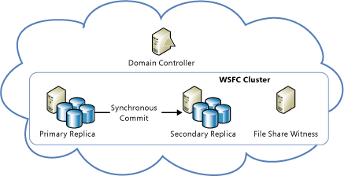
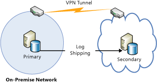

<properties
    pageTitle="SQL Server 的高可用性和灾难恢复 | Azure"
    description="介绍 Azure 虚拟机中运行的 SQL Server 的各种 HADR 策略。"
    services="virtual-machines-windows"
    documentationcenter="na"
    author="MikeRayMSFT"
    manager="jhubbard"
    editor=""
    tags="azure-service-management" />
<tags
    ms.assetid="53981f7e-8370-4979-b26a-93a5988d905f"
    ms.service="virtual-machines-windows"
    ms.devlang="na"
    ms.topic="article"
    ms.tgt_pltfrm="vm-windows-sql-server"
    ms.workload="iaas-sql-server"
    ms.date="03/17/2017"
    wacn.date="04/27/2017"
    ms.author="mikeray" />  

# Azure 虚拟机中 SQL Server 的高可用性和灾难恢复
## 概述
带有 SQL Server 的 Azure 虚拟机 (VM) 有助于降低高可用性和灾难恢复 (HADR) 数据库解决方案的成本。Azure 虚拟机支持大多数 SQL Server HADR 解决方案，这些解决方案既可以仅包含 Azure，也可是混合解决方案。在仅包含 Azure 的解决方案中，整个 HADR 系统都在 Azure 中运行。而在混合配置中，解决方案的一部分在 Azure 中运行，另一部分则在组织的本地运行。Azure 环境具有灵活性，允许你部分或完全迁移至 Azure，以满足 SQL Server 数据库系统对于预算和 HADR 的要求。

[AZURE.INCLUDE [了解部署模型](../../includes/learn-about-deployment-models-both-include.md)]

## 了解对 HADR 解决方案的需求
你有责任确保你的数据库系统拥有服务级别协议 (SLA) 要求的 HADR 功能。Azure 提供了高可用性机制，例如云服务的服务修复和虚拟机的故障恢复检测，但这一事实自身并不保证你能够达到所需 SLA 的要求。这些机制可以保护 VM 的高可用性，但不能保护在 VM 内部运行的 SQL Server 的高可用性。VM 联机并正常运行时，SQL Server 实例也可能会出故障。再者，即便是 Azure 提供的高可用性机制，也会在 VM 遇到从软件或硬件故障进行恢复、操作系统升级等事件时，为其留出一定的停机时间。

此外，使用异地复制功能在 Azure 中实现的异地冗余存储 (GRS)，可能不适合作为数据库的灾难恢复解决方案。因为异地复制功能会异步发送数据，在发生灾难的情况下，最近的更新可能丢失。[数据和日志文件各自在不同磁盘上的情况下不支持异地复制](#geo-replication-support)部分中提供了有关异地复制限制的详细信息。

## HADR 部署体系结构
Azure 支持的 SQL Server HADR 技术包括：

* [Always On 可用性组](https://technet.microsoft.com/zh-cn/library/hh510230.aspx)
* [Always On 故障转移群集实例](https://technet.microsoft.com/zh-cn/library/ms189134.aspx)
* [日志传送](https://technet.microsoft.com/zh-cn/library/ms187103.aspx)
* [使用 Azure Blob 存储服务执行 SQL Server 备份和还原](https://msdn.microsoft.com/zh-cn/library/jj919148.aspx)
* [数据库镜像](https://technet.microsoft.com/zh-cn/library/ms189852.aspx) - 在 SQL Server 2016 中已弃用

可将多种技术配合使用，以实现具有高可用性和灾难恢复功能的 SQL Server 解决方案。根据所用技术的不同，混合部署可能需要使用 VPN 隧道连接 Azure 虚拟网络。以下部分显示了某些部署体系结构的示例。

##  仅限 Azure：高可用性解决方案
可使用 AlwaysOn 功能（包括可用性组或故障转移群集实例），为 Azure 中的 SQL Server 数据库提供高可用性解决方案。

| 技术 | 示例体系结构 |
| --- | --- |
| **Always On 可用性组** |在同一区域的 Azure VM 中运行的可用性副本提供高可用性。你需要配置域控制器 VM，因为 Windows Server 故障转移群集 (WSFC) 需要 Active Directory 域。   有关详细信息，请参阅[在 Azure 中配置 AlwaysOn 可用性组（手册）](/documentation/articles/virtual-machines-windows-portal-sql-alwayson-availability-groups-manual/)。 |
| **Always On 故障转移群集实例** |需要共享存储的故障转移群集实例 (FCI)，可以通过 3 种不同方式创建。  1.在 Azure VM 中运行一个双节点 WSFC，附加的存储使用 [Windows Server 2016 存储空间直通 (S2D)](/documentation/articles/virtual-machines-windows-portal-sql-create-failover-cluster/) 来提供基于软件的虚拟 SAN。  2.在 Azure VM 中运行双节点 WSFC，该 VM 使用的存储受第三方群集解决方案支持。有关使用 SIOS DataKeeper 的具体示例，请参阅[使用 WSFC 和第三方软件 SIOS Datakeeper 的文件共享的高可用性](https://azure.microsoft.com/blog/high-availability-for-a-file-share-using-wsfc-ilb-and-3rd-party-software-sios-datakeeper/)。  3.在 Azure VM 中运行双节点 WSFC，该 VM 通过 ExpressRoute 使用远程 iSCSI 目标共享块存储。例如，NetApp Private Storage (NPS) 通过 Equinix 的 ExpressRoute 向 Azure VM 公开 iSCSI 目标。  有关第三方共享存储和数据复制解决方案，应联系供应商了解与在故障转移时访问数据相关的任何问题。  请注意，尚不支持在 [Azure 文件存储](/home/features/storage/files/)之上使用 FCI，因为此解决方案不使用高级存储。我们正在不懈努力，很快就能支持此功能。 |

## 仅限 Azure：灾难恢复解决方案
可将 Always On 可用性组、数据库镜像或备份和还原与存储 Blob 配合使用，为 Azure 中的 SQL Server 数据库提供灾难恢复解决方案。

| 技术 | 示例体系结构 |
| --- | --- |
| **Always On 可用性组** |可用性副本在 Azure VM 中跨多个数据中心运行以实现灾难恢复。这种跨区域解决方案可以防止站点完全中断。   在一个区域内，所有副本应该位于同一云服务和同一 VNet 中。由于每个区域将有单独的 VNet，因此这些解决方案需要 VNet 到 VNet 连接。有关详细信息，请参阅[在 Azure 经典管理门户中配置站点到站点 VPN](/documentation/articles/vpn-gateway-site-to-site-create/)。如需详细的说明，请参阅[在不同区域中的 Azure 虚拟机上创建 SQL Server AlwaysOn 可用性组](/documentation/articles/virtual-machines-windows-portal-sql-availability-group-dr/)。|
| **数据库镜像** |主体和镜像以及服务器在不同数据库中运行以实现灾难恢复。必须使用服务器证书进行部署，因为 Active Directory 域不能跨越多个数据中心。  |
| **使用 Azure Blob 存储服务进行备份和还原** |生产数据库直接备份到不同数据中心内的 Blob 存储以实现灾难恢复。  有关详细信息，请参阅 [Azure 虚拟机中 SQL Server 的备份和还原](/documentation/articles/virtual-machines-windows-sql-backup-recovery/)。 |

## 混合 IT：灾难恢复解决方案
可将 Always On 可用性组、数据库镜像、日志传送以及备份和还原与 Azure Blob 存储配合使用，在混合 IT 环境中为 SQL Server 数据库提供灾难恢复解决方案。

| 技术 | 示例体系结构 |
| --- | --- |
| **Always On 可用性组** |某些可用性副本运行在 Azure VM 中，另一些则在本地运行，以实现跨站点灾难恢复。生产站点可以是本地站点，也可以位于 Azure 数据中心内。  由于所有可用性副本必须在同一 WSFC 群集中，因此 WSFC 群集必须同时跨越这两个网络（多子网 WSFC 群集）。此配置需要在 Azure 与本地网络之间进行 VPN 连接。  为了成功地对数据库进行灾难恢复，还应在灾难恢复站点安装副本域控制器。  可以使用 SSMS 中的“添加副本向导”将 Azure 副本添加到现有的 Always On 可用性组。有关详细信息，请参阅教程“将 Always On 可用性组扩展到 Azure”。 |
| **数据库镜像** |一个伙伴在 Azure VM 中运行，另一个则在本地运行，以使用服务器证书进行跨站点灾难恢复。伙伴不必在同一 Active Directory 域中，并且不需要 VPN 连接。  另一种数据库镜像方案是一个伙伴在 Azure VM 中运行，另一个伙伴则在同一 Active Directory 域中本地运行，以实现跨站点灾难恢复。需要[在 Azure 虚拟网络与本地网络之间进行 VPN 连接](/documentation/articles/vpn-gateway-site-to-site-create/)。  为了成功地对数据库进行灾难恢复，还应在灾难恢复站点安装副本域控制器。 |
| **日志传送** |一个服务器在 Azure VM 中运行，另一个则在本地运行，以实现跨站点灾难恢复。日志传送依赖于 Windows 文件共享，因此需要在 Azure 虚拟网络与本地网络之间进行 VPN 连接。  为了成功地对数据库进行灾难恢复，还应在灾难恢复站点安装副本域控制器。 |
| **使用 Azure Blob 存储服务进行备份和还原** |本地生产数据库直接备份到 Azure Blob 存储以实现灾难恢复。  有关详细信息，请参阅 [Azure 虚拟机中 SQL Server 的备份和还原](/documentation/articles/virtual-machines-windows-sql-backup-recovery/)。 |

## 有关 Azure 中的 SQL Server HADR 的重要注意事项
Azure VM、存储和网络的运行特征与本地非虚拟化的 IT 基础结构不同。需要了解这些区别并设计可适应这些区别的解决方案，才能成功地在 Azure 中实现 HADR SQL Server 解决方案。

### 可用性集中的高可用性节点
使用 Azure 中的高可用性集，可以将高可用性节点放置在单独的容错域 (FD) 和更新域 (UD) 中。若要将 Azure VM 放入同一可用性集，必须将这些 VM 部署到同一云服务中。只有同一云服务中的节点可加入同一可用性集。有关详细信息，请参阅[管理虚拟机的可用性](/documentation/articles/virtual-machines-windows-manage-availability/)。

### WSFC 群集在 Azure 网络中的行为
Azure 中的 DHCP 服务不符合 RFC 标准，可能会导致创建某些 WSFC 群集配置失败，因为向群集网络名称分配重复的 IP 地址（例如 IP 地址与某个群集节点相同）。实现 Always On 可用性组时，这就会产生问题，因为它依赖于 WSFC 功能。

创建两节点群集并使其联机时，请考虑此应用场景：

1. 群集联机，然后 NODE1 为群集网络名称请求一个动态分配的 IP 地址。
2. DHCP 服务除了 NODE1 自身的 IP 地址以外不提供任何 IP 地址，因为 DHCP 服务可以识别请求是否来自 NODE1 自身。
3. Windows 检测到同时向 NODE1 和群集网络名称分配了一个重复的地址，并且默认群集组未能联机。
4. 默认群集组移至 NODE2，后者将 NODE1 的 IP 地址视为群集 IP 地址，并使默认群集组联机。
5. 当 NODE2 尝试与 NODE1 建立连接时，针对 NODE1 的数据包从不离开 NODE2，因为后者将 NODE1 的 IP 地址解析为其自身。NODE2 无法与 NODE1 建立连接，然后丢失仲裁并关闭群集。
6. 同时，NODE1 可向 NODE2 发送数据包，但 NODE2 无法回复。NODE1 丢失仲裁并关闭群集。

可通过将未使用的静态 IP 地址（如 169.254.1.1 等链接本地 IP 地址）分配给群集网络名称，让群集网络名称联机，从而避免这种情况发生。若要简化此过程，请参阅[在 Azure 中针对 Always On 可用性组配置 Windows 故障转移群集](http://social.technet.microsoft.com/wiki/contents/articles/14776.configuring-windows-failover-cluster-in-windows-azure-for-alwayson-availability-groups.aspx)。

有关详细信息，请参阅[在 Azure 中配置 AlwaysOn 可用性组（手动）](/documentation/articles/virtual-machines-windows-portal-sql-alwayson-availability-groups-manual/)。

### 可用性组侦听器支持
运行 Windows Server 2008 R2、Windows Server 2012、Windows Server 2012 R2 和 Windows Server 2016 的 Azure VM 支持可用性组侦听器。这种支持的实现，是借助于在 Azure VM 上启用的负载均衡终结点，它们都是可用性组节点。必须执行特殊的配置步骤，才能让侦听器对在 Azure 中运行和本地运行的客户端应用程序都有效。

设置侦听器时有两个主要选项：“外部(公共)”或“内部”。外部（公共）侦听器使用面向 Internet 的负载均衡器，并与可通过 Internet 访问的公共虚拟 IP (VIP) 相关联。内部侦听器使用内部负载均衡器，仅支持同一虚拟网络内的客户端。无论使用哪种负载均衡器类型，都必须启用“直接服务器返回”。

如果可用性组跨多个 Azure 子网（例如，跨 Azure 区域的部署），则客户端连接字符串必须包含“**MultisubnetFailover=True**”。这会导致尝试与不同子网中的副本建立并行连接。有关设置侦听器的说明，请参阅

* [在 Azure 中配置 Always On 可用性组的 ILB 侦听器](/documentation/articles/virtual-machines-windows-portal-sql-ps-alwayson-int-listener/)。
* [在 Azure 中配置 Always On 可用性组的外部侦听器](/documentation/articles/virtual-machines-windows-classic-ps-sql-ext-listener/)。

你仍可通过直接连接到服务实例，单独连接到每个可用性副本。此外，由于 Always On 可用性组与数据库镜像客户端向后兼容，因此只要可用性副本的配置与数据库镜像类似，即可像数据库镜像伙伴一样连接到这些副本：

* 一个主副本和一个辅助副本
* 将辅助副本配置为不可读（“可读辅助副本”选项设置为“否”）

下面是一个示例客户端连接字符串，它对应于使用 ADO.NET 或 SQL Server 本机客户端的类似于数据库镜像的配置：

    Data Source=ReplicaServer1;Failover Partner=ReplicaServer2;Initial Catalog=AvailabilityDatabase;

有关客户端连接的详细信息，请参阅：

* [将连接字符串关键字用于 SQL Server 本机客户端](https://msdn.microsoft.com/zh-cn/library/ms130822.aspx)
* [将客户端连接到数据库镜像会话 (SQL Server)](https://technet.microsoft.com/zh-cn/library/ms175484.aspx)
* [在混合 IT 环境中连接到可用性组侦听器](http://blogs.msdn.com/b/sqlalwayson/archive/2013/02/14/connecting-to-availability-group-listener-in-hybrid-it.aspx)
* [可用性组侦听器、客户端连接和应用程序故障转移 (SQL Server)](https://technet.microsoft.com/zh-cn/library/hh213417.aspx)
* [将数据库镜像连接字符串用于可用性组](https://technet.microsoft.com/zh-cn/library/hh213417.aspx)

### 混合 IT 环境中的网络延迟
在部署 HADR 解决方案时，应该假设本地网络和 Azure 之间有时可能会存在很高的网络延迟。将副本部署到 Azure 时，同步模式应使用异步提交而非同步提交。同时在本地和 Azure 中部署数据库镜像服务器时，请使用高性能模式，而非高安全模式。

###  异地复制支持
Azure 磁盘中的异地复制不支持将同一数据库的数据文件和日志文件各自存储在不同的磁盘上。GRS 独立并异步地复制对每个磁盘的更改。此机制可保证单个磁盘中异地复制副本上的写顺序，但不能保证多个磁盘的异地复制副本上的写顺序。如果将数据库配置为将其数据文件和日志文件各自存储在不同的磁盘上，则灾难后恢复的磁盘所含的数据文件副本可能比日志文件副本新，而这违反了 SQL Server 中的预写日志以及事务的 ACID 属性。如果无法对存储帐户禁用异地复制，则应将给定数据库的所有数据和日志文件都保留在同一磁盘上。如果因数据库较大而必须使用多个磁盘，则需要部署上面列出的某个灾难恢复解决方案以确保数据冗余。

## 后续步骤
如果需要创建使用 SQL Server 的 Azure 虚拟机，请参阅[在 Azure 上预配 SQL Server 虚拟机](/documentation/articles/virtual-machines-windows-portal-sql-server-provision/)。

若要使 Azure VM 上运行的 SQL Server 保持最佳性能，请参阅 [Azure 虚拟机中 SQL Server 的性能最佳实践](/documentation/articles/virtual-machines-windows-sql-performance/)中的指导。

有关其他与在 Azure VM 中运行 SQL Server 相关的主题，请参阅 [Azure 虚拟机上的 SQL Server](/documentation/articles/virtual-machines-windows-sql-server-iaas-overview/)。

### 其他资源
* [在 Azure 中安装新的 Active Directory 林](/documentation/articles/active-directory-new-forest-virtual-machine/)
* [在 Azure VM 中创建用于 Always On 可用性组的 WSFC 群集](http://gallery.technet.microsoft.com/scriptcenter/Create-WSFC-Cluster-for-7c207d3a)

<!---HONumber=Mooncake_0313_2017-->
<!--Update_Description: wording update-->