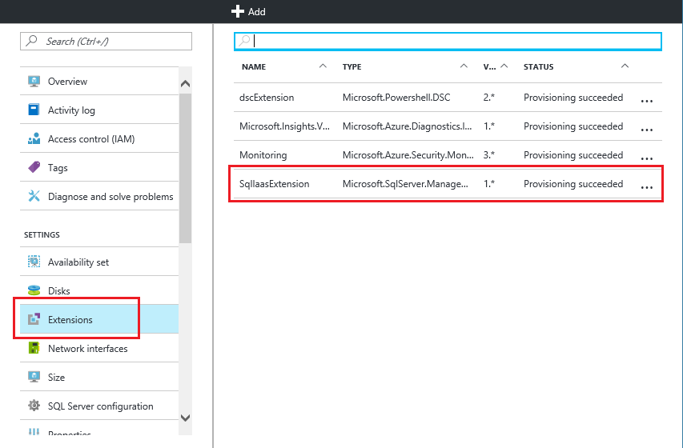

<properties
    pageTitle="适用于 SQL Server VM 的 SQL Server 代理扩展 (Resource Manager) | Azure"
    description="本主题介绍如何管理可以自动执行特定 SQL Server 管理任务的 SQL Server 代理扩展。这些任务包括自动备份、自动修补和 Azure 密钥保管库集成。本主题使用 Resource Manager 部署模型。"
    services="virtual-machines-windows"
    documentationcenter=""
    author="rothja"
    manager="jhubbard"
    editor=""
    tags="azure-resource-manager" />
<tags
    ms.assetid="effe4e2f-35b5-490a-b5ef-b06746083da4"
    ms.service="virtual-machines-windows"
    ms.devlang="na"
    ms.topic="article"
    ms.tgt_pltfrm="vm-windows-sql-server"
    ms.workload="iaas-sql-server"
    ms.date="01/09/2017"
    wacn.date="02/24/2017"
    ms.author="jroth" />  

# 适用于 SQL Server VM 的 SQL Server 代理扩展 \(Resource Manager\)
> [AZURE.SELECTOR]
- [资源管理器](/documentation/articles/virtual-machines-windows-sql-server-agent-extension/)
- [经典](/documentation/articles/virtual-machines-windows-classic-sql-server-agent-extension/)

Azure 虚拟机上运行的 SQL Server IaaS 代理扩展 \(SQLIaaSExtension\) 可以自动执行管理任务。本主题概述了该扩展支持的服务以及有关安装、状态及删除的说明。

[AZURE.INCLUDE [了解部署模型](../../includes/learn-about-deployment-models-rm-include.md)]

若要查看这篇文章的经典版，请参阅[适用于 SQL Server 经典 VM 的 SQL Server 代理扩展](/documentation/articles/virtual-machines-windows-classic-sql-server-agent-extension/)。

## 支持的服务
SQL Server IaaS 代理扩展支持以下管理任务：

| 管理功能 | 说明 |
| --- | --- |
| **SQL 自动备份** |对 VM 中的 SQL Server 默认实例自动执行所有数据库的备份计划。有关详细信息，请参阅 [Azure 虚拟机中 SQL Server 的自动备份 \(Resource Manager\)](/documentation/articles/virtual-machines-windows-sql-automated-backup/)。 |
| **SQL 自动修补** |配置维护时段，在此期间可能更新你的 VM，因此可以避免在工作负荷的高峰时间进行更新。有关详细信息，请参阅 [Azure 虚拟机中 SQL Server 的自动修补 \(Resource Manager\)](/documentation/articles/virtual-machines-windows-sql-automated-patching/)。 |
| **Azure 密钥保管库集成** |可让你在 SQL Server VM 上自动安装和配置 Azure 密匙保管库。有关详细信息，请参阅 [为 Azure VM 上的 SQL Server 配置 Azure Key Vault 集成 \(Resource Manager\)](/documentation/articles/virtual-machines-windows-ps-sql-keyvault/)。 |

## 先决条件
在 VM 上使用 SQL Server IaaS 代理扩展的要求：

**操作系统**：

* Windows Server 2012
* Windows Server 2012 R2

**SQL Server 版本**：

* SQL Server 2012
* SQL Server 2014
* SQL Server 2016

**Azure PowerShell**：

* [下载和配置最新 Azure PowerShell 命令](https://docs.microsoft.com/powershell/azureps-cmdlets-docs)

## 安装
当你预配某个 SQL Server 虚拟机库映像时，系统会自动安装 SQL Server IaaS 代理扩展。

如果你创建仅有 OS 的 Windows Server 虚拟机，可以使用 **Set-AzureVMSqlServerExtension** PowerShell cmdlet 手动安装扩展。例如，以下命令将在仅限操作系统的 Windows Server VM 上安装扩展，并将其命名为“SQLIaaSExtension”。

    Set-AzureRmVMSqlServerExtension -ResourceGroupName "resourcegroupname" -VMName "vmname" -Name "SQLIaasExtension" -Version "1.2" -Location "China East"

如果更新到最新版本的 SQL IaaS 代理扩展，则必须在更新该扩展后重启虚拟机。

> [AZURE.NOTE]
如果在 Windows Server VM 上手动安装 SQL Server IaaS 代理扩展，必须通过 PowerShell 命令使用和管理该扩展的功能。门户界面仅适用于 SQL Server 库映像。
> 
> 

## 状态
验证是否已安装扩展的方法之一是在 Azure 门户中查看代理状态。在虚拟机边栏选项卡中选择“所有设置”，然后单击“扩展”。随后应会列出“SQLIaaSExtension”扩展。

  

还可使用 **Get-AzureVMSqlServerExtension** Azure Powershell cmdlet。

    Get-AzureRmVMSqlServerExtension -VMName "vmname" -ResourceGroupName "resourcegroupname"

上一个命令确认已安装代理并提供常规状态信息。还可使用以下命令获取有关自动备份和修补的特定状态信息。

    $sqlext = Get-AzureRmVMSqlServerExtension -VMName "vmname" -ResourceGroupName "resourcegroupname"
    $sqlext.AutoPatchingSettings
    $sqlext.AutoBackupSettings

## 删除
在 Azure 门户中，可以卸载扩展，方法是访问虚拟机属性的“扩展”边栏选项卡，单击其中的省略号，然后单击“删除”。

  

也可以使用 **Remove-AzureRmVMSqlServerExtension** Powershell cmdlet。

    Remove-AzureRmVMSqlServerExtension -ResourceGroupName "resourcegroupname" -VMName "vmname" -Name "SQLIaasExtension"

## 后续步骤
开始使用扩展支持的服务之一。有关详细信息，请参阅本文的[支持的服务](#supported-services)部分中提到的主题。

有关在 Azure 虚拟机中运行 SQL Server 的详细信息，请参阅 [Azure 虚拟机中的 SQL Server 概述](/documentation/articles/virtual-machines-windows-sql-server-iaas-overview/)。

<!---HONumber=Mooncake_0220_2017-->
<!--Update_Description: wording update-->