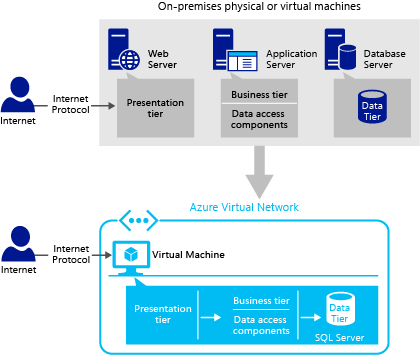
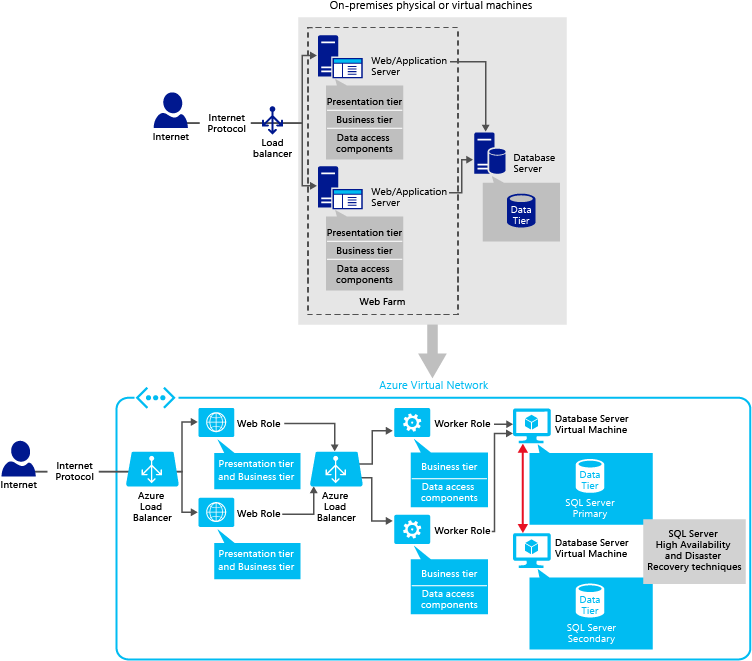
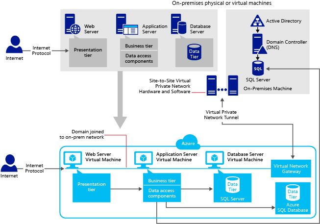

<properties
	pageTitle="VM 上的 SQL Server 应用程序模式 | Azure"
	description="本文介绍 Azure VM 上的 SQL Server 的应用程序模式。这些模式可帮助解决方案架构师和开发人员奠定良好的应用程序体系结构和设计基础。"
	services="virtual-machines-windows"
	documentationCenter="na"
	authors="luisherring"
	manager="jhubbard"
	editor=""
	tags="azure-service-management,azure-resource-manager" />  

<tags
	ms.service="virtual-machines-windows"
	ms.devlang="na"
	ms.topic="article"
	ms.tgt_pltfrm="vm-windows-sql-server"
	ms.workload="infrastructure-services"
	ms.date="08/19/2016"
	wacn.date="10/24/2016"
	ms.author="lvargas" />  

# Azure 虚拟机中的 SQL Server 的应用程序模式和开发策略

[AZURE.INCLUDE [了解部署模型](../../includes/learn-about-deployment-models-both-include.md)]

## 摘要：
确定要将哪些应用程序模式用于 Azure 环境中基于 SQL Server 的应用程序是一个重要设计决策，要求用户深入了解 SQL Server 和每个 Azure 基础结构组件的协同工作方式。使用 Azure 基础结构服务中的 SQL Server，你可以轻松地将基于 Windows Server 构建的现有 SQL Server 应用程序迁移到 Azure 中的虚拟机，并且进行维护和监控。

本文旨在为解决方案架构师和开发人员构建良好的应用程序体系结构和进行设计奠定基础，在将现有应用程序迁移到 Azure 和开发 Azure 中的新应用程序时，他们可以遵循其中的模式。

对于每种应用程序模式，你都将找到本地方案及其相应的云解决方案，还可以找到相关的技术建议。此外，本文还讨论了 Azure 特定开发策略，方便用户正确设计应用程序。由于各种应用程序模式千变万化，建议架构师和开发人员为其应用程序和用户选择最合适的模式。

**技术供稿人：**Luis Carlos Vargas Herring、Madhan Arumugam Ramakrishnan

**技术审校：**Corey Sanders、Drew McDaniel、Narayan Annamalai、Nir Mashkowski、Sanjay Mishra、Silvano Coriani、Stefan Schackow、Tim Hickey、Tim Wieman、Xin Jin

## 介绍

你可以通过将不同应用程序层级的组件放入不同计算机以及不同的组件中，开发多种类型的 n 层应用程序。例如，你可将客户端应用程序和业务规则组件放置在一台计算机中，而将前端 Web 层和数据访问层组件放置在另一台计算机中，再将后端数据库层放置在另一台计算机中。这种类型的结构有助于将每个层相互隔离。如果更改了数据来源，则无需更改客户端或 Web 应用程序，而只需更改数据访问层组件。

典型的 *n 层*应用程序包括表示层、业务层和数据层：

| 层 | 说明 |
|-------------------|---------------------------------------------------------------------------------------------------------------------------------------------------------------------------------|
| **呈现** | *呈现层*（Web 层、前端层）是用户与应用程序进行交互的层级。 |
| **业务电话** | *业务层*（中间层）是呈现层和数据层用来相互通信的层级，包括了系统的核心功能。 |
| **数据** | *数据层*基本上是存储应用程序数据的服务器（例如运行 SQL Server 的服务器）。 |

应用程序层级描述应用程序中的功能和组件的逻辑分组；而层则描述独立物理服务器、计算机、网络或远程地点的功能和组件的物理分布。应用程序的多个层级可能位于同一台物理计算机上（同一层），也可能分布在多台单独计算机上（n 层），每个层级中的组件通过明确定义的接口，与其他层级中的组件进行通信。你可将“层”这个词视为物理分布模式，例如两层、三层和 n 层。**2 层应用程序模式**包含两个应用程序层：应用程序服务器和数据库服务器。直接通信发生在应用程序服务器和数据库服务器之间。应用程序服务器包含 Web 层和业务层组件。在 **3 层应用程序模式**中，有三个应用程序层：Web 服务器、应用程序服务器（包含业务逻辑层和/或业务层数据访问组件）、数据库服务器。Web 服务器和数据库服务器之间的通信在应用程序服务器上进行。有关应用程序层级和层的详细信息，请参阅 [Microsoft 应用程序体系结构指南](https://msdn.microsoft.com/zh-cn/library/ff650706.aspx)。

开始阅读本文之前，你应该掌握有关 SQL Server 和 Azure 的基本概念知识。有关信息，请参阅 [SQL Server 联机丛书](https://msdn.microsoft.com/zh-cn/library/bb545450.aspx)、[Azure 虚拟机中的 SQL Server](/documentation/articles/virtual-machines-windows-sql-server-iaas-overview/) 和 [Azure.cn](https://www.azure.cn/)。

本文介绍了几种应用程序模式，它们可能适合你的简单应用程序，也可能适合非常复杂的企业应用程序。在详细介绍每种模式之前，我们建议你熟悉 Azure 中的可用数据存储服务，例如 [Azure 存储空间](/documentation/articles/storage-introduction/)、[Azure SQL 数据库](/documentation/articles/sql-database-technical-overview/)和 [Azure 虚拟机中的 SQL Server](/documentation/articles/virtual-machines-windows-sql-server-iaas-overview/)。若要为你的应用程序做出最好的设计决策，必须明确了解何时使用何种数据存储服务。

### 在以下情况下，应选择 Azure 虚拟机中的 SQL Server：

- 你需要在 SQL Server 和 Winodws 上进行控制。例如，你想要控制 SQL Server 版本、特殊修补程序、性能配置等。

- 你需要与本地 SQL Server 完全兼容，并希望将现有应用程序按现状迁移至 Azure。

- 你希望充分利用 Azure 环境的功能，但 Azure SQL 数据库不支持你的应用程序需要的全部功能。这可能包括以下方面：

	- **数据库大小**：在更新这篇文章时，SQL 数据库支持最多包含 1 TB 数据的数据库。如果应用程序需要 1 TB 以上的数据，但用户不希望实现自定义分片解决方案，则建议在 Azure 虚拟机中使用 SQL Server。有关最新信息，请参阅[向外缩放 Azure SQL 数据库](/documentation/articles/sql-database-elastic-scale-introduction/)和 [Azure SQL 数据库服务层和性能级别](/documentation/articles/sql-database-service-tiers/)。
	- **HIPAA 合规性**：医疗保健客户和独立软件供应商 (ISV) 可能选择 [Azure 虚拟机中的 SQL Server](/documentation/articles/virtual-machines-windows-sql-server-iaas-overview/) 而不选择 [Azure SQL 数据库](/documentation/articles/sql-database-technical-overview/)，原因是 Azure 虚拟机中的 SQL Server 已纳入 HIPAA 商业伙伴协议 (BAA)。有关合规性的信息，请参阅 [Azure 信任中心：合规性](https://www.trustcenter.cn/zh-cn/compliance/default.html)。
	- **实例级功能**：目前，SQL 数据库不支持数据库外部的功能（如链接服务器、代理作业，FileStream、Service Broker 等）。有关详细信息，请参阅 [Azure SQL 数据库指导原则和限制](/documentation/articles/sql-database-general-limitations/)。

## 1 层（简单）：单虚拟机

在这种应用程序模式中，你将 SQL Server 应用程序和数据库部署到 Azure 中的独立虚拟机上。同一个虚拟机还包含你的客户端/Web 应用程序、业务组件、数据访问层级和数据库服务器。呈现、业务和数据访问代码在逻辑上是分离的，但从物理位置来看是位于单台服务器计算机上。大多数客户首先使用这种应用程序模式，然后通过向系统添加更多 Web 角色或虚拟机向外缩放。

此应用程序模式适用于以下情况：

- 用户希望执行向 Azure 平台的简单迁移，以评估平台是否能够满足应用程序的要求。

- 你希望将所有应用程序层都承载在同一 Azure 数据中心的同一虚拟机上，以减少层之间的延迟。

- 你希望快速预配短期的开发和测试环境。

- 你希望执行不同工作负荷级别的压力测试，但同时又不希望始终拥有和维护很多物理计算机。

下图演示了一个简单的本地方案，以及如何将它的云解决方案部署在 Azure 中的单个虚拟机上。

  

将业务层级（业务逻辑和数据访问组件）部署在呈现层级所在的同一物理层上可以最大程度地提高应用程序性能，除非你由于可扩展性或安全问题必须使用单独的层。

由于这是客户在开始时经常使用的一种模式，你可能会发现以下有关将数据迁移到 SQL Server VM 的文章非常有用：[将数据库迁移到 Azure VM 上的 SQL Server](/documentation/articles/virtual-machines-windows-migrate-sql/)。

## 3 层（简单）：多个虚拟机

在这种应用程序模式中，你在 Azure 中部署 3 层应用程序，方法是将每个应用程序层放置在不同的虚拟机中。这样可为简单的向上缩放和向外缩放方案提供灵活的环境。一个虚拟机包含你的客户端/Web 应用程序，另一个虚拟机托管你的业务组件，另一个虚拟机则托管数据库服务器。

此应用程序模式适用于以下情况：

- 你希望执行复杂数据库应用程序向 Azure 虚拟机的迁移。

- 你希望在不同区域托管不同应用程序层。例如，你可能会将一些共享数据库部署到不同区域，用于报告目的。

- 你希望将企业应用程序从本地虚拟化平台迁移到 Azure 虚拟机。有关企业应用程序的详细讨论，请参阅[什么是企业应用程序](https://msdn.microsoft.com/zh-cn/library/aa267045.aspx)。

- 你希望快速预配短期的开发和测试环境。

- 你希望执行不同工作负荷级别的压力测试，但同时又不希望始终拥有和维护很多物理计算机。

下图演示如何将简单的 3 层应用程序置于 Azure 中，方法是将每个应用程序层置于不同的虚拟机中。

  

在这种应用程序模式中，每层只有一个虚拟机 (VM)。如果你使用 Azure 中的多个 VM，我们建议你设置虚拟网络。[Azure 虚拟网络](/documentation/articles/virtual-networks-overview/)创建受信任安全边界，并允许 VM 通过专用 IP 地址相互通信。此外，请始终确保所有 Internet 连接仅进入呈现层。按此应用程序模式操作时，可通过管理网络安全组规则来控制访问。有关详细信息，请参阅 [Allow external access to your VM using the Azure portal](/documentation/articles/virtual-machines-windows-nsg-quickstart-portal/)（允许通过 Azure 门户对 VM 进行外部访问）。

图中的 Internet 协议可以是 TCP、UDP、HTTP 或 HTTPS。

>[AZURE.NOTE] 在 Azure 中设置虚拟网络是免费的。但是，你要为连接到本地的 VPN 网关付费。此费用的依据是预配和提供连接的时间长度。

## 2 层和 3 层模式，呈现层向外缩放

在这种应用程序模式中，你将 2 层或 3 层数据库应用程序部署到 Azure 虚拟机，并将每个应用程序层放置在不同的虚拟机中。此外，由于传入客户端请求数量增加，你还将呈现层向外缩放。

此应用程序模式适用于以下情况：

- 你希望将企业应用程序从本地虚拟化平台迁移到 Azure 虚拟机。

- 由于传入客户端请求数量增加，你还将呈现层向外缩放。

- 你希望快速预配短期的开发和测试环境。

- 你希望执行不同工作负荷级别的压力测试，但同时又不希望始终拥有和维护很多物理计算机。

- 你希望拥有可以根据需要向上缩放和向下缩放的基础结构环境。

下图演示由于传入客户端请求数量增加，你如何才能通过将呈现层向外缩放，将应用程序层放置在 Azure 中的多个虚拟机中。正如图中所示，Azure 负载平衡器负责将流量分布到多个虚拟机，并确定要连接到哪个 Web 服务器。负载平衡器之后有多个 Web 服务器实例，可以确保呈现层的高可用性。

  

### 在一层中包含多个 VM 的 2 层、3 层或 n 层应用程序模式的最佳实践

建议将属于同一层的虚拟机放置在同一云服务和同一可用性集中。例如，将一组 Web 服务器放置在 **CloudService1** 和 **AvailabilitySet1** 中，而将一组数据库服务器放置在 **CloudService2** 和 **AvailabilitySet2** 中。利用 Azure 中的可用性集，你可将高可用性节点放置在单独的容错域和升级域中。

若要充分利用一层的多个 VM 实例，必须配置应用程序层之间的 Azure 负载平衡器。若要配置每个层中的负载均衡器，请在每个层的 VM 上单独创建负载均衡终结点。对于特定层，请首先在同一云服务中创建 VM。这样可以确保它们具有同一公共虚拟 IP 地址。接下来，在该层的一个虚拟机上创建终结点。然后，将同一终结点分配给该层上的其他虚拟机，以便进行负载平衡。通过创建负载平衡集，你可将流量分布到多个虚拟机，并让负载平衡器能够在后端 VM 节点出现故障时确定连接哪一个节点。例如，负载平衡器之后有多个 Web 服务器实例，可以确保呈现层的高可用性。

最佳做法是始终确保所有 Internet 连接首先进入呈现层。呈现层访问业务层，业务层再访问数据层。如需详细了解如何允许对呈现层的访问，请参阅 [Allow external access to your VM using the Azure portal](/documentation/articles/virtual-machines-windows-nsg-quickstart-portal/)（允许通过 Azure 门户对 VM 进行外部访问）。

请注意，Azure 中的负载平衡器的工作方式类似于本地环境中的负载平衡器。有关更多信息，请参阅 [Azure 基础结构服务的负载平衡](/documentation/articles/virtual-machines-windows-load-balance/)。

此外，我们建议你使用 Azure 虚拟网络为虚拟机设置专用网络。这让虚拟机能够通过专用 IP 地址相互通信。有关详细信息，请参阅 [Azure 虚拟网络](/documentation/articles/virtual-networks-overview/)。

## 2 层和 3 层模式，业务层向外缩放

在这种应用程序模式中，你将 2 层或 3 层数据库应用程序部署到 Azure 虚拟机，并将每个应用程序层放置在不同的虚拟机中。此外，考虑到应用程序的复杂性，你可能希望将应用程序服务器组件分布到多个虚拟机。

此应用程序模式适用于以下情况：

- 你希望将企业应用程序从本地虚拟化平台迁移到 Azure 虚拟机。

- 考虑到应用程序的复杂性，你希望将应用程序服务器组件分布到多个虚拟机。

- 你希望将承受很重业务逻辑负荷的本地 LOB（业务线）应用程序迁移到 Azure 虚拟机。LOB 应用程序是对企业运营很重要的一组关键计算机应用程序，例如会计、人力资源 (HR)、工资单、供应链管理和资源计划应用程序。

- 你希望快速预配短期的开发和测试环境。

- 你希望执行不同工作负荷级别的压力测试，但同时又不希望始终拥有和维护很多物理计算机。

- 你希望拥有可以根据需要向上缩放和向下缩放的基础结构环境。

下图演示本地方案及其云解决方案。在此方案中，你将应用程序层放置在 Azure 的多个虚拟机中，方法是将包含业务逻辑层和数据访问组件的业务层向外缩放。正如图中所示，Azure 负载平衡器负责将流量分布到多个虚拟机，并确定要连接到哪个 Web 服务器。负载平衡器之后有多个应用程序服务器实例，可以确保业务层的高可用性。

  

## 2 层和 3 层模式，呈现层和业务层向外缩放，提供 HADR

在此应用程序模式中，你将 2 层或 3 层数据库应用程序部署到 Azure 虚拟机，方法是将呈现层（Web 服务器）和业务层（应用程序服务器）组件分布到多个虚拟机。此外，你还在 Azure 虚拟机中为数据库实现高可用性和灾难恢复解决方案。

此应用程序模式适用于以下情况：

- 你希望将企业应用程序从本地虚拟化平台迁移到 Azure，实现 SQL Server 高可用性和灾难恢复功能。

- 考虑到传入客户端请求数量增加以及应用程序的复杂性，你希望将呈现层和业务层向外缩放。

- 你希望快速预配短期的开发和测试环境。

- 你希望执行不同工作负荷级别的压力测试，但同时又不希望始终拥有和维护很多物理计算机。

- 你希望拥有可以根据需要向上缩放和向下缩放的基础结构环境。

下图演示本地方案及其云解决方案。在此方案中，你将 Azure 的多个虚拟机中的呈现层和业务层组件向外缩放。此外，你还要为 Azure 中的 SQL Server 数据库实现高可用性和灾难恢复 (HADR) 技术。

在不同 VM 上运行一个应用程序的多个副本，确保你在这些虚拟机上实现请求的负载平衡。使用多个虚拟机时，需要确保所有 VM 都是可访问的，并且同一时间点都在运行。如果配置了负载均衡，Azure Load Balancer 会跟踪 VM 的运行状况，并将传入调用正确定向到正常运行的 VM 节点。有关如何设置虚拟机负载平衡的信息，请参阅 [Azure 基础结构服务的负载平衡](/documentation/articles/virtual-machines-windows-load-balance/)。负载平衡器之后有多个 Web 服务器和应用程序服务器实例，可以确保呈现层和业务层的高可用性。

  

### 需要 SQL HADR 的应用程序模式的最佳实践

当你在 Azure 虚拟机中设置 SQL Server 高可用性和灾难恢复解决方案时，必须使用 [Azure 虚拟网络](/documentation/articles/virtual-networks-overview/)为你的虚拟机设置一个虚拟网络。即便在服务停机之后，虚拟网络内的虚拟机也将具有静态专用 IP 地址，因此你可以避免 DNS 名称解析所需的更新时间。此外，虚拟网络允许你将本地网络扩展到 Azure，并创建受信任安全边界。例如，如果你的应用程序具有企业域限制（例如 Windows 身份验证、Active Directory），则必须设置 [Azure 虚拟网络](/documentation/articles/virtual-networks-overview/)。

在 Azure 上运行生产代码的大多数客户都在 Azure 中保存主副本和辅助副本。

有关高可用性和灾难恢复技术的综合信息和教程，请参阅 [Azure 虚拟机中 SQL Server 的高可用性和灾难恢复](/documentation/articles/virtual-machines-windows-sql-high-availability-dr/)。

## 使用 Azure VM 和云服务的 2 层和 3 层模式

在此应用程序模式中，你使用 [Azure 云服务](/documentation/articles/cloud-services-choose-me/#tellmecs)（Web 角色和辅助角色 - 平台即服务 (PaaS)）和 [Azure 虚拟机](/documentation/articles/virtual-machines-windows-about/)（基础结构即服务 (IaaS)），将 2 层或 3 层应用程序部署到 Azure。将 [Azure 云服务](/documentation/services/cloud-services/)用于呈现层/业务层，而将 [Azure 虚拟机](/documentation/articles/virtual-machines-windows-about/)中的 SQL Server 用于数据层，这对于在 Azure 上运行的大多数应用程序都是有利的。原因是，在云服务上运行一个计算实例可以简化管理、部署、监控和向外缩放操作。

通过云服务，Azure 可为你维护基础结构、执行日常维护、为操作系统安装修补程序，并尝试从服务和硬件故障中恢复。当应用程序需要向外缩放时，可以通过增加或减少应用程序使用的实例或虚拟机的数量，使用云服务项目的自动和手动向外缩放选项。此外，你可以使用本地 Visual Studio，将应用程序部署到 Azure 中的云服务项目。

总之，如果不希望自行承担呈现层/业务层的大量管理任务，而且应用程序也不需要软件或操作系统的任何复杂配置，则请使用 Azure 云服务。如果 Azure SQL 数据库无法支持你需要的全部功能，请将 Azure 虚拟机中的 SQL Server 用于数据层。在 Azure 云服务上运行应用程序，并将数据存储在 Azure 虚拟机中，可以综合两种服务的优点。如需详细的比较，请参阅此主题中有关 [Comparing development strategies in Azure](#comparing-web-development-strategies-in-azure)（比较 Azure 中的开发策略）的部分。

在此应用程序模式中，呈现层包括 Web 角色，它是在 Azure 执行环境中运行的云服务组件，为 IIS 和 ASP.NET 支持的 Web 应用程序编程进行了自定义。业务或后端层包括辅助角色，它是在 Azure 执行环境中运行的云服务组件，对通用开发非常有用，可为 Web 角色执行后台处理。数据库层驻留在 Azure 中的 SQL Server 虚拟机中。呈现层和数据库层之间的通信直接进行，或者通过业务层（也就是辅助角色组件）进行。

此应用程序模式适用于以下情况：

- 你希望将企业应用程序从本地虚拟化平台迁移到 Azure，实现 SQL Server 高可用性和灾难恢复功能。

- 你希望拥有可以根据需要向上缩放和向下缩放的基础结构环境。

- Azure SQL 数据库无法支持应用程序或数据库需要的所有功能。

- 你希望执行不同工作负荷级别的压力测试，但同时又不希望始终拥有和维护很多物理计算机。

下图演示本地方案及其云解决方案。在此方案中，你将呈现层放置在 Web 角色中，将业务层放置在辅助角色中，而将数据层放置在 Azure 的虚拟机中。在不同 Web 角色中运行呈现层的多个副本，可以确保实现其请求的负载平衡。将 Azure 云服务和 Azure 虚拟机结合使用时，建议还设置 [Azure 虚拟网络](/documentation/articles/virtual-networks-overview/)。使用 [Azure 虚拟网络](/documentation/articles/virtual-networks-overview/)，你可以在云中的同一云服务内拥有稳定持久的专用 IP 地址。在你为虚拟机和云服务定义虚拟网络后，它们就可以通过专用 IP 地址开始相互通信。此外，使虚拟机与 Azure Web/辅助角色处于同一 [Azure 虚拟网络](/documentation/articles/virtual-networks-overview/)中可缩短连接延迟并使连接更安全。有关详细信息，请参阅[什么是云服务](/documentation/articles/cloud-services-choose-me/)。

正如图中所示，Azure 负载平衡器将流量分布到多个虚拟机，并确定要连接到哪个 Web 服务器或应用程序服务器。负载平衡器之后有多个 Web 服务器和应用程序服务器实例，可以确保呈现层和业务层的高可用性。

  

实施此应用程序模式的另一种方法是使用包含呈现层和业务层组件的整合 Web 角色，如下图所示。此应用程序模式适用于需要状态设计的应用程序。由于 Azure 在 Web 角色和辅助角色上提供无状态计算节点，我们建议你实现一个使用以下技术之一存储会话状态的逻辑：[Azure 缓存](/documentation/services/redis-cache/)、[Azure 表存储](/documentation/articles/storage-dotnet-how-to-use-tables/)或 [Azure SQL 数据库](/documentation/articles/sql-database-technical-overview/)。

  

## 混合 Azure VM、Azure SQL 数据库和 Azure 应用服务（Web 应用）的模式

此应用程序模式的主要目标是演示如何在解决方案中将 Azure 基础结构即服务 (IaaS) 组件和 Azure 平台即服务 (PaaS) 组件结合使用。此模式的重点是用于关系数据存储的 Azure SQL 数据库。它不将 SQL Server 包括在 Azure 虚拟机中，而将其作为 Azure 基础结构即服务。

在此应用程序模式中，你将数据库应用程序部署到 Azure，方法是将呈现层和业务层放置到同一虚拟机中，并访问 Azure SQL 数据库(SQL 数据库) 服务器中的数据库。你可以使用基于 IIS 的传统 Web 解决方案来实现呈现层。或者，你可以使用 [Azure Web Apps](/documentation/services/web-sites/)，实现组合形式的呈现层和业务层。

此应用程序模式适用于以下情况：

- 你现在已经拥有了在 Azure 中配置的 SQL 数据库服务器，因此希望快速测试你的应用程序。

- 你希望测试 Azure 环境的功能。

- 你希望快速预配短期的开发和测试环境。

- 你的业务逻辑和数据访问组件可以自包含在 Web 应用程序中。

下图演示本地方案及其云解决方案。在此方案中，你将应用程序层放置在 Azure 的单个虚拟机中，并访问 Azure SQL 数据库中的数据。

  

如果你选择使用 Azure Web Apps 来实现组合形式的 Web 和应用程序层，我们建议你保留中间层或应用程序层，作为 Web 应用程序上下文中的动态链接库 (DLL)。

此外，请查看本文末尾的[比较 Azure 中的 Web 开发策略](#comparing-web-development-strategies-in-azure)中提供的建议，以详细了解编程技巧。

## N 层混合应用程序模式

在 n 层混合应用程序模式中，你在分布在本地和 Azure 上的多个层中实现应用程序。因此，你创建的是一个灵活和可重用的混合系统，你可以修改该系统或添加特定层，而不对其他层进行更改。为将企业网络扩展到云，你使用 [Azure 虚拟网络](/documentation/articles/virtual-networks-overview/)服务。

此混合应用程序模式适用于以下情况：

- 你希望生成部分在云中运行、部分在本地运行的应用程序。

- 你希望将现有本地应用程序的部分或全部元素迁移到云。

- 你希望将企业应用程序从本地虚拟化平台迁移到 Azure。

- 你希望拥有可以根据需要向上缩放和向下缩放的基础结构环境。

- 你希望快速预配短期的开发和测试环境。

- 你需要一种经济高效的方式来执行企业数据库应用程序的备份。

下图演示横跨本地和 Azure 的 n 层混合应用程序模式。如图中所示，本地基础结构包括 [Active Directory 域服务](https://technet.microsoft.com/zh-cn/library/hh831484.aspx)域控制器，用于支持用户身份验证和授权。请注意，下图演示了一种方案，数据层的某些部分位于本地数据中心，而其他一些部分则位于 Azure 中。根据应用程序的需求，可以实现多种其他混合方案。例如，你可将呈现层和业务层保留在本地环境中，而将数据层保留在 Azure 中。

  

在 Azure 中，你可以使用 Active Directory 作为组织的独立云目录，也可以将现有本地 Active Directory 与 [Azure Active Directory](/documentation/services/identity/) 相集成。正如图中所示，业务层组件可以访问多个数据源，例如通过专用内部 IP 地址访问 [Azure 中的 SQL Server](/documentation/articles/virtual-machines-windows-sql-server-iaas-overview/)、通过 [Azure 虚拟网络](/documentation/articles/virtual-networks-overview/)访问本地 SQL Server、使用 .NET Framework 数据提供程序技术访问 [SQL 数据库](/documentation/articles/sql-database-technical-overview/)。在此图中，Azure SQL 数据库是一种可选的数据存储服务。

在 n 层混合应用程序模式中，你可以按照指定顺序实现以下工作流：

1. 使用 [Microsoft 评估和计划 (MAP) 工具包](http://microsoft.com/map)，识别需要迁移到云的企业数据库应用程序。MAP 工具包从准备虚拟化的计算机中收集清单和性能数据，提供有关容量和评估计划的建议。

1. 计划在 Azure 平台中需要的资源和配置，例如存储帐户和虚拟机。

1. 设置本地企业网络和 [Azure 虚拟网络](/documentation/articles/virtual-networks-overview/)之间的连接。若要设置本地企业网络和 Azure 中虚拟机之间的连接，请使用以下两种方法之一：

	1. 通过 Azure 中虚拟机上的公共终结点，在本地和 Azure 之间建立连接。这种方法提供简单的设置，让你能够在虚拟机中使用 SQL Server 身份验证。另外，还可以设置网络安全组规则，控制到 VM 的公共流量。有关详细信息，请参阅 [Allow external access to your VM using the Azure portal](/documentation/articles/virtual-machines-windows-nsg-quickstart-portal/)（允许通过 Azure 门户对 VM 进行外部访问）。

	1. 通过 Azure 虚拟专用网络 (VPN) 隧道，在本地和 Azure 之间建立连接。这种方法允许你将域策略缩放到 Azure 中的虚拟机。此外，你可以设置防火墙规则，并在虚拟机中使用 Windows 身份验证。当前，Azure 支持安全的站点到站点 VPN 和点到站点 VPN 连接：

		- 使用安全的站点到站点连接，你可在本地网络和 Azure 中的虚拟网络之间建立网络连接。建议将你的本地数据中心环境连接到 Azure。

		- 使用安全的点到站点连接，你可在 Azure 中的虚拟网络和在任何地点运行的各个计算机之间建立网络连接。建议将它主要用于开发和测试。

	有关如何连接到 Azure 中的 SQL Server 的信息，请参阅[连接到 Azure 上的 SQL Server 虚拟机](/documentation/articles/virtual-machines-windows-classic-sql-connect/)。

1. 设置计划的作业和警报，将本地数据备份到 Azure 中的虚拟机磁盘上。有关详细信息，请参阅[使用 Azure Blob 存储服务执行 SQL Server 备份和还原](https://msdn.microsoft.com/zh-cn/library/jj919148.aspx)和 [Azure 虚拟机中 SQL Server 的备份和还原](/documentation/articles/virtual-machines-windows-sql-backup-recovery/)。

1. 根据应用程序的需要，可以实现以下三个常见方案之一：

	1. 你可将 Web 服务器、应用程序服务器和非敏感数据保留在 Azure 中的数据库服务器中，而将敏感数据保留在本地。

	1. 你可将 Web 服务器和应用程序服务器保留在本地，而将数据库服务器保留在 Azure 的虚拟机中。

	1. 你可将数据库服务器、Web 服务器和应用程序服务器保留在本地，而将数据库副本保留在 Azure 的虚拟机中。这种设置允许本地 Web 服务器或报告应用程序访问 Azure 中的数据库副本。因此，你可以成功地降低本地数据库中的工作负荷。我们建议你在具有很高读取工作负荷的情况下实施此方案，也可将其用于开发目的。有关在 Azure 中创建数据库副本的信息，请参阅 [Azure 虚拟机中 SQL Server 的高可用性和灾难恢复](/documentation/articles/virtual-machines-windows-sql-high-availability-dr/)中的“AlwaysOn 可用性组”。

##  比较 Azure 中的 Web 开发策略

若要在 Azure 中实现和部署基于 SQL Server 的多层应用程序，可以使用下述两种编程方法之一：

- 在 Azure 中设置传统 Web 服务器 (IIS - Internet Information Services)，并访问 Azure 虚拟机的 SQL Server 中的数据库。

- 实现云服务并将其部署到 Azure。然后，确保此云服务可以访问 Azure 虚拟机的 SQL Server 中的数据库。一个云服务可以包含多个 Web 角色和辅助角色。

下表提供了在 Azure 虚拟机中的 SQL Server 方面，传统 Web 开发与 Azure 云服务和 Azure Web Apps 之间的比较。该表包括 Azure Web Apps，因为我们可以通过公共虚拟 IP 地址或 DNS 名称，使用 Azure VM 中的 SQL Server 作为 Azure Web Apps 的数据源。

||Azure 虚拟机中的传统 Web 开发|Azure 中的云服务|Azure Web 应用的 Web 托管功能|
|---|---|---|---|
|**从本地进行的应用程序迁移**|保持现有应用程序的原样。|应用程序需要 Web 角色和辅助角色。|在保持现有应用程序原样的同时，针对需要快速缩放的自包含 Web 应用程序和 Web 服务进行了调整。|
|**开发和部署**|Visual Studio、WebMatrix、Visual Web Developer、WebDeploy、FTP、TFS、IIS Manager、PowerShell。|Visual Studio、Azure SDK、TFS、PowerShell。每个云服务具有两个环境，你可将服务包和配置部署到这两个环境：过渡和生产。在将云服务升级到生产环境之前，你可以将其部署到过渡环境以对其进行测试。|Visual Studio、WebMatrix、Visual Web Developer、FTP、GIT、BitBucket、CodePlex、DropBox、GitHub、Mercurial、TFS、Web Deploy、PowerShell。|
|**管理和设置**|用户负责应用程序、数据、防火墙规则、虚拟网络和操作系统的管理任务。|用户负责应用程序、数据、防火墙规则和虚拟网络的管理任务。|用户只负责应用程序和数据的管理任务。|
|**高可用性和灾难恢复 (HADR)**|建议将虚拟机置于同一可用性集和同一云服务中。将你的 VM 保留在同一可用性集中，可以让 Azure 将高可用性节点放置在单独的容错域和升级域中。同样，将你的 VM 保留在同一云服务中可以实现负载平衡，VM 能够通过 Azure 数据中心内的本地网络直接相互通信。  你负责为 Azure 虚拟机中的 SQL Server 实现高可用性和灾难恢复解决方案，以避免任何停机。有关受支持的 HADR 技术，请参阅 [Azure 虚拟机中 SQL Server 的高可用性和灾难恢复](/documentation/articles/virtual-machines-windows-sql-high-availability-dr/)。  你负责备份自己的数据和应用程序。  如果由于硬件问题，数据中心的主机发生故障，Azure 可以移动你的虚拟机。此外，在出于安全目的对主机进行更新或进行一般的软件更新时，你的 VM 可能会有计划地进行停机。因此，我们建议你在每个应用程序层保持至少两个 VM，以确保持续可用性。Azure 不提供针对单个虚拟机的 SLA。|Azure 可管理底层硬件或操作系统软件导致的故障。我们建议你实现 Web 角色或辅助角色的多个实例，以确保应用程序的高可用性。  用户负责备份自己的数据和应用程序。  对于 Azure VM 的 SQL Server 数据库中驻留的数据库，用户负责实现高可用性和灾难恢复解决方案，避免任何停机。有关受支持的 HDAR 技术，请参阅“Azure 虚拟机中 SQL Server 的高可用性和灾难恢复”。  **SQL Server 数据库镜像**：在与 Azure 云服务（Web/辅助角色）配合使用时受支持。SQL Server VM 和云服务项目可以位于同一 Azure 虚拟网络中。如果 SQL Server VM 不在同一虚拟网络中，你需要创建一个 SQL Server 别名以将通信路由到 SQL Server 实例。此外，该别名必须与 SQL Server 名称匹配。|高可用性是从 Azure 辅助角色、Azure Blob 存储和 Azure SQL 数据库继承的。例如，Azure 存储空间保存所有 Blob、表和队列数据的 3 个副本。在任何时候，Azure SQL 数据库都始终会运行数据的三个副本 - 一个主副本和两个辅助副本。有关详细信息，请参阅 [Azure 存储空间](/documentation/services/storage/)和 [SQL 数据库](/documentation/articles/sql-database-technical-overview/)。  请记住，使用 Azure VM 中的 SQL Server 作为 Azure Web Apps的数据源时，Azure Web Apps不支持 Azure 虚拟网络。换言之，Azure 中所有从 Azure Web Apps 到 SQL Server VM 的连接都必须经过虚拟机的公共终结点。这可能会导致一些对高可用性和灾难恢复方案的限制。例如，如果 Azure Web Apps 连接到带有数据库镜像功能的 SQL Server VM，那么这些客户端应用程序将无法连接到新的主服务器，因为数据库镜像需要你设置 Azure 中 SQL Server 宿主 VM 之间的 Azure 虚拟网络。因此，当前不支持将 **SQL Server 数据库镜像**用于 Azure Web 应用。  **SQL Server AlwaysOn 可用性组**：在 Azure 中将 Azure Web 应用与 SQL Server VM 配合使用时，可以设置 AlwaysOn 可用性组。但是，用户需对 AlwaysOn 可用性组侦听器进行配置，通过公共负载均衡终结点将通信路由到主副本。|
|**跨界连接**|可以使用 Azure 虚拟网络连接到本地。|可以使用 Azure 虚拟网络连接到本地。|支持 Azure 虚拟网络。有关详细信息，请参阅 [Web Apps Virtual Network Integration](/documentation/articles/app-service-vnet-integration-powershell/)（Web 应用虚拟网络集成）。|
|**可伸缩性**|增加虚拟机大小或添加更多磁盘即可向上缩放。有关虚拟机大小的详细信息，请参阅 [Azure 的虚拟机和云服务大小](/documentation/articles/virtual-machines-windows-sizes/)。  **对于数据库服务器**：可通过数据库分区技术或 SQL Server AlwaysOn 可用性组向外缩放。  对于很高的读取工作负荷，可在多个辅助节点上使用 [AlwaysOn 可用性组](https://msdn.microsoft.com/zh-cn/library/hh510230.aspx)，还可使用 SQL Server 复制。  对于很高的写入工作负荷，可在多个物理服务器上实施水平分区数据，以便进行应用程序向外缩放。  此外，还可以使用[具有数据相关的路由的 SQL Server](https://technet.microsoft.com/zh-cn/library/cc966448.aspx) 实现向外缩放。使用数据相关的路由 (DDR) 时，需要在客户端应用程序中实施分区机制（通常是在业务层中），将数据库请求路由到多个 SQL Server 节点。业务层包含有关如何对数据进行分区和哪些节点包含数据的映射。  你可以缩放运行虚拟机的应用程序。有关更多信息，请参阅[如何缩放应用程序](/documentation/articles/cloud-services-how-to-scale/)。  **重要说明**：Azure 中的**自动缩放**功能可以自动增加或减少应用程序使用的虚拟机。此功能可以保证在高峰期间不会对最终用户体验产生负面影响，并且在需求较低时可以关闭 VM。如果云服务包括 SQL Server VM，建议不要为其设置“自动缩放”选项。原因是自动缩放功能允许 Azure 在该 VM 中的 CPU 使用率高于某个阈值时打开一个虚拟机，并且在 CPU 使用率低于该阈值时关闭一个虚拟机。自动缩放功能对于无状态应用程序（例如 Web 服务器）非常有用，在这种应用程序中，VM 可以在不参考以前状态的情况下管理工作负荷。不过，自动缩放功能对于有状态应用程序（例如 SQL Server）没有用处，在这种应用程序中，只有一个实例允许写入到数据库。|可以使用多个 Web 角色和辅助角色进行向上缩放。有关 Web 角色和辅助角色的虚拟机大小的详细信息，请参阅[配置云服务大小](/documentation/articles/cloud-services-sizes-specs/)。  使用**云服务**时，你可以定义多个角色，以便分配处理并实现应用程序的弹性缩放。每个云服务包括一个或多个 Web 角色和/或辅助角色，每个角色具有自身的应用程序文件和配置。你可以通过增加为角色部署的角色实例（虚拟机）的数量，使云服务向上缩放，或者通过减少角色实例的数量，使云服务向下缩放。有关详细信息，请参阅 [Azure 执行模型](/documentation/articles/cloud-services-choose-me/)。  可利用云服务、虚拟机以及虚拟网络服务级别协议和负载均衡器，通过内置的 Azure 高可用性支持向外缩放。  对于多层应用程序，建议通过 Azure 虚拟网络，将 Web 角色/辅助角色应用程序连接到数据库服务器 VM。此外，Azure 为同一云服务中的 VM 提供负载平衡，将用户请求分散到这些 VM。以这种方式连接的虚拟机可以通过 Azure 数据中心内的本地网络直接相互通信。  可在 Azure 经典管理门户上设置“自动缩放”，还可设置计划时间。有关详细信息，请参阅 [How to Scale an Application](/documentation/articles/cloud-services-how-to-scale/)（如何缩放应用程序）。|**向上缩放和向下缩放**：可以增大/减少为网站保留的实例 (VM) 的大小。  向外缩放：可为网站添加更多保留实例 (VM)。  可在门户上设置“自动缩放”，还可设置计划时间。有关详细信息，请参阅 [How to Scale Web Apps](/documentation/articles/web-sites-scale/)（如何缩放 Web 应用）。|

有关如何在这些编辑方法之间进行选择的详细信息，请参阅 [Azure Web Apps, Cloud Services, and VMs: When to use which](/documentation/articles/choose-web-site-cloud-service-vm/)（Azure Web 应用、云服务和 VM：何时使用何种产品）。

## 后续步骤

有关在 Azure 虚拟机中运行 SQL Server 的详细信息，请参阅 [Azure 虚拟机中的 SQL Server 概述](/documentation/articles/virtual-machines-windows-sql-server-iaas-overview/)。

<!---HONumber=Mooncake_1017_2016-->