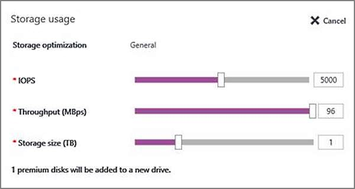

<properties
    pageTitle="SQL Server VM 的存储配置 | Azure"
    description="本主题介绍 Azure 在预配期间如何配置 SQL Server VM 的存储（Resource Manager 部署模型）。此外，还说明了如何为现有的 SQL Server VM 配置存储。"
    services="virtual-machines-windows"
    documentationcenter="na"
    author="ninarn"
    manager="jhubbard"
    tags="azure-resource-manager" />
<tags
    ms.assetid="169fc765-3269-48fa-83f1-9fe3e4e40947"
    ms.service="virtual-machines-windows"
    ms.devlang="na"
    ms.topic="article"
    ms.tgt_pltfrm="vm-windows-sql-server"
    ms.workload="infrastructure-services"
    ms.date="01/31/2017"
    wacn.date="03/28/2017"
    ms.author="ninarn" />  

# SQL Server VM 的存储配置
在 Azure 中配置 SQL Server 虚拟机映像时，可以借助门户自动完成存储配置。这包括将存储附加到 VM、使该存储可供 SQL Server 访问，并对其进行配置以根据特定的性能要求优化。

本主题介绍 Azure 如何在预配期间针对 SQL Server VM 以及针对现有的 VM 配置存储。此配置基于运行 SQL Server 的 Azure VM 的[性能最佳实践](/documentation/articles/virtual-machines-windows-sql-performance/)。

[AZURE.INCLUDE [了解部署模型](../../includes/learn-about-deployment-models-rm-include.md)]

## 先决条件
若要使用自动存储配置设置，虚拟机需有以下特征：

* 是使用 [SQL Server 库映像](/documentation/articles/virtual-machines-windows-sql-server-iaas-overview/#option-1-create-a-sql-vm-with-per-minute-licensing)预配的。
* 使用 [Resource Manager 部署模型](/documentation/articles/resource-manager-deployment-model/)。
* 使用[高级存储](/documentation/articles/storage-premium-storage/)。

## 新的 VM
以下部分介绍了如何为新的 SQL Server 虚拟机配置存储。

### Azure 门户
使用 SQL Server 库映像预配 Azure VM 时，可以选择自动为新的 VM 配置存储。可以指定存储大小、性能限制和工作负荷类型。以下屏幕截图显示了在预配 SQL VM 期间使用的“存储配置”边栏选项卡。

根据所做的选择，Azure 将在创建 VM 后执行以下存储配置任务：

* 创建高级存储数据磁盘并将其连接到虚拟机。
* 配置 SQL Server 可访问的数据磁盘。
* 根据指定的大小和性能（IOPS 和吞吐量）要求，在存储池中配置数据磁盘。
* 将存储池与虚拟机上的新驱动器相关联。
* 根据指定的工作负荷类型（“数据仓库”、“事务处理”或“常规”）优化新驱动器。

有关 Azure 如何配置存储设置的详细信息，请参阅[存储配置部分](#storage-configuration)。有关如何在 Azure 门户中创建 SQL Server VM 的完整演练，请参阅[预配教程](/documentation/articles/virtual-machines-windows-portal-sql-server-provision/)。

### Resource Manager 模板
如果使用以下 Resource Manager 模板，则会默认附加两个不带存储池配置的高级数据磁盘。但是，可以自定义这些模板，更改附加到虚拟机的高级数据磁盘的数目。

* [使用自动备份创建 VM](https://github.com/Azure/azure-quickstart-templates/tree/master/201-vm-sql-full-autobackup)
* [使用自动修补创建 VM](https://github.com/Azure/azure-quickstart-templates/tree/master/201-vm-sql-full-autopatching)
* [使用 AKV 集成创建 VM](https://github.com/Azure/azure-quickstart-templates/tree/master/201-vm-sql-full-keyvault)

## 现有 VM
对于现有 SQL Server VM，可在 Azure 门户中修改某些存储设置。选择 VM，转到“设置”区域，然后选择“SQL Server 配置”。“SQL Server 配置”边栏选项卡显示了 VM 当前的存储用量。此图显示了 VM 上存在的所有驱动器。每个驱动器的存储空间都分四个部分显示：

* SQL 数据
* SQL 日志
* 其他（非 SQL 存储）
* 可用

  

若要配置存储以添加新驱动器或扩展现有的驱动器，请单击图表上方的“编辑”链接。

显示的配置选项会有所不同，这取决于以前是否用过此功能。首次使用时，可以指定新驱动器的存储要求。如果以前曾经使用此功能创建了驱动器，可以选择扩展该驱动器的存储。

### 首次使用
如果首次使用此功能，可以指定新驱动器的存储大小和性能限制。这种体验与预配类似。主要差别在于无法指定工作负荷类型。此限制可防止中断虚拟机上任何现有的 SQL Server 配置。

Azure 将根据规范创建新驱动器。在此方案中，Azure 将执行以下存储配置任务：

* 创建高级存储数据磁盘并将其连接到虚拟机。
* 配置 SQL Server 可访问的数据磁盘。
* 根据指定的大小和性能（IOPS 和吞吐量）要求，在存储池中配置数据磁盘。
* 将存储池与虚拟机上的新驱动器相关联。

有关 Azure 如何配置存储设置的详细信息，请参阅[存储配置部分](#storage-configuration)。

### 添加新驱动器
如果已在 SQL Server VM 上配置存储，则展开存储会显示两个新选项。第一个选项是添加新驱动器以提升 VM 的性能级别。

但是，添加驱动器后，必须执行一些附加的手动配置才能提升性能。

### 扩展驱动器
扩展存储的另一个选项是扩展现有驱动器。此选项会增加驱动器的可用存储，但不提升性能。对于存储池，在创建存储池后无法更改列数。列数决定了可跨数据磁盘条带化的并行写入数。因此，添加的任何数据磁盘均无法提升性能。它们只能为写入的数据提供更多的存储空间。这种限制也意味着，在扩展驱动器时，列数决定了可以添加的数据磁盘的最小数目。因此，如果创建的存储池包含四个数据磁盘，则列数也是四个。每当扩展存储时，就必须添加至少四个数据磁盘。

  

##  存储配置
本部分提供相关参考，让你了解在 Azure 门户中预配或配置 SQL VM 期间，Azure 自动执行哪些存储配置更改。

* 如果为 VM 选择的存储小于 2 TB，Azure 不会创建存储池。
* 如果为 VM 选择了至少 2 TB 的存储，则 Azure 将配置存储池。本主题的下一部分提供了存储池配置详细信息。
* 自动存储配置始终使用[高级存储](/documentation/articles/storage-premium-storage/) P30 数据磁盘。因此，所选 TB 数目与附加到 VM 的数据磁盘数目之间存在 1:1 映射。

有关价格信息，请参阅“磁盘存储”选项卡上的“存储定价”页。

### 创建存储池
Azure 使用以下设置在 SQL Server VM 上创建存储池。

| 设置 | 值 |
| --- | --- |
| 条带大小 |256 KB（数据仓库）；64 KB（事务） |
| 磁盘大小 |每个磁盘 1 TB |
| 缓存 |读取 |
| 分配大小 |64 KB NTFS 分配单元大小 |
| 即时文件初始化 |Enabled |
| 在内存中锁定页面 |Enabled |
| 恢复 |简单恢复（不可复原） |
| 列数 |数据磁盘数1 |
| TempDB 位置 |存储在数据磁盘上2 |

1 创建存储池后，无法更改存储池中的列数。

2 此设置仅适用于使用存储配置功能创建的第一个驱动器。

## 工作负荷优化设置
下表描述了三个可用的工作负荷类型选项及其对应的优化：

| 工作负荷类型 | 说明 | 优化 |
| --- | --- | --- |
| **常规** |支持大多数工作负荷的默认设置 |无 |
| **事务处理** |针对传统数据库 OLTP 工作负荷优化存储 |跟踪标志 1117 跟踪标志 1118 |
| **数据仓库** |针对分析和报告工作负荷优化存储 |跟踪标志 610 跟踪标志 1117 |

> [AZURE.NOTE]
只有通过在预配 SQL 虚拟机时，在存储配置步骤中进行选择，才能指定工作负荷类型。
>
>

## 后续步骤
有关其他与在 Azure VM 中运行 SQL Server 相关的主题，请参阅 [SQL Server on Azure Virtual Machines](/documentation/articles/virtual-machines-windows-sql-server-iaas-overview/)（Azure 虚拟机上的 SQL Server）。

<!---HONumber=Mooncake_0220_2017-->
<!--Update_Description: wording update-->