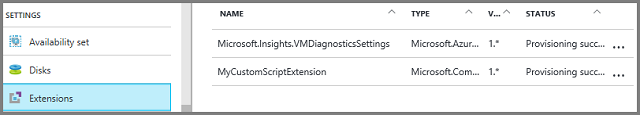
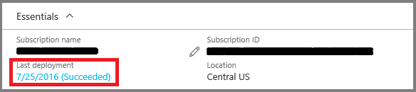

<properties
    pageTitle="Azure Resource Manager 模板中的虚拟机 | Azure"
    description="详细了解如何在 Azure Resource Manager 模板中定义虚拟机资源。"
    services="virtual-machines-windows"
    documentationcenter=""
    author="davidmu1"
    manager="timlt"
    editor=""
    tags="azure-resource-manager" />
<tags
    ms.assetid="f63ab5cc-45b8-43aa-a4e7-69dc42adbb99"
    ms.service="virtual-machines-windows"
    ms.workload="na"
    ms.tgt_pltfrm="vm-windows"
    ms.devlang="na"
    ms.topic="article"
    ms.date="01/04/2017"
    wacn.date="02/20/2017"
    ms.author="davidmu" />  

# Azure Resource Manager 模板中的虚拟机

本文介绍 Azure Resource Manager 模板中与虚拟机相关的方面。本文不会介绍用于创建虚拟机的完整模板；在完整的模板中，需要提供存储帐户、网络接口、公共 IP 地址和虚拟网络的资源定义。有关如何统一定义这些资源的详细信息，请参阅 [Resource Manager 模板演练](/documentation/articles/resource-manager-template-walkthrough/)。

[在库中](https://github.com/Azure/azure-quickstart-templates/?term=VM)有许多包含 VM 资源的模板。本文并未介绍可在模板中包含的所有元素。

本示例演示了模板中用于创建指定数量的 VM 的典型资源节：

    "resources": [
      { 
        "apiVersion": "2016-03-30", 
        "type": "Microsoft.Compute/virtualMachines", 
        "name": "[concat('myVM', copyindex())]", 
        "location": "[resourceGroup().location]",
        "copy": {
          "name": "virtualMachineLoop",    
          "count": "[parameters('numberOfInstances')]"
        },
        "dependsOn": [
          "[concat('Microsoft.Network/networkInterfaces/myNIC', copyindex())]" 
        ], 
        "properties": { 
          "hardwareProfile": { 
            "vmSize": "Standard_DS1_v2" 
          }, 
          "osProfile": { 
            "computername": "[concat('myVM', copyindex())]", 
            "adminUsername": "[parameters('adminUsername')]", 
            "adminPassword": "[parameters('adminPassword')]" 
          }, 
          "storageProfile": { 
            "imageReference": { 
              "publisher": "MicrosoftWindowsServer", 
              "offer": "WindowsServer", 
              "sku": "2012-R2-Datacenter", 
              "version": "latest" 
            }, 
            "osDisk": { 
              "name": "[concat('myOSDisk', copyindex())]" 
              "vhd": { 
                "uri": "[concat('https://', variables('storageName'), 
                  '.blob.core.chinacloudapi.cn/vhds/myOSDisk', copyindex(),'.vhd')]" 
              }, 
              "caching": "ReadWrite", 
              "createOption": "FromImage" 
            }
            "dataDisks": [
              {
                "name": "[concat('myDataDisk', copyindex())]",
                "diskSizeGB": "100",
                "lun": 0,
                "vhd": {
                  "uri": "[concat('https://', variables('storageName'), 
                    '.blob.core.chinacloudapi.cn/vhds/myDataDisk', copyindex(),'.vhd')]"
                },  
                "createOption": "Empty"
              }
            ] 
          }, 
          "networkProfile": { 
            "networkInterfaces": [ 
              { 
                "id": "[resourceId('Microsoft.Network/networkInterfaces',
                  concat('myNIC', copyindex())]" 
              } 
            ] 
          }
          "diagnosticsProfile": {
            "bootDiagnostics": {
              "enabled": "true",
              "storageUri": "[concat('https://', variables('storageName'), 
                '.blob.core.chinacloudapi.cn"
            }
          } 
        },
        "resources": [ 
          { 
            "name": "Microsoft.Insights.VMDiagnosticsSettings", 
            "type": "extensions", 
            "location": "[resourceGroup().location]", 
            "apiVersion": "2016-03-30", 
            "dependsOn": [ 
              "[concat('Microsoft.Compute/virtualMachines/myVM', copyindex())]" 
            ], 
            "properties": { 
              "publisher": "Microsoft.Azure.Diagnostics", 
              "type": "IaaSDiagnostics", 
              "typeHandlerVersion": "1.5", 
              "autoUpgradeMinorVersion": true, 
              "settings": { 
                "xmlCfg": "[base64(concat(variables('wadcfgxstart'), 
                variables('wadmetricsresourceid'), 
                concat('myVM', copyindex()),
                variables('wadcfgxend')))]", 
                "storageAccount": "[variables('storageName')]" 
              }, 
              "protectedSettings": { 
                "storageAccountName": "[variables('storageName')]", 
                "storageAccountKey": "[listkeys(variables('accountid'), 
                  '2015-06-15').key1]", 
                "storageAccountEndPoint": "https://core.chinacloudapi.cn" 
              } 
            } 
          },
          {
            "name": "MyCustomScriptExtension",
            "type": "extensions",
            "apiVersion": "2016-03-30",
            "location": "[resourceGroup().location]",
            "dependsOn": [
              "[concat('Microsoft.Compute/virtualMachines/myVM', copyindex())]"
            ],
            "properties": {
              "publisher": "Microsoft.Compute",
              "type": "CustomScriptExtension",
              "typeHandlerVersion": "1.7",
              "autoUpgradeMinorVersion": true,
              "settings": {
                "fileUris": [
                  "[concat('https://', variables('storageName'),
                    '.blob.core.chinacloudapi.cn/customscripts/start.ps1')]" 
                ],
                "commandToExecute": "powershell.exe -ExecutionPolicy Unrestricted -File start.ps1"
              }
            }
          } 
        ]
      } 
    ]

> [AZURE.NOTE] 
本示例依赖于前面创建的存储帐户。可通过在模板中部署存储帐户来创建存储帐户。本示例还依赖于在模板中定义的网络接口及其相关资源。本示例未显示这些资源。
>
>

## API 版本

使用模板部署资源时，必须指定要使用的 API 版本。本示例使用以下 apiVersion 元素显示虚拟机资源：

    "apiVersion": "2016-03-30",

在模板中指定的 API 版本会影响到可在模板中定义的属性。通常，在创建模板时，应选择最新的 API 版本。对于现有模板，你可以决定是要继续使用以前的 API 版本，还是要选择最新版本来更新模板以利用新功能。

可通过以下方式获取最新的 API 版本：

- REST API - [列出所有资源提供程序](https://docs.microsoft.com/rest/api/resources/providers#Providers_List)
- PowerShell - [Get-AzureRmResourceProvider](https://docs.microsoft.com/powershell/resourcemanager/Azurerm.Resources/v3.1.0/Get-AzureRmResourceProvider?redirectedfrom=msdn)
- Azure CLI 2.0（预览版）- [az provider show](https://docs.microsoft.com/cli/azure/provider#show)

[AZURE.INCLUDE [azure-cli-2-azurechinacloud-environment-parameter](../../includes/azure-cli-2-azurechinacloud-environment-parameter.md)]

## 参数和变量

使用[参数](/documentation/articles/resource-group-authoring-templates/)可在运行模板时轻松指定模板值。本示例使用了以下 parameters 节：

    "parameters": {
      "adminUsername": { "type": "string" },
      "adminPassword": { "type": "securestring" },
      "numberOfInstances": { "type": "int" }
    },

部署示例模板时，需输入每个 VM 上的管理员帐户的名称与密码值，以及要创建的 VM 数目。可以选择在使用模板管理的单独文件中指定参数值，或者根据提示提供值。

使用[变量](/documentation/articles/resource-group-authoring-templates/)可以轻松设置在整个模板中重复使用的值，或者可随时变化的值。本示例使用了以下 variables 节：

    "variables": { 
      "storageName": "mystore1",
      "accountid": "[concat('/subscriptions/', subscription().subscriptionId, 
        '/resourceGroups/', resourceGroup().name,
      '/providers/','Microsoft.Storage/storageAccounts/', variables('storageName'))]", 
      "wadlogs": "<WadCfg> 
        <DiagnosticMonitorConfiguration overallQuotaInMB=\"4096\" xmlns=\"http://schemas.microsoft.com/ServiceHosting/2010/10/DiagnosticsConfiguration\"> 
          <DiagnosticInfrastructureLogs scheduledTransferLogLevelFilter=\"Error\"/> 
          <WindowsEventLog scheduledTransferPeriod=\"PT1M\" > 
            <DataSource name=\"Application!*[System[(Level = 1 or Level = 2)]]\" /> 
            <DataSource name=\"Security!*[System[(Level = 1 or Level = 2)]]\" /> 
            <DataSource name=\"System!*[System[(Level = 1 or Level = 2)]]\" />
          </WindowsEventLog>", 
      "wadperfcounters": "<PerformanceCounters scheduledTransferPeriod=\"PT1M\">
          <PerformanceCounterConfiguration counterSpecifier=\"\\Process(_Total)\\Thread Count\" sampleRate=\"PT15S\" unit=\"Count\">
            <annotation displayName=\"Threads\" locale=\"zh-cn\"/>
          </PerformanceCounterConfiguration>
        </PerformanceCounters>", 
      "wadcfgxstart": "[concat(variables('wadlogs'), variables('wadperfcounters'), 
        '<Metrics resourceId=\"')]", 
      "wadmetricsresourceid": "[concat('/subscriptions/', subscription().subscriptionId, 
        '/resourceGroups/', resourceGroup().name , 
        '/providers/', 'Microsoft.Compute/virtualMachines/')]", 
      "wadcfgxend": "\"><MetricAggregation scheduledTransferPeriod=\"PT1H\"/>
        <MetricAggregation scheduledTransferPeriod=\"PT1M\"/>
        </Metrics></DiagnosticMonitorConfiguration>
        </WadCfg>"
    }, 

部署示例模板时，先前创建的存储帐户的名称和标识符将使用变量值。变量还用于提供诊断扩展的设置。请参阅[创建 Azure Resource Manager 模板的最佳实践](/documentation/articles/resource-manager-template-best-practices/)来帮助自己确定如何构造模板中的参数和变量。

## 资源循环

如果需要为应用程序创建多个虚拟机，可在模板中使用 copy 元素。此可选元素将根据以参数形式指定的数目反复创建 VM：

    "copy": {
      "name": "virtualMachineLoop",    
      "count": "[parameters('numberOfInstances')]"
    },

另请注意，在本示例中，为资源指定某些值时使用了循环索引。例如，如果输入实例计数 3，则 vhd 的定义会生成名为 myOSDisk1、myOSDisk2 和 myOSDisk3 的磁盘：

    "vhd": { 
      "uri": "[concat('https://', variables('storageName'), 
        '.blob.core.chinacloudapi.cn/vhds/myOSDisk', 
        copyindex(),'.vhd')]" 
    },

请记住，如果为模板中的一个资源创建了循环，则创建或访问其他资源时，可能需要使用该循环。例如，多个 VM 不能使用同一个网络接口，因此，如果模板反复创建三个 VM，则它也必须反复创建三个网络接口。将网络接口分配到 VM 时，会使用循环索引来标识该接口：

    "networkInterfaces": [ { 
      "id": "[resourceId('Microsoft.Network/networkInterfaces',
        concat('myNIC', copyindex()))]" 
    } ]

## 依赖项

大多数资源必须依赖于其他资源才能正常工作。虚拟机必须与虚拟网络相关联，因此需要一个网络接口。[dependsOn](/documentation/articles/resource-group-define-dependencies/) 元素用于确保在创建 VM 之前，网络接口随时可供使用：

    "dependsOn": [
      "[concat('Microsoft.Network/networkInterfaces/', 'myNIC', copyindex())]" 
    ],

Resource Manager 将同时部署所有不依赖于其他所要部署的资源的资源。请谨慎设置依赖关系，因为可能会无意中指定不必要的依赖关系，导致部署速度变慢。多个资源的依赖关系可能会串联在一起。例如，网络接口依赖于公共 IP 地址和虚拟网络资源。

如何知道是否需要指定依赖关系？ 查看模板中设置的值即可。如果虚拟机资源定义中的某个元素指向同一模板中部署的另一个资源，则需要指定依赖关系。例如，示例虚拟机定义了一个网络配置文件：

    "networkProfile": { 
      "networkInterfaces": [ { 
        "id": "[resourceId('Microsoft.Network/networkInterfaces',
          concat('myNIC', copyindex())]" 
      } ] 
    }

若要设置此属性，网络接口必须存在。因此，需要指定依赖关系。如果在一个资源（父级）内部定义了另一个资源（子级），则也需要设置依赖关系。例如，诊断设置和自定义脚本扩展都定义为虚拟机的子资源。只有存在该虚拟机，才能创建这些子资源。因此，这两个资源都标记为依赖于该虚拟机。

你可能会疑惑，为什么虚拟机资源不依赖于存储帐户？虚拟机包含指向存储帐户的元素。

    "osDisk": { 
      "name": "[concat('myOSDisk', copyindex())]" 
      "vhd": { 
        "uri": "[concat('https://', variables('storageName'), 
          '.blob.core.chinacloudapi.cn/vhds/myOSDisk', copyindex(),'.vhd')]" 
      }, 
      "caching": "ReadWrite", 
      "createOption": "FromImage" 
    }

在这种情况下，我们假设存储帐户已存在。如果存储帐户部署在同一个模板中，则需要设置与存储帐户之间的依赖关系。

## 配置文件

定义虚拟机资源时，需要使用几个 profile 元素。其中一些元素是必需的，还有一些是可选的。例如，hardwareProfile、osProfile、storageProfile 和 networkProfile 元素是必需的，而 diagnosticsProfile 是可选的。这些配置文件定义如下所述的设置：
   
- [大小](/documentation/articles/virtual-machines-windows-sizes/)
- [名称](/documentation/articles/virtual-machines-linux-infrastructure-naming-guidelines/)和凭据
- 磁盘和[操作系统设置](/documentation/articles/virtual-machines-windows-cli-ps-findimage/)
- [网络接口](/documentation/articles/virtual-networks-multiple-nics/)
- 启动诊断

## 磁盘和映像
   
在 Azure 中，vhd 文件可以表示[磁盘或映像](/documentation/articles/virtual-machines-windows-about-disks-vhds/)。如果 vhd 文件中的操作系统专用于特定的 VM，则该文件称为磁盘。如果 vhd 文件中的操作系统经过通用化，用于创建许多 VM，则该文件称为映像。
    
### 从平台映像创建新虚拟机和新磁盘

创建 VM 时，必须确定要使用哪个操作系统。imageReference 元素用于定义新 VM 的操作系统。本示例显示了 Windows Server 操作系统的定义：

    "imageReference": { 
      "publisher": "MicrosoftWindowsServer", 
      "offer": "WindowsServer", 
      "sku": "2012-R2-Datacenter", 
      "version": "latest" 
    },

若要创建 Linux 操作系统，可使用以下定义：

    "imageReference": {
      "publisher": "Canonical",
      "offer": "UbuntuServer",
      "sku": "14.04.2-LTS",
      "version": "latest"
    },

磁盘的配置设置是使用 osDisk 元素分配的。本示例定义了磁盘存储中的位置、磁盘的缓存模式，以及要从[平台映像](/documentation/articles/virtual-machines-windows-cli-ps-findimage/)创建磁盘：

    "osDisk": { 
      "name": "[concat('myOSDisk', copyindex())]" 
      "vhd": { 
        "uri": "[concat('https://', variables('storageName'), 
          '.blob.core.chinacloudapi.cn/vhds/myOSDisk', copyindex(),'.vhd')]" 
      }, 
      "caching": "ReadWrite", 
      "createOption": "FromImage" 
    }

### 从现有磁盘创建新虚拟机

若要从现有磁盘创建虚拟机，请删除 imageReference 和 osProfile 元素，然后定义以下磁盘设置：

    "osDisk": { 
      "name": "[concat('myOSDisk', copyindex())]", 
      "osType": "Windows",
      "vhd": { 
        "[concat('https://', variables('storageName'),
          '.blob.core.chinacloudapi.cn/vhds/myOSDisk', copyindex(),'.vhd')]" 
      }, 
      "caching": "ReadWrite",
      "createOption": "Attach" 
    }

在本示例中，uri 指向现有的 vhd 文件，而不是新文件的位置。createOption 设置为附加现有磁盘。

### 从自定义映像创建新虚拟机

若要从[自定义映像](/documentation/articles/virtual-machines-windows-upload-image/)创建虚拟机，请删除 imageReference 元素，然后定义以下磁盘设置：

    "osDisk": { 
      "name": "[concat('myOSDisk', copyindex())]",
      "osType": "Windows", 
      "vhd": { 
        "uri": "[concat('https://', variables('storageName'), 
          '.blob.core.chinacloudapi.cn/vhds/myOSDisk', copyindex(),'.vhd')]"
      },
      "image": {
        "uri": "[concat('https://', variables('storageName'), 
          'blob.core.chinacloudapi.cn/images/myImage.vhd"
      },
      "caching": "ReadWrite", 
      "createOption": "FromImage" 
    }

在本示例中，vhd uri 指向新磁盘的存储位置，映像 uri 指向要使用的自定义映像。

### 附加数据磁盘

可以选择性地将数据磁盘添加到 VM。[磁盘数目](/documentation/articles/virtual-machines-windows-sizes/)取决于要使用的操作系统磁盘的大小。如果 VM 的大小设置为 Standard\_DS1\_v2，则可添加到 VM 的数据磁盘数目上限为 2。在本示例中，将向每个 VM 添加一个数据磁盘：

    "dataDisks": [
      {
        "name": "[concat('myDataDisk', copyindex())]",
        "diskSizeGB": "100",
        "lun": 0,
        "vhd": {
          "uri": "[concat('https://', variables('storageName'), 
            '.blob.core.chinacloudapi.cn/vhds/myDataDisk', copyindex(),'.vhd')]"
        },  
        "caching": "ReadWrite",
        "createOption": "Empty"
      }
    ]

本示例中的 vhd 是为磁盘创建的新文件。可将 uri 设置为现有 vhd，将 createOption 设置为 **Attach**。

## 扩展

尽管[扩展](/documentation/articles/virtual-machines-windows-extensions-features/)是独立的资源，但它们与 VM 密切相关。可将扩展添加为 VM 的子资源，或添加为独立的资源。本示例显示要将[诊断扩展](/documentation/articles/virtual-machines-windows-extensions-diagnostics-template/)添加到 VM：

    { 
      "name": "Microsoft.Insights.VMDiagnosticsSettings", 
      "type": "extensions", 
      "location": "[resourceGroup().location]", 
      "apiVersion": "2016-03-30", 
      "dependsOn": [ 
        "[concat('Microsoft.Compute/virtualMachines/myVM', copyindex())]" 
      ], 
      "properties": { 
        "publisher": "Microsoft.Azure.Diagnostics", 
        "type": "IaaSDiagnostics", 
        "typeHandlerVersion": "1.5", 
        "autoUpgradeMinorVersion": true, 
        "settings": { 
          "xmlCfg": "[base64(concat(variables('wadcfgxstart'), 
          variables('wadmetricsresourceid'), 
          concat('myVM', copyindex()),
          variables('wadcfgxend')))]", 
          "storageAccount": "[variables('storageName')]" 
        }, 
        "protectedSettings": { 
          "storageAccountName": "[variables('storageName')]", 
          "storageAccountKey": "[listkeys(variables('accountid'), 
            '2015-06-15').key1]", 
          "storageAccountEndPoint": "https://core.chinacloudapi.cn" 
        } 
      } 
    },

此扩展资源使用 storageName 变量和 diagnostic 变量来提供值。若要更改此扩展收集的数据，可将更多的性能计数器添加到 wadperfcounters 变量。还可以选择将诊断数据放入其他存储帐户，而不是 VM 磁盘所在的存储帐户。

可在 VM 上安装许多扩展，但最有用的扩展也许是[自定义脚本扩展](/documentation/articles/virtual-machines-windows-extensions-customscript/)。在本示例中，首次启动每个 VM 时，将在 VM 上运行名为 start.ps1 的 PowerShell 脚本：

    {
      "name": "MyCustomScriptExtension",
      "type": "extensions",
      "apiVersion": "2016-03-30",
      "location": "[resourceGroup().location]",
      "dependsOn": [
        "[concat('Microsoft.Compute/virtualMachines/myVM', copyindex())]"
      ],
      "properties": {
        "publisher": "Microsoft.Compute",
        "type": "CustomScriptExtension",
        "typeHandlerVersion": "1.7",
        "autoUpgradeMinorVersion": true,
        "settings": {
          "fileUris": [
            "[concat('https://', variables('storageName'),
              '.blob.core.chinacloudapi.cn/customscripts/start.ps1')]" 
          ],
          "commandToExecute": "powershell.exe -ExecutionPolicy Unrestricted -File start.ps1"
        }
      }
    }

start.ps1 脚本可以完成许多配置任务。例如，在本示例中已添加到 VM 的数据磁盘并未初始化；可以使用自定义脚本将它们初始化。如果要执行多个启动任务，可在 Azure 存储中使用 start.ps1 文件调用其他 PowerShell 脚本。本示例使用 PowerShell，但你可以使用自己的操作系统支持的任何脚本方法。

可在门户中通过“扩展”设置查看已安装的扩展的状态：

  

此外，也可以使用 **Get-AzureRmVMExtension** PowerShell 命令、**vm extension get** Azure CLI 2.0（预览版）命令或“获取扩展信息”REST API 来获取扩展信息。

## 部署

部署模板时，Azure 将会跟踪以组的形式部署的资源，并自动为这个部署的组分配一个名称。部署名称与模板名称相同。

如果你很想知道部署中的资源状态，可以使用 Azure 门户预览中的“资源组”边栏选项卡：

  

    
完全可以使用同一个模板来创建资源或更新现有资源。使用命令部署模板时，可以指定想要使用的[模式](/documentation/articles/resource-group-template-deploy/)。模式可设置为“完整”\(Complete\) 或“增量”\(Incremental\)。默认设置为执行增量更新。请谨慎使用“完整”模式，因为这可能会意外删除资源。将模式设置为“完整”时，Resource Manager 会删除资源组中不包含在模板内的所有资源。

## 后续步骤

- 参考[创作 Azure Resource Manager 模板](/documentation/articles/resource-group-authoring-templates/)创建自己的模板。
- 参考[使用 Resource Manager 模板创建 Windows 虚拟机](/documentation/articles/virtual-machines-windows-ps-template/)部署创建的模板。
- 查看[使用 Azure Resource Manager 和 PowerShell 管理虚拟机](/documentation/articles/virtual-machines-windows-ps-manage/)，了解如何管理创建的 VM。

<!---HONumber=Mooncake_0213_2017-->