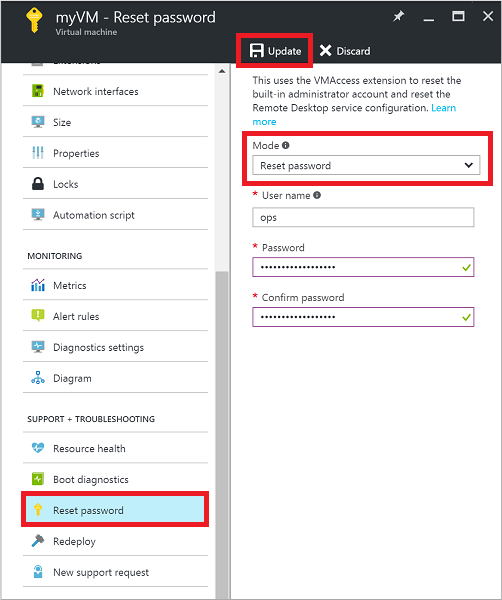
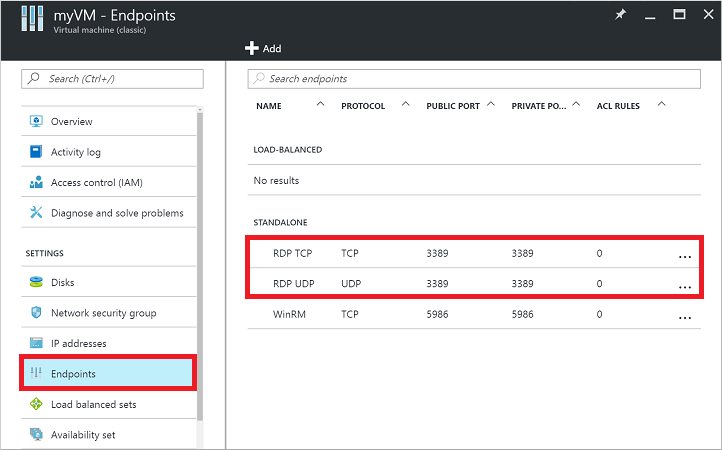
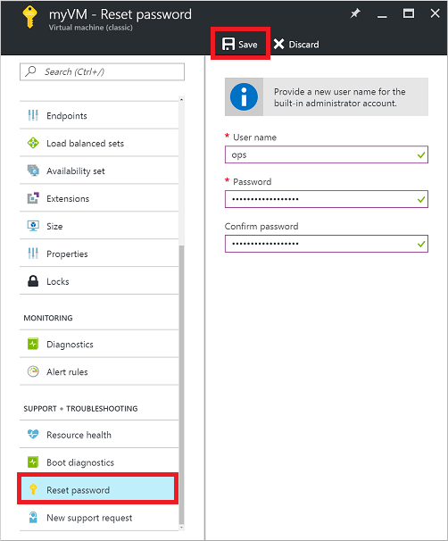

<!-- need to be verified -->

<properties
    pageTitle="无法通过 RDP 连接到 Azure VM | Azure"
    description="排查无法使用远程桌面连接到 Azure 中 Windows 虚拟机的问题"
    keywords="远程桌面错误,远程桌面连接错误,无法连接到 VM,远程桌面故障排除"
    services="virtual-machines-windows"
    documentationcenter=""
    author="iainfoulds"
    manager="timlt"
    editor=""
    tags="top-support-issue,azure-service-management,azure-resource-manager" />
<tags 
    ms.assetid="0d740f8e-98b8-4e55-bb02-520f604f5b18"
    ms.service="virtual-machines-windows"
    ms.workload="infrastructure-services"
    ms.tgt_pltfrm="vm-windows"
    ms.devlang="na"
    ms.topic="support-article"
    ms.date="10/26/2016"
    wacn.date="01/05/2017"
    ms.author="iainfou" />

# 排查 Azure 虚拟机的远程桌面连接问题
与基于 Windows 的 Azure 虚拟机 (VM) 的远程桌面协议 (RDP) 连接可能会因各种原因而失败，使用户无法访问 VM。问题可能出在 VM 上的远程桌面服务、网络连接或主计算机上的远程桌面客户端。本文介绍解决 RDP 连接问题的一些最常见方法。

如果你对本文中的任何观点存在疑问，可以联系 [MSDN Azure 和 CSDN Azure](/support/forums/) 上的 Azure 专家。或者，也可以提交 Azure 支持事件。请转到 [Azure 支持站点](/support/contact/)并选择“获取支持”。

##  快速故障排除步骤
在执行每个故障排除步骤之后，请尝试连接到 VM：

1. 重置远程桌面配置。
2. 检查网络安全组规则/云服务终结点。
3. 查看 VM 控制台日志。
4. 检查 VM 资源运行状况。
5. 重置 VM 密码。
6. 重新启动 VM。
7. 重新部署 VM。

如需更详细的步骤和说明，请继续阅读余下的内容。

> [AZURE.TIP]
如果 VM 的“连接”按钮在门户中灰显，且未通过 [Express Route](/documentation/articles/expressroute-introduction/) 或[站点到站点 VPN](/documentation/articles/vpn-gateway-howto-site-to-site-resource-manager-portal/) 连接连接到 Azure，则必须先为 VM 创建并分配一个公共 IP 地址，然后才能使用 RDP。有关详细信息，请参阅 [Azure 中的公共 IP 地址](/documentation/articles/virtual-network-ip-addresses-overview-arm/)。
> 
> 

## 排查 RDP 问题的方法
可以使用以下方法之一，对使用 Resource Manager 部署模型创建的 VM 进行故障排除：

* [Azure 门户预览](#using-the-azure-portal) - 如果需要快速重置 RDP 配置或用户凭据，并且没有安装 Azure 工具，则很适合使用此方法。
* [Azure PowerShell](#using-azure-powershell) - 如果你很熟练 PowerShell 提示符，可以使用 Azure PowerShell cmdlet 快速重置 RDP 配置或用户凭据。

还可以查找有关针对使用[经典部署模型](#troubleshoot-vms-created-using-the-classic-deployment-model)创建的 VM 进行故障排除的步骤。

## 使用 Azure 门户预览进行故障排除
在执行每个故障排除步骤之后，请尝试再次连接到 VM。如果仍然无法连接，请尝试下一步。

1. **重置 RDP 连接**。当“远程连接”已禁用或 Windows 防火墙规则阻止 RDP 时，此故障排除步骤可重置 RDP 配置。
   
    请在 Azure 门户预览中选择你的 VM。向下滚动到设置窗格中靠近列表底部的“支持 + 故障排除”部分。单击“重置密码”按钮。将“模式”设置为“只重置配置”，然后单击“更新”按钮：
   
      

2. **验证网络安全组规则**。此故障排除步骤验证网络安全组中是否存在允许 RDP 流量的规则。RDP 的默认端口为 TCP 端口 3389。创建 VM 时，可能不会自动创建允许 RDP 流量的规则。
   
    请在 Azure 门户预览中选择你的 VM。在设置窗格中单击“网络接口”。
   
      

    从列表中选择网络接口（通常只有一个）：
   
      

    选择“网络安全组”，查看与网络接口关联的网络安全组：
   
      

    验证是否存在允许 TCP 端口 3389 上的 RDP 流量的入站规则。以下示例显示了一个允许 RDP 流量的有效安全规则。可以看到其中已正确配置 `Service` 和 `Action`：
   
      

    如果不存在允许 RDP 流量的规则，请[创建一个网络安全组规则](/documentation/articles/virtual-machines-windows-nsg-quickstart-portal/)。允许 TCP 端口 3389。
3. **检查 VM 启动诊断**。此故障排除步骤检查 VM 控制台日志，确定 VM 是否报告了问题。并非所有 VM 都已启用启动诊断，因此，此故障排除步骤可能是可选的。
   
    本文未介绍具体的故障排除步骤，而是指出会影响 RDP 连接的更广泛问题。有关查看控制台日志和 VM 屏幕截图的详细信息，请参阅 [Boot Diagnostics for VMs](https://azure.microsoft.com/blog/boot-diagnostics-for-virtual-machines-v2/)（VM 的启动诊断）。
4. **检查 VM 资源运行状况**。此故障排除步骤验证 Azure 平台上是否未出现任何可能影响 VM 连接的已知问题。
   
    请在 Azure 门户预览中选择你的 VM。向下滚动到设置窗格中靠近列表底部的“支持 + 故障排除”部分。单击“资源运行状况”按钮。正常的 VM 将报告为“可用”：
   
      

5. **重置用户凭据**。当你不确定或者忘了凭据时，可以使用此故障排除步骤重置本地管理员帐户的密码。
   
    请在 Azure 门户预览中选择你的 VM。向下滚动到设置窗格中靠近列表底部的“支持 + 故障排除”部分。单击“重置密码”按钮。确保“模式”设置为“重置密码”，然后输入用户名和新密码。最后，单击“更新”按钮：
   
      

6. **重新启动 VM**。此故障排除步骤可以解决 VM 本身存在的任何基本问题。
   
    在 Azure 门户中选择 VM，然后单击“概述”选项卡。单击“重新启动”按钮：
   
      

7. **重新部署 VM**。此故障排除步骤可将 VM 重新部署到 Azure 中的另一台主机，从而解决平台或网络的任何基本问题。
   
    请在 Azure 门户预览中选择你的 VM。向下滚动到设置窗格中靠近列表底部的“支持 + 故障排除”部分。单击“重新部署”按钮，然后单击“重新部署”：
   
      

   
    完成此操作后，会丢失临时磁盘数据，系统会更新与 VM 关联的动态 IP 地址。

如果仍遇到 RDP 问题，可以[开具支持请求](/support/contact/)或阅读[更详细的 RDP 故障排除概念和步骤](/documentation/articles/virtual-machines-windows-detailed-troubleshoot-rdp/)。

##  使用 Azure PowerShell 进行故障排除
如果尚未执行该操作，请[安装并配置最新的 Azure PowerShell](https://docs.microsoft.com/powershell/azureps-cmdlets-docs)。

以下示例使用 `myResourceGroup`、`myVM` 和 `myVMAccessExtension` 等变量。请将这些变量名称和位置替换为自己的值。

> [AZURE.NOTE]
可以使用 [Set-AzureRmVMAccessExtension PowerShell](https://msdn.microsoft.com/zh-cn/library/mt619447.aspx) cmdlet 重置用户凭据和 RDP 配置。在以下示例中，`myVMAccessExtension` 是在重置过程中指定的名称。如果以前使用过 VMAccessAgent，可以使用 `Get-AzureRmVM -ResourceGroupName "myResourceGroup" -Name "myVM"` 检查 VM 的属性，从而获取现有的扩展名称。若要查看名称，请查看输出的“Extensions”节中的内容。
> 
> 

在执行每个故障排除步骤之后，请尝试再次连接到 VM。如果仍然无法连接，请尝试下一步。

1. **重置 RDP 连接**。当“远程连接”已禁用或 Windows 防火墙规则阻止 RDP 时，此故障排除步骤可重置 RDP 配置。
   
    以下示例在位于 `ChinaNorth`、名为 `myResourceGroup` 的资源组中名为 `myVM` 的 VM 上重置 RDP 连接：

        Set-AzureRmVMAccessExtension -ResourceGroupName "myResourceGroup" `
            -VMName "myVM" -Location Westus -Name "myVMAccessExtension"

2. **验证网络安全组规则**。此故障排除步骤验证网络安全组中是否存在允许 RDP 流量的规则。RDP 的默认端口为 TCP 端口 3389。创建 VM 时，可能不会自动创建允许 RDP 流量的规则。
   
    首先，将网络安全组的所有配置数据分配到 `$rules` 变量。以下示例在名为 `myResourceGroup` 的资源组中获取名为 `myNetworkSecurityGroup` 的网络安全组的相关信息：

        $rules = Get-AzureRmNetworkSecurityGroup -ResourceGroupName "myResourceGroup" `
            -Name "myNetworkSecurityGroup"

    现在，查看针对此网络安全组配置的规则。验证是否存在一个允许使用 TCP 端口 3389 进行入站连接的规则，如下所示：

        $rules.SecurityRules

    以下示例显示了一个允许 RDP 流量的有效安全规则。可以看到其中已正确配置 `Protocol`、`DestinationPortRange`、`Access` 和 `Direction`：

        Name                     : default-allow-rdp
        Id                       : /subscriptions/guid/resourceGroups/myResourceGroup/providers/Microsoft.Network/networkSecurityGroups/myNetworkSecurityGroup/securityRules/default-allow-rdp
        Etag                     : 
        ProvisioningState        : Succeeded
        Description              : 
        Protocol                 : TCP
        SourcePortRange          : *
        DestinationPortRange     : 3389
        SourceAddressPrefix      : *
        DestinationAddressPrefix : *
        Access                   : Allow
        Priority                 : 1000
        Direction                : Inbound

    如果不存在允许 RDP 流量的规则，请[创建一个网络安全组规则](/documentation/articles/virtual-machines-windows-nsg-quickstart-powershell/)。允许 TCP 端口 3389。
3. **重置用户凭据**。当你不确定或者忘了凭据时，可以使用此故障排除步骤重置指定的本地管理员帐户的密码。
   
    首先，通过将凭据分配到 `$cred` 变量来指定用户名和新密码，如下所示：

        $cred=Get-Credential

    接下来，更新 VM 上的凭据。以下示例在位于 `ChinaNorth`、名为 `myResourceGroup` 的资源组中名为 `myVM` 的 VM 上更新凭据：

        Set-AzureRmVMAccessExtension -ResourceGroupName "myResourceGroup" `
            -VMName "myVM" -Location ChinaNorth -Name "myVMAccessExtension" `
            -UserName $cred.GetNetworkCredential().Username `
            -Password $cred.GetNetworkCredential().Password

4. **重新启动 VM**。此故障排除步骤可以解决 VM 本身存在的任何基本问题。
   
    以下示例重新启动 `myResourceGroup` 资源组中名为 `myVM` 的 VM：

        Restart-AzureRmVM -ResourceGroup "myResourceGroup" -Name "myVM"

5. **重新部署 VM**。此故障排除步骤可将 VM 重新部署到 Azure 中的另一台主机，从而解决平台或网络的任何基本问题。
   
    以下示例重新部署位于 `ChinaNorth`、名为 `myResourceGroup` 的资源组中名为 `myVM` 的 VM：

        Set-AzureRmVM -Redeploy -ResourceGroupName "myResourceGroup" -Name "myVM"

如果仍遇到 RDP 问题，可以[开具支持请求](/support/contact/)或阅读[更详细的 RDP 故障排除概念和步骤](/documentation/articles/virtual-machines-windows-detailed-troubleshoot-rdp/)。

##  对使用经典部署模型创建的 VM 进行故障排除
执行每个故障排除步骤后，请尝试重新连接到 VM。

1. **重置 RDP 连接**。当“远程连接”已禁用或 Windows 防火墙规则阻止 RDP 时，此故障排除步骤可重置 RDP 配置。
   
    请在 Azure 门户预览中选择你的 VM。单击“...更多”按钮，然后单击“重置远程访问”：
   
      

2. **验证云服务终结点**。此故障排除步骤验证云服务中是否存在允许 RDP 流量的终结点。RDP 的默认端口为 TCP 端口 3389。创建 VM 时，可能不会自动创建允许 RDP 流量的规则。
   
    请在 Azure 门户预览中选择你的 VM。单击“终结点”按钮查看当前为 VM 配置的终结点。验证是否存在允许 TCP 端口 3389 上的 RDP 流量的终结点。
   
    以下示例显示了允许 RDP 流量的有效终结点：
   
      

   
    如果不存在允许 RDP 流量的终结点，请[创建一个云服务终结点](/documentation/articles/virtual-machines-windows-classic-setup-endpoints/)。允许使用 TCP 连接到专用端口 3389。
3. **检查 VM 启动诊断**。此故障排除步骤检查 VM 控制台日志，确定 VM 是否报告了问题。并非所有 VM 都已启用启动诊断，因此，此故障排除步骤可能是可选的。
   
    本文未介绍具体的故障排除步骤，而是指出会影响 RDP 连接的更广泛问题。有关查看控制台日志和 VM 屏幕截图的详细信息，请参阅 [Boot Diagnostics for VMs](https://azure.microsoft.com/blog/boot-diagnostics-for-virtual-machines-v2/)（VM 的启动诊断）。
4. **检查 VM 资源运行状况**。此故障排除步骤验证 Azure 平台上是否未出现任何可能影响 VM 连接的已知问题。
   
    请在 Azure 门户预览中选择你的 VM。向下滚动到设置窗格中靠近列表底部的“支持 + 故障排除”部分。单击“资源运行状况”按钮。正常的 VM 将报告为“可用”：
   
      

5. **重置用户凭据**。当你不确定或者忘了凭据时，可以使用此故障排除步骤重置指定的本地管理员帐户的密码。
   
    请在 Azure 门户预览中选择你的 VM。向下滚动到设置窗格中靠近列表底部的“支持 + 故障排除”部分。单击“重置密码”按钮。输入用户名和新密码。最后，单击“保存”按钮：
   
      

6. **重新启动 VM**。此故障排除步骤可以解决 VM 本身存在的任何基本问题。
   
    在 Azure 门户中选择 VM，然后单击“概述”选项卡。单击“重新启动”按钮：
   
      

如果仍遇到 RDP 问题，可以[开具支持请求](/support/contact/)或阅读[更详细的 RDP 故障排除概念和步骤](/documentation/articles/virtual-machines-windows-detailed-troubleshoot-rdp/)。

## 排查特定的 RDP 错误
尝试通过 RDP 连接到 VM 时，可能会遇到特定的错误消息。以下是最常见的错误消息：

* [由于没有可用于提供许可证的远程桌面许可证服务器，远程会话已断开连接](/documentation/articles/virtual-machines-windows-troubleshoot-specific-rdp-errors/#rdplicense)。
* [远程桌面找不到计算机“名称”。](/documentation/articles/virtual-machines-windows-troubleshoot-specific-rdp-errors/#rdpname)
* [身份验证出错。无法联系本地安全机构](/documentation/articles/virtual-machines-windows-troubleshoot-specific-rdp-errors/#rdpauth)。
* [Windows 安全性错误：凭据无效](/documentation/articles/virtual-machines-windows-troubleshoot-specific-rdp-errors/#wincred)。
* [此计算机无法连接到远程计算机。](/documentation/articles/virtual-machines-windows-troubleshoot-specific-rdp-errors/#rdpconnect)

## 其他资源
如果未发生上述任何错误但仍无法通过远程桌面连接到 VM，请阅读详细的[远程桌面故障排除指南](/documentation/articles/virtual-machines-windows-detailed-troubleshoot-rdp/)。

* [Azure IaaS (Windows) 诊断程序包](https://home.diagnostics.support.microsoft.com/SelfHelp?knowledgebaseArticleFilter=2976864)
* 有关排查访问 VM 上运行的应用程序时遇到的问题的步骤，请参阅 [Troubleshoot access to an application running on an Azure VM](/documentation/articles/virtual-machines-linux-troubleshoot-app-connection/)（排查访问 Azure VM 上运行的应用程序时遇到的问题）。
* 如果在 Azure 中使用安全外壳 (SSH) 连接到 Linux VM 时遇到问题，请参阅 [Troubleshoot SSH connections to a Linux VM in Azure](/documentation/articles/virtual-machines-linux-troubleshoot-ssh-connection/)（排查 Azure 中 Linux VM 的 SSH 连接问题）。

<!---HONumber=Mooncake_1212_2016-->