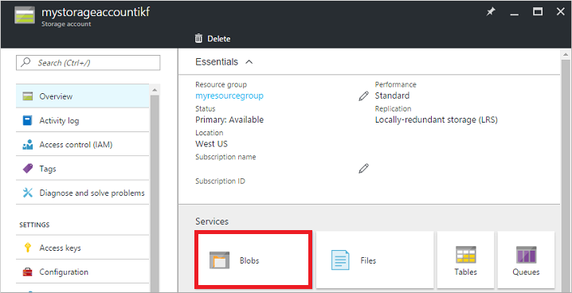
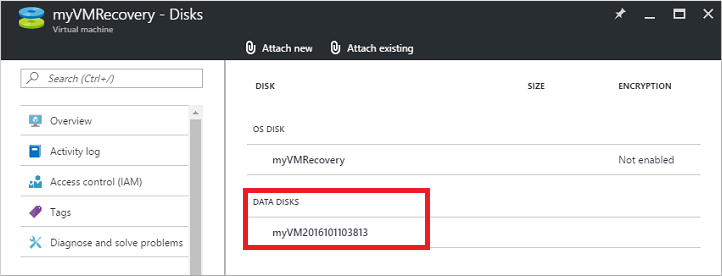
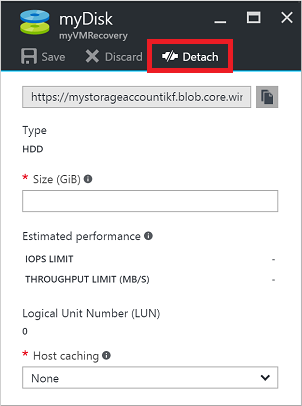

<properties
    pageTitle="在 Azure 门户中使用 Windows 故障排除 VM | Azure"
    description="了解如何通过使用 Azure 门户将 OS 磁盘连接到恢复 VM 来排查 Azure 中的 Windows 虚拟机问题"
    services="virtual-machines-windows"
    documentationCenter=""
    authors="iainfoulds"
    manager="timlt"
    editor="" />
<tags
    ms.service="virtual-machines-windows"
    ms.devlang="na"
    ms.topic="article"
    ms.tgt_pltfrm="vm-windows"
    ms.workload="infrastructure"
    ms.date="12/12/2016"
    wacn.date="01/13/2017"
    ms.author="iainfou" />  

# 通过使用 Azure 门户将 OS 磁盘附加到恢复 VM 来对 Windows VM 进行故障排除
如果 Windows 虚拟机 (VM) 在 Azure 中遇到启动或磁盘错误，可能需要对虚拟硬盘本身执行故障排除步骤。一个常见示例是应用程序更新失败，使 VM 无法成功启动。本文详细介绍如何使用 Azure 门户将虚拟硬盘连接到另一个 Windows VM 来修复所有错误，然后重新创建原始 VM。

## 恢复过程概述
故障排除过程如下：

1. 删除遇到问题的 VM，保留虚拟硬盘。
2. 将虚拟硬盘附加并装入到另一个 Windows VM，以便进行故障排除。
3. 连接到故障排除 VM。编辑文件或运行任何工具以修复原始虚拟硬盘上的问题。
4. 从故障排除 VM 卸载并分离虚拟硬盘。
5. 使用原始虚拟硬盘创建 VM。

## 确定启动问题
若要确定 VM 不能正常启动的原因，请检查启动诊断 VM 屏幕截图。一个常见的例子是应用程序更新失败，或底层虚拟硬盘已删除或移动。

在门户中选择你的 VM，然后向下滚动到“支持 + 故障排除”部分。单击“启动诊断”查看屏幕快照。记下任何特定的错误消息或错误代码，以便确定 VM 遇到问题的原因。以下示例显示一个 VM 在正在等待系统停止服务：

  

也可单击“屏幕快照”，以便下载捕获的 VM 屏幕快照。

## 查看现有虚拟硬盘的详细信息
在将虚拟硬盘附加到另一个 VM 之前，需要标识虚拟硬盘 (VHD) 的名称。

在门户中选择资源组，然后选择存储帐户。单击“Blob”，如以下示例中所示：

  

通常，虚拟硬盘存储在一个名为 **vhds** 的容器中。请选择该容器查看虚拟硬盘的列表。记下 VHD 的名称（前缀通常是你的 VM 的名称）：

  

从列表中选择现有的虚拟硬盘，并复制 URL 供后续步骤使用：

  

## 删除现有 VM
虚拟硬盘和 VM 在 Azure 中是两个不同的资源。虚拟硬盘是操作系统本身，存储应用程序和配置。VM 本身只是定义大小或位置的元数据，引用虚拟硬盘或虚拟网络接口卡 (NIC) 等资源。每个虚拟硬盘在附加到 VM 时分配有一个租约。尽管 VM 正在运行时也可以附加和分离数据磁盘，但是，若要分离 OS 磁盘，则必须删除 VM 资源。即使 VM 处于停止和解除分配状态，租约也继续将 OS 磁盘与 VM 相关联。

恢复 VM 的第一步是删除 VM 资源本身。删除 VM 时会将虚拟硬盘留在存储帐户中。删除 VM 后，可将虚拟硬盘附加到另一个 VM，以排查和解决这些错误。

在门户中选择你的 VM，然后单击“删除”：

  

等到 VM 完成删除，然后将虚拟硬盘附加到另一个 VM。虚拟硬盘上将其与 VM 关联的租约需要释放，然后才能将虚拟硬盘附加到另一个 VM。

## 将现有虚拟硬盘附加到另一个 VM
在后续几个步骤中，将使用另一个 VM 进行故障排除。将现有虚拟硬盘附加到此故障排除 VM，以便浏览和编辑磁盘的内容。例如，此过程允许用户更正任何配置错误或者查看其他应用程序或系统日志文件。选择或创建另一个 VM 用于故障排除。

1. 在门户中选择资源组，然后选择故障排除 VM。选择“磁盘”，然后单击“附加现有磁盘”：

      

2. 若要选择现有的虚拟硬盘，请单击“VHD 文件”：

      

3. 选择存储帐户和容器，然后单击现有的 VHD。单击“选择”按钮确认所做的选择：

      

4. 选择 VHD 后，请单击“确定”附加现有虚拟硬盘：

      

5. 几秒钟后，VM 的“磁盘”窗格将列出作为数据磁盘连接的现有虚拟硬盘：

      

## 装载附加的数据磁盘

1. 打开到 VM 的远程桌面连接。在门户中选择 VM，然后单击“连接”。下载并打开 RDP 连接文件。输入登录 VM 所需的凭据，如下所示：

      

2. 打开“服务器管理器”，然后选择“文件和存储服务”。

      

3. 系统会自动检测并附加数据磁盘。若要查看已连接磁盘的列表，请选择“磁盘”。用户可以选择要查看卷信息（包括驱动器号）的数据磁盘。以下示例显示了使用 **F:** 的附加数据磁盘：

      

## 修复原始虚拟硬盘上的问题
装载现有虚拟硬盘后，可以根据需要执行任何维护和故障排除步骤。解决问题后，请继续执行以下步骤。

## 卸载并分离原始虚拟硬盘
解决错误后，可从故障排除 VM 中分离现有虚拟硬盘。在将虚拟硬盘附加到故障排除 VM 的租约释放前，不能将该虚拟硬盘用于任何其他 VM。

1. 在到 VM 的 RDP 会话中，打开“服务器管理器”，然后选择“文件和存储服务”：

      

2. 选择“磁盘”，然后选择数据磁盘。右键单击数据磁盘，然后选择“脱机”：

      

3. 现在从 VM 中分离虚拟硬盘。请在 Azure 门户中选择 VM，然后单击“磁盘”。选择现有的虚拟硬盘，然后单击“分离”：

      

    等到 VM 成功分离数据磁盘，然后继续操作。

## 从原始硬盘创建 VM
若要从原始虚拟硬盘创建 VM，请使用[此 Azure Resource Manager 模板](https://github.com/Azure/azure-quickstart-templates/tree/master/201-vm-specialized-vhd-existing-vnet)。该模板使用前面命令中的 VHD URL 将 VM 部署到现有虚拟网络。请勿单击 GitHub 存储库中的“部署到 Azure”，因为该项是针对全球 Azure 的。与之相反，请单击下面的这个：

模板已加载到 Azure 门户中进行部署。请输入新 VM 和现有 Azure 资源的名称，然后粘贴现有虚拟硬盘的 URL。若要开始部署，请单击“购买”：

  

## 重新启用启动诊断
从现有虚拟硬盘创建 VM 时，启动诊断可能不会自动启用。若要检查启动诊断的状态并根据需要打开启动诊断，请在门户中选择你的 VM。在“监视”下面，单击“诊断设置”。确保状态为“打开”，并检查“启动诊断”旁边的复选标记是否为选中状态。如果做了任何更改，请单击“保存”：

  

## 后续步骤
如果在连接到 VM 时遇到问题，请参阅[排查 Azure VM 的 RDP 连接问题](/documentation/articles/virtual-machines-windows-troubleshoot-rdp-connection/)。如果在访问 VM 上运行的应用时遇到问题，请参阅[排查 Windows VM 上的应用程序连接问题](/documentation/articles/virtual-machines-windows-troubleshoot-app-connection/)。

有关资源组的详细信息，请参阅 [Azure Resource Manager 概述](/documentation/articles/resource-group-overview/)。

<!---HONumber=Mooncake_0109_2017-->