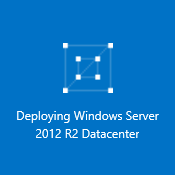

<properties
    pageTitle="使用 Azure 门户预览创建具有静态公共 IP 的 VM | Azure"
    description="了解如何使用 Azure 门户预览通过 Azure Resource Manager 创建具有静态公共 IP 地址的 VM。"
    services="virtual-network"
    documentationcenter="na"
    author="jimdial"
    manager="carmonm"
    editor=""
    tags="azure-resource-manager" />  

<tags
    ms.assetid="e9546bcc-f300-428f-b94a-056c5bd29035"
    ms.service="virtual-network"
    ms.devlang="na"
    ms.topic="article"
    ms.tgt_pltfrm="na"
    ms.workload="infrastructure-services"
    ms.date="02/04/2016"
    wacn.date="12/26/2016"
    ms.author="jdial" />  

# 使用 Azure 门户预览创建具有静态公共 IP 的 VM
> [AZURE.SELECTOR]
- [Azure 门户预览](/documentation/articles/virtual-network-deploy-static-pip-arm-portal/)
- [PowerShell](/documentation/articles/virtual-network-deploy-static-pip-arm-ps/)
- [Azure CLI](/documentation/articles/virtual-network-deploy-static-pip-arm-cli/)
- [模板](/documentation/articles/virtual-network-deploy-static-pip-arm-template/)
- [PowerShell（经典）](/documentation/articles/virtual-networks-reserved-public-ip/)

[AZURE.INCLUDE [virtual-network-deploy-static-pip-intro-include.md](../../includes/virtual-network-deploy-static-pip-intro-include.md)]

> [AZURE.NOTE]
Azure 具有两种不同的部署模型，用于创建和处理资源：[Resource Manager 模型和经典模型](/documentation/articles/resource-manager-deployment-model/)。本文介绍如何使用 Resource Manager 部署模型。Azure 建议对大多数新的部署使用该模型，而不是经典部署模型。

[AZURE.INCLUDE [virtual-network-deploy-static-pip-scenario-include.md](../../includes/virtual-network-deploy-static-pip-scenario-include.md)]

## 使用静态公共 IP 创建 VM

若要在 Azure 门户预览中创建具有静态公共 IP 地址的 VM，请完成以下步骤：

1. 从浏览器导航到 [Azure 门户预览](https://portal.azure.cn)，使用 Azure 帐户登录（如有必要）。
2. 在门户左上角，单击“新建”>“计算”>“Windows Server 2012 R2 Datacenter”。
3. 在“选择部署模型”列表中，选择“Resource Manager”，然后单击“创建”。
4. 在“基本”边栏选项卡中，输入如下所示的 VM 信息，然后单击“确定”。
   
      

5. 在“选择大小”边栏选项卡中，依次单击“A1 标准”（如下所示）和“选择”。
   
      

6. 在“设置”边栏选项卡中，单击“公共 IP 地址”，然后在“创建公共 IP 地址”边栏选项卡的“分配”下，单击“静态”，如下所示。然后，单击“确定”。
   
      

7. 在“设置”边栏选项卡中，单击“确定”。
8. 查看“摘要”边栏选项卡（如下所示），然后单击“确定”。
   
      

9. 请注意仪表板中的新磁贴。
   
      

10. 创建 VM 后，“设置”边栏选项卡会如下所示
    
      

<!---HONumber=Mooncake_1219_2016-->