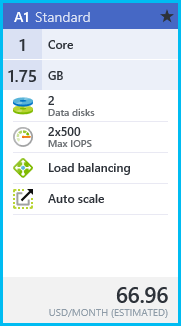
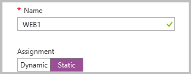

<!-- ARM: tested -->

<properties 
   pageTitle="在 Resource Manager 中使用 Azure 门户预览通过静态公共 IP 部署 VM | Azure"
   description="了解如何在 Resource Manager 中使用 Azure 门户预览通过静态公共 IP 部署 VM"
   services="virtual-network"
   documentationCenter="na"
   authors="telmosampaio"
   manager="carmonm"
   editor=""
   tags="azure-resource-manager"
/>
<tags
	ms.service="virtual-network"
	ms.date="02/04/2016"
	wacn.date="07/04/2016"/>

# 使用 Azure 门户预览通过静态公共 IP 部署 VM

[AZURE.INCLUDE [virtual-network-deploy-static-pip-arm-selectors-include.md](../includes/virtual-network-deploy-static-pip-arm-selectors-include.md)]

[AZURE.INCLUDE [virtual-network-deploy-static-pip-intro-include.md](../includes/virtual-network-deploy-static-pip-intro-include.md)]

> [AZURE.NOTE]Azure 具有用于创建和处理资源的两个不同的部署模型：[资源管理器和经典](/documentation/articles/resource-manager-deployment-model/)。这篇文章介绍如何使用资源管理器部署模型，Azure 建议大多数新部署使用资源管理器模型替代经典部署模型。

[AZURE.INCLUDE [virtual-network-deploy-static-pip-scenario-include.md](../includes/virtual-network-deploy-static-pip-scenario-include.md)]

## 使用静态公共 IP 创建 VM 

若要在 Azure 门户预览中使用静态公共 IP 地址创建 VM，请按以下步骤操作。

1. 从浏览器导航到 [Azure 门户预览](https://portal.azure.cn)。如有必要，请使用 Azure 帐户登录。
2. 在门户预览左上角，单击“新建”>“计算”>“Windows Server 2012 R2 Datacenter”。
3. 在“选择部署模型”列表中，选择“Resource Manager”，然后单击“创建”。
4. 在“基本信息”边栏选项卡中，输入如下所示的 VM 信息，然后单击“确定”。

	

5. 在“选择大小”边栏选项卡中，单击“A1 标准”（如下所示），然后单击“选择”。

	

6. 在“设置”边栏选项卡中，单击“公共 IP 地址”，然后在“创建公共 IP 地址”边栏选项卡的“分配”下，单击“静态”，如下所示。然后，单击“确定”。

	

7. 在“设置”边栏选项卡中，单击“确定”。
8. 查看“摘要”边栏选项卡（如下所示），然后单击“确定”。

	

9. 请注意仪表板中的新磁贴。

	

10. 创建 VM 后，“设置”边栏选项卡将如下所示

	

<!---HONumber=Mooncake_0418_2016-->