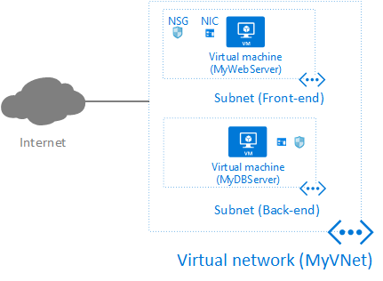
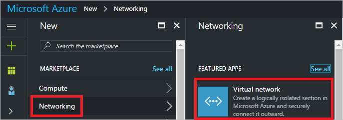
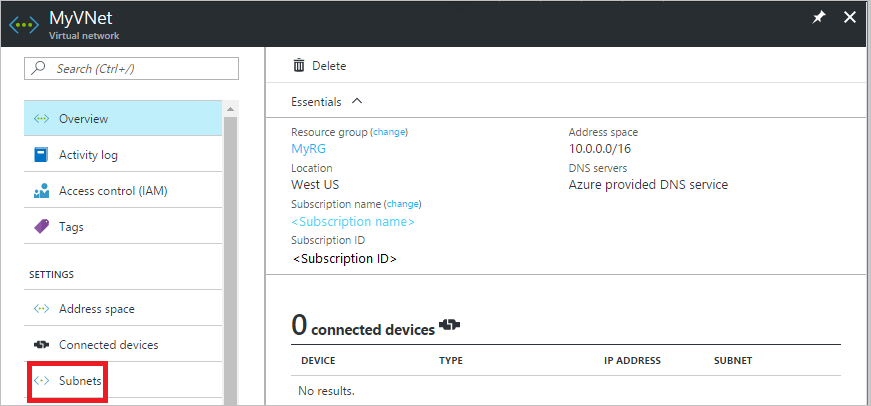
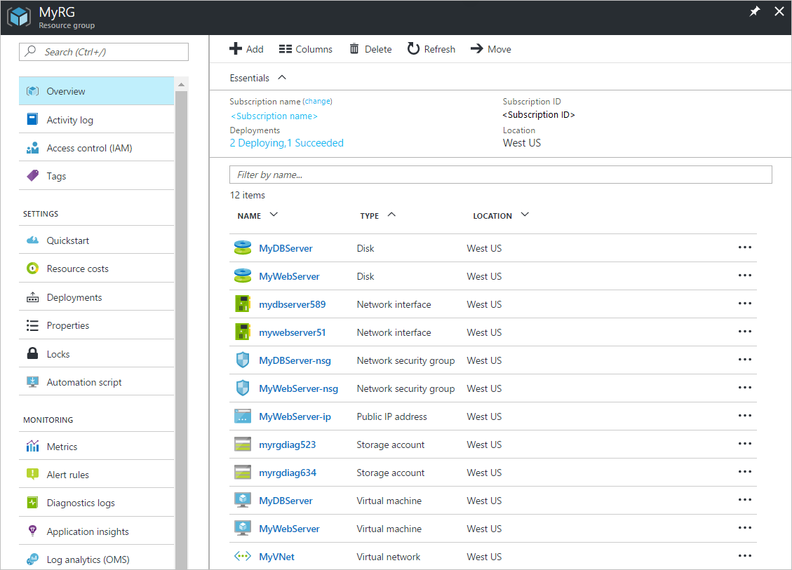
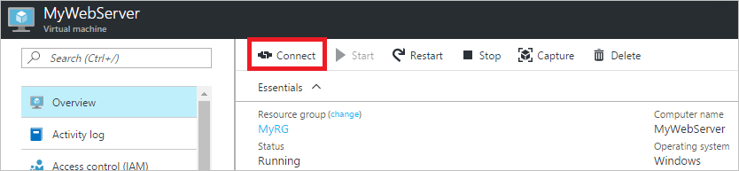
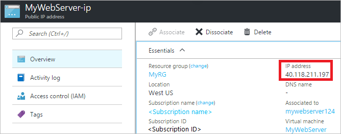

<properties
    pageTitle="创建首个 Azure 虚拟网络 | Azure"
    description="了解如何创建 Azure 虚拟网络 (VNet)、将两个虚拟机 (VM) 连接到 VNet，以及如何连接到 VM。"
    services="virtual-network"
    documentationcenter=""
    author="jimdial"
    manager="timlt"
    editor=""
    tags="azure-resource-manager" />
<tags
    ms.assetid=""
    ms.service="virtual-network"
    ms.devlang="na"
    ms.topic="hero-article"
    ms.tgt_pltfrm="na"
    ms.workload="infrastructure-services"
    ms.date="02/27/2016"
    wacn.date="03/31/2017"
    ms.author="jdial" />  

# 创建首个虚拟网络

了解如何创建包含两个子网的虚拟网络 (VNet)，创建两个虚拟机 (VM)，并将每个 VM 连接到其中一个子网，如下图所示：

  

Azure 虚拟网络 (VNet) 是你自己的网络在云中的表示形式。你可以控制 Azure 网络设置并定义 DHCP 地址块、DNS 设置、安全策略和路由。若要详细了解 VNet 概念，请参阅[虚拟网络概述](/documentation/articles/virtual-networks-overview/)一文。完成以下步骤创建图中所示的资源：

1. [创建包含两个子网的 VNet](#create-vnet)
2. [创建两个 VM，各带一个网络接口 (NIC)](#create-vms)，并将网络安全组 (NSG) 与每个 NIC 相关联
3. [连接到 VM 和从 VM 连接](#connect-to-from-vms)
4. [删除所有资源](#delete-resources)。对于该练习中创建的某些资源，其预配时会产生费用。为尽量削减费用，完成练习后，请务必完成本节中的步骤以删除创建的资源。

你将基本了解在完成本节中的步骤后可如何使用 VNet。提供后续步骤，便于你详细了解如何更深层次地使用 VNet。

## 创建包含两个子网的虚拟网络

若要创建包含两个子网的虚拟网络，请完成以下步骤。通常使用不同子网控制各子网间的通信流量。

1. 登录 [Azure 门户](https://portal.azure.cn)。如果还没有帐户，可注册 [1 个月期限的试用版](/pricing/1rmb-trial/)。
2. 在门户的“收藏夹”窗格中，单击“新建”。
3. 在“新建”边栏选项卡中，单击“网络”。在“网络”边栏选项卡中单击“虚拟网络”，如下图所示：

      

4.  在“虚拟网络”边栏选项卡中，将“Resource Manager”保留为部署模型，然后单击“创建”。
5.  在显示的“创建虚拟网络”边栏选项卡中，输入以下值，然后单击“创建”：

    |**设置**|**值**|**详细信息**|
    |---|---|---|
    |**Name**|*MyVNet*|名称在资源组中必须唯一。|
    |**地址空间**|*10.0.0.0/16*|可通过 CIDR 注释指定任意地址空间。|
    |**子网名称**|*前端*|子网名称在虚拟网络中必须唯一。|
    |**子网地址范围**|*10.0.0.0/24*| 指定的范围必须位于为该虚拟网络定义的地址空间内。|
    |**订阅**|*[用户的订阅]*|选择要在其中创建 VNet 的订阅。VNet 位于单个订阅内。|
    |**资源组**|**新建：***MyRG*|创建资源组。资源组名称在所选订阅中必须唯一。若要详细了解资源组，请参阅 [Resource Manager 概述](/documentation/articles/resource-group-overview/#resource-groups)一文。|
    |**位置**|*中国北部*| 通常选择在物理位置上最接近你的位置。|

    VNet 创建需耗时几秒。创建后，将显示 Azure 门户仪表板。

6. 创建虚拟网络后，在 Azure 门户的“收藏夹”窗格中单击“所有资源”。在“所有资源”边栏选项卡中，单击“MyVNet”虚拟网络。如果所选订阅中已有多个资源，则可在“按名称筛选...”框中输入“MyVNet”，以轻松访问该 VNet。
7. “MyVNet”边栏选项卡将打开并显示 VNet 相关信息，如下图所示：

      

8. 如上图所示，单击“子网”显示 VNet 中子网的列表。只存在**前端**子网，即步骤 5 中创建的子网。
9. 在“MyVNet -子网”边栏选项卡中，单击“+子网”以基于下述信息创建子网，然后单击“确定”进行创建：

    |**设置**|**值**|**详细信息**|
    |---|---|---|
    |**Name**|*后端*|名称在虚拟网络中必须唯一。|
    |**地址范围**|*10.0.1.0/24*|指定的范围必须位于为该虚拟网络定义的地址空间内。|
    |**网络安全组**和**路由表**|*无*（默认值）|网络安全组 (NSG) 将在本文稍后部分讲解。若要详细了解用户定义的路由，请参阅[用户定义的路由](/documentation/articles/virtual-networks-udr-overview/)一文。|

10. 将新的子网添加到 VNet 之后，可关闭“MyVNet -子网”边栏选项卡，然后关闭“所有资源”边栏选项卡。

## 创建虚拟机

VNet 和子网创建完毕后，即可创建 VM。虽然两个 VM 可运行 Azure 支持的任意操作系统（包括多个不同的 Linux 分发），但在该练习中，它们都运行 Windows Server 操作系统。

### 创建 Web 服务器 VM

若要创建 Web 服务器 VM，请完成以下步骤：

1. 在 Azure 门户的“收藏夹”窗格中，依次单击“新建”、“计算”和“Windows Server 2016 Datacenter”。
2. 在“Windows Server 2016 Datacenter”边栏选项卡中，单击“创建”。
3. 在显示的“基本信息”边栏选项卡中，输入或选择以下值并单击“确定”：

    |**设置**| **值**|**详细信息**|
    |---|---|---|
    |**Name**|*MyWebServer*|此 VM 用作 Internet 资源连接到的 Web 服务器。|
    |**VM 磁盘类型**|*SSD*|
    |**用户名**|*由用户决定*|
    |**密码和确认密码**|*由用户决定*|
    | **订阅**|*<用户的订阅>*|该订阅必须等同于在本文[创建包含两个子网的虚拟网络](#create-vnet)部分的步骤 5 中所选的订阅。VM 所连接到的 VNet 必须与该 VM 位于同一订阅中。|
    |**资源组**|**使用现有组：**选择“MyRG”|虽然使用的资源组与 VNet 所用的相同，但资源无需位于同一资源组中。|
    |**位置**|*中国北部*|该位置必须等同于在本文[创建包含两个子网的虚拟网络](#create-vnet)部分的步骤 5 中指定的位置。VM 及其连接到的 VNet 必须位于同一位置。|

4. 在“选择大小”边栏选项卡中，单击“DS1\_V2 标准”，然后单击“选择”。有关 Azure 支持的所有 Windows VM 大小的列表，请参阅 [Windows VM 大小](/documentation/articles/virtual-machines-windows-sizes/)一文。
5. 在“设置”边栏选项卡中，输入或选择以下值并单击“确定”：

    |**设置**|**值**|**详细信息**|
    |---|---|---|
    |**虚拟网络**| 选择“MyVNet”|可选择要创建的 VM 所在的同一位置下的任意 VNet。若要详细了解 VNet 和子网，请参阅[虚拟网络](/documentation/articles/virtual-networks-overview/)一文。|
    |**子网**|选择“前端”|可选择 VNet 中的任意子网。|
    |**公共 IP 地址**|接受默认值|公共 IP 地址允许通过 Internet 连接到 VM。若要详细了解公共 IP 地址，请参阅 [IP 地址](/documentation/articles/virtual-network-ip-addresses-overview-arm/#public-ip-addresses)一文。|
    |**网络安全组（防火墙）**|接受默认值|单击门户创建的“(新) MyWebServer-nsg”默认 NSG，以查看其设置。在打开的“创建网络安全组”边栏选项卡中，请注意该组中的某个入站规则允许来自任何源 IP 地址的 TCP/3389 (RDP) 通信。|
    |**其他所有值**|接受默认值|若要详细了解剩余设置，请参阅[关于 VM](/documentation/articles/virtual-machines-windows-overview/) 一文。|

    借助网络安全组 (NSG)，可为流入和流出 VM 的网络流量类型创建入站/出站规则。默认拒绝所有到 VM 的入站流量。可能要为生产 Web 服务器添加额外的 TCP/80 (HTTP)和 TCP/443 (HTTPS) 入站规则。没有出站流量规则，因为默认允许所有出站流量。可添加/删除规则，根据策略控制流量。阅读[网络安全组](/documentation/articles/virtual-networks-nsg/)一文，了解有关 NSG 的详细信息。

6.  在“摘要”边栏选项卡上查看设置，然后单击“确定”以创建 VM。VM 创建后，门户仪表板上将显示“状态”磁贴。创建操作可能耗时几分钟。无需等待创建完成。在 VM 创建期间，可继续执行下一步。

### 创建数据库服务器 VM

若要创建数据库服务器 VM，请完成以下步骤：

1.  在“收藏夹”窗格中，依次单击“新建”、“计算”和“Windows Server 2016 Datacenter”。
2.  在“Windows Server 2016 Datacenter”边栏选项卡中，单击“创建”。
3.  在“基本信息”边栏选项卡中，输入或选择以下值，然后单击“确定”：

    |**设置**|**值**|**详细信息**|
    |---|---|---|
    |**Name**|*MyDBServer*|此 VM 充当 Web 服务器连接到，但 Internet 无法连接到的数据库服务器。|
    |**VM 磁盘类型**|*SSD*||
    |**用户名**|由用户决定||
    |**密码和确认密码**|由用户决定||
    |**订阅**|<用户的订阅>|该订阅必须等同于在本文[创建包含两个子网的虚拟网络](#create-vnet)部分的步骤 5 中所选的订阅。|
    |**资源组**|**使用现有组：**选择“MyRG”|虽然使用的资源组与 VNet 所用的相同，但资源无需位于同一资源组中。|
    |**位置**|*中国北部*|该位置必须等同于在本文[创建包含两个子网的虚拟网络](#create-vnet)部分的步骤 5 中指定的位置。|

4.  在“选择大小”边栏选项卡中，单击“DS1\_V2 标准”，然后单击“选择”。
5.  在“设置”边栏选项卡中，输入或选择以下值并单击“确定”：

    |**设置**|**值**|**详细信息**|
    |----|----|---|
    |**虚拟网络**|选择“MyVNet”|可选择要创建的 VM 所在的同一位置下的任意 VNet。|
    |**子网**|单击“子网”框，然后在“选择子网”边栏选项卡选择“后端”|可选择 VNet 中的任意子网。|
    |**公共 IP 地址**|无 - 单击默认地址，然后在“选择公共 IP 地址”边栏选项卡中单击“无”|若没有公共 IP 地址，就只能通过连接到同一 VNet 的其他 VM 连接到此 VM。不能直接从 Internet 连接到该 VM。|
    |**网络安全组（防火墙）**|接受默认值| 与为 MyWebServer VM 创建的默认 NSG 一样，此 NSG 也具有相同的默认入站规则。可为数据库服务器添加额外的 TCP/1433 (MS SQL) 入站规则。没有出站流量规则，因为默认允许所有出站流量。可添加/删除规则，根据策略控制流量。|
    |**其他所有值**|接受默认值||

6.  在“摘要”边栏选项卡上查看设置，然后单击“确定”以创建 VM。VM 创建后，门户仪表板上将显示“状态”磁贴。创建操作可能耗时几分钟。无需等待创建完成。在 VM 创建期间，可继续执行下一步。

## 查看资源

虽然你创建了 1 个 VNet 和 2 个 VM，但 Azure 门户仍在 MyRG 资源组中创建了多个其他资源。请完成以下步骤，查看 MyRG 资源组的内容：

1. 在“收藏夹”窗格中，单击“更多服务”。
2. 在该窗格内填有“筛选器”一词的框中键入“资源组”。若在筛选后的列表中显示，则单击“资源组”。
3. 在“资源组”窗格中，单击“MyRG”资源组。如果订阅中有多个现有资源组，则可在含有“按名称筛选...”文本的框中键入“MyRG”，以快速访问 MyRG 资源组。
4.  在“MyRG”边栏选项卡中，将看到资源组包含 12 个资源，如下图所示：

      

若要详细了解 VM、磁盘和存储帐户，请参阅[虚拟机](/documentation/articles/virtual-machines-windows-overview/)、[磁盘](/documentation/articles/storage-about-disks-and-vhds-windows/)和[存储帐户](/documentation/articles/storage-introduction/)概述文章。可看到门户代为创建的两个默认 NSG。还可看到门户创建了两个网络接口 (NIC) 资源。其中一个 NIC 允许 VM 通过 VNet 连接到其他资源。有关 NIC 的详细信息，请参阅 [NIC](/documentation/articles/virtual-network-network-interface/) 一文。门户还创建了一个公共 IP 地址资源。公共 IP 地址是针对公共 IP 地址资源的一种设置。若要详细了解公共 IP 地址，请参阅 [IP 地址](/documentation/articles/virtual-network-ip-addresses-overview-arm/#public-ip-addresses)一文。

## 连接到 VM

创建 VNet 和两个 VM 后，可通过完成以下各节中的步骤连接到 VM：

### 从 Internet 连接到 Web 服务器 VM

若要从 Internet 连接到 Web 服务器 VM，请完成以下步骤：

1. 在门户中，通过完成本文[查看资源](#review)部分中的步骤打开 MyRG 资源组。
2. 在“MyRG”边栏选项卡中，单击“MyWebServer”VM。
3. 在“MyWebServer”边栏选项卡中单击“连接”，如下图所示：

      

4. 允许浏览器下载“MyWebServer.rdp”文件，然后将其打开。
5. 如果收到一个对话框，显示无法验证远程连接的发布者，请单击“连接”。
6. 输入凭据时，请确保登录时所用的用户名和密码与本文[创建 Web 服务器 VM](#create-web-server-vm) 部分的步骤 3 中所指定的相同。如果显示的“Windows 安全性”框中未列出正确的凭据，则可能需要单击“更多选择”，然后单击“使用其他帐户”，以指定正确的用户名和密码。单击“确定”以连接到 VM。
7. 如果收到“远程桌面连接”框，显示无法验证远程计算机的标识，请单击“是”。
8. 现已从 Internet 连接到 MyWebServer VM。保持远程桌面连接打开，完成下一节中的步骤。

该远程连接指向分配给公共 IP 地址资源的公共 IP 地址，其中该资源是在本文[创建包含两个子网的虚拟网络](#create-vnet)部分的步骤 5 中由门户创建的。允许该连接的原因是，**MyWebServer-nsg** NSG 中创建的默认规则允许通过 TCP/3389 (RDP) 从任意源 IP 地址入站到 VM。如果尝试通过任何其他端口连接到 VM，则连接将失败，除非在允许其他端口的 NSG 中添加了其他入站规则。

>[AZURE.NOTE]
向 NSG 添加其他入站规则时，请确保 Windows 防火墙上的相同端口是打开的，否则连接将失败。
>

### 从 Web 服务器 VM 连接到 Internet

若要从 Web 服务器 VM 连接到 Internet，请完成以下步骤：

1. 如果尚未打开指向 MyWebServerVM 的远程连接，请完成本文[从 Internet 连接到 Web 服务器 VM](#connect-from-internet) 部分中的步骤，建立到 VM 的远程连接。
2. 在 Windows 桌面上，打开“Internet Explorer”。在“安装 Internet Explorer 11”对话框中，单击“不使用推荐的设置”，然后单击“确定”。建议接受生产服务器的推荐设置。
3. 在 Internet Explorer 地址栏中，输入“[bing.com](http://www.bing.com)”。如果收到 Internet Explorer 对话框，则单击“添加”，然后在“受信任的网站”对话框中单击“添加”，再单击“关闭”。任何其他 Internet Explorer 对话框均重复此过程。
4. 在必应搜索页面中，输入“whatsmyipaddress”，然后单击“放大镜”按钮。在你创建 VM 时，必应会返回分配到门户创建的公共 IP 地址资源的公共 IP 地址。如果检查“MyWebServer-ip”资源的设置，可看到分配给公共 IP 地址资源的 IP 地址，如下图所示。但分配到 VM 的 IP 地址不同。

      

5.  保持远程桌面连接打开，完成下一节中的步骤。

可通过 VM 连接到 Internet，因为默认允许来自 VM 的所有出站连接。可将其他规则添加到应用于 NIC 的 NSG 和/或 NIC 连接到的子网，进而限制出站连接。

如果通过门户将 VM 置于停止（已释放）状态，即可更改公共 IP 地址。如果要求公共 IP 地址永不更改，可使用 IP 地址的静态分配方法，而不是默认的动态分配方法。若要详细了解分配方法之间的差异，请参阅 [IP 地址类型和分配方法](/documentation/articles/virtual-network-ip-addresses-overview-arm/)一文。

### 从 Web 服务器 VM 连接到数据库服务器 VM

若要从 Web 服务器 VM 连接到数据库服务器 VM，请完成以下步骤：

1. 如果尚未打开指向 MyWebServer VM 的远程连接，请完成本文[从 Internet 连接到 Web 服务器 VM](#connect-from-internet) 部分中的步骤，建立连接到 VM 的远程连接。
2. 单击 Windows 桌面左下角的“开始”按钮，然后开始键入“远程桌面”。“开始”菜单列表显示“远程桌面连接”时单击它。
3. 在“远程桌面连接”对话框中，输入计算机名称“MyDBServer”并单击“连接”。
4. 输入在本文[创建数据库服务器 VM](#create-database-server-vm) 部分的步骤 3 中输入的用户名和密码，然后单击“确定”。
5. 如果收到一个对话框，显示无法验证远程计算机的标识，请单击“是”。
6. 将到两个服务器的远程桌面连接保持打开状态，完成下一节中的步骤。

可建立从 Web 服务器 VM 到数据库服务器 VM 的连接，原因如下：

- 对于本文[创建数据库服务器 VM](#create-database-server-vm) 部分的步骤 5 中创建的默认 NSG 中的任何源 IP，启用 TCP/3389 入站连接。
- 启用了来自 Web 服务器 VM 的连接，其与数据库服务器 VM 连接到同一个 VNet。若要连接到未分配有公共 IP 地址的 VM，必须从连接到同一 VNet 的其他 VM 进行连接，即使该 VM 连接到其他子网也是如此。
- 尽管 VM 连接到不同子网，Azure 仍会创建实现子网间连接的默认路由。但是，可通过自行创建路由覆盖默认路由。若要详细了解 Azure 中的路由，请参阅[用户定义的路由](/documentation/articles/virtual-networks-udr-overview/)一文。

如果尝试启动从 Internet 到数据库服务器 VM 的远程连接，如在本文[从 Internet 连接到 Web 服务器 VM](#connect-from-internet) 部分中的操作一样，将看到“连接”选项呈灰显。灰显的原因是，未向 VM 分配公共 IP 地址，因此无法建立从 Internet 到该 VM 的入站连接。

### 从数据库服务器 VM 连接到 Internet

请完成以下步骤，建立从数据库服务器 VM 到 Internet 的出站连接：

1. 如果尚未打开从 MyWebServer VM 到 MyDBServer VM 的远程连接，请完成本文[从 Web 服务器 VM 连接到 数据库服务器 VM](#webserver-to-dbserver) 部分中的步骤。
2. 在 Windows 桌面的 MyDBServer VM 上，打开 Internet Explorer 并响应对话框，如本文[从 Web 服务器 VM 连接到 Internet](#connect-to-internet) 部分的步骤 2 和 3 中所述。
3. 在地址栏中输入“[bing.com](http://www.bing.com)”。
4. 在显示的“Internet Explorer”对话框中，单击“添加”，**添加**内容，然后在“受信任的网站”对话框中单击“关闭”。在显示的所有其他对话框中完成这些步骤。
5. 在必应搜索页面中，输入“whatsmyipaddress”，然后单击“放大镜”按钮。必应将返回 Azure 基础结构当前分配到该 VM 的公共 IP 地址。6.关闭从 MyWebServer VM 到 MyDBServer VM 的远程桌面，然后关闭到 MyWebServer VM 的远程连接。

允许指向 Internet 的出站连接，因为默认允许所有出站流量，即使公共 IP 地址资源未分配到 MyDBServer VM 也是如此。默认情况下，无论 VM 是否分配有公共 IP 地址资源，所有 VM 均可出站连接到 Internet。但是，无法从 Internet 连接到公共 IP 地址，正如可为分配有公共 IP 地址资源的 MyWebServer VM 建立连接一样。

## 删除所有资源

若要删除本文中创建的所有资源，请完成以下步骤：

1. 若要查看本文中创建的 MyRG 资源组，请完成本文[查看资源](#review)部分中的步骤 1-3。再次查看资源组中的资源。如果先前的每个步骤中都创建了 MyRG 资源组，则会看到步骤 4 的图中显示 12 个资源。
2. 在“MyRG”边栏选项卡中，单击“删除”按钮。
3. 门户将要求你键入资源组的名称以确认要将其删除。如果发现某些资源在本文[查看资源](#review)部分的步骤 4 中未显示，请单击“取消”。如果只看到本文过程中创建的 12 个资源，请键入资源组名称“MyRG”，然后单击“删除”。资源组将连同其内附的所有资源一并删除，因此在删除前，请始终要确认资源组的内容。门户将删除资源组中包含的所有资源，然后删除资源组本身。此过程需耗时几分钟。

## 后续步骤

在此练习中，创建了一个 VNet 和两个 VM。在 VM 创建期间指定了一些自定义设置，并接受了多个默认设置。建议在部署生产 VNet 和 VM 之前阅读以下文章，确保了解所有可用设置：

- [虚拟网络](/documentation/articles/virtual-networks-overview/)
- [公共 IP 地址](/documentation/articles/virtual-network-ip-addresses-overview-arm/#public-ip-addresses)
- [网络接口](/documentation/articles/virtual-network-network-interface/)
- [网络安全组](/documentation/articles/virtual-networks-nsg/)
- [虚拟机](/documentation/articles/virtual-machines-windows-overview/)

<!---HONumber=Mooncake_0327_2017-->