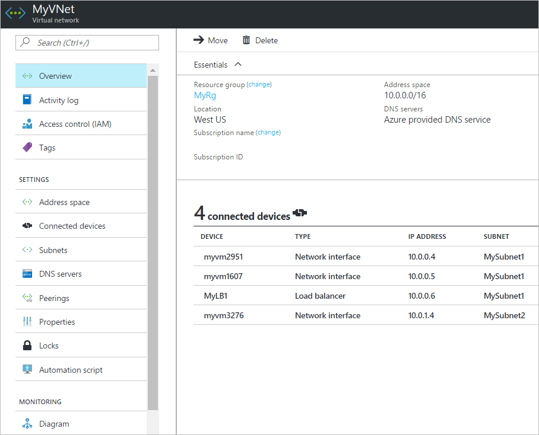

<properties
    pageTitle="创建、更改或删除 Azure 虚拟网络 | Azure"
    description="了解如何创建、更改或删除虚拟网络。"
    services="virtual-network"
    documentationcenter="na"
    author="jimdial"
    manager="timlt"
    editor=""
    tags="azure-resource-manager" />
<tags
    ms.assetid=""
    ms.service="virtual-network"
    ms.devlang="na"
    ms.topic="article"
    ms.tgt_pltfrm="na"
    ms.workload="infrastructure-services"
    ms.date="05/10/2017"
    wacn.date="06/05/2017"
    ms.author="v-dazen"
    ms.translationtype="Human Translation"
    ms.sourcegitcommit="08618ee31568db24eba7a7d9a5fc3b079cf34577"
    ms.openlocfilehash="c8088b89393b56af026be1a729e47ce58969389f"
    ms.contentlocale="zh-cn"
    ms.lasthandoff="05/26/2017" />

# 创建、更改或删除虚拟网络

了解如何创建和删除虚拟网络 (VNet) 以及更改现有 VNet 的设置，如 DNS 服务器和 IP 地址空间。 VNet 是你自己的网络在云中的表示形式。 VNet 是对专用于你的订阅的 Azure 云进行的逻辑隔离。 对于每个 VNet，可执行以下操作：
- 选择要分配的地址空间。 地址空间由使用 CIDR 表示法定义的一个或多个地址范围组成，例如 10.0.0.0/16。
- 选择为每个 VNet 使用 Azure 提供的 DNS 服务器或自己的 DNS 服务器。 连接到 VNet 的所有资源都分配此 DNS 服务器来解析 VNet 中的名称。
- 将 VNet 分段为子网，每个子网在 VNet 的地址空间中都有其自己的地址范围。 若要了解如何创建、更改和删除子网，请参阅[添加、更改或删除子网](/documentation/articles/virtual-network-manage-subnet/)一文。

本文介绍如何创建 VNet，以及更改和删除通过 Azure Resource Manager 部署模型创建的 VNet。

## 准备工作

在完成本文任何部分中的步骤之前，请完成以下任务：

- 如果你不熟悉子网，我们建议在阅读本文之前，先完成[创建第一个 Azure 虚拟网络](/documentation/articles/virtual-network-get-started-vnet-subnet/)中的练习。 该练习可帮助你熟悉 VNet。
- 查看 [Azure 限制](/documentation/articles/azure-subscription-service-limits/#azure-resource-manager-virtual-networking-limits)一文，了解 VNet 的限制。
- 使用 Azure 帐户登录到 Azure 门户、Azure 命令行接口 (CLI) 或 Azure PowerShell。 如果还没有 Azure 帐户，请注册[试用帐户](/pricing/1rmb-trial)。
- 如果使用 Azure PowerShell 命令来完成本文中的任务，首先必须[安装和配置 Azure PowerShell](https://docs.microsoft.com/zh-cn/powershell/azureps-cmdlets-docs)。 确保已安装最新版本的 Azure PowerShell cmdlet。 若要获取 PowerShell 命令的帮助和示例，请键入 `get-help <command> -full`。
- 如果使用 Azure 命令行接口 (CLI) 命令来完成本文中的任务，首先必须[安装和配置 Azure CLI](https://docs.microsoft.com/zh-cn/cli/azure/install-azure-cli)。 确保已安装最新版本的 Azure CLI。 若要获取 CLI 命令的帮助，请键入 `az <command> --help`。

## 创建虚拟网络

1. 使用已分配订阅的“网络参与者”角色权限（最低权限）的帐户登录到[门户](https://portal.azure.cn)。 请参阅[用于 Azure 基于角色的访问控制的内置角色](/documentation/articles/role-based-access-built-in-roles/#network-contributor)一文，详细了解如何将角色和权限分配给帐户。
2. 在 Azure 门户中单击“新建”。 在显示的“新建”边栏选项卡中，单击“网络”。 在显示的“网络”边栏选项卡中，单击“虚拟网络”。
3. 在显示的“虚拟网络”边栏选项卡中，保留“选择部署模型”框中选中的“Resource Manager”，然后单击“创建”。
4. 在显示的“创建虚拟网络”边栏选项卡中，输入或选择以下设置的值，然后单击“创建”：
    - **名称**：该名称在选择创建 VNet 的[资源组](/documentation/articles/azure-glossary-cloud-terminology/#resource-group)中必须唯一。 创建 VNet 后无法更改其名称。 随着时间的推移，可以创建多个 VNet。 有关命名建议，请参阅[命名约定](https://docs.microsoft.com/azure/architecture/best-practices/naming-conventions#naming-rules-and-restrictions)一文，以便管理多个 VNet。
    - **地址空间**：以 CIDR 表示法指定。 定义的地址空间可以是公共或专用 (RFC 1918) 地址。 不管是定义公共还是专用地址空间，都只能从 VNet、互连 VNet 以及已连接到 VNet 的任何本地网络内部访问该地址空间。 无法添加以下的地址空间：
        - 224.0.0.0/4（多播）
        - 255.255.255.255/32（广播）
        - 127.0.0.0/8（环回）
        - 169.254.0.0/16（本地链路）
        - 168.63.129.16/32（内部 DNS）

      尽管创建 VNet 时只能定义一个地址空间，但创建 VNet 后可以添加更多地址空间。 若要了解如何操作，请完成本文[添加/删除地址空间](#address-spaces)部分中所述的步骤。

      >[AZURE.WARNING]
      >如果 VNet 的地址空间与其他 VNet 或本地网络重叠，它们不能连接在一起。 定义地址空间之前，请考虑将来可能要将 VNet 连接到的其他 VNet 或本地网络。
      >
      >

    - **子网名称：**该名称在 VNet 中必须唯一。 创建子网后无法更改其名称。 创建 VNet 时，门户需要定义一个子网，即使 VNet 不需要包含任何子网。 创建 VNet 时门户仅允许定义一个子网，但创建 VNet 后，可将更多子网附加到创建的 VNet。 若要向 VNet 添加子网，请参阅[创建、更改或删除子网](/documentation/articles/virtual-network-manage-subnet/)一文的[创建子网](/documentation/articles/virtual-network-manage-subnet/#create-subnet)部分。 可以使用 CLI 或 PowerShell 创建包含多个子网的 VNet。

      >[AZURE.TIP]
      >通常会创建不同的子网来筛选或控制它们之间的流量路由。 在定义子网之前，请考虑如何筛选和路由子网之间的流量。 若要详细了解如何筛选子网之间的流量，请参阅[网络安全组](/documentation/articles/virtual-networks-nsg/)一文。 Azure 自动在子网之间路由，但你可以替代 Azure 的默认路由。 若要了解如何操作，请参阅[用户定义的路由](/documentation/articles/virtual-networks-udr-overview/)一文。
      >

    - **子网地址范围：**必须在为 VNet 输入的**地址空间**内。 可以指定的最小范围为 /29，为子网提供八个 IP 地址。 Azure 保留每个子网中的第一个地址和最后一个地址，以确保协议一致性。 此外还会保留三个地址供 Azure 服务使用。 因此，子网地址范围为 /29 的 VNet 有三个可用 IP 地址。 如果计划将 VNet 连接到 VPN 网关，则必须创建网关子网。 详细了解[网关子网地址范围具体考虑事项](/documentation/articles/vpn-gateway-about-vpn-gateway-settings/#gwsub)。 在特定条件下，可以在子网创建后更改地址范围。 若要了解如何更改子网地址范围，请参阅[添加、更改或删除子网](/documentation/articles/virtual-network-manage-subnet/)一文的[更改子网](/documentation/articles/virtual-network-manage-subnet/#change-subnet)部分。
    - **订阅：**选择[订阅](/documentation/articles/azure-glossary-cloud-terminology/#subscription)。 VNet 不能跨订阅，但可以使用 Azure VPN 网关或 VNet 对等互连连接到其他订阅中的 VNet。 连接到 VNet 的 Azure 资源必须属于同一订阅。
    - **资源组：**选择现有[资源组](/documentation/articles/resource-group-overview/#resource-groups)或创建新资源组。 连接到 VNet 的 Azure 资源可以属于相同或不同的资源组。
    - **位置：**选择 Azure 位置（也称为区域）。 VNet 不能跨 Azure 位置，但一个位置的 VNet 可以使用 Azure VPN 网关连接到另一个位置的 VNet。 连接到 VNet 的 Azure 资源必须在同一位置。

**命令**

|工具|命令|
|---|---|
|CLI|[az network vnet create](https://docs.microsoft.com/zh-cn/cli/azure/network/vnet#create)|
|PowerShell|[New-AzureRmVirtualNetwork](https://docs.microsoft.com/zh-cn/powershell/module/azurerm.network/new-azurermvirtualnetwork)|

## 查看虚拟网络和设置

1. 使用已分配订阅的“网络参与者”角色权限（最低权限）的帐户登录到[门户](https://portal.azure.cn)。 请参阅[用于 Azure 基于角色的访问控制的内置角色](/documentation/articles/role-based-access-built-in-roles/#network-contributor)一文，详细了解如何将角色和权限分配给帐户。
2. 在门户顶部包含“搜索资源”文本的框中，键入“虚拟网络”。 当“虚拟网络”出现在搜索结果中时，请单击它。
3. 在显示的“虚拟网络”边栏选项卡中，单击要查看其设置的 VNet。
4. 针对所选 VNet 显示的边栏选项卡中将列出以下设置：
    - **概述：**提供有关 VNet 的信息，例如其地址空间和 DNS 服务器。 下图显示了名为 **MyVNet** 的 VNet 的概述设置：

        

      可以从此边栏选项卡将 VNet 移到不同的订阅或资源组。 若要了解如何移动 VNet，请参阅[将资源移到不同的资源组或订阅](/documentation/articles/resource-group-move-resources/)一文。 此文列出了先决条件，以及如何使用 Azure 门户、PowerShell 和 Azure CLI 移动资源。 连接到 VNet 的所有资源必须连同 VNet 一起移动。 
    - **地址空间：**列出分配给 VNet 的地址空间。 若要了解如何添加和删除地址空间，请完成本文[添加/删除地址空间](#address-spaces)部分中所述的步骤。
    - **连接的设备：**显示已连接到 VNet 的所有资源。 在上图所示的示例中，有三个网络接口和一个负载均衡器连接到 VNet。 将列出创建并连接到 VNet 的所有新资源。 如果删除已连接到 VNet 的资源，它不再会显示在列表中。
    - **子网：**VNet 中的子网列表。 若要了解如何添加和删除子网，请参阅[添加、更改或删除子网](/documentation/articles/virtual-network-manage-subnet/)一文的[添加子网](/documentation/articles/virtual-network-manage-subnet/#create-subnet)和[删除子网](/documentation/articles/virtual-network-manage-subnet/#delete-subnet)部分。
    - **DNS 服务器：**可以指定 Azure 内部 DNS 服务器或自定义 DNS 服务器是否为连接到 VNet 的设备提供名称解析。 使用 Azure 门户创建 VNet 时，Azure 的 DNS 服务器默认用于 VNet 中的名称解析。 若要修改 DNS 服务器，请完成本文的[添加、更改和删除 DNS 服务器](#dns-servers)部分中所述的步骤。 
    - **对等互连：**如果订阅中存在现有的对等互连，它们将列在此处。 可以查看现有对等互连的设置，或者创建、更改或删除对等互连。 若要了解有关对等互连的详细信息，请参阅[对等互连概述](/documentation/articles/virtual-network-peering-overview/)一文。
    - **属性：**显示有关 VNet 的属性，包括 VNet 的资源 ID 及其所在的订阅。
    - **图示：**该图提供已连接到 VNet 的所有设备的可视表示形式，包括有关设备的关键信息。 可以单击任一设备直接通过此视图对其进行管理。
    - **常见的 Azure 设置：**若要详细了解常见的 Azure 设置，请参阅文章[活动日志](/documentation/articles/resource-group-overview/#activity-logs)、[访问控制 (IAM)](/documentation/articles/resource-group-overview/#access-control)、[标记](/documentation/articles/resource-group-overview/#tags)、[锁定](/documentation/articles/resource-group-lock-resources/)和[自动化脚本](/documentation/articles/resource-manager-export-template/#export-the-template-from-resource-group)。

**命令**

|**工具**|**命令**|
|---|---|
|CLI|[az network vnet show](https://docs.microsoft.com/zh-cn/cli/azure/network/vnet#show)|
|PowerShell|[Get-AzureRmVirtualNetwork](https://docs.microsoft.com/zh-cn/powershell/resourcemanager/azurerm.network/v3.8.0/get-azurermvirtualnetwork/)|

## 添加/删除地址空间

可以在 VNet 中添加和删除地址空间。 地址空间必须以 CIDR 表示法指定，并且不能在同一虚拟网络中重叠。 定义的地址空间可以是公共或专用 (RFC 1918) 地址。 不管是定义公共还是专用地址空间，都只能从 VNet、互连 VNet 以及已连接到 VNet 的任何本地网络内部访问 VNet 中的地址空间。 无法添加以下的地址空间：
    - 224.0.0.0/4（多播）
    - 255.255.255.255/32（广播）
    - 127.0.0.0/8（环回）
    - 169.254.0.0/16（本地链路）
    - 168.63.129.16/32（内部 DNS）

1. 使用已分配订阅的“网络参与者”角色权限（最低权限）的帐户登录到[门户](https://portal.azure.cn)。 请参阅[用于 Azure 基于角色的访问控制的内置角色](/documentation/articles/role-based-access-built-in-roles/#network-contributor)一文，详细了解如何将角色和权限分配给帐户。
2. 在 Azure 门户顶部包含“搜索资源”文本的框中，键入“虚拟网络”。 当“虚拟网络”出现在搜索结果中时，请单击它。
3. 在显示的“虚拟网络”边栏选项卡中，单击要在其中添加或删除地址空间的虚拟网络。
4. 在针对所选 VNet 显示的边栏选项卡的“设置”部分中，单击“地址空间”。
5. 在显示的包含地址空间的边栏选项卡中完成以下选项之一：
    - **添加地址空间：**在框中输入新的地址空间。 **注意：**该地址空间不能与针对 VNet 定义的现有地址空间重叠。
    - **删除地址空间：**右键单击某个地址空间，然后单击“删除”。 如果该地址空间包含子网，则无法删除该地址空间。 在删除某个地址空间之前，必须先删除该地址空间中的所有子网（以及已连接到这些子网的所有资源）。
6. 单击“保存” 。

**命令**

|工具|命令|
|---|---|
|CLI|仅限 Resource Manager|[az network vnet update](https://docs.microsoft.com/zh-cn/cli/azure/network/vnet#update)|
|PowerShell|[Set-AzureRmVirtualNetwork](https://docs.microsoft.com/zh-cn/powershell/module/azurerm.network/set-azurermvirtualnetwork?view=azurermps-3.8.0)|

## 添加、更改和删除 DNS 服务器

连接到 VNet 的所有 VM 将注册到为 VNet 指定的 DNS 服务器，并使用 DNS 服务器进行名称解析。 VM 中的每个网络接口 (NIC) 可以有自己的 DNS 服务器设置。 如果 NIC 有自己的 DNS 服务器设置，它们将替代 VNet 的 DNS 服务器设置。 若要了解有关 NIC DNS 设置的详细信息，请参阅[网络接口任务和设置](/documentation/articles/virtual-network-network-interface/#dns)一文。 若要了解 VM 和云服务角色实例的名称解析的详细信息，请参阅 [VM 和角色实例的名称解析](/documentation/articles/virtual-networks-name-resolution-for-vms-and-role-instances/)一文。

1. 使用已分配订阅的“网络参与者”角色权限（最低权限）的帐户登录到[门户](https://portal.azure.cn)。 请参阅[用于 Azure 基于角色的访问控制的内置角色](/documentation/articles/role-based-access-built-in-roles/#network-contributor)一文，详细了解如何将角色和权限分配给帐户。
2. 在 Azure 门户顶部包含“搜索资源”文本的框中，键入“虚拟网络”。 当“虚拟网络”出现在搜索结果中时，请单击它。 
3. 在显示的“虚拟网络”边栏选项卡中，单击要更改其 DNS 设置的虚拟网络。
4. 在针对所选 VNet 显示的边栏选项卡的“设置”部分中，单击“DNS 服务器”。
5. 在显示的包含 DNS 服务器的边栏选项卡中选择以下选项之一：
    - **默认(Azure 提供)：**所有资源名称和专用 IP 地址将自动注册到 Azure DNS 服务器。 可以解析连接到同一 VNet 的任何资源之间的名称。 不能使用此选项解析跨 VNet 的名称。 若要解决跨 VNet 的名称，必须使用自定义 DNS 服务器。
    - **自定义：**可以添加一个或多个服务器，直到到达 VNet 的 Azure 限制。 有关 DNS 服务器限制的详细信息，请参阅 [Azure 限制](/documentation/articles/azure-subscription-service-limits/#virtual-networking-limits-classic)一文。 可以使用以下选项：
        - **添加地址：**将 DNS 服务器添加到虚拟网络 DNS 服务器列表，并向 Azure 注册 DNS 服务器。 如果以前已将 DNS 服务器注册到 Azure，可以从显示的列表中选择它。 
        - **删除地址：**单击要删除的服务器旁边的“X”。 删除服务器只会从此 VNet 列表中将它移除。 DNS 服务器在 Azure 中仍为注册状态，可供其他 VNet 使用。 
        - **重新排列 DNS 服务器的地址**：确认按所处环境的正确顺序列出 DNS 服务器，这一点很重要。 DNS 服务器列表不采用循环机制。 将按指定服务器的顺序使用这些服务器。 如果可访问列表上的第一个 DNS 服务器，则无论该 DNS 服务器是否运行正常，客户端都将使用该服务器。 删除列出的所有 DNS 服务器，然后按照所需顺序，将这些服务器重新添加到列表中。
        - **更改地址**：在列表中突出显示 DNS 服务器，然后键入新名称。
6. 单击“保存” 。
7. 重启已连接到 VNet 的 VM，以便为它们分配新的 DNS 服务器设置。 VM 在重启之前，将继续使用其当前 DNS 设置。

**命令**

|工具|命令|
|---|---|
|CLI|[az network vnet update](https://docs.microsoft.com/zh-cn/cli/azure/network/vnet#update)|
|PowerShell|[Set-AzureRmVirtualNetwork](https://docs.microsoft.com/zh-cn/powershell/module/azurerm.network/set-azurermvirtualnetwork?view=azurermps-3.8.0)|

## 删除虚拟网络

只有在没有资源连接到 VNet 的情况下，才能删除该 VNet。 如果有资源连接到 VNet 中的任何子网，则必须首先删除已连接到 VNet 中的所有子网的资源。 资源删除说明因资源而异。 若要了解如何删除连接到子网的资源，请参阅要删除的每个资源类型的文档。 若要删除 VNet，请完成以下步骤：

1. 使用已分配订阅的“网络参与者”角色权限（最低权限）的帐户登录到[门户](https://portal.azure.cn)。 请参阅[用于 Azure 基于角色的访问控制的内置角色](/documentation/articles/role-based-access-built-in-roles/#network-contributor)一文，详细了解如何将角色和权限分配给帐户。
2. 在 Azure 门户顶部包含“搜索资源”文本的框中，键入“虚拟网络”。 当“虚拟网络”出现在搜索结果中时，请单击它。
3. 在显示的“虚拟网络”边栏选项卡中，单击要删除的 VNet。
4. 单击针对所选 VNet 显示的边栏选项卡的“设置”部分中的“连接的设备”，确认没有任何设备连接到 VNet。 如果有连接的设备，则必须先删除它们，然后才能删除 VNet。  如果没有连接的设备，请单击边栏选项卡中的“概述”。
5. 单击边栏选项卡顶部的“删除”图标。 
6. 单击“是”确认删除该 VNet。

**命令**

|工具|命令|
|---|---|
|CLI|[azure network vnet delete](https://docs.microsoft.com/zh-cn/cli/azure/network/vnet#delete)|
|PowerShell|[Remove-AzureRmVirtualNetwork](https://docs.microsoft.com/zh-cn/powershell/module/azurerm.network/remove-azurermvirtualnetwork?view=azurermps-3.8.0)|

## 后续步骤

- 若要创建 VM 并将其连接到 VNet，请参阅[创建 VNet 并连接 VM](/documentation/articles/virtual-network-get-started-vnet-subnet/#create-vms) 一文。
- 若要筛选 VNet 中子网之间的网络流量，请参阅[创建网络安全组](/documentation/articles/virtual-networks-create-nsg-arm-pportal/)一文。
- 若要在 VNet 之间建立对等互连，请参阅[创建虚拟网络对等互连](/documentation/articles/virtual-networks-create-vnetpeering-arm-portal/#peering-vnets-in-the-same-subscription)一文。
- 若要了解用于将 VNet 连接到本地网络的选项，请参阅[关于网络网关](/documentation/articles/vpn-gateway-about-vpngateways/#a-namediagramsaconnection-topology-diagrams)一文。