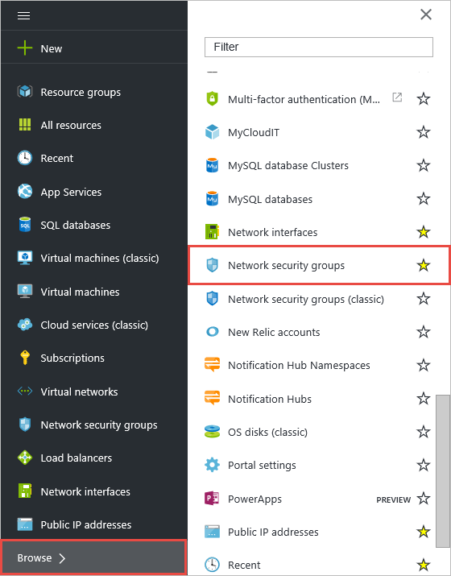
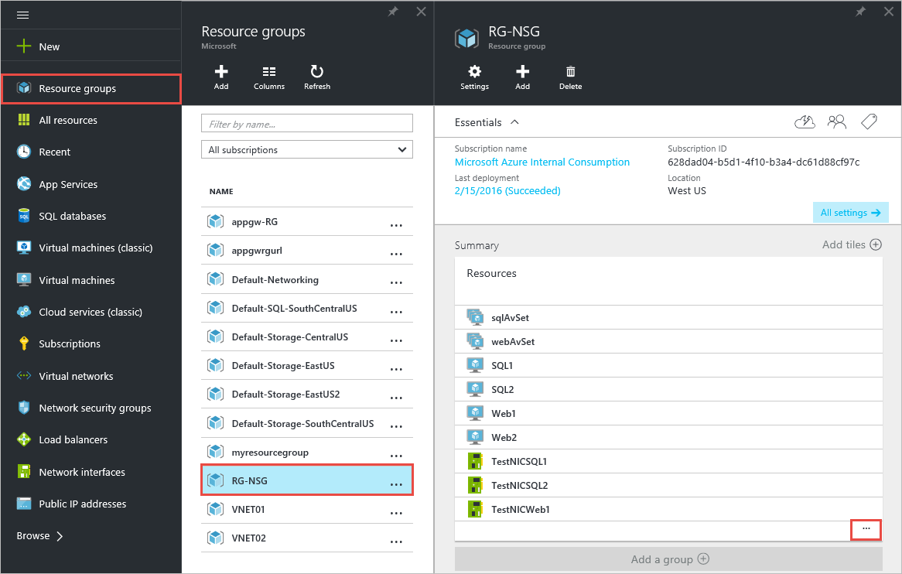
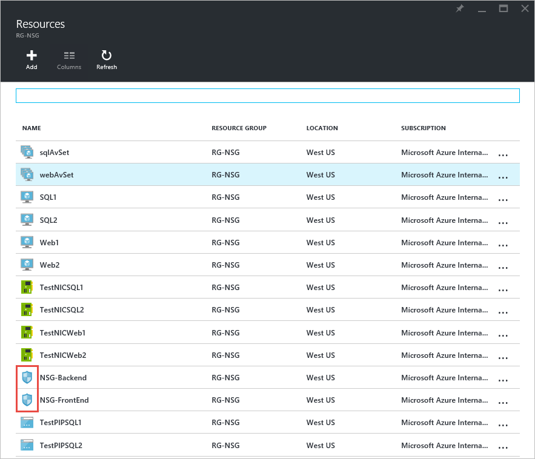
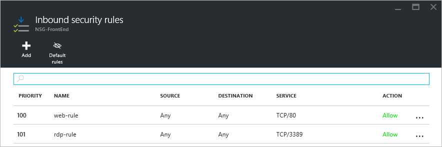
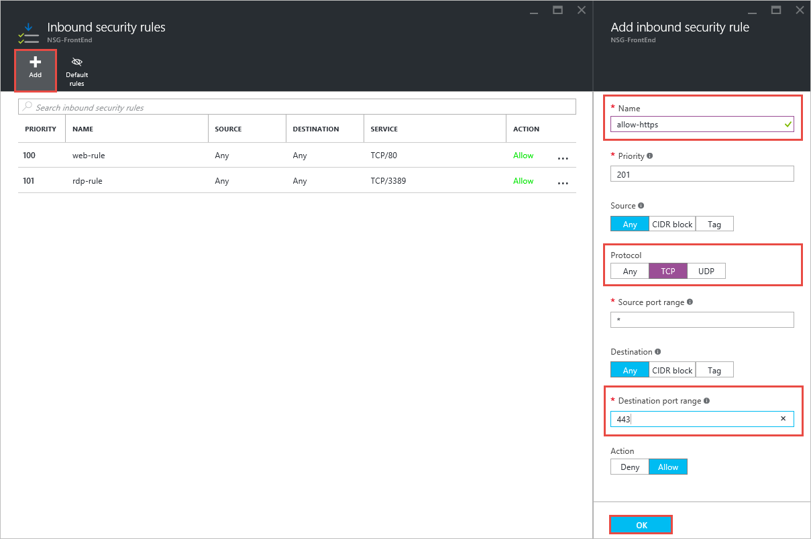
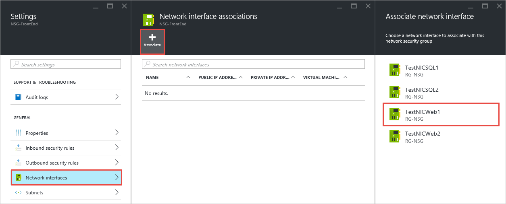
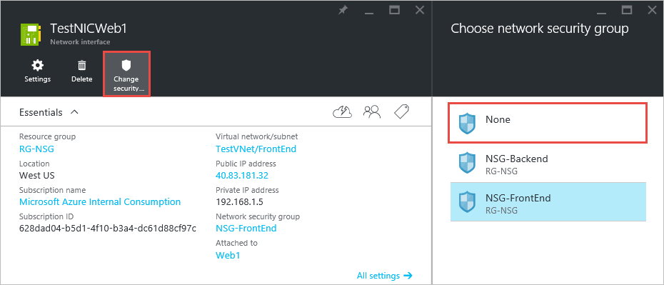
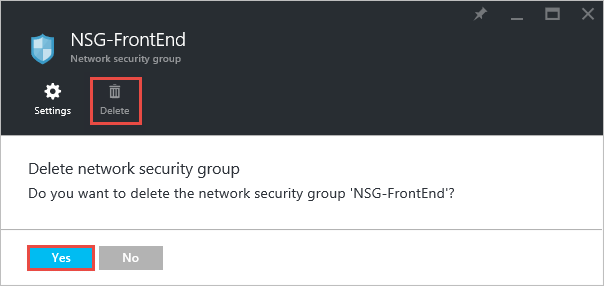

<properties
    pageTitle="使用 Azure 门户管理 NSG | Azure"
    description="了解如何使用 Azure 门户管理现有 NSG。"
    services="virtual-network"
    documentationcenter="na"
    author="jimdial"
    manager="carmonm"
    editor=""
    tags="azure-resource-manager" />  

<tags
    ms.assetid="5d55679d-57da-457c-97dc-1e1973909ee5"
    ms.service="virtual-network"
    ms.devlang="na"
    ms.topic="article"
    ms.tgt_pltfrm="na"
    ms.workload="infrastructure-services"
    ms.date="03/14/2016"
    wacn.date="12/26/2016"
    ms.author="jdial" />  

# 使用门户管理 NSG
> [AZURE.SELECTOR]
- [门户](/documentation/articles/virtual-network-manage-nsg-arm-portal/)
- [PowerShell](/documentation/articles/virtual-network-manage-nsg-arm-ps/)
- [Azure CLI](/documentation/articles/virtual-network-manage-nsg-arm-cli/)

[AZURE.INCLUDE [virtual-network-manage-nsg-intro-include.md](../../includes/virtual-network-manage-nsg-intro-include.md)]

> [AZURE.NOTE]
Azure 具有两种不同的部署模型，用于创建和处理资源：[Resource Manager 模型和经典模型](/documentation/articles/resource-manager-deployment-model/)。本文介绍如何使用 Resource Manager 部署模型。Azure 建议对大多数新的部署使用该模型，而不是经典部署模型。
> 

[AZURE.INCLUDE [virtual-network-manage-nsg-arm-scenario-include.md](../../includes/virtual-network-manage-nsg-arm-scenario-include.md)]

## 检索信息
可以查看你的现有 NSG、检索现有 NSG 的规则和查找与 NSG 关联的资源。

### 查看现有 NSG

若要查看订阅中的全部现有 NSG，请完成以下步骤：

1. 从浏览器导航到 http://portal.azure.cn， 根据需要使用 Azure 帐户登录。

2. 单击“浏览 >”>“网络安全组”。

	  

3. 在“网络安全组”边栏选项卡中查看 NSG 列表。

	  

### 查看资源组中的 NSG

若要查看 **RG-NSG** 资源组中的 NSG 列表，请完成以下步骤：

1. 单击“资源组 >”>“RG-NSG”>“...”。

	  

2. 在资源列表中，查找显示 NSG 图标的项，如以下“资源”边栏选项卡中所示。

	  

### 列出 NSG 的所有规则

若要查看名为 **NSG-FrontEnd** 的 NSG 的规则，请完成以下步骤：

1. 在“网络安全组”边栏选项卡或上方显示的“资源”边栏选项卡中，单击“NSG-FrontEnd”。

2. 在“设置”选项卡中，单击“入站安全规则”。

	  

3. “入站安全规则”边栏选项卡如下所示。

	  

4. 在“设置”选项卡中，单击“出站安全规则”，查看出站规则。

	> [AZURE.NOTE]
	若要查看默认规则，请单击显示规则的边栏选项卡顶部的“默认规则”图标。
	> 

### 查看 NSG 关联项

若要查看与 **NSG-FrontEnd** NSG 关联的资源，请完成以下步骤：

1. 在“网络安全组”边栏选项卡或上方显示的“资源”边栏选项卡中，单击“NSG-FrontEnd”。

2. 在“设置”选项卡中，单击“子网”，查看与 NSG 关联的子网。

	  

3. 在“设置”选项卡中，单击“网络接口”，查看与 NSG 关联的 NIC。

## 管理规则
可向现有 NSG 添加规则、编辑现有规则和删除规则。

### 添加规则
若要向 **NSG-FrontEnd** NSG 添加允许来自任何计算机的**入站**流量流入端口 **443** 的规则，请完成以下步骤：

1. 在“网络安全组”边栏选项卡或上方显示的“资源”边栏选项卡中，单击“NSG-FrontEnd”。
2. 在“设置”选项卡中，单击“入站安全规则”。
3. 在“入站安全规则”边栏选项卡中，单击“添加”。然后在“添加入站安全规则”边栏选项卡中，填充如下所示的值，然后单击“确定”。

	  

	几秒钟后，即可在“入站安全规则”边栏选项卡中查看新规则。

	  

### 更改规则
若要将上面创建的规则更改为仅允许来自 **Internet** 的入站流量，请完成以下步骤：

1. 在“网络安全组”边栏选项卡或上方显示的“资源”边栏选项卡中，单击“NSG-FrontEnd”。
2. 在“设置”选项卡中，单击上面创建的规则。
3. 在“allow-https”边栏选项卡中，对“Source”属性进行如下更改，然后单击“保存”。

	  

### 删除规则

若要删除上面创建的规则，请完成以下步骤：

1. 在“网络安全组”边栏选项卡或上方显示的“资源”边栏选项卡中，单击“NSG-FrontEnd”。
2. 在“设置”选项卡中，单击上面创建的规则。
3. 在“allow-https”边栏选项卡中，单击“删除”，然后单击“是”。

	  

## 管理关联项
可将 NSG 关联到子网和 NIC。还可取消 NSG 与任何相关联的资源之间的关联。

### 将 NSG 关联到 NIC
若要将 **NSG-FrontEnd** NSG 关联到 **TestNICWeb1** NIC，请完成以下步骤：

1. 在“网络安全组”边栏选项卡或上方显示的“资源”边栏选项卡中，单击“NSG-FrontEnd”。
2. 在“设置”选项卡中，单击“网络接口”>“关联”>“TestNICWeb1”。

	  

###  取消 NSG 与 NIC 之间的关联

若要取消 **NSG-FrontEnd** NSG 与 **TestNICWeb1** NIC 之间的关联，请完成以下步骤：

1. 在 Azure 门户中，单击“资源组 >”>“RG-NSG”>“...”>“TestNICWeb1”。

2. 在“TestNICWeb1”边栏选项卡中，单击“更改安全性...”>“无”。

	  

> [AZURE.NOTE]
还可使用此边栏选项卡将 NIC 关联到任意现有 NSG。
>

### 取消 NSG 与子网之间的关联

若要取消 **NSG-FrontEnd** NSG 与 **FrontEnd** 子网之间的关联，请完成以下步骤：

1. 在 Azure 门户中，单击“资源组 >”>“RG-NSG”>“...”>“TestVNet”。

2. 在“设置”边栏选项卡中，单击“子网”>“FrontEnd”>“网络安全组”>“无”。

	  

3. 在“FrontEnd”边栏选项卡中，单击“保存”。

	  

### 将 NSG 关联到子网

若要再次将 **NSG-FrontEnd** NSG 关联到 **FronEnd** 子网，请完成以下步骤：

1. 在 Azure 门户中，单击“资源组 >”>“RG-NSG”>“...”>“TestVNet”。
2. 在“设置”边栏选项卡中，单击“子网”>“FrontEnd”>“网络安全组”>“NSG-FrontEnd”。
3. 在“FrontEnd”边栏选项卡中，单击“保存”。

> [AZURE.NOTE]
还可以在 NSG 的“设置”边栏选项卡中将 NSG 关联到子网。
> 

## 删除 NSG
仅当 NSG 不与任何资源关联时，才能删除 NSG。若要删除 NSG，请完成以下步骤：

1. 在 Azure 门户中，单击“资源组 >”>“RG-NSG”>“...”>“NSG-FrontEnd”。
2. 在“设置”边栏选项卡中，单击“网络接口”。
3. 如果列出了任何 NIC，请按照[取消 NSG 与 NIC 之间的关联](#Dissociate-an-NSG-from-a-NIC)中的步骤 2 进行操作。
4. 对每个 NIC 重复步骤 3。
5. 在“设置”边栏选项卡中，单击“子网”。
6. 如果列出了任何子网，请单击子网，并按照[取消 NSG 与子网之间的关联](#Dissociate-an-NSG-from-a-subnet)中的步骤 2 和步骤 3 进行操作。
7. 向左滚动到“NSG-FrontEnd”边栏选项卡，然后单击“删除”>“是”。

	

## 后续步骤
* 为 NSG [启用日志记录](/documentation/articles/virtual-network-nsg-manage-log/)。

<!---HONumber=Mooncake_1219_2016-->