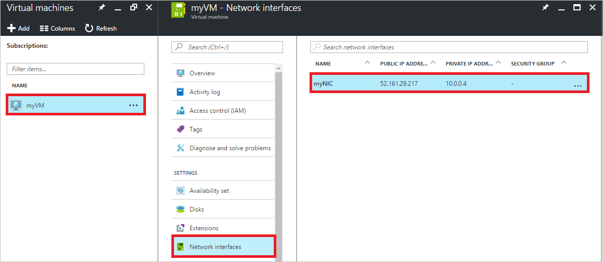
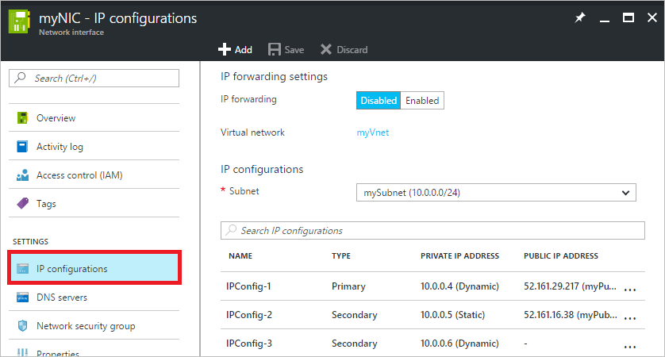
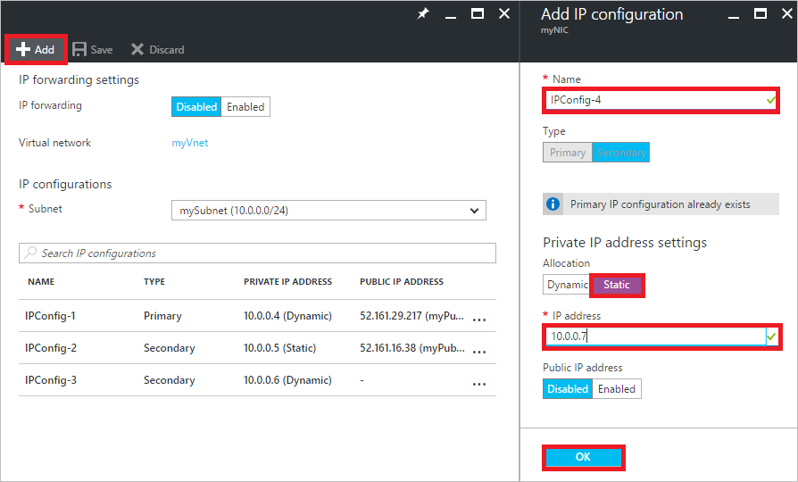
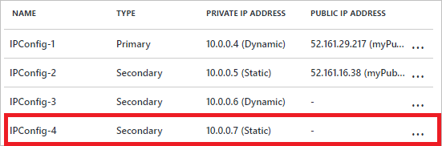
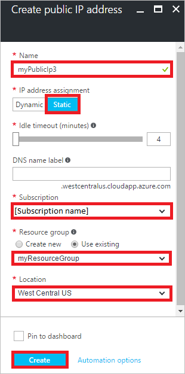
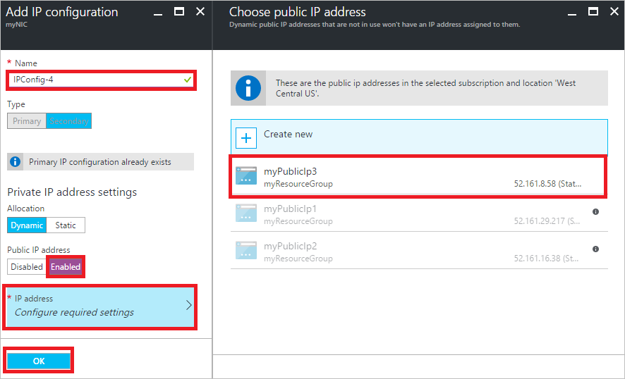
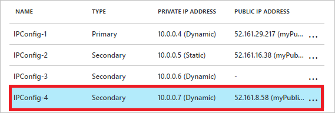
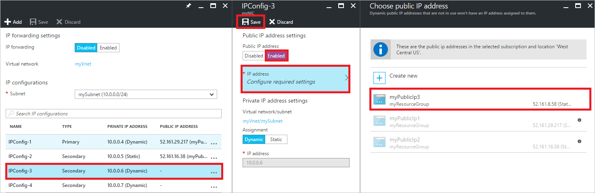
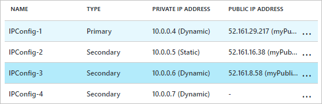

<properties
    pageTitle="Azure 虚拟机的多个 IP 地址 - 门户 | Azure"
    description="了解如何使用 Azure 门户预览将多个 IP 地址分配给虚拟机 | Resource Manager。"
    services="virtual-network"
    documentationcenter="na"
    author="anavinahar"
    manager="narayan"
    editor=""
    tags="azure-resource-manager" />
<tags
    ms.assetid="3a8cae97-3bed-430d-91b3-274696d91e34"
    ms.service="virtual-network"
    ms.devlang="na"
    ms.topic="article"
    ms.tgt_pltfrm="na"
    ms.workload="infrastructure-services"
    ms.date="11/30/2016"
    wacn.date="03/24/2017"
    ms.author="annahar" />  


# 使用 Azure 门户预览将多个 IP 地址分配给虚拟机

>[AZURE.INCLUDE [virtual-network-multiple-ip-addresses-intro.md](../../includes/virtual-network-multiple-ip-addresses-intro.md)]
>
本文介绍如何使用 Azure 门户预览通过 Azure Resource Manager 部署模型创建虚拟机 (VM)。无法将多个 IP 地址分配给通过经典部署模型创建的资源。若要了解有关 Azure 部署模型的详细信息，请阅读[了解部署模型](/documentation/articles/resource-manager-deployment-model/)一文。

[AZURE.INCLUDE [virtual-network-preview](../../includes/virtual-network-preview.md)]

[AZURE.INCLUDE [virtual-network-multiple-ip-addresses-template-scenario.md](../../includes/virtual-network-multiple-ip-addresses-scenario.md)]

## <a name = "create"></a>创建具有多个 IP 地址的 VM

若要创建具有多个 IP 地址的 VM，则必须使用 PowerShell 或 Azure CLI 来创建。若要了解如何操作，请单击本文顶部的 PowerShell 或 CLI 选项。可以根据[创建 Windows VM](/documentation/articles/virtual-machines-windows-hero-tutorial/) 或[创建 Linux VM](/documentation/articles/virtual-machines-linux-quick-create-portal/) 文章中的步骤，使用门户通过单个静态专用 IP 地址和（可选）单个公共 IP 地址来创建 VM。创建 VM 后，可以根据本文[向 VM 添加 IP 地址](#add)部分的步骤，使用门户更改 IP 地址类型和添加其他 IP 地址。

## <a name="add"></a>将 IP 地址添加到 VM

完成以下步骤即可将专用和公共 IP 地址添加到 NIC。以下部分的示例假定用户的 VM 已完成本文[方案](#Scenario)中描述的三项 IP 配置，但这不是必需的。

### <a name="coreadd"></a>核心步骤

1. 通过登录后在 PowerShell 中运行以下命令并选择相应的订阅来注册预览版：

        Register-AzureRmProviderFeature -FeatureName AllowMultipleIpConfigurationsPerNic -ProviderNamespace Microsoft.Network

        Register-AzureRmProviderFeature -FeatureName AllowLoadBalancingonSecondaryIpconfigs -ProviderNamespace Microsoft.Network
    
        Register-AzureRmResourceProvider -ProviderNamespace Microsoft.Network

    请不要尝试完成剩余步骤，直至运行 ```Get-AzureRmProviderFeature``` 命令时看到以下输出：

        FeatureName                            ProviderName      RegistrationState
        -----------                            ------------      -----------------      
        AllowLoadBalancingOnSecondaryIpConfigs Microsoft.Network Registered       
        AllowMultipleIpConfigurationsPerNic    Microsoft.Network Registered       

    >[AZURE.NOTE] 
    这可能需要几分钟的时间。
	
2. 根据需要浏览到 https://portal.azure.cn 的 Azure 门户预览并登录。
3. 在门户中单击“更多服务”> 在筛选框中键入“虚拟机”，然后单击“虚拟机”。
4. 在“虚拟机”边栏选项卡中单击要向其添加 IP 地址的 VM。在显示的虚拟机边栏选项卡中单击“网络接口”，然后选择要向其添加 IP 地址的网络接口。在下图所示的示例中，已从名为“myVM”的 VM 中选定名为“myNIC”的 NIC：

      


5. 在针对所选 NIC 显示的边栏选项卡中单击“IP 配置”，如下图所示：

      


根据要添加的 IP 地址的类型完成以下某个部分的步骤。

### **添加专用 IP 地址**

完成以下步骤，添加新的专用 IP 地址：

1. 完成本文[核心步骤](#coreadd)部分的步骤。
2. 单击**“添加”**。在显示的“添加 IP 配置”边栏选项卡中，创建名为“IPConfig-4”的 IP 配置，以“10.0.0.7”作为“静态”专用 IP 地址，然后单击“确定”，如下图所示：

      


    > [AZURE.NOTE]
    在添加静态 IP 地址时，必须在 NIC 连接到的子网中指定未使用的有效地址。如果所选地址不可用，门户会显示 X 来表示该 IP 地址，用户需另选一个。

    如果喜欢将专用 IP 地址的“分配方法”设置为“动态”，则可进行相应的选择，不需指定 IP 地址。
3. 单击“确定”后，边栏选项卡将会关闭，用户会看到列出的新 IP 配置，如下图所示：

      


    单击“确定”关闭“添加 IP 配置”边栏选项卡。
4. 可以单击“添加”添加其他 IP 配置，也可以关闭所有打开的边栏选项卡，完成添加 IP 地址的操作。
5. 将专用 IP 地址添加到 VM 操作系统，只需完成本文[将 IP 地址添加到 VM 操作系统](#os-config)部分针对操作系统的步骤即可。

### 添加公共 IP 地址

将公共 IP 地址资源关联到新 IP 配置或现有 IP 配置即可添加公共 IP 地址。

> [AZURE.NOTE]
公共 IP 地址会产生少许费用。有关 IP 地址定价的详细信息，请阅读 [IP address pricing](/pricing/details/reserved-ip-addresses/)（IP 地址定价）页。可在一个订阅中使用的公共 IP 地址数有限制。若要了解有关限制的详细信息，请阅读 [Azure 限制](/documentation/articles/azure-subscription-service-limits/#networking-limits)一文。
> 

### <a name="create-public-ip"></a>创建公共 IP 地址资源

公共 IP 地址是针对公共 IP 地址资源的一种设置。如果你的公共 IP 地址资源目前所关联到的 IP 配置不是你想要关联到的 IP 配置，可跳过以下步骤，根据需要完成后面某个部分的步骤。如果没有可用的公共 IP 地址资源，可通过以下步骤创建一个：

1. 根据需要浏览到 https://portal.azure.cn 的 Azure 门户预览并登录。
3. 在门户中，单击“新建”>“网络”>“公共 IP 地址”。
4. 在显示的“创建公共 IP 地址”边栏选项卡中，输入一个“名称”，选择一个“IP 地址分配”类型、一个“订阅”、一个“资源组”和一个“位置”，然后单击“创建”，如下图所示：

      


5. 完成下面某个部分的步骤，将公共 IP 地址资源关联到某个 IP 配置。

#### 将公共 IP 地址资源关联到新 IP 配置

1. 完成本文[核心步骤](#coreadd)部分的步骤。
2. 单击**“添加”**。在显示的“添加 IP 配置”边栏选项卡中，创建名为“IPConfig-4”的 IP 配置。启用“公共 IP 地址”，并从“选择公共 IP 地址”边栏选项卡中选择一个现有的可用公共 IP 地址资源，如下图所示：

      


    在选择公共 IP 地址资源后单击“确定”，边栏选项卡将会关闭。如果还没有公共 IP 地址，则可通过完成本文[创建公共 IP 地址资源](#create-public-ip)部分的步骤创建一个。

3. 查看新的 IP 配置，如下图所示：

      


    > [AZURE.NOTE]
    即使没有向 IP 配置显式分配专用 IP 地址，也会自动分配一个，因为所有 IP 配置都必须有一个专用 IP 地址。
    >

4. 可以单击“添加”添加其他 IP 配置，也可以关闭所有打开的边栏选项卡，完成添加 IP 地址的操作。
5. 将专用 IP 地址添加到 VM 操作系统，只需完成本文[将 IP 地址添加到 VM 操作系统](#os-config)部分针对操作系统的步骤即可。请勿向操作系统添加公共 IP 地址。

#### 将公共 IP 地址资源关联到现有 IP 配置

1. 完成本文[核心步骤](#coreadd)部分的步骤。
2. 选择要向其添加公共 IP 地址资源的 IP 配置，启用公共 IP 地址，然后选择一个现有的可用公共 IP 地址资源。在下图所示的示例中，“myPublicIp3”公共 IP 地址资源关联到“IPConfig-3”。

      


    在选择公共 IP 地址资源后单击“保存”，边栏选项卡将会关闭。如果还没有公共 IP 地址，则可通过完成本文[创建公共 IP 地址资源](#create-public-ip)部分的步骤创建一个。

3. 查看新的 IP 配置，如下图所示：

      


4. 可以单击“添加”添加其他 IP 配置，也可以关闭所有打开的边栏选项卡，完成添加 IP 地址的操作。请勿向操作系统添加公共 IP 地址。

[AZURE.INCLUDE [virtual-network-multiple-ip-addresses-os-config.md](../../includes/virtual-network-multiple-ip-addresses-os-config.md)]

<!---HONumber=Mooncake_0320_2017-->