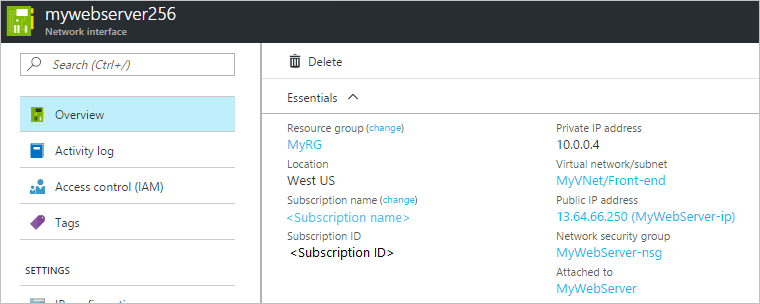

<properties
    pageTitle="创建、更改或删除 Azure 网络接口 | Azure"
    description="了解网络接口 (NIC) 是什么，以及如何创建、删除 NIC 及更改其设置。"
    services="virtual-network"
    documentationcenter="na"
    author="jimdial"
    manager="timlt"
    editor=""
    tags="azure-resource-manager" />
<tags
    ms.assetid=""
    ms.service="virtual-network"
    ms.devlang="na"
    ms.topic="article"
    ms.tgt_pltfrm="na"
    ms.workload="infrastructure-services"
    ms.date="05/04/2017"
    wacn.date="06/05/2017"
    ms.author="v-dazen"
    ms.translationtype="Human Translation"
    ms.sourcegitcommit="08618ee31568db24eba7a7d9a5fc3b079cf34577"
    ms.openlocfilehash="3a94b36ebdd3fed3f8c592399473a9f617bfaea2"
    ms.contentlocale="zh-cn"
    ms.lasthandoff="05/26/2017" />

# 创建、更改或删除网络接口

了解如何创建、删除网络接口 (NIC) 及更改其设置。 Azure 虚拟机 (VM) 通过 NIC 与 Internet、Azure 及本地资源通信。 使用 Azure 门户创建 VM 时，门户将使用默认设置创建一个 NIC。 可以改为选择使用自定义设置创建 NIC，并在创建 VM 时向其添加一个或多个 NIC。 还可以更改现有 NIC 的默认 NIC 设置。 本文介绍如何使用自定义设置创建 NIC、更改现有的 NIC 设置（例如网络筛选器分配（网络安全组）、子网分配、DNS 服务器设置和 IP 转发），以及删除 NIC。 

如果需要为 NIC 添加、更改或删除 IP 地址，请参阅[添加、更改或删除 IP 地址](/documentation/articles/virtual-network-network-interface-addresses/)一文。 如果需要在 VM 中添加或删除 NIC，请参阅[添加或删除 NIC](/documentation/articles/virtual-network-network-interface-vm/) 一文。 

## 准备工作

在完成本文的任何部分中的任何步骤之前完成以下任务：

- 查看 [Azure 限制](/documentation/articles/azure-subscription-service-limits/#azure-resource-manager-virtual-networking-limits)一文，了解 NIC 的限制。
- 使用 Azure 帐户登录到 Azure 门户、Azure 命令行接口 (CLI) 或 Azure PowerShell。 如果还没有 Azure 帐户，请注册[试用帐户](/pricing/1rmb-trial)。
- 如果使用 PowerShell 命令完成本文中的任务，请按[如何安装和配置 Azure PowerShell](https://docs.microsoft.com/zh-cn/powershell/azureps-cmdlets-docs) 一文中的步骤安装和配置 Azure PowerShell。 确保已安装最新版本的 Azure PowerShell cmdlet。 若要获取 PowerShell 命令的帮助和示例，请键入 `get-help <command> -full`。
- 如果使用 Azure 命令行接口 (CLI) 命令完成本文中的任务，请按[如何安装和配置 Azure CLI](https://docs.microsoft.com/zh-cn/cli/azure/install-azure-cli) 一文中的步骤安装和配置 Azure CLI。 确保已安装最新版本的 Azure CLI。 若要获取 CLI 命令的帮助，请键入 `az <command> --help`。

[AZURE.INCLUDE [azure-cli-2-azurechinacloud-environment-parameter](../../includes/azure-cli-2-azurechinacloud-environment-parameter.md)]

## 创建 NIC
使用 Azure 门户创建 VM 时，门户将使用默认设置创建一个 NIC。 如果想要指定所有 NIC 设置，可以使用自定义设置创建 NIC 并在创建 VM 时将该 NIC 附加到 VM。 还可以创建 NIC 并将其添加到现有的 VM。 若要了解如何创建包含现有 NIC 的 VM，或者要在现有 VM 中添加或删除 NIC，请参阅[添加或删除 NIC](/documentation/articles/virtual-network-network-interface-vm/) 一文。 创建 NIC 之前，创建 NIC 时所在的同一位置和订阅中必须存在现有的虚拟网络 (VNet)。 若要了解如何创建 VNet，请参阅[创建 VNet](/documentation/articles/virtual-networks-create-vnet-arm-pportal/) 一文。

1. 使用已分配订阅的“网络参与者”角色权限（最低权限）的帐户登录到 [Azure 门户](https://portal.azure.cn)。 请参阅[用于 Azure 基于角色的访问控制的内置角色](/documentation/articles/role-based-access-built-in-roles/#network-contributor)一文，详细了解如何将角色和权限分配给帐户。
2. 在 Azure 门户顶部包含“搜索资源”文本的框中，键入“网络接口”。 在搜索结果中出现“网络接口”  时，单击该接口。
3. 在出现的“网络接口”边栏选项卡中，单击“+ 添加”。
4. 在出现的“创建网络接口”边栏选项卡中，输入或选择以下设置的值，然后单击“创建”：

    |设置|必需？|详细信息|
    |---|---|---|
    |名称|是|名称在所选资源组中必须唯一。 随着时间推移，Azure 订阅中可能会有多个 NIC。 请参阅[命名约定](https://docs.microsoft.com/azure/architecture/best-practices/naming-conventions#naming-rules-and-restrictions)一文，获取有关创建命名约定来简化多个 NIC 的管理的建议。 创建 NIC 后无法更改此名称。|
    |虚拟网络|是|选择要将 NIC 连接到的 VNet。 NIC 仅可连接到 NIC 所在的订阅和位置中的 VNet 上。 创建 NIC 后，无法更改其连接到的 VNet。 将 NIC 添加到的 VM 也必须位于该 NIC 所在的同一位置和订阅中。|
    |子网|是|在选定的 VNet 中选择一个子网。 创建 NIC 后，可更改 NIC 连接到的子网。|
    |专用 IP 地址分配|是| 从以下分配方法中选择：**动态：**选择此选项时，Azure 将从所选子网的地址空间中自动分配可用地址。 当 NIC 所在的 VM 处于停止（解除分配）状态后启动时，Azure 会向 NIC 分配一个不同的地址。 如果在 VM 不是处于停止（解除分配）的状态下将它重新启动，地址将保持不变。 **静态：**选择此选项时，必须手动从所选子网的地址空间中手动分配一个可用的 IP 地址。 静态地址不会更改，除非手动将它更改或者删除 NIC。 创建 NIC 后，即可更改分配方法。 Azure DHCP 服务器将此地址分配到 VM 操作系统中的 NIC。|
    |网络安全组|否| 保留设置为“无”，选择现有的网络安全组 (NSG)，或创建 NSG。 使用 NSG 可以筛选传入和传出 NIC 的网络流量。 有关 NSG 的详细信息，请参阅[网络安全组](/documentation/articles/virtual-networks-nsg/)一文。 若要创建 NSG，请参阅[创建 NSG](/documentation/articles/virtual-networks-create-nsg-arm-pportal/) 一文。 可以将零个或一个 NSG 应用到 NIC。 还可将零个或一个 NSG 应用于 NIC 连接到的子网。 将 NSG 应用到 NIC 以及 NIC 连接到的子网时，有时会发生意外的结果。 若要对应用到 NIC 和子网的 NSG 进行故障排除，请参阅 [NSG 故障排除](/documentation/articles/virtual-network-nsg-troubleshoot-portal/#view-effective-security-rules-for-a-network-interface)一文。|
    |订阅|是|选择一个 Azure [订阅](/documentation/articles/azure-glossary-cloud-terminology/#subscription)。 NIC 附加到的 VM 及将其连接到的 VNet 必须位于同一订阅。|
    |资源组|是|选择现有的[资源组](/documentation/articles/azure-glossary-cloud-terminology/#resource-group)或创建一个资源组。 NIC 可与它附加的 VM 或者连接到的 VNet 位于相同或不同的资源组中。|
    |位置|是|将 NIC 附加到的 VM 以及将 NIC 连接的 VNet 必须位于同一个位置（也称为区域）。|

创建 NIC 时，门户不会提供向 NIC 分配公共 IP 地址的选项，但使用门户创建 VM 时，它确实会向 NIC 分配公共 IP 地址。 若要了解在创建后如何将公共 IP 地址添加到 NIC，请参阅[添加、更改或删除 IP 地址](/documentation/articles/virtual-network-network-interface-addresses/)一文。 若要使用公共 IP 地址创建 NIC，必须使用 CLI 或 PowerShell 创建 NIC。

>[AZURE.NOTE]
> 仅在将 NIC 附加到 VM 且 VM 首次启动后，Azure 才会向 NIC 分配 MAC 地址。 无法指定 Azure 分配给 NIC 的 MAC 地址。 在删除 NIC 或者更改分配到主 NIC 的主 IP 配置的专用 IP 地址之前，MAC 地址将始终分配给 NIC。 若要详细了解 IP 地址和 IP 配置，请参阅[添加、更改或删除 IP 地址](/documentation/articles/virtual-network-network-interface-addresses/)一文。

**命令**

|工具|命令|
|---|---|
|CLI|[az network nic create](https://docs.microsoft.com/zh-cn/cli/azure/network/nic#create)|
|PowerShell|[New-AzureRmNetworkInterface](https://docs.microsoft.com/zh-cn/powershell/resourcemanager/azurerm.network/v3.4.0/new-azurermnetworkinterface/cli/azure/network/nic#create)|

## 查看 NIC 设置

可以查看和更改的 NIC 的大多数设置。

1. 使用已分配订阅的“网络参与者”角色权限（最低权限）的帐户登录到 [Azure 门户](https://portal.azure.cn)。 请参阅[用于 Azure 基于角色的访问控制的内置角色](/documentation/articles/role-based-access-built-in-roles/#network-contributor)一文，详细了解如何将角色和权限分配给帐户。
2. 在 Azure 门户顶部包含“搜索资源”文本的框中，键入“网络接口”。 在搜索结果中出现“网络接口”  时，单击该接口。
3. 在显示的“网络接口”  边栏选项卡中，单击要查看或更改其设置的 NIC。
4. 针对所选 NIC 显示的边栏选项卡中将列出以下设置：
    - **概述：**提供有关 NIC 的信息，例如，分配给该 NIC 的 IP 地址、该 NIC 连接到的 VNet/子网，以及该 NIC 附加到的 VM（如果已附加到 VM）。 下图显示名为 **mywebserver256** 的 NIC 的概述设置：网络接口概述。可以单击“资源组”或“订阅名称”旁边的“(更改)”，将 NIC 移到不同的资源组或订阅。   如果移动 NIC，必须同时移动与该 NIC 相关的所有资源。 例如，如果 NIC 已附加到 VM，则还必须移动该 VM 及其相关的其他资源。 若要移动 NIC，请参阅[将资源移到新的资源组或订阅](/documentation/articles/resource-group-move-resources/#use-portal)一文。 此文列出了先决条件，以及如何使用 Azure 门户、PowerShell 和 Azure CLI 移动资源。
    - **IP 配置：**公共和专用 IP 地址将分配到 NIC 的一个或多个 IP 配置。 若要详细了解 NIC 支持的 IP 配置数上限，请参阅 [Azure 限制](/documentation/articles/azure-subscription-service-limits/#azure-resource-manager-virtual-networking-limits)一文。 每个 IP 配置有一个分配的专用 IP 地址，可与一个公共 IP 地址关联。 若要添加、更改或删除 NIC 中的 IP 配置，请完成[添加、更改或删除 IP 地址](/documentation/articles/virtual-network-network-interface-addresses/)一文的[向 NIC 添加辅助 IP 配置](/documentation/articles/virtual-network-network-interface-addresses/#create-ip-config)、[更改 IP 配置](/documentation/articles/virtual-network-network-interface-addresses/#change-ip-config)或[删除 IP 配置](/documentation/articles/virtual-network-network-interface-addresses/#delete-ip-config)部分中的步骤。 此部分还配置了 IP 转发和子网分配。 若要详细了解这些设置，请参阅本文的[启用/禁用 IP 转发](#ip-forwarding)和[更改子网分配](#subnet)部分。
    - **DNS 服务器：**可以指定 Azure DHCP 服务器向 NIC 分配哪个 DNS 服务器。 NIC 可从 NIC 连接到的 VNet 继承设置，或使用自定义设置来替代它连接到的 VNet 的设置。 若要修改显示的内容，请完成本文[更改 DNS 服务器](#dns)部分中的步骤。
    - **网络安全组(NSG)：**显示与 NIC 关联的 NSG（如果有）。 NSG 包含用于筛选 NIC 网络流量的入站和出站规则 如果 NIC 有关联的 NSG，将显示关联的 NSG 的名称。
    - **属性：**显示有关 NIC 的关键设置，包括它的 MAC 地址（如果 NIC 未附加到 VM，则为空）及其所在的订阅。
    - **有效的安全规则：**如果 NIC 已附加到正在运行的 VM，并且某个 NSG 规则已关联到该 NIC 和/或它连接到的子网，则会列出安全规则。 若要详细了解显示的内容，请参阅[网络安全组故障排除](/documentation/articles/virtual-network-nsg-troubleshoot-portal/#view-effective-security-rules-for-a-network-interface)一文。 有关 NSG 的详细信息，请参阅[网络安全组](/documentation/articles/virtual-networks-nsg/)一文。
    - **有效路由：** 如果 NIC 附加到正在运行的 VM，则会列出路由。 路由是 Azure 默认路由、用户定义的任何路由 (UDR) 和 NIC 所连接到的子网可能存在的任何 BGP 路由的组合。 若要详细了解显示的内容，请参阅[路由故障排除](/documentation/articles/virtual-network-routes-troubleshoot-portal/#view-effective-routes-for-a-network-interface)一文。 若要详细了解 Azure 默认值和 UDR，请参阅[用户定义的路由](/documentation/articles/virtual-networks-udr-overview/)一文。
    - **常见的 Azure Resource Manager 设置：**若要详细了解常见的 Azure Resource Manager 设置，请参阅文章[活动日志](/documentation/articles/resource-group-overview/#activity-logs)、[访问控制 (IAM)](/documentation/articles/resource-group-overview/#access-control)、[标记](/documentation/articles/resource-group-overview/#tags)、[锁定](/documentation/articles/resource-group-lock-resources/)和[自动化脚本](/documentation/articles/resource-manager-export-template/#export-the-template-from-resource-group)。

**命令**

|工具|命令|
|---|---|
|CLI|使用 [az network nic list](https://docs.microsoft.com/zh-cn/cli/azure/network/nic#list) 可查看订阅中的 NIC；使用 [az network nic show](https://docs.microsoft.com/zh-cn/cli/azure/network/nic#show) 可查看 NIC 的设置|
|PowerShell|使用 [Get-AzureRmNetworkInterface](https://docs.microsoft.com/zh-cn/powershell/resourcemanager/azurerm.network/v3.4.0/get-azurermnetworkinterface) 可查看订阅中的 NIC，或 NIC 的设置|

## 更改 DNS 服务器

DNS 服务器由 Azure DHCP 服务器分配到 VM 操作系统中的 NIC。 分配的 DNS 服务器设置就是 NIC 的 DNS 服务器设置。 若要详细了解 NIC 的名称解析设置，请参阅 [VM 的名称解析](/documentation/articles/virtual-networks-name-resolution-for-vms-and-role-instances/)一文。 NIC 可以从 VNet 继承设置，或使用自身唯一的设置替代 VNet 的设置。

1. 使用已分配订阅的“网络参与者”角色权限（最低权限）的帐户登录到 [Azure 门户](https://portal.azure.cn)。 请参阅[用于 Azure 基于角色的访问控制的内置角色](/documentation/articles/role-based-access-built-in-roles/#network-contributor)一文，详细了解如何将角色和权限分配给帐户。
2. 在 Azure 门户顶部包含“搜索资源”文本的框中，键入“网络接口”。 在搜索结果中出现“网络接口”  时，单击该接口。
3. 在显示的“网络接口”  边栏选项卡中，单击要查看或更改其设置的 NIC。
4. 在所选 NIC 的边栏选项卡中，单击“设置”下面的“DNS 服务器”。
5. 单击以下选项之一：
    - **从虚拟网络继承(默认)**：选择此选项将会继承针对 NIC 所连接到的虚拟网络定义的 DNS 服务器设置。 自定义 DNS 服务器或 Azure 提供的 DNS 服务器会在 VNet 级别定义。 Azure 提供的 DNS 服务器可以解析连接到同一 VNet 的资源的主机名。 必须使用 FQDN 解析连接到不同 VNet 的资源。
    - “自定义”：可自行配置 DNS 服务器以解析多个 VNet 中的名称。 输入要用作 DNS 服务器的服务器的 IP 地址。 所指定的 DNS 服务器地址仅分配给此 NIC，并替代 NIC 连接到的 VNet 的任何 DNS 设置。
6. 单击“保存” 。

**命令**

|工具|命令|
|---|---|
|CLI|[az network nic update](https://docs.microsoft.com/zh-cn/cli/azure/network/nic#update)|
|PowerShell|[Set-AzureRmNetworkInterface](https://docs.microsoft.com/zh-cn/powershell/resourcemanager/azurerm.network/v3.4.0/set-azurermnetworkinterface)|

## 启用/禁用 IP 转发

通过 IP 转发，NIC 连接到的 VM 可以：
- 接收未流向某 IP 地址的网络流量，该地址被分配给 NIC 获得任意 IP 配置。
- 使用与分配给 NIC 某个 IP 配置的源 IP 地址不同的地址发送网络流量。

对于接收 VM 需转发的流量的 VM，必须向其附加的每个 NIC 启用该设置。 无论 VM 上附加了一个或多个 NIC，其均可转发流量。 IP 转发是一项 Azure 设置，但 VM 还必须运行可转发流量的应用程序，如防火墙、WAN 优化和负载均衡应用程序。 运行网络应用程序的 VM 通常称为网络虚拟设备 (NVA)。 可在 Azure 应用商店中查看可直接部署的 NVA 列表。 IP 转发通常用于用户定义的路由。 若要详细了解用户定义的路由，请阅读[用户定义的路由](/documentation/articles/virtual-networks-udr-overview/)一文。

1. 使用已分配订阅的“网络参与者”角色权限（最低权限）的帐户登录到 [Azure 门户](https://portal.azure.cn)。 请参阅[用于 Azure 基于角色的访问控制的内置角色](/documentation/articles/role-based-access-built-in-roles/#network-contributor)一文，详细了解如何将角色和权限分配给帐户。
2. 在 Azure 门户顶部包含“搜索资源”文本的框中，键入“网络接口”。 在搜索结果中出现“网络接口”  时，单击该接口。
3. 在出现的“网络接口”边栏选项卡中，单击要为其启用或禁用 IP 转发的 NIC。
4. 在所选 NIC 的边栏选项卡的“设置”部分中，单击“IP 配置”。
5. 单击“已启用”或“禁用”（默认设置）来更改设置。
6. 单击“保存” 。

**命令**

|工具|命令|
|---|---|
|CLI|[az network nic update](https://docs.microsoft.com/zh-cn/cli/azure/network/nic#update)|
|PowerShell|[Set-AzureRmNetworkInterface](https://docs.microsoft.com/zh-cn/powershell/resourcemanager/azurerm.network/v3.4.0/set-azurermnetworkinterface)|

## 更改子网分配

可更改 NIC 连接的子网，但不能更改 VNet。

1. 使用已分配订阅的“网络参与者”角色权限（最低权限）的帐户登录到 [Azure 门户](https://portal.azure.cn)。 请参阅[用于 Azure 基于角色的访问控制的内置角色](/documentation/articles/role-based-access-built-in-roles/#network-contributor)一文，详细了解如何将角色和权限分配给帐户。
2. 在 Azure 门户顶部包含“搜索资源”文本的框中，键入“网络接口”。 在搜索结果中出现“网络接口”  时，单击该接口。
3. 在显示的“网络接口”  边栏选项卡中，单击要查看或更改其设置的 NIC。
4. 在所选 NIC 的边栏选项卡中的“设置”下面，单击“IP 配置”。 如果所列任何 IP 配置的任何专用 IP 地址旁边出现“(静态)”，则必须完成以下步骤，将 IP 地址分配方法更改为动态。 必须使用动态分配方法分配所有专用 IP 地址，以更改 NIC 的子网分配。 如果使用动态方法分配地址，请转到步骤 5。 如果使用静态分配方法分配了任何地址，请完成以下步骤，将分配方法更改为动态：
    - 在 IP 配置列表中，单击想要更改其 IP 地址分配方法的 IP 配置。
    - 在显示的 IP 配置边栏选项卡中，选择“动态”作为“分配”方法。
    - 单击“保存” 。
5. 从“子网”  下拉列表中，选择 NIC 要连接到的子网。
6. 单击“保存” 。 新的动态地址是从新子网的子网地址范围中分配的。 将 NIC 分配到新子网后，如果需要，可以从新子网地址范围中分配静态 IP 地址。 若要详细了解如何添加、更改和删除 NIC 的 IP 地址，请参阅[添加、更改或删除 IP 地址](/documentation/articles/virtual-network-network-interface-addresses/)一文。

**命令**

|工具|命令|
|---|---|
|CLI|[az network nic ip-config update](https://docs.microsoft.com/zh-cn/cli/azure/network/nic/ip-config#update)|
|PowerShell|[Set-AzureRmNetworkInterfaceIpConfig](https://docs.microsoft.com/zh-cn/powershell/resourcemanager/azurerm.network/v3.4.0/set-azurermnetworkinterfaceipconfig)|

## 删除 NIC

只要 NIC 未附加到 VM，即可将其删除。 如果它已附加到 VM，则必须先将 VM 置于停止（解除分配）状态，再从 VM 分离 NIC，然后才能删除 NIC。 若要从 VM 中分离 NIC，请完成[添加或删除网络接口](/documentation/articles/virtual-network-network-interface-vm/)一文的[从虚拟机中分离 NIC](/documentation/articles/virtual-network-network-interface-vm/#vm-remove-nic) 部分中的步骤。 删除 VM 会分离其上附加的所有 NIC，但不会删除 NIC。

1. 使用已分配订阅的“网络参与者”角色权限（最低权限）的帐户登录到 [Azure 门户](https://portal.azure.cn)。 请参阅[用于 Azure 基于角色的访问控制的内置角色](/documentation/articles/role-based-access-built-in-roles/#network-contributor)一文，详细了解如何将角色和权限分配给帐户。
2. 在 Azure 门户顶部包含“搜索资源”文本的框中，键入“网络接口”。 在搜索结果中出现“网络接口”  时，单击该接口。
3. 右键单击要删除的 NIC，然后单击“删除” 。
4. 单击“是”  ，确认删除该 NIC。

删除 NIC 时，将释放其附带的所有 MAC 和 IP 地址。

**命令**

|工具|命令|
|---|---|
|CLI|[az network nic delete](https://docs.microsoft.com/zh-cn/cli/azure/network/nic#delete)|
|PowerShell|[Remove-AzureRmNetworkInterface](https://docs.microsoft.com/zh-cn/powershell/resourcemanager/azurerm.network/v3.1.0/remove-azurermnetworkinterface)|

## 后续步骤
若要创建具有多个 NIC 或 IP 地址的 VM，请参阅以下文章：

**命令**

|任务|工具|
|---|---|
|创建具有多个 NIC 的 VM|[CLI](/documentation/articles/virtual-machines-linux-multiple-nics/)|
||[PowerShell](/documentation/articles/virtual-machines-windows-multiple-nics/)|
|创建具有多个 IP 地址的单 NIC VM|[CLI](/documentation/articles/virtual-network-multiple-ip-addresses-cli/)|
||[PowerShell](/documentation/articles/virtual-network-multiple-ip-addresses-powershell/)|

<!--Update_Description: wording update-->