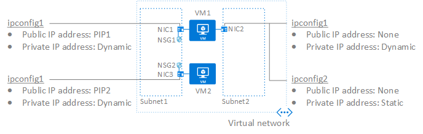

<properties
    pageTitle="Azure 网络接口 | Azure"
    description="了解如何创建和删除网络接口 (NIC)，以及如何为 NIC 分配公共和专用 IP 地址。 了解如何将 NIC 附加到 Azure 虚拟机以及如何分离两者。"
    services="virtual-network"
    documentationcenter="na"
    author="jimdial"
    manager="timlt"
    editor=""
    tags="azure-resource-manager"
    translationtype="Human Translation" />
<tags
    ms.assetid=""
    ms.service="virtual-network"
    ms.devlang="na"
    ms.topic="article"
    ms.tgt_pltfrm="na"
    ms.workload="infrastructure-services"
    ms.date="03/14/2017"
    wacn.date="05/02/2017"
    ms.author="jdial"
    ms.sourcegitcommit="78da854d58905bc82228bcbff1de0fcfbc12d5ac"
    ms.openlocfilehash="04d850144e7c06398b412caccf0a2850d25e5c8f"
    ms.lasthandoff="04/22/2017" />

# 网络接口

了解网络接口 (NIC) 及其使用方法。 NIC 是 Azure 虚拟机 (VM) 与基础软件网络之间互相连接的桥梁。 下图演示了 NIC 提供的功能：

本文介绍如何使用图中所示的概念。 单击以下任一概念可直接转到本文的相关部分：

- [网络接口](#nics)：NIC 连接到 Azure 虚拟网络 (VNet) 中的一个子网。 在图中，**VM1** 上附加了两个 NIC，**VM2** 上附加了一个 NIC。 每个 NIC 均连接到同一个 VNet，但连接到不同子网。 本节提供相关步骤，帮你列出现有 NIC 以及创建、更改和删除 NIC。
- [IP 配置](#ip-configs)：每个 NIC 都关联了一个或多个 IP 配置。 每个 IP 配置均分配有私有 IP 地址。 IP 配置可与公共 IP 地址相关联。 在图中，**NIC1** 和 **NIC3** 各有一个关联的 IP 配置，而 **NIC2** 有两个关联的 IP 配置。 分配到 NIC1 和 NIC3 的 IP 配置被分配公共 IP 地址，而分配到 NIC2 的两个 IP 配置都没有被分配公共 IP 地址。 本节提供相关步骤，帮你创建、更改和删除使用静态和动态分配方法分配了专用 IP 地址的 IP 配置。 本部分还提供将公共 IP 地址与 IP 配置相关联以及取消关联的步骤。
- [网络安全组](#nsgs)：网络安全组 (NSG) 包含一个或多个入站或出站安全规则。 这些规则控制可流入和流出网络接口和/或子网的网络流量类型。 在图中，**NIC1** 和 **NIC3** 具有关联的 NSG，而 **NIC2** 则没有。 此部分提供查看应用到 NIC 的 NSG、将 NSG 添加到 NIC 以及从 NIC 中删除 NSG 的步骤。
- [虚拟机](#vms)：VM 上至少附加了一个 NIC，但根据 VM 大小，有时可以附加多个 NIC。 若要查看每个 VM 大小支持的 NIC 数目，请参阅有关 [Windows](/documentation/articles/virtual-machines-windows-sizes/) 或 [Linux](/documentation/articles/virtual-machines-linux-sizes/) VM 大小的文章。 此部分提供创建单 NIC 和多 NIC VM，以及在现有 VM 上附加和分离 NIC 的步骤。

如果你不太熟悉 Azure 中的 NIC 和 Vm，我们建议在阅读本文之前，先完成[创建第一个 Azure 虚拟网络](/documentation/articles/virtual-network-get-started-vnet-subnet/)中的练习。 该练习可帮助你熟悉 VNet 和 VM。

本文适用于通过 Azure Resource Manager 部署模型创建的 VM 和 NIC。 Azure 建议通过 Resource Manager 部署模型创建资源，而不是通过经典部署模型。 如果你不熟悉这两个模型之间的差别，请参阅[了解 Azure 部署模型](/documentation/articles/resource-manager-deployment-model/)一文。

本文的剩余部分提供了所有 NIC 相关任务的执行步骤。 每节分别列出了：
- 在 Azure 门户预览中完成任务的步骤。 要完成这些步骤，必须登录 [Azure 门户预览](http://portal.azure.cn)。 如果没有帐户，请注册 [试用帐户](/pricing/1rmb-trial/) 。
- 使用 Azure PowerShell 完成任务的命令，内附命令参考链接。 请完成[如何安装和配置 Azure PowerShell](https://docs.microsoft.com/zh-cn/powershell/azureps-cmdlets-docs) 一文中的步骤安装和配置 PowerShell。 若要获取 PowerShell 命令的帮助和示例，请键入 `get-help <command> -full`。
- 用于通过 Azure 命令行接口 (CLI) 完成任务的命令，以及相关命令的命令参考链接。 请完成[如何安装和配置 Azure CLI 2.0](https://docs.microsoft.com/zh-cn/cli/azure/install-azure-cli) 一文中的步骤安装 Azure CLI。 若要获取 CLI 命令的帮助，请键入 `az <command> -h`。

## 网络接口
完成以下部分中的步骤，以创建、查看、更改和删除网络接口和设置：

### 创建网络接口

NIC 可附加到 VM 上或独立存在。 若要了解如何将 NIC 附加到 VM，请参阅本文中的 [将 NIC 附加到虚拟机](#vm-attach-nic) 部分。

若要创建 NIC，请完成以下步骤：

1. 使用已分配订阅的“网络参与者”角色权限（最低权限）的帐户登录到 [Azure 门户预览](https://portal.azure.cn)。 请参阅[用于 Azure 基于角色的访问控制的内置角色](/documentation/articles/role-based-access-built-in-roles/#network-contributor)一文，详细了解如何将角色和权限分配给帐户。
2. 在 Azure 门户预览顶部包含“搜索资源”文本的框中，键入“网络接口”。 在搜索结果中出现“网络接口”  时，单击该接口。
3. 在出现的“网络接口”边栏选项卡中，单击“+ 添加”。
4. 在出现的“创建网络接口”边栏选项卡中，输入或选择以下设置的值，然后单击“创建”：

    |**设置**|**必需？**|**详细信息**|
    |---|---|---|
    |**Name**|是|创建 NIC 后无法更改此名称。 名称在所选资源组中必须唯一。|
    |**虚拟网络**|是|NIC 仅可连接到 NIC 所在的订阅和位置中的 VNet 上。 NIC 附加到的 VM 也必须与 NIC 同处于一个位置和订阅中。 若未列出 VNet，需创建一个。 若要创建 VNet，请完成[虚拟网络](/documentation/articles/virtual-networks-create-vnet-arm-pportal/)一文中的步骤。 创建 NIC 后，无法更改其连接到的 VNet。|
    |**子网**|是|在选定的 VNet 中选择一个子网。 创建 NIC 后，可更改 NIC 连接到的子网。|
    |**专用 IP 地址分配**|是| 创建 NIC 后，由 Azure DHCP 服务器向其分配专用 IP 地址。 DHCP 服务器将从针对 NIC 所连接到的子网定义的子网地址范围中分配一个可用地址。 **动态：**当 NIC 附加到的 VM 在处于停止（解除分配）状态后启动时，Azure 会向 NIC 分配一个不同的地址。 如果在 VM 不是处于停止（解除分配）的状态下将它重新启动，地址将保持不变。 **静态：**静态地址不会更改，除非手动将它更改或者删除 NIC。 创建 NIC 后，即可更改分配方法。|
    |**网络安全组**|否|网络安全组可用于控制流入和流出 NIC 的网络流量。 有关 NSG 的详细信息，请参阅[网络安全组](/documentation/articles/virtual-networks-nsg/)一文。 可将零个或一个网络安全组 (NSG) 应用到 NIC。 还可将零个或一个 NSG 应用于 NIC 连接到的子网。 将 NSG 应用于 NIC 及其连接到子网时，有时会出现意外结果。 若要对应用到 NIC 的 NSG 进行故障排除，请参阅 [NSG 故障排除](/documentation/articles/virtual-network-nsg-troubleshoot-portal/#view-effective-security-rules-for-a-network-interface)一文。|
    |**订阅**|是| NIC 附加到的 VM 及将其连接到的 VNet 必须位于同一订阅。|
    |**资源组**|是| NIC 可与其附加到的 VM 或其连接到的 VNet 同属一个资源组，也可分属不同的组。|
    |**位置**|是|NIC 附加到的 VM 及将其连接到的 VNet 必须位于同一位置。|

Azure 门户预览会使用动态专用 IP 地址创建名为 **ipconfig1** 的主 IP 配置，并将其关联到所创建的 NIC。 若要详细了解 IP 配置，请参阅本文的 [IP 配置](#ip-configs) 部分。 无法指定门户创建的 IP 配置的名称、分配静态专用 IP 地址，也无法在创建 NIC 时分配公共 IP 地址。 如果使用 PowerShell 或 CLI 创建 NIC，则可指定 IP 配置的名称、静态 IP 地址，并分配公共 IP 地址。 创建 NIC 后，可更改专用 IP 地址分配方法，并决定是否将公共 IP 地址关联到 NIC。 若要在创建 NIC 后更改设置，请完成本文 [更改 IP 配置](#change-ip-config) 部分中的步骤。

>[AZURE.NOTE]
> 仅在将 NIC 附加到 VM 且 VM 首次启动后，Azure 才会向 NIC 分配 MAC 地址。 无法指定 Azure 分配给 NIC 的 MAC 地址。 在删除 NIC 或者更改分配到主 NIC 的主 IP 配置的专用 IP 地址之前，MAC 地址将始终分配给 NIC。 若要详细了解 IP 配置，请参阅本文的 [IP 配置](#ip-configs) 部分。

|**工具**|**命令**|
|:---|:---|
|**CLI**|[az network nic create](https://docs.microsoft.com/zh-cn/cli/azure/network/nic#create)|
|**PowerShell**|[New-AzureRmNetworkInterface](https://docs.microsoft.com/zh-cn/powershell/resourcemanager/azurerm.network/v3.4.0/new-azurermnetworkinterface)|

### 查看和更改网络接口及设置

若要查看和更改网络接口及设置，请完成以下步骤：

1. 使用已分配订阅的“网络参与者”角色权限（最低权限）的帐户登录到 [Azure 门户预览](https://portal.azure.cn)。 请参阅[用于 Azure 基于角色的访问控制的内置角色](/documentation/articles/role-based-access-built-in-roles/#network-contributor)一文，详细了解如何将角色和权限分配给帐户。
2. 在 Azure 门户预览顶部包含“搜索资源”文本的框中，键入“网络接口”。 在搜索结果中出现“网络接口”  时，单击该接口。
3. 在显示的“网络接口”  边栏选项卡中，单击要查看或更改其设置的 NIC。
4. 针对所选 NIC 显示的边栏选项卡中将列出以下设置：
    - **概述：**提供有关 NIC 的信息，例如，分配给该 NIC 的 IP 地址、该 NIC 连接到的 VNet/子网，以及该 NIC 附加到的 VM（如果已附加到 VM）。下图显示名为 **mywebserver256** 的 NIC 的概述设置：  
    - **IP 配置：**NIC 中至少分配了一个 IP 配置，但也可以向它分配多个 IP 配置。 若要了解 NIC 支持的 IP 配置数上限，请参阅 [Azure 限制](/documentation/articles/azure-subscription-service-limits/#azure-resource-manager-virtual-networking-limits)一文。 每个 IP 配置有一个分配的专用 IP 地址，可与一个公共 IP 地址关联。 若要修改显示的内容，请完成本文[向 NIC 分配辅助 IP 配置](#create-ip-config)、[更改 IP 配置](#change-ip-config)或[删除 IP 配置](#delete-ip-config)部分中的步骤。
    - **DNS 服务器：**可以指定 Azure DHCP 服务器向 NIC 分配哪个 DNS 服务器。 可选择 Azure 内部 DNS 服务器或自定义 DNS 服务器。 若要修改显示的内容，请完成本文[更改 NIC 的 DNS 设置](#dns)部分中的步骤。
    - **网络安全组 (NSG)：**显示 NIC 是否有关联的 NSG。 如果 NIC 有关联的 NSG，将显示关联的 NSG 的名称。 若要修改显示内容，请完成本文 [将 NSG 关联到网络接口或取消两者关联](#associate-nsg) 部分中的步骤。
    - **属性：** 显示关于 NIC 的关键设置，包括其 MAC 地址及其所在的订阅。 可将 NIC 移动到不同的资源组或订阅，前提是同时移动与 NIC 相关的所有资源。 例如，如果 NIC 附加到 VM，还必须移动该 VM 及其相关的其他所有资源。 若要移动 NIC，请参阅[将资源移到新的资源组或订阅](/documentation/articles/resource-group-move-resources/#use-portal)一文。 本文列出了先决条件，以及如何使用 Azure 门户预览、PowerShell 和 Azure CLI 移动资源。
    - **有效的安全规则：**如果 NIC 已附加到正在运行的 VM，并且某个 NSG 规则已关联到该 NIC 和/或它连接到的子网，则会列出安全规则。 若要详细了解显示的内容，请参阅[网络安全组故障排除](/documentation/articles/virtual-network-nsg-troubleshoot-portal/#view-effective-security-rules-for-a-network-interface)一文。 有关 NSG 的详细信息，请参阅[网络安全组](/documentation/articles/virtual-networks-nsg/)一文。
    - **有效路由：** 如果 NIC 附加到正在运行的 VM，则会列出路由。 这些路由中组合有 Azure 默认路由、用户定义的任何路由，以及 NIC 连接到的子网中可能存在的任何 BGP 路由。 若要详细了解显示的内容，请参阅[路由故障排除](/documentation/articles/virtual-network-routes-troubleshoot-portal/#view-effective-routes-for-a-network-interface)一文。 若要详细了解用户定义的路由，请阅读[用户定义的路由](/documentation/articles/virtual-networks-udr-overview/)一文。
    - **常见的 Azure Resource Manager 设置：**若要详细了解常见的 Azure Resource Manager 设置，请参阅文章[活动日志](/documentation/articles/resource-group-overview/#activity-logs)、[访问控制 (IAM)](/documentation/articles/resource-group-overview/#access-control)、[标记](/documentation/articles/resource-group-overview/#tags)、[锁定](/documentation/articles/resource-group-lock-resources/)和[自动化脚本](/documentation/articles/resource-manager-export-template/#export-the-template-from-resource-group)。

|**工具**|**命令**|
|---|---|
|**CLI**|使用 [az network nic list](https://docs.microsoft.com/zh-cn/cli/azure/network/nic#list) 可查看订阅中的 NIC；使用 [az network nic show](https://docs.microsoft.com/zh-cn/cli/azure/network/nic#show) 可查看 NIC 的设置|
|**PowerShell**|使用 [Get-AzureRmNetworkInterface](https://docs.microsoft.com/zh-cn/powershell/resourcemanager/azurerm.network/v3.4.0/get-azurermnetworkinterface) 可查看订阅中的 NIC，或 NIC 的设置|

### 更改 NIC 的 DNS 设置

若要更改 NIC 的 DNS 设置，请完成以下步骤。 DNS 服务器由 Azure DHCP 服务器分配到 VM。 若要详细了解 NIC 的名称解析设置，请参阅 [VM 的名称解析](/documentation/articles/virtual-networks-name-resolution-for-vms-and-role-instances/)一文。

1. 为要更改其设置的 NIC 完成本文 [查看和更改网络接口和设置](#view-nics) 部分中的步骤 1-3。
2. 在所选 NIC 的边栏选项卡中，单击“DNS 服务器” 。
3. 单击以下选项之一：
    - **从虚拟网络继承(默认)**：选择此选项将会继承针对 NIC 所连接到的虚拟网络定义的 DNS 服务器设置。 自定义 DNS 服务器或 Azure 提供的 DNS 服务器会在 VNet 级别定义。 Azure 提供的 DNS 服务器可解析连接到相同 VNet 的资源的名称，但无法解析连接到不同 VNet 的资源。
    - “自定义”：可自行配置 DNS 服务器以解析多个 VNet 中的名称。 输入要用作 DNS 服务器的服务器的 IP 地址。 所指定的 DNS 服务器地址仅分配给此 NIC，并替代 NIC 连接到的 VNet 的任何 DNS 设置。
4. 单击“保存” 。

|**工具**|**命令**|
|---|---|
|**CLI**|[az network nic update](https://docs.microsoft.com/zh-cn/cli/azure/network/nic#update)|
|**PowerShell**|[Set-AzureRmNetworkInterface](https://docs.microsoft.com/zh-cn/powershell/resourcemanager/azurerm.network/v3.4.0/set-azurermnetworkinterface)|

### 更改 NIC 的 IP 转发

通过 IP 转发，NIC 连接到的 VM 可以：
- 接收未流向某 IP 地址的网络流量，该地址被分配给 NIC 获得任意 IP 配置。
- 发送其源 IP 地址与分配给其某个 IP 配置的地址不同的网络流量。

对于接收 VM 需转发的流量的 VM，必须向其附加的每个 NIC 启用该设置。 无论 VM 上附加了一个或多个 NIC，其均可转发流量。 IP 转发是一项 Azure 设置，但 VM 还必须运行可转发流量的应用程序，如防火墙、WAN 优化和负载均衡应用程序。 运行网络应用程序的 VM 通常称为网络虚拟设备 (NVA)。 可在 Azure 应用商店中查看可直接部署的 NVA 列表。 IP 转发通常用于用户定义的路由。 若要详细了解用户定义的路由，请阅读[用户定义的路由](/documentation/articles/virtual-networks-udr-overview/)一文。

若要更改 NIC 的 IP 转发设置，请完成以下步骤：

1. 针对要修改的 NIC，完成本文 [查看和更改网络接口及设置](#view-nics) 部分中的步骤 1-3。
2. 在所选 NIC 的边栏选项卡中，单击“IP 配置”
3. 单击“已启用”或“禁用”（默认设置）来更改设置。
4. 单击“保存” 。

|**工具**|**命令**|
|---|---|
|**CLI**|[az network nic update](https://docs.microsoft.com/zh-cn/cli/azure/network/nic#update)|
|**PowerShell**|[Set-AzureRmNetworkInterface](https://docs.microsoft.com/zh-cn/powershell/resourcemanager/azurerm.network/v3.4.0/set-azurermnetworkinterface)|

### 更改 NIC 连接的子网

可更改 NIC 连接的子网，但不能更改 VNet。 若要更改子网，必须向与 NIC 关联的所有 IP 配置分配动态专用 IP 地址。 若要更改 NIC 连接的子网，请完成以下步骤：

1. 针对要连接到其他子网的 NIC，完成本文 [查看和更改网络接口及设置](#view-nics) 部分中的步骤 1-3。
2. 在所选 NIC 的边栏选项卡中，单击“IP 配置”  。 如果列出的某 IP 配置的某专用 IP 地址具有按静态方法分配的专用 IP 地址，必须完成以下步骤将方法更改为动态。 如果地址是使用动态方法分配的，请转为执行步骤 3：
    - 在 IP 配置列表中，单击想要更改的 IP 配置的静态 IP 地址。
    - 在显示的 IP 配置边栏选项卡中，选择“动态”作为“分配”方法。
    - 单击“保存” 。
3. 从“子网”  下拉列表中，选择 NIC 要连接到的子网。
4. 单击“保存” 。 新的动态地址是从网络子网地址范围中分配的。 如果需要，随后可分配新的子网地址范围中的静态 IP 地址。

|**工具**|**命令**|
|---|---|
|**CLI**|[az network nic ip-config update](https://docs.microsoft.com/zh-cn/cli/azure/network/nic/ip-config#update)|
|**PowerShell**|[Set-AzureRmNetworkInterfaceIpConfig](https://docs.microsoft.com/zh-cn/powershell/resourcemanager/azurerm.network/v3.4.0/set-azurermnetworkinterfaceipconfig)|

### 删除网络接口

只要 NIC 未附加到 VM，即可将其删除。 如果它已附加到 VM，则必须先将其从 VM 中分离，然后才能删除。 若要从 VM 中分离 NIC，请完成本文 [从虚拟机中分离 NIC](#vm-detach-nic) 部分中的步骤。

1. 针对要删除的 NIC，完成本文 [查看和更改网络接口及设置](#view-nics) 部分中的步骤 1-2。
2. 右键单击要删除的 NIC，然后单击“删除” 。
3. 单击“是”  ，确认删除该 NIC。

删除 NIC 时，将释放其附带的所有 MAC 和 IP 地址。

|**工具**|**命令**|
|---|---|
|**CLI**|[az network nic delete](https://docs.microsoft.com/zh-cn/cli/azure/network/nic#delete)|
|**PowerShell**|[Remove-AzureRmNetworkInterface](https://docs.microsoft.com/zh-cn/powershell/resourcemanager/azurerm.network/v3.1.0/remove-azurermnetworkinterface)|

## IP 配置
每个 NIC 至少有一个 IP 配置，称为 **主** 配置。 一个 NIC 还可关联一个或多个 *辅助* IP 配置。 仅可向 NIC 分配有限数量的 IP 地址。 有关详细信息，请参阅 [Azure 限制](/documentation/articles/azure-subscription-service-limits/#azure-resource-manager-virtual-networking-limits)一文。 每个 IP 配置：
- 具有一个通过静态或动态分配方式分配给它的专用 IP 地址。 如果 VM 在处于停止（已释放）状态后启动，则动态 IP 地址可能变化。 仅在删除 NIC 后，才从 NIC 中释放静态 IP 地址。
- 可关联一个公共 IP 地址。

Azure DHCP 服务器将 NIC 的主 IP 配置的专用 IP 地址分配到 VM 操作系统中的 NIC。

在以下场景中，有必要为 NIC 分配多个 IP 地址：
- 在一台服务器上托管具有不同 IP 地址和 SSL 证书的多个网站或服务。
- VM 用作网络虚拟设备，例如防火墙或负载均衡器。
- 能够将任何 NIC 的任意专用 IP 地址添加到 Azure 负载均衡器后端池。 过去，只有主 NIC 的主 IP 地址才能添加到后端池。 若要详细了解如何对多个 IP 配置进行负载均衡，请阅读[对多个 IP 配置进行负载均衡](/documentation/articles/load-balancer-multiple-ip/)一文。

可在订阅中使用的公共 IP 地址数有限制，可分配到 NIC 的专用 IP 地址数也有限制。 若要详细了解这些限制，请参阅 [Azure 限制](/documentation/articles/azure-subscription-service-limits/#azure-resource-manager-virtual-networking-limits)一文。

### 向 NIC 添加辅助 IP 配置

可将任意数量的 IP 配置添加到 NIC，只要不超过 [Azure 限制](/documentation/articles/azure-subscription-service-limits/#azure-resource-manager-virtual-networking-limits)一文中所列的限制即可。 若要将 IP 配置添加到 NIC，请完成以下步骤：

1. 对于想要将 IP 配置添加到的 NIC，请完成本文[查看网络接口设置](#view-nics)部分中的步骤 1-3。
2. 在所选 NIC 的边栏选项卡中，单击“IP 配置”  。
3. 在打开的 IP 配置边栏选项卡中单击“+ 添加”。
4. 指定以下设置，然后单击“确定”关闭“添加 IP 配置”边栏选项卡：

    |**设置**|**必需？**|**详细信息**|
    |---|---|---|
    |**Name**|是|对此 NIC 而言必须唯一|
    |**类型**|是|由于要向现有 NIC 添加 IP 配置，且每个 NIC 均必须具有主 IP 配置，因此仅可选择“辅助” 。|
    |**专用 IP 地址分配方法**|是|如果在 VM 处于停止（解除分配）的状态下将它重新启动，**动态**地址可能会更改。 只有在删除 NIC 之后，**静态**地址才会释放。 从当前未由其他 IP 配置使用的子网地址空间范围中指定一个 IP 地址。|
    |**公共 IP 地址**|否|**禁用：** IP 配置目前未关联公共 IP 地址资源。 **启用：** 选择现有的公共 IP 地址或新建一个。 若要了解如何创建公共 IP 地址，请参阅[公共 IP 地址](/documentation/articles/virtual-network-public-ip-address/#create)一文。|
5. 可以遵循[将多个 IP 地址分配到虚拟机](/documentation/articles/virtual-network-multiple-ip-addresses-portal/#os-config)一文中的说明，手动将辅助专用 IP 地址添加到 VM 操作系统。 请勿向 VM 操作系统添加任何公共 IP 地址。

|**工具**|**命令**|
|---|---|
|**CLI**|[az network nic ip-config create](https://docs.microsoft.com/zh-cn/cli/azure/network/nic/ip-config#create)|
|**PowerShell**|[Add-AzureRmNetworkInterfaceIpConfig](https://docs.microsoft.com/zh-cn/powershell/resourcemanager/azurerm.network/v3.4.0/add-azurermnetworkinterfaceipconfig)|

### 更改 IP 配置

若要更改任何主要或辅助 IP 配置的专用和公共 IP 地址设置，请完成以下步骤：

1. 针对要修改的 NIC，完成本文 [查看网络接口设置](#view-nics) 部分中的步骤 1-3。
2. 在所选 NIC 的边栏选项卡中，单击“IP 配置”  。
3. 在打开的 IP 配置边栏选项卡上显示的列表中，单击要修改的 IP 配置。
4. 参考本文[添加 IP 配置](#create-ip-config)部分中有关设置的信息，根据需要更改设置，然后单击“保存”关闭所选 IP 配置的边栏选项卡。

>[AZURE.NOTE]
>如果主 NIC 有多个 IP 配置，而你更改了主 IP 配置的专用 IP 地址，则必须手动将所有辅助 IP 地址重新分配到 Windows 中的 NIC（在 Linux 中不需要执行此操作）。 若要手动将 IP 地址分配到操作系统中的 NIC，请参阅[将多个 IP 地址分配到虚拟机](/documentation/articles/virtual-network-multiple-ip-addresses-portal/#os-config)一文。 请勿向 VM 操作系统添加任何公共 IP 地址。

>[AZURE.WARNING]
>若要更改与辅助 NIC 关联的辅助 IP 配置的专用 IP 地址，必须先停止并解除分配 VM，然后完成上述步骤。

|**工具**|**命令**|
|---|---|
|**CLI**|[az network nic ip-config update](https://docs.microsoft.com/zh-cn/cli/azure/network/nic/ip-config#update)|
|**PowerShell**|[Set-AzureRMNetworkInterfaceIpConfig](https://docs.microsoft.com/zh-cn/powershell/resourcemanager/azurerm.network/v3.4.0/set-azurermnetworkinterfaceipconfig)|

### 删除 NIC 中的辅助 IP 配置

若要从 NIC 中删除辅助 IP 配置，请完成以下步骤：

1. 针对要修改的 NIC，完成本文 [查看网络接口设置](#view-nics) 部分中的步骤 1-3。
2. 在所选 NIC 的边栏选项卡中，单击“IP 配置”  。
3. 右键单击要删除的辅助 IP 配置，然后单击“删除” 。 如果该配置关联了公共 IP 地址资源，则该资源将从 IP 配置中分离，但不会被删除。
4. 关闭“IP 配置”  边栏选项卡。

|**工具**|**命令**|
|---|---|
|**CLI**|[az network nic ip-config delete](https://docs.microsoft.com/zh-cn/cli/azure/network/nic/ip-config#delete)|
|**PowerShell**|[Remove-AzureRmNetworkInterfaceIpConfig](https://docs.microsoft.com/zh-cn/powershell/resourcemanager/azurerm.network/v3.4.0/remove-azurermnetworkinterfaceipconfig)|

## 网络安全组
网络安全组 (NSG) 包含一系列入站和出站规则，用于允许或拒绝流向 NIC 的网络流量。 NIC 及其连接的子网无需关联 NSG。 NSG 可与 NIC 和/或其连接的子网相关联。 如果 NSG 的规则适用于所有连接到子网的 NIC，则这些 NSG 通常与子网关联。 然后可向单个 NIC 应用拥有更具体规则的 NSG。 有关网络安全组的详细信息，请参阅[网络安全组](/documentation/articles/virtual-networks-nsg/)一文。

### 将 NSG 关联到网络接口或解除关联

若要将 NSG 关联到 NIC 或解除两者的关联，请完成以下步骤：

1. 针对要将 NSG 关联到或解除 NSG 关联的 NIC，完成本文 [查看和更改网络接口及设置](#view-nics) 部分中的步骤 1-3。
2. 在所选 NIC 的边栏选项卡中，单击“网络安全组” 。 此时将出现一个边栏选项卡，其顶部显示了“编辑”。 如果 NIC 当前没有任何关联的 NSG，将显示“网络安全组: 无”显示。 如果 NIC 当前有关联的 NSG，将显示“网络安全组: NSG-Name”（其中，NSG-Name 是当前关联到 NIC 的 NSG 名称）。
3. 单击“编辑”。
4. 单击“网络安全组” 。 如果未列出网络安全组，则表示你的订阅中没有网络安全组。 若要创建 NSG，请完成[网络安全组](/documentation/articles/virtual-networks-create-nsg-arm-pportal/)一文中的步骤。
5. 在出现的“选择网络安全组”边栏选项卡中的列表内，单击某个现有的 NSG 将该 NSG 关联到 NIC，或单击“无”取消关联当前与 NIC 关联的 NSG。
6. 单击“保存” 。

|**工具**|**命令**|
|---|---|
|**CLI**|[az network nic update](https://docs.microsoft.com/zh-cn/cli/azure/network/nic#update)|
|**PowerShell**|[Set-AzureRmNetworkInterface](https://docs.microsoft.com/zh-cn/powershell/resourcemanager/azurerm.network/v3.4.0/set-azurermnetworkinterface)|

## 在虚拟机中附加和分离 NIC

可在创建 VM 时向其附加现有 NIC，或者将现有 NIC 附加到现有 VM。 还可从具有至少两个 NIC 的现有 VM 中分离 NIC。 虽然门户在你创建 VM 时创建了 NIC，但你不可以：

- 在创建 VM 时指定要附加的现有 NIC
- 创建附加有多个 NIC 的 VM
- 指定 NIC 的名称（门户使用默认名称创建 NIC）
- 指定按静态方法分配专用 IP 地址。 门户会自动分配动态专用 IP 地址，但仍可在门户创建 NIC 后更改分配方法。

对于门户无法处理的所有先前属性，可使用 PowerShell 或 CLI 创建带有这些属性的 NIC 或 VM。 在完成以下部分中的任务之前，请考虑以下约束和行为：

- 不同的 VM 大小支持不同数目的 NIC。 若要详细了解每种 VM 大小支持的 NIC 数量，请阅读有关 [Linux](/documentation/articles/virtual-machines-linux-sizes/) 或 [Windows](/documentation/articles/virtual-machines-windows-sizes/) VM 大小的文章。 
- 在过去，只能将 NIC 添加到支持多个 NIC 且是使用至少两个 NIC 创建的 VM。 不能将 NIC 添加到使用一个 NIC 创建的 VM，即使 VM 大小支持多个 NIC。 反过来，只能从附加了至少三个 NIC 的 VM 删除 NIC，因为使用至少两个 NIC 创建的 VM 必须始终有至少两个 NIC 附加到其上。 这些约束均不再适用。 现在可以创建一个包含任意数目 NIC 的 VM（只要 VM 大小允许），并且可以添加或删除任意数目的 NIC，只要始终有至少一个 NIC 附加到该 VM 即可。 
- 默认情况下，连接到 VM 的第一个 NIC 将被定义为 *主* NIC。 连接到 VM 的所有其他 NIC 均为 *辅助* NIC。
- 默认情况下，来自 VM 的所有出站流量均发送至分配给主 NIC 的主 IP 配置的 IP 地址。 当然，可控制将哪个 IP 地址用于 VM 操作系统中的出站流量。
- 以前，同一可用性集中的所有 VM 均需具有单个或多个 NIC。 现在，同一可用性集中可存在带任意数量 NIC 的 VM。 但仅可在创建 VM 时将其添加到可用性集。 若要详细了解可用性集，请参阅[在 Azure 中管理 Windows 虚拟机的可用性](/documentation/articles/virtual-machines-windows-manage-availability/#configure-multiple-virtual-machines-in-an-availability-set-for-redundancy)一文。
- 虽然附加到同一 VM 的 NIC 可连接到 VNet 中的不同子网，但 NIC 必须全部连接到同一个 VNet。
- 可将任意主/辅助 NIC 的 IP 配置的任意 IP 地址添加到 Azure 负载均衡器后端池。 以往，只能将主要 NIC 的主要 IP 地址添加到后端池。
- 删除 VM 不会删除其中附加的 NIC。 删除 VM 时，NIC 将从此 VM分离。 可将 NIC 附加到不同的 VM，也可将其删除。

### 在创建虚拟机时附加一个或多个 NIC

不可将现有 NIC 附加到新的 VM，也不可使用 Azure 门户预览创建具有多个 NIC 的 VM。 创建 VM 时，可使用以下 Azure CLI 或 PowerShell 命令附加一个或多个现有 NIC：

- **CLI：**[az vm create](https://docs.microsoft.com/zh-cn/cli/azure/vm#create)
- **PowerShell：**[New-AzureRmVM](https://docs.microsoft.com/zh-cn/powershell/resourcemanager/azurerm.compute/v2.5.0/new-azurermvm)

###  查看附加到虚拟机的 NIC

1. 通过分配有订阅中所有者、参与者或网络参与者角色的帐户登录到 [Azure 门户预览](https://portal.azure.cn) 。 请参阅[用于 Azure 基于角色的访问控制的内置角色](/documentation/articles/role-based-access-built-in-roles/#network-contributor)一文，详细了解如何将角色分配给帐户。
2. 在 Azure 门户预览顶部包含“搜索资源”文本的框中，键入“虚拟机”。 在搜索结果中出现“虚拟机”  时，单击该虚拟机。
3. 在出现的“虚拟机”边栏选项卡中，单击要查看其附加网络接口的 VM 的名称。
4. 在针对所选 VM 显示的“虚拟机”边栏选项卡中，单击“网络接口”。

|**工具**|**命令**|
|---|---|
|**CLI**|[az vm show](https://docs.microsoft.com/zh-cn/cli/azure/vm#show)|
|**PowerShell**|[Get-AzureRmVM](https://docs.microsoft.com/zh-cn/powershell/resourcemanager/azurerm.compute/v1.3.4/get-azurermvm)|

### 将 NIC 附加到现有的虚拟机

NIC 要附加到的 VM 必须支持多个 NIC，且处于停止（已释放）状态。 无法使用 Azure 门户预览将 NIC 附加到现有 VM。 可使用以下 Azure CLI 或 PowerShell 命令将 NIC 附加到 VM：

- **CLI：**[az vm nic add](https://docs.microsoft.com/zh-cn/cli/azure/vm/nic#add)
- **PowerShell：**[Add-AzureRmVMNetworkInterface](https://docs.microsoft.com/zh-cn/powershell/resourcemanager/azurerm.compute/v2.5.0/add-azurermvmnetworkinterface)

### 从现有的虚拟机中分离 NIC

要从中分离 NIC 的 VM 必须处于停止（已释放）状态，且至少必须附加了两个 NIC。 可分离任意 NIC，但 VM 必须至少附加一个 NIC。 如果分离了主 NIC，Azure 会将主属性分配给 VM 上附加的其余 NIC 中的最长项。 也可将任意 NIC 自行指定为主 NIC。 虽然可通过 CLI 或 PowerShell 完成上述两项操作，但无法从 VM 中分离 NIC，也无法使用 Azure 门户预览为 NIC 设置主属性。 可使用以下 Azure CLI 或 PowerShell 命令从 VM 中分离 NIC：

- **CLI：**[az vm nic remove](https://docs.microsoft.com/zh-cn/cli/azure/vm/nic#remove)
- **PowerShell：**[Remove-AzureRMVMNetworkInterface](https://docs.microsoft.com/zh-cn/powershell/resourcemanager/azurerm.compute/v2.5.0/remove-azurermvmnetworkinterface)

## 后续步骤
若要使用脚本创建具有多个 NIC 或 IP 配置的 VM，请阅读以下文章：

|**任务**|**工具**|
|---|---|
|**创建具有多个 NIC 的 VM**|[CLI](/documentation/articles/virtual-network-deploy-multinic-arm-cli/) 和 [PowerShell](/documentation/articles/virtual-network-deploy-multinic-arm-ps/)|
|**创建分配有多个 IP 地址的单 NIC VM**|[CLI](/documentation/articles/virtual-network-multiple-ip-addresses-cli/) 和 [PowerShell](/documentation/articles/virtual-network-multiple-ip-addresses-powershell/)|

<!--Update_Description: wording update-->