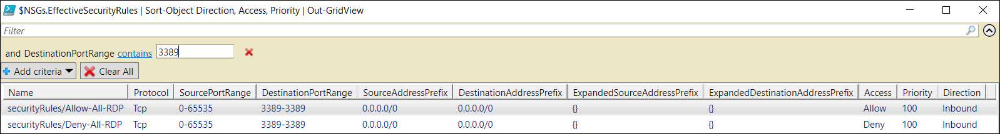

<properties 
   pageTitle="排查网络安全组问题 - PowerShell | Azure"
   description="了解如何使用 Azure PowerShell 在 Azure Resource Manager 部署模型中排查网络安全组问题。"
   services="virtual-network"
   documentationCenter="na"
   authors="AnithaAdusumilli"
   manager="narayan"
   editor=""
   tags="azure-resource-manager"
/>  

<tags 
   ms.service="virtual-network"
   ms.devlang="na"
   ms.topic="article"
   ms.tgt_pltfrm="na"
   ms.workload="infrastructure-services"
   ms.date="09/23/2016"
   wacn.date="01/05/2017"
   ms.author="anithaa" />  

# 使用 Azure PowerShell 排查网络安全组问题

> [AZURE.SELECTOR]
- [Azure 门户预览](/documentation/articles/virtual-network-nsg-troubleshoot-portal/)
- [PowerShell](/documentation/articles/virtual-network-nsg-troubleshoot-powershell/)

如果在虚拟机 (VM) 上配置网络安全组 (NSG) 时遇到 VM 连接问题，可以借助本文中概述的 NSG 诊断功能进行故障排除。

使用 NSG 可以控制流入和流出虚拟机 (VM) 的流量类型。可对 Azure 虚拟网络 (VNet) 中的子网和/或网络接口 (NIC) 应用 NSG。对 NIC 应用的有效规则是对 NIC 应用的 NSG 以及对 NIC 所连接到的子网应用的 NSG 的规则聚合。这些 NSG 的规则有时互相冲突，影响 VM 的网络连接。

可以查看 NSG 中对 VM NIC 应用的所有有效安全规则。本文说明如何在 Azure Resource Manager 部署模型中使用这些规则来排查 VM 连接问题。如果你不熟悉 VNet 与 NSG 的概念，请参阅 [Virtual network](/documentation/articles/virtual-networks-overview/)（虚拟网络）和 [Network security groups](/documentation/articles/virtual-networks-nsg/)（网络安全组）概述文章。

## 使用有效的安全规则排查 VM 流量流问题

以下情景是常见连接问题的示例：

名为 *VM1* 的 VM 位于 VNet *ChinaNorth-VNet1* 中的 *Subnet1* 子网内。尝试使用 RDP 通过 TCP 端口 3389 连接到 VM 失败。已同时对 NIC *VM1-NIC1* 和子网 *Subnet1* 应用了 NSG。与网络接口 *VM1-NIC1* 关联的 NSG 中允许发往 TCP 端口 3389 的流量，但对 VM1 的端口 3389 执行 TCP ping 失败。

尽管本示例使用 TCP 端口 3389，但可以使用以下步骤在任何端口上判断入站和出站连接失败情况。

## 详细故障排除步骤
完成以下步骤排查 VM 的 NSG 问题：

1. 启动 Azure PowerShell 会话并登录到 Azure。如果不知道如何使用 Azure PowerShell，请阅读 [How to install and configure Azure PowerShell](https://docs.microsoft.com/powershell/azureps-cmdlets-docs)（如何安装和配置 Azure PowerShell）一文。

2. 输入以下命令返回对资源组 *RG1* 中名为 *VM1-NIC1* 的 NIC 应用的所有 NSG 规则：

		Get-AzureRmEffectiveNetworkSecurityGroup -NetworkInterfaceName VM1-NIC1 -ResourceGroupName RG1

	>[AZURE.TIP] 如果不知道 NIC 的名称，请输入以下命令检索资源组中所有 NIC 的名称：
	
	>`Get-AzureRmNetworkInterface -ResourceGroupName RG1 | Format-Table Name`  

	以下文本是针对 *VM1-NIC1* NIC 返回的有效规则输出示例：

		NetworkSecurityGroup   : {
		                           "Id": "/subscriptions/[Subscription ID]/resourceGroups/RG1/providers/Microsoft.Network/networkSecurityGroups/VM1-NIC1-NSG"
		                         }
		Association            : {
		                           "NetworkInterface": {
		                             "Id": "/subscriptions/[Subscription ID]/resourceGroups/RG1/providers/Microsoft.Network/networkInterfaces/VM1-NIC1"
		                           }
		                         }
		EffectiveSecurityRules : [
		                         {
                                 "Name": "securityRules/allowRDP",
                                 "Protocol": "Tcp",
                                 "SourcePortRange": "0-65535",
                                 "DestinationPortRange": "3389-3389",
                                 "SourceAddressPrefix": "Internet",
                                 "DestinationAddressPrefix": "0.0.0.0/0",
                                 "ExpandedSourceAddressPrefix": [… ],
                                 "ExpandedDestinationAddressPrefix": [],
                                 "Access": "Allow",
                                 "Priority": 1000,
                                 "Direction": "Inbound"
		                         },
		                         {
                                 "Name": "defaultSecurityRules/AllowVnetInBound",
                                 "Protocol": "All",
                                 "SourcePortRange": "0-65535",
                                 "DestinationPortRange": "0-65535",
                                 "SourceAddressPrefix": "VirtualNetwork",
                                 "DestinationAddressPrefix": "VirtualNetwork",
                                 "ExpandedSourceAddressPrefix": [
                                  "10.9.0.0/16",
                                  "168.63.129.16/32",
                                  "10.0.0.0/16",
                                  "10.1.0.0/16"
                                  ],
                                 "ExpandedDestinationAddressPrefix": [
                                  "10.9.0.0/16",
                                  "168.63.129.16/32",
                                  "10.0.0.0/16",
                                  "10.1.0.0/16"
                                  ],
                                  "Access": "Allow",
                                  "Priority": 65000,
                                  "Direction": "Inbound"
                                  },…
                         ]
		
		NetworkSecurityGroup   : {
		                           "Id": 
		                         "/subscriptions/[Subscription ID]/resourceGroups/RG1/providers/Microsoft.Network/networkSecurityGroups/Subnet1-NSG"
		                         }
		Association            : {
		                           "Subnet": {
		                             "Id": 
		                         "/subscriptions/[Subscription ID]/resourceGroups/RG1/providers/Microsoft.Network/virtualNetworks/ChinaNorth-VNet1/subnets/Subnet1"
		                         }
		                         }
		EffectiveSecurityRules : [
                                 {
		                        "Name": "securityRules/denyRDP",
                                "Protocol": "Tcp",
                                "SourcePortRange": "0-65535",
                                "DestinationPortRange": "3389-3389",
                                "SourceAddressPrefix": "Internet",
                                "DestinationAddressPrefix": "0.0.0.0/0",
                                "ExpandedSourceAddressPrefix": [
                                   ... ],
                                "ExpandedDestinationAddressPrefix": [],
                                "Access": "Deny",
                                "Priority": 1000,
                                "Direction": "Inbound"
                                },
                                {
                                "Name": "defaultSecurityRules/AllowVnetInBound",
                                "Protocol": "All",
                                "SourcePortRange": "0-65535",
                                "DestinationPortRange": "0-65535",
                                "SourceAddressPrefix": "VirtualNetwork",
                                "DestinationAddressPrefix": "VirtualNetwork",
                                "ExpandedSourceAddressPrefix": [
                                "10.9.0.0/16",
                                "168.63.129.16/32",
                                "10.0.0.0/16",
                                "10.1.0.0/16"
                                ],
                                "ExpandedDestinationAddressPrefix": [
                                "10.9.0.0/16",
                                "168.63.129.16/32",
                                "10.0.0.0/16",
                                "10.1.0.0/16"
                                ],
                                "Access": "Allow",
                                "Priority": 65000,
                                "Direction": "Inbound"
                                },...
		                        ]

	请注意输出中的以下信息：

	- 有两个 **NetworkSecurityGroup** 节：一个与子网 (*Subnet1*) 关联，另一个与 NIC (*VM1-NIC1*) 关联。在本示例中，两个都已应用 NSG。
	- **Association** 显示给定的 NSG 关联的资源（子网或 NIC）。如果在移动 NSG 资源/解除 NSG 资源的关联之后紧接着运行此命令，可能需要等待几秒钟时间，更改才会反映在命令输出中。
	- 前面带有 *defaultSecurityRules* 的规则名称：创建 NSG 时，将在其中创建几个默认的安全规则。无法删除默认规则，但可以使用更高优先级的规则将其覆盖。请阅读 [NSG overview](/documentation/articles/virtual-networks-nsg/#default-rules)（NSG 概述）一文，了解有关 NSG 默认安全规则的详细信息。
	- **ExpandedAddressPrefix** 扩展 NSG 默认标记的地址前缀。标记代表多个地址前缀。对 VM 与特定地址前缀的连接进行故障排除时，扩展标记很有用。例如，如果有 VNET 对等互连，VIRTUAL\_NETWORK 标记将在上述输出中扩展，显示对等互连的 VNet 前缀。

		>[AZURE.NOTE] 仅当 NSG 与子网和/或 NIC 关联时，该命令才显示有效规则。一个 VM 可能有多个应用了不同 NSG 的 NIC。故障排除时，请针对每个 NIC 运行该命令。
        
3. 为了方便筛选大量 NSG 规则，请输入以下命令进一步进行故障排除：

		$NSGs = Get-AzureRmEffectiveNetworkSecurityGroup -NetworkInterfaceName VM1-NIC1 -ResourceGroupName RG1
		$NSGs.EffectiveSecurityRules | Sort-Object Direction, Access, Priority | Out-GridView

	下图向网格视图应用了 RDP 流量（TCP 端口 3389）筛选器：

	  

	
4. 在网格视图中可以看到，RDP 具有允许和拒绝两种规则。步骤 2 的输出显示 *DenyRDP* 规则位于对子网应用的 NSG 中。入站规则先处理对子网应用的 NSG。如果找到匹配项，则不处理对网络接口应用的 NSG。在此情况下，子网中的 *DenyRDP* 规则会阻止通过 RDP 连接到 VM (**VM1**)。

	>[AZURE.NOTE] 一个 VM 上可以附加多个 NIC。每个 NIC 可以连接到不同的子网。由于上一步骤中的命令是针对 NIC 运行的，因此请务必指定连接失败的 NIC。如果不确定要指定哪个 NIC，可以针对附加到 VM 的每个 NIC 运行这些命令。

5. 若要使用 RDP 连接到 VM1，请在 **Subnet1-NSG** NSG 中将 *Deny RDP (3389)* 规则更改为 *Allow RDP(3389)*。打开与 VM 的 RDP 连接或使用 PsPing 工具，确认 TCP 端口 3389 是否已打开。有关 PsPing 的详细信息，请阅读 [PsPing 下载页](https://technet.microsoft.com/sysinternals/psping.aspx)

	可以使用以下命令输出中的信息删除 NSG 中的规则：

		Get-Help *-AzureRmNetworkSecurityRuleConfig
		

## 注意事项

排查连接问题时，请注意以下几点：

- 默认的 NSG 规则会阻止来自 Internet 的入站访问，只允许 VNet 入站流量。若要允许来自 Internet 的入站访问，应该根据需要显式添加规则。
- 如果没有任何 NSG 安全规则导致 VM 出现网络连接失败，则问题的起源可能是：
	- VM 操作系统中运行的防火墙软件
	- 为虚拟设备或本地流量配置的路由。Internet 流量可以通过强制隧道重定向到本地。根据本地网络硬件处理此流量的方式，可能无法使用此设置通过 RDP/SSH 从 Internet 连接到 VM。请阅读 [Troubleshooting Routes](/documentation/articles/virtual-network-routes-troubleshoot-powershell/)（排查路由问题）一文，了解如何诊断可能妨碍流量流入和流出 VM 的路由问题。
- 如果已创建对等互连的 VNet，则默认情况下，VIRTUAL\_NETWORK 标记会自动扩展，包含对等互连的 VNet 的前缀。可以在 **ExpandedAddressPrefix** 列表中查看这些前缀，排查与 VNet 对等互连相关的任何问题。
- 仅当有 NSG 与 VM 的 NIC 和/或子网关联时，才会显示有效安全规则。
- 如果没有任何 NSG 与 NIC 或子网关联，并且向 VM 分配了公共 IP 地址，则会打开所有端口以便进行入站和出站访问。如果 VM 使用公共 IP 地址，我们强烈建议对 NIC 或子网应用 NSG。

<!---HONumber=Mooncake_1107_2016-->