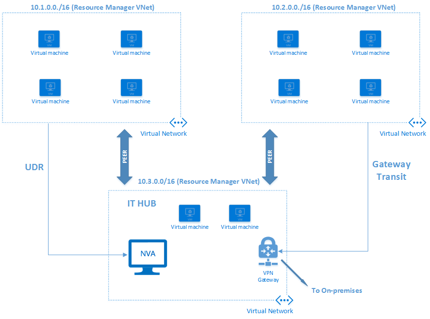

<properties
   pageTitle="Azure 虚拟网络对等互连 | Azure"
   description="了解 Azure 中的 VNet 对等互连。"
   services="virtual-network"
   documentationCenter="na"
   authors="NarayanAnnamalai"
   manager="jefco"
   editor="tysonn" />
<tags 
   ms.service="virtual-network"
   ms.devlang="na"
   ms.topic="get-started-article"
   ms.tgt_pltfrm="na"
   ms.workload="infrastructure-services"
   ms.date="10/17/2016"
   wacn.date=""
   ms.author="narayan" />

# VNet 对等互连

VNet 对等互连是一种通过 Azure 主干网络在同一区域连接两个虚拟网络的机制。对等互连后，出于所有连接目的，两个虚拟网络会显示为一个。这两个虚拟网络仍作为单独资源管理，但这些虚拟网络中的虚拟机可直接通过专用 IP 地址彼此通信。

对等虚拟网络中虚拟机之间的流量通过Azure 基础结构路由，与同一虚拟网络中的 VM 间的流量的路由方式一样。使用 VNet 对等互连的部分好处有：

- 不同虚拟网络中资源之间的连接延迟低且带宽高。
- 能够将诸如网络设备和 VPN 网关等资源用作对等 VNet 中的传输点。
- 能够连接使用 Azure Resource Manager 模型的虚拟网络与使用经典部署模型的虚拟网络，并使这些虚拟网络中资源之间可完全连接。

VNet 对等互连的要求和关键方面：

- 对等的两个虚拟网络应位于同一 Azure 区域中。
- 对等的虚拟网络应具有非重叠的 IP 地址空间。
- VNet 对等互连在两个虚拟网络之间进行，没有任何派生的可传递关系。例如，如果虚拟网络 A 与虚拟网络 B 对等，虚拟网络 B 与虚拟网络 C 对等，这并不表示虚拟网络 A 与虚拟网络 C 对等。
- 可以在两个不同订阅中的虚拟网络间建立对等互连，只要两个订阅的特权用户授权予对等互连，并且订阅与同一个 Active Directory 租户关联即可。
- Resouce Manager 模型与经典部署模型中虚拟网络之间的对等互连要求 VNet 位于同一个订阅中。
- 使用 Resource Manager 部署模型的虚拟网络可与使用此模型的另一个虚拟网络对等，或与使用经典部署模型的虚拟网络对等。但使用经典部署模型的虚拟网络不能彼此对等：
- 尽管对等虚拟网络中虚拟机之间的通信没有任何额外的带宽限制，但基于 VM 大小的带宽上限仍适用。

## 连接
两个虚拟网络对等后，虚拟网络中的虚拟机 （Web/辅助角色）可直接与对等虚拟网络中的其他虚拟机连接。这两个网络具有完全 IP 级连接。

对等虚拟网络中两个虚拟机间的往返网络延迟与本地虚拟网络内的往返过程相同。网络吞吐量取决于允许虚拟机与其大小成比例匹配的带宽。带宽没有任何其他限制。

对等虚拟网络中虚拟机间的流量直接通过 Azure 后端基础结构（而不通过网关）路由。

虚拟网络中的虚拟机可访问对等虚拟网络中的内部负载均衡 (ILB) 终结点。网络安全组 (NSG) 适用于虚拟网络（阻止访问其他虚拟网络）或子网（如需要）。

用户配置对等互连时，可以打开或关闭虚拟网络之间的 NSG 规则。如果用户选择打开对等虚拟网络之间的完全连接（这是默认选项），就可以使用特定子网或虚拟机上的 NSG 阻止或拒绝特定访问。

Azure 为虚拟机提供的内部 DNS 名称解析在对等虚拟网络中无效。虚拟机具有仅在本地虚拟网络内可解析的内部 DNS 名称。但用户可将运行于对等虚拟网络中的虚拟机配置为虚拟网络的 DNS 服务器。

## 服务链
如本文之后的关系图所示，用户可以将指向对等虚拟网络中虚拟机的用户定义路由表配置为“下一跃点”IP 地址。这使用户能够实现服务链，通过服务链可将流量从一个虚拟网络定向到虚拟设备，该虚拟设备通过用户定义的路由表在对等虚拟网络中运行。

用户还有效构建中心辐射型环境，中心可在其中托管基础结构组件，如网络虚拟设备。然后，所有分散虚拟网络均可与之对等，以及与运行于中心虚拟网络的装置的流量子集对等。简言之，VNet 对等互连使“用户定义的路由表”中的下一跃点 IP 地址成为对等虚拟网络中虚拟机的 IP 地址。

## 网关和本地连接
无论是否与另一个虚拟网络对等，每个虚拟网络仍可具有自己的网关，并使用它连接到本地。即使虚拟网络对等，用户也可以使用网关配置 [VNet 到 VNet 连接](/documentation/articles/vpn-gateway-vnet-vnet-rm-ps/)。

若已配置虚拟网络互连的两个选项，则虚拟网络之间的流量将通过对等配置（即通过 Azure 主干）流通。

虚拟网络对等时，用户还可以将对等虚拟网络中的网关配置为本地的传输点。在这种情况下，使用远程网关的虚拟网络没有自己的网关。一个虚拟网络只能有一个网关。可能是是本地网关或远程网关（对等虚拟网络中），如下图所示。

网关传输在使用 Resource Manager 模型和经典部署模型的虚拟网络间的对等关系中不受支持。对等关系中的两个虚拟网络需要使用 Resource Manager 部署模型才能使网关传输正常工作。

正在共享单个 Azure ExpressRoute 连接的虚拟网络对等时，它们之间的流量会通过对等关系（即通过 Azure 主干网）流通。用户仍可在各个虚拟网络中使用本地网关连接到本地线路。或者可以使用共享网关，并为本地连接配置传输。

## 设置
VNet 对等互连是一项特权操作。它是 VirtualNetworks 命名空间下的独立功能。可授予用户特定权限来授权对等互连。具有虚拟网络读写访问权限的用户自动继承这些权限。

管理员或具有对等互连能力的特权用户可在另一个 VNet 上启动对等操作。如果另一端存在对等互连的匹配请求且也满足其他要求，就会建立对等互连。

请参阅“后续步骤”部分的文章，了解有关如何建立两个虚拟网络之间的 VNet 对等互连的详细信息。

## 限制
允许单个虚拟网络建立的对等互连数存在限制。有关详细信息，请参阅 [Azure 网络限制](/documentation/articles/azure-subscription-service-limits/#networking-limits)。

## 定价
VNet 对等互连在审核期间免费。正式发布后，会对利用对等互连的入口和出口流量收取少许费用。有关详细信息，请参阅[定价页](/pricing/details/networking/)。

## 后续步骤
- [设置虚拟网络间的对等互连](/documentation/articles/virtual-networks-create-vnetpeering-arm-portal/)。
- 了解 [NSG](/documentation/articles/virtual-networks-nsg/)。
- 了解[用户定义的路由和 IP 转发](/documentation/articles/virtual-networks-udr-overview/)。

<!---HONumber=Mooncake_1107_2016-->