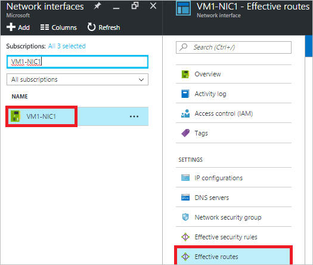
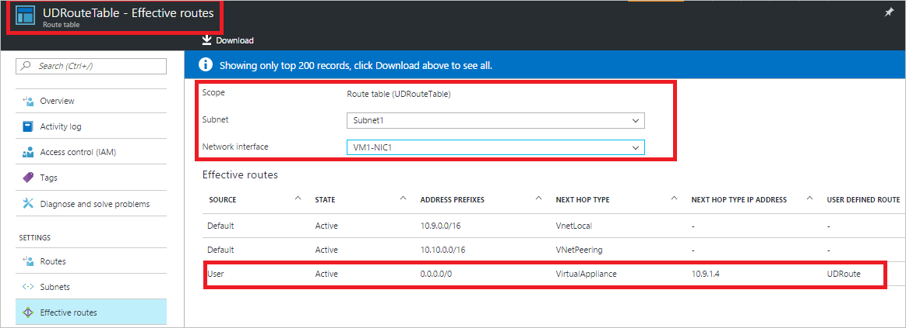

<properties 
   pageTitle="排查路由问题 - 门户 | Azure"
   description="了解如何使用 Azure 门户在 Azure Resource Manager 部署模型中排查路由问题。"
   services="virtual-network"
   documentationCenter="na"
   authors="AnithaAdusumilli"
   manager="narayan"
   editor=""
   tags="azure-resource-manager"
/>  

<tags 
   ms.service="virtual-network"
   ms.devlang="na"
   ms.topic="article"
   ms.tgt_pltfrm="na"
   ms.workload="infrastructure-services"
   ms.date="09/23/2016"
   wacn.date="11/14/2016"
   ms.author="anithaa" />  

# 使用 Azure 门户排查路由问题

> [AZURE.SELECTOR]
- [Azure 门户](/documentation/articles/virtual-network-routes-troubleshoot-portal/)
- [PowerShell](/documentation/articles/virtual-network-routes-troubleshoot-powershell/)

如果与 Azure 虚拟机 (VM) 之间出现网络连接问题，路由可能会影响 VM 的流量流。本文概述路由诊断功能，帮助用户做进一步的故障排除。

路由表与子网关联，在该子网中的所有网络接口 (NIC) 上有效。可将以下类型的路由应用到每个网络接口：

- **系统路由：**默认情况下，在 Azure 虚拟网络 (VNet) 中创建的每个子网都具有系统路由表，允许传送本地 VNet 流量、通过 VPN 网关的本地流量以及 Internet 流量。对等互连的 VNet 也有系统路由。
- **BGP 路由：**通过 ExpressRoute 或站点到站点 VPN 连接传播到网络接口。阅读 [BGP with VPN gateways](/documentation/articles/vpn-gateway-bgp-overview/)（使用 VPN 网关的 BGP）和 [ExpressRoute overview](/documentation/articles/expressroute-introduction/)（ExpressRoute 概述）文章，了解有关 BGP 路由的详细信息。
- **用户定义的路由 (UDR)：**如果使用网络虚拟设备或强制隧道通过站点到站点 VPN 将流量传送到本地网络，可将用户定义的路由 (UDR) 与子网路由表相关联。如果你不熟悉 UDR，请阅读 [user-defined routes](/documentation/articles/virtual-networks-udr-overview/#user-defined-routes)（用户定义的路由）一文。

由于可将各种路由应用到网络接口，因此有时难以确定哪些聚合路由是有效的。为了帮助排查 VM 网络连接问题，可以查看 Azure Resource Manager 部署模型中某个网络接口的所有有效路由。

## 使用有效路由排查 VM 流量流问题

本文使用以下情景作为示例，演示如何排查网络接口的有效路由问题：

与 VNet（*VNet1*，前缀为 10.9.0.0/16）连接的 VM (*VM1*) 无法连接到最近对等互连的 VNet（*VNet3*，前缀为 10.10.0.0/16）中的 VM (VM3)。连接到该 VM 的 VM1-NIC1 网络接口未应用 UDR 或 BGP 路由，只应用了系统路由。

本文说明如何使用 Azure Resource Manager 部署模型中的有效路由功能确定连接失败的原因。尽管本示例只使用系统路由，但可以使用相同的步骤判断任何路由类型的入站和出站连接失败情况。

>[AZURE.NOTE] 如果 VM 附加了多个 NIC，请检查每个 NIC 的有效路由，以便诊断与 VM 之间的网络连接问题。

### 查看虚拟机的有效路由

若要查看应用到 VM 的聚合路由，请完成以下步骤：

1. 登录到 Azure 门户 (https://portal.azure.cn)。
2. 单击“更多服务”，然后在显示的列表中单击“虚拟机”。
3. 在显示的列表中选择要进行故障排除的 VM，随后会显示一个包含选项的 VM 边栏选项卡。
4. 单击“诊断和解决问题”，然后选择一个常见问题。本示例选择了“无法连接到 Windows VM”。

	  

5. 该问题的下面会出现步骤，如下图所示：

	  

	在建议的步骤列表中单击“有效路由”。

6. 此时将显示“有效路由”边栏选项卡，如下图所示：

	  

	如果 VM 只有一个 NIC，则默认已选择该 NIC。如果有多个 NIC，请选择要查看其有效路由的 NIC。

	>[AZURE.NOTE] 如果与 NIC 关联的 VM 不处于运行中状态，将不显示有效路由。门户中只显示前 200 个有效路由。如需完整列表，请单击“下载”。可以在下载的 .csv 文件中进一步筛选结果。

	请注意输出中的以下信息：
	- **Source**：表示路由的类型。系统路由显示为 *Default*，UDR 显示为 *User*，网关路由（静态或 BGP）显示为 *VPNGateway*。
	- **State**：表示有效路由的状态。可能的值为 *Active* 或 *Invalid*。
	- **AddressPrefixes**：以 CIDR 表示法指定有效路由的地址前缀。
	- **nextHopType**：表示给定路由的下一跃点。可能的值为 *VirtualAppliance*、*Internet*、*VNetLocal*、*VNetPeering* 或 *Null*。如果 UDR 中的 **nextHopType** 值为 *Null*，可能表示是路由无效。例如，如果 **nextHopType** 为 *VirtualAppliance*，但网络虚拟设备 VM 不处于已预配/运行中状态。如果 **nextHopType** 为 *VPNGateway*，但给定的 VNet 中没有任何网关处于已预配/运行中状态，则路由可能失效。
    
7. 上一步骤的图片中没有列出从 *ChinaNorth-VNet1*（前缀 10.9.0.0/16）到 *ChinaNorth-VNET3* VNet（前缀 10.10.0.0/16）的路由。在下图中，对等互连链接处于 *Disconnected* 状态：
	
	  

	对等互连的双向链接已断开，正因如此，VM1 无法连接到 *ChinaNorth-VNet3* VNet 中的 VM3。

8. 下图显示了创建双向对等互连链接后的路由：

	  

有关强制隧道和路由评估的更多故障排除方案，请阅读本文的[注意事项](/documentation/articles/virtual-network-routes-troubleshoot-portal/#Considerations)部分。

###  查看网络接口的有效路由

如果网络流量流受到特定网络接口 (NIC) 的影响，可以直接查看 NIC 上有效路由的完整列表。若要查看应用到 NIC 的聚合路由，请完成以下步骤：

1. 登录到 Azure 门户 (https://portal.azure.cn)。
2. 单击“更多服务”，然后单击“网络接口”。
3. 在列表中搜索 NIC 的名称，或者从显示的列表中选择 NIC。本示例选择了 **VM1-NIC1**。
4. 在“网络接口”边栏选项卡中选择“有效路由”，如下图所示：
   
   	  

    “范围”默认设置为选定的网络接口。

  	  

### 查看路由表的有效路由

在路由表中修改用户定义的路由 (UDR) 时，可以查看在特定 VM 上添加路由造成的影响。一个路由表可与任意数量的子网关联。现在，可以查看应用了给定路由表的所有 NIC 的所有有效路由，而无需从给定路由表的边栏选项卡切换上下文。

在本示例中，路由表 (*UDRouteTable*) 中指定了 UDR (*UDRoute*)。此路由通过网络虚拟设备 (NVA) 将所有 Internet 流量从 *ChinaNorth-VNet1* VNet 中的 *Subnet1* 发送到同一 VNet 中的 *Subnet2*。该路由如下图所示：

  

若要查看路由表的聚合路由，请完成以下步骤：

1. 登录到 Azure 门户 (https://portal.azure.cn)。
2. 单击“更多服务”，然后单击“路由表”。
3. 在列表中搜索想要查看其聚合路由的路由表，并将它选中。本示例选择了 **UDRouteTable**。此时将显示选定路由表的边栏选项卡，如下图所示：

	  

4. 在“路由表”边栏选项卡中选择“有效路由”。“范围”已设置为选定的路由表。
5. 一个路由表可以应用到多个子网。从列表中选择想要查看的**子网**。本示例选择了 **Subnet1**。
6. 选择一个**网络接口**。随后将列出已连接到选定子网的所有 NIC。本示例选择了 **VM1-NIC1**。

	  

	>[AZURE.NOTE] 如果 NIC 没有与运行中的 VM 关联，则不会显示任何有效路由。

## 注意事项

查看返回的路由列表时，请注意以下事项：

- 路由基于 UDR、BGP 与系统路由之间的最长前缀匹配 (LPM)。如果有多个路由的 LPM 匹配情况相同，则按以下顺序根据路由源来选择路由：
	- 用户定义的路由
	- BGP 路由
	- 系统（默认）路由

	对于有效路由，只能查看基于所有可用路由匹配 LPM 的有效路由。如果显示了如何针对给定 NIC 实际评估路由，因此可以更方便地对可能影响 VM 连接的特定路由进行故障排除。

- 如果使用 UDR 并且要将流量发送到网络虚拟设备 (NVA)（*VirtualAppliance* 为 **nextHopType**），请确保接收流量的 NVA 已启用 IP 转发，否则数据包将被丢弃。
- 如果启用了强制隧道，所有出站 Internet 流量将路由到本地。根据本地处理此流量的方式，可能无法使用此设置通过 RDP/SSH 从 Internet 连接到 VM。符合以下条件时，可以启用强制隧道：
	- 使用站点到站点 VPN 时，将用户定义的路由 (UDR) 的 nextHopType 设置为 VPN 网关
	- 通过 BGP 播发默认路由时
- 要使 VNet 对等互连流量正常工作，对等互连的 VNet 的前缀范围中必须存在 **nextHopType** 为 *VNetPeering* 的系统路由。如果没有此类路由，并且 VNet 对等互连链接看起来正常：
	- 如果是新建立的对等互连链接，请等待几秒钟并重试。有时需要花费较长的时间才能将路由传播到子网中的所有网络接口。
	- 网络安全组 (NSG) 规则可能会影响流量流。有关详细信息，请参阅 [Troubleshoot Network Security Groups](/documentation/articles/virtual-network-nsg-troubleshoot-portal/)（排查网络安全组问题）一文。

<!---HONumber=Mooncake_1107_2016-->