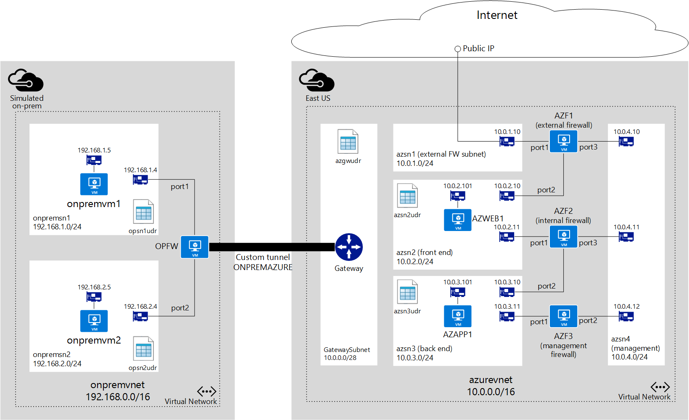

<properties 
   pageTitle="包含双层应用程序的混合连接 | Azure"
   description="了解如何部署虚拟设备和 UDR 以便在 Azure 中创建多层应用程序环境"
   services="virtual-network"
   documentationCenter="na"
   authors="telmosampaio"
   manager="christb"
   editor="tysonn" />
<tags
	ms.service="virtual-network"
	ms.date="05/05/2016"
	wacn.date="05/30/2016"/>

# 虚拟设备方案

在较大的 Azure 客户中，一种常见情况是需要向 Internet 公开某个双层应用程序，同时允许从本地数据中心访问后端层。本文档将指导你实施一种使用用户定义的路由 (UDR)、VPN 网关和网络虚拟设备部署双层环境的方案，该方案可满足以下要求：

- 只能从公共 Internet 访问 Web 应用程序。
- 托管应用程序的 Web 服务器必须能够访问后端应用程序服务器。
- 从 Internet 到 Web 应用程序的所有流量必须流经防火墙虚拟设备。此虚拟设备只用于 Internet 流量。
- 发往应用程序服务器的所有流量必须流经防火墙虚拟设备。此虚拟设备将用于通过 VPN 网关从本地网络访问后端服务器。
- 管理员必须能够使用第三个防火墙虚拟设备（专门用于管理目的）从其本地计算机管理防火墙虚拟设备。

这是一个标准的外围网络方案，其中包含一个外围网络和一个受保护网络。可以在 Azure 中使用 NSG 和/或防火墙虚拟设备来构建此类方案。下表显示了 NSG 与防火墙虚拟设备之间的一些优缺点。

||优点|缺点|
|---|---|---|
|NSG|无需付费。 已集成到 Azure RBAC 中。 可以在 ARM 模板中创建规则。|在大型环境中复杂性各不相同。 |
|防火墙|完全控制数据平面。 通过防火墙控制台进行集中管理。|防火墙设备的费用。 不与 Azure RBAC 集成。|

以下解决方案使用防火墙虚拟设备来实施外围网络/受保护网络方案。

## 注意事项

可以使用当前可用的如下所述的不同功能在 Azure 中部署上述环境。

- **虚拟网络 (VNet)**。Azure VNet 在形式上与本地网络相似，可分段为一个或多个子网，以提供流量隔离和关注点分离。
- **虚拟设备**。有多个合作伙伴在 Azure 库中提供了虚拟设备，可对上述三种防火墙使用这些设备。 
- **用户定义的路由 (UDR)**。路由表可以包含 Azure 网络使用的 UDR 来控制数据包在 VNet 中的流动。这些路由表可应用到子网。Azure 中的最新功能之一是将路由表应用到 GatewaySubnet，从而能够通过混合连接将传入 Azure VNet 的所有流量转发到虚拟设备。
- **IP 转发**。默认情况下，仅当数据包目标 IP 地址与 NIC IP 地址匹配时，Azure 网络引擎才将数据包转发到虚拟网络接口卡 (NIC)。因此，如果 UDR 定义必须将数据包发送到给定的虚拟设备，则 Azure 网络引擎会丢弃该数据包。为了确保将数据包传送到并非数据包实际目标的 VM（在本例中为虚拟设备），需要为虚拟设备启用 IP 转发。
- **网络安全组 (NSG)**。以下示例未使用 NSG，但你可以在此解决方案中使用应用到子网和/或 NIC 的 NSG 来进一步筛选传入和传出子网与 NIC 的流量。

此示例中，有一个订阅包含以下项：

- 2 个资源组（示意图中未显示）。 
	- **ONPREMRG**。包含模拟本地网络所需的所有资源。
	- **AZURERG**。包含 Azure 虚拟网络环境所需的所有资源。 
- 名为 **onpremvnet** 的 VNet，用于模拟按如下所示分段的本地数据中心。
	- **onpremsn1**。包含一个虚拟机 (VM) 的子网，该 VM 运行 Ubuntu，用于模拟本地服务器。
	- **onpremsn2**。包含一个 VM 的子网，该 VM 运行 Ubuntu，用于模拟管理员使用的本地计算机。
- **onpremvnet** 上有一个名为 **OPFW** 的防火墙虚拟设备，用于与 **azurevnet** 保持隧道连接。
- 按如下所示分段的名为 **azurevnet** 的 VNet。
	- **azsn1**。专门用于外部防火墙的外部防火墙子网。所有 Internet 流量将通过此子网传入。此子网仅包含链接到外部防火墙的 NIC。
	- **azsn2**。前端子网，托管作为 Web 服务器运行的、将从 Internet 访问的 VM。
	- **azsn3**。后端子网，托管运行前端应用程序服务器的、将由前端 Web 服务器访问的 VM。
	- **azsn4**。管理子网，专门用于提供对所有防火墙虚拟设备的管理访问权限。此子网仅包含解决方案中使用的每个防火墙虚拟设备的 NIC。
	- **GatewaySubnet**。ExpressRoute 和 VPN 网关在 Azure VNet 与其他网络之间提供连接所需的 Azure 混合连接子网。 
- **azurevnet** 网络中有 3 个防火墙虚拟设备。 
	- **AZF1**。在 Azure 中使用公共 IP 地址资源向公共 Internet 公开的外部防火墙。需要确保从应用商店或者直接从设备供应商那里获取一个模板用于预配 3-NIC 虚拟设备。
	- **AZF2**。用于控制 **azsn2** 与 **azsn3** 之间流量的内部防火墙。这也是一个 3-NIC 虚拟设备。
	- **AZF3**。管理员可从本地数据中心访问的管理防火墙，它已连接到用于管理所有防火墙设备的管理子网。可以在应用商店中查找 2-NIC 虚拟设备模板，或者直接向设备供应商请求提供此类模板。

## 用户定义的路由 (UDR)

Azure 中的每个子网可以链接到用于定义该子网中发起的流量路由方式的 UDR 表。如果未定义 UDR，Azure 将使用默认路由来允许流量从一个子网流向另一个子网。若要更好地理解 UDR，请访问“What are User Defined Routes and IP Forwarding”（什么是用户定义的路由和 IP 转发）。

为了确保根据上述最后一项要求通过适当的防火墙设备进行通信，需要在 **azurevnet** 中创建以下包含 UDR 的路由表。

### azgwudr

在此方案中，只会通过连接到 **AZF3**，使用从本地流往 Azure 的流量来管理防火墙，并且这些流量必须通过内部防火墙 **AZF2**。因此，**GatewaySubnet** 中只需要一个路由，如下所示。

|目标|下一跃点|说明|
|---|---|---|
|10\.0.4.0/24|10\.0.3.11|允许本地流量到达管理防火墙 **AZF3**|

### azsn2udr

|目标|下一跃点|说明|
|---|---|---|
|10\.0.3.0/24|10\.0.2.11|允许通过 **AZF2** 将流量传送到托管应用程序服务器的后端子网|
|0\.0.0.0/0|10\.0.2.10|允许通过 **AZF1** 路由所有其他流量|

### azsn3udr

|目标|下一跃点|说明|
|---|---|---|
|10\.0.2.0/24|10\.0.3.10|允许通过 **AZF2** 将发往 **azsn2** 的流量从应用服务器传送到 Web 服务器|

还需要为 **onpremvnet** 中的子网创建路由表用于模拟本地数据中心。

### onpremsn1udr

|目标|下一跃点|说明|
|---|---|---|
|192\.168.2.0/24|192\.168.1.4|允许通过 **OPFW** 将流量传送到 **onpremsn2**|

### onpremsn2udr

|目标|下一跃点|说明|
|---|---|---|
|10\.0.3.0/24|192\.168.2.4|允许通过 **OPFW** 将流量传送到 Azure 中的后端子网|
|192\.168.1.0/24|192\.168.2.4|允许通过 **OPFW** 将流量传送到 **onpremsn1**|

## IP 转发 

可以结合使用 UDR 和 IP 转发功能来允许使用虚拟设备控制 Azure VNet 中的流量流。虚拟设备只是一个 VM，该 VM 所运行的应用程序用于通过某种方式（例如防火墙或 NAT 设备）处理网络流量。

此虚拟设备 VM 必须能够接收不发送给自身的传入流量。若要允许 VM 接收发送到其他目标的流量，必须为该 VM 启用 IP 转发。这是 Azure 设置，不是来宾操作系统中的设置。虚拟设备仍需要运行某种类型的应用程序来处理传入流量并相应地路由这些流量。

有关 IP 转发的详细信息，请访问 [What are User Defined Routes and IP Forwarding（什么是用户定义的路由和 IP 转发）](/documentation/articles/virtual-networks-udr-overview/#ip-forwarding)。

例如，假设你在 Azure VNet 中使用了以下设置：

- 子网 **onpremsn1** 包含名为 **onpremvm1** 的 VM。
- 子网 **onpremsn2** 包含名为 **onpremvm2** 的 VM。
- 名为 **OPFW** 的虚拟设备已连接到 **onpremsn1** 和 **onpremsn2**。
- 链接到 **onpremsn1** 的用户定义路由指定发往 **onpremsn2** 的所有流量必须发送到 **OPFW**。

此时，如果 **onpremvm1** 尝试与 **onpremvm2** 建立连接，将使用 UDR 并将流量发送到用作下一跃点的 **OPFW**。请注意，实际数据包目标不会更改，**onpremvm2** 仍显示为目标。

如果没有为 **OPFW** 启用 IP 转发，Azure 虚拟网络逻辑将丢弃数据包，因为仅当 VM 的 IP 地址是数据包的目标时，它才允许将数据包发送到 VM。

如果启用了 IP 转发，Azure 虚拟网络逻辑会将数据包转发到 OPFW，且不更改其原始目标地址。**OPFW** 必须处理数据包并确定要进行哪些方面的处理。

要正常运行上述方案，必须在 **OPFW**、**AZF1**、**AZF2** 和 **AZF3** 中用于路由的 NIC（除链接到管理子网以外的所有 NIC）上启用 IP 转发。

## 防火墙规则

如上所述，IP 转发仅确保将数据包发送到虚拟设备。设备仍需要确定如何处理这些数据包。对于上述方案，需要在设备中创建以下规则：

### OPFW

OPFW 代表包含以下规则的本地设备：

- **路由**：发往 10.0.0.0/16 (**azurevnet**) 的所有流量必须通过隧道 **ONPREMAZURE** 发送。
- **策略**：允许 **port2** 与 **ONPREMAZURE** 之间的所有双向流量。
 
### AZF1

AZF1 代表包含以下规则的 Azure 虚拟设备：

- **策略**：允许 **port1** 与 **port2** 之间的所有双向流量。

### AZF2

AZF2 代表包含以下规则的 Azure 虚拟设备：

- **路由**：发往 10.0.0.0/16 (**onpremvnet**) 的所有流量必须通过 **port1** 发送到 Azure 网关 IP 地址（即 10.0.0.1）。
- **策略**：允许 **port1** 与 **port2** 之间的所有双向流量。

## 网络安全组 (NSG)

此方案中未使用 NSG。但是，你可以向每个子网应用 NSG，以限制传入和传出的流量。例如，可将以下 NSG 规则应用到外部 FW 子网。

**传入**

- 允许所有 TCP 流量从 Internet 发往子网中任何 VM 上的端口 80。
- 拒绝来自 Internet 的所有其他流量。

**传出**
- 拒绝发往 Internet 的所有流量。

## 大致步骤

若要部署此方案，请遵循以下概要步骤。

1.	登录到你的 Azure 订阅。
2.	如果你要部署 VNet 来模拟本地网络，请预配属于 **ONPREMRG** 的资源。
3.	预配属于 **AZURERG** 的资源。
4.	预配从 **onpremvnet** 到 **azurevnet** 的隧道。
5.	预配所有资源后，登录到 **onpremvm2** 并 ping 10.0.3.101，以测试 **onpremsn2** 与 **azsn3** 之间的连接。

<!---HONumber=Mooncake_0523_2016-->