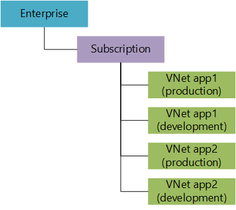
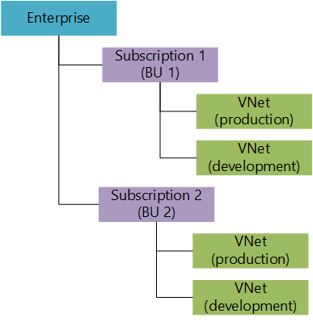

<!-- ARM: tested -->

<properties
   pageTitle="Azure 虚拟网络 (VNet) 规划和设计指南 | Azure"
   description="了解如何基于隔离、连接性和位置要求规划和设计 Azure 中的虚拟网络。"
   services="virtual-network"
   documentationCenter="na"
   authors="telmosampaio"
   manager="carmonm"
   editor="tysonn" />
<tags
	ms.service="virtual-network"
	ms.date="02/08/2016"
	wacn.date="06/06/2016"/>

# 规划和设计 Azure 虚拟网络

创建要用于试验的 VNet 非常简单，但却可能是，你将在一段时间内部署多个 VNet 以支持组织的生产需要。通过进行一些规划和设计，你将能够更有效地部署 VNet 和连接所需的资源。如果你不熟悉 VNet，建议你[了解 VNet](/documentation/articles/virtual-networks-overview/) 和[如何部署](/documentation/articles/virtual-networks-create-vnet-arm-ps/) VNet 后再继续。

## 计划

深入了解 Azure 订阅、区域和网络资源对于成功来说至关重要。可以使用下面的注意事项列表作为起点。了解这些注意事项后，你便可以定义网络设计要求了。

### 注意事项

在回答下面的规划问题之前，请考虑以下事项：

- 你在 Azure 中创建的所有内容都由一个或多个资源组成。虚拟机 (VM) 是一种资源，VM 所用的网络适配器接口 (NIC) 是一个资源，NIC 所用的公共 IP 地址是一种资源，NIC 所连接到的 VNet 也是一种资源。
- 你可在 Azure 区域和订阅中创建资源。并且资源只能连接到它们所属的同一区域和订阅中存在的 VNet。 
- 你可以使用 Azure [VPN 网关](/documentation/articles/vpn-gateway-vnet-vnet-rm-ps/)将 VNet 彼此相连。你还可以通过这种方式跨区域和订阅连接 VNet。
- 你可以使用 Azure 中提供的[连接选项](/documentation/articles/vpn-gateway-cross-premises-options/)之一将 VNet 连接到本地网络。 
- 不同资源可以在[资源组](/documentation/articles/resource-group-overview/#resource-groups)中分组在一起，这样可便于将资源作一个单元来进行管理。资源组可以包含多个区域中的资源，只要这些资源属于同一订阅。

### 定义要求

使用下面的问题作为 Azure 网络设计的起点。

1. 你将使用哪些 Azure 位置来托管 VNet？
2. 你是否需要在这些 Azure 位置之间提供通信？
3. 你是否需要在 Azure VNet 和在本地数据中心之间提供通信？
4. 你需要将多少基础结构即服务 (IaaS) VM、云服务角色和 Web 应用用于你的解决方案？
5. 是否需要基于 VM 组（即前端 Web 服务器和后端数据库服务器）隔离流量？
6. 是否需要使用虚拟设备来控制通信流？
7. 用户对于不同 Azure 资源是否需要不同权限集？

### 了解 VNet 和子网属性

VNet 和子网资源可帮助定义 Azure 中运行的工作负荷的安全边界。VNet 的特征包括一个地址空间（定义为 CIDR 块）的集合。

>[AZURE.NOTE] 网络管理员应熟悉 CIDR 表示法。如果你不熟悉 CIDR，请[了解它的详细信息](http://whatismyipaddress.com/cidr)。

VNet 包含以下属性。

|属性|说明|约束|
|---|---|---|
|**name**|VNet 名称|最多 80 个字符的字符串。可以包含字母、数字、下划线、句点或连字符。必须以字母或数字开头。必须以字母、数字或下划线结尾。可以包含大写或小写字母。|  
|**位置**|Azure 位置（也称为区域）。|必须是有效的 Azure 位置之一。|
|**addressSpace**|在 CIDR 表示法中构成 VNet 的地址前缀集合。|必须是有效的 CIDR 地址块（包括公共 IP 地址范围）的数组。|
|**子网**|构成 VNet 的子网集合|请参阅下面的子网属性表。||
|**dhcpOptions**|包含一个名为 **dnsServers** 的必需属性的对象。||
|**dnsServers**|VNet 所使用的 DNS 服务器的数组。如果未指定服务器，则使用 Azure 内部名称解析。|必须为最多 10 个 DNS 服务器（按 IP 地址统计）的数组。| 

子网是 VNet 的子资源，可帮助定义使用 IP 地址前缀在 CIDR 块中定义地址空间的段。可以将 NIC 添加到子网，并连接到 VM，以便为各种工作负荷提供连接。

子网包含以下属性。

|属性|说明|约束|
|---|---|---|
|**name**|子网名称|最多 80 个字符的字符串。可以包含字母、数字、下划线、句点或连字符。必须以字母或数字开头。必须以字母、数字或下划线结尾。可以包含大写或小写字母。|
|**位置**|Azure 位置（也称为区域）。|必须是有效的 Azure 位置之一。|
|**addressPrefix**|在 CIDR 表示法中构成子网的单个地址前缀|必须是属于其中一个 VNet 地址空间的单个 CIDR 块。|
|**networkSecurityGroup**|应用到子网的 NSG|请参阅 NSG|
|**routeTable**|应用到子网的路由表|请参阅 UDR|
|**ipConfigurations**|连接子网的 NIC 所用的 IP 配置对象集合|请参阅 IP 配置|

### 名称解析

默认情况下，你的 VNet 使用 [Azure 提供的名称解析](/documentation/articles/virtual-networks-name-resolution-for-vms-and-role-instances/#Azure-provided-name-resolution)来解析 VNet 内部和公共 Internet 上的名称。但是，如果你将 VNet 连接到本地数据中心，则需要提供 [你自己的 DNS 服务器](/documentation/articles/virtual-networks-name-resolution-for-vms-and-role-instances/#Name-resolution-using-your-own-DNS-server)来解析网络之间的名称。

### 限制

在设计解决方案之前，请确保查看所有[与 Azure 中的网络服务相关的限制](/documentation/articles/azure-subscription-service-limits/#networking-limits)。可以通过开具支持票证增加某些限制。

### 基于角色的访问控制 (RBAC)

你可以使用 Azure RBAC 来控制不同用户可能对 Azure 中的不同资源具有的访问级别。这样就可以根据团队的需要分隔团队完成的工作。

就虚拟网络而言，具有**网络参与者**角色的用户可以完全控制 Azure Resource Manager 虚拟网络资源。同样，具有**经典网络参与者**角色的用户可以完全控制经典虚拟网络资源。

>[AZURE.NOTE] 你还可以创建自己的角色来分离管理需求。

## 设计

了解[规划](#Plan)部分中问题的答案后，请查看以下内容，然后再定义你的 VNet。

### 订阅和 VNet 的数量

在以下情况下，你应考虑创建多个 VNet：

- **需要放置在不同 Azure 位置的 VM**。Azure 中的 VNet 是区域 VNet。它们不能跨位置设置。因此，每个要在其中托管 VM 的 Azure 位置至少需要一个 VNet。
- **需要彼此之间完全隔离的工作负荷**。你可以创建单独的 VNet（甚至使用相同的 IP 地址空间）来将不同的工作负荷彼此隔离。 
- **避免平台限制**。如[限制](#Limits)部分中所示，你在单个 VNet 中不能有超过 2048 个的 VM。 

请记住，你在上面看到的限制是按每个区域、每个订阅制定的。这意味着你可以使用多个订阅来增加可以在 Azure 中维护的资源的上限。可以使用站点到站点 VPN 或 ExpressRoute 线路来连接不同订阅中的 VNet。

### 订阅和 VNet 设计模式

下表显示了使用订阅和 VNet 的一些常用设计模式。

|方案|图表|优点|缺点|
|---|---|---|---|
|每个应用单个订阅、两个 VNet||只需要管理一个订阅。|每个 Azure 区域最多有 25 个应用。在这之后，你需要更多订阅。|
|每个应用一个订阅，每个应用两个 VNet||每个订阅仅使用两个 VNet。|当有太多应用时，难于管理。|
|每个业务部门一个订阅，每个应用两个 VNet。||在订阅数和 VNet 数之间取得平衡。|每个业务部门（订阅）最多 25 个应用。|
|每个业务部门一个订阅，每个应用组两个 VNet。||在订阅数和 VNet 数之间取得平衡。|必须使用子网和 NSG 隔离应用。|

### 子网数

在以下情况下，你应考虑在 VNet 中创建多个子网：

- **用于子网中的所有 NIC 的专用 IP 地址不足**。如果你的子网地址空间未包含子网中的 NIC 数所对应的足够 IP 地址，则需要创建多个子网。请记住，Azure 保留每个子网中的 5 个专用 IP 地址，这些 IP 地址不能使用：地址空间的第一个和最后一个地址（用于子网地址和多播）和 3 个要内部使用的地址（用于 DHCP 和 DNS 目的）。 
- **安全性**。你可以使用子网将 VM 组彼此分离以用于具有多层结构的工作负荷，并对这些子网应用不同的[网络安全组 (NSG)](/documentation/articles/virtual-networks-nsg/#subnets)。
- **混合连接**。你可以使用 VPN 网关和到 ExpressRoute 线路来将 VNet 彼此[连接](/documentation/articles/vpn-gateway-cross-premises-options/)，并连接到本地数据中心。VPN 网关和 ExpressRoute 线路需要创建其自己的子网。
- **虚拟设备**。可以在 Azure VNet 中使用虚拟设备，如防火墙、WAN 加速器或 VPN 网关。这样做时，需要[路由流量](/documentation/articles/virtual-networks-udr-overview/)到这些设备，并将其隔离在它们自己的子网中。

### 子网和 NSG 设计模式

下表显示了使用子网的一些常用设计模式。

|方案|图表|优点|缺点|
|---|---|---|---|
|每个应用每个应用程序层单个子网、多个 NSG||只需要管理一个子网。|要隔离每个应用程序，需要多个 NSG。|
|每个应用一个子网，每个应用程序层多个 NSG||需要管理更少 NSG。|需要管理多个子网。|
|每个应用程序层一个子网，每个应用多个 NSG。||在子网数和 NSG 数之间取得平衡。|最多 100 个 NSG。如果每个应用需要 2 个不同的 NSG，则为 50 个应用。|
|每个应用每个应用程序层一个子网，每个子网多个 NSG||可能 NSG 数更少。|需要管理多个子网。|

## 示例设计

为了说明本文中的信息所描述的应用程序，请考虑以下方案。

你为这样一家公司工作：它在北美有 2 个数据中心，在欧洲有两个数据中心。你确定了 6 个面向不同客户的应用程序，这些应用程序由 2 个要作为试点迁移到 Azure 的业务部门维护。这些应用程序的基本体系结构如下所示：

- App1、App2、App3 和 App4 是在运行 Ubuntu 的 Linux 服务器上托管的 Web 应用程序。每个应用程序均连接到在 Linux 服务器上托管 RESTful 服务的单独应用程序服务器。RESTful 服务连接到后端 MySQL 数据库。
- App5 和 App6 是在运行 Windows Server 2012 R2 的 Windows 服务器上托管的 Web 应用程序。每个应用程序均连接到后端 SQL Server 数据库。
- 所有应用目前在公司在北美的数据中心之一托管。
- 本地数据中心使用 10.0.0.0/8 地址空间。

你需要设计能够满足以下要求的虚拟网络解决方案：

- 每个业务部门不应受其他业务部门资源消耗的影响。
- 你应最大限度地减少 VNet 和子网的数量，以使管理更加轻松。
- 每个业务部门应将单个测试/开发 VNet 用于所有应用程序。
- 每个应用程序在每个大洲（北美和欧洲）的 2 个不同 Azure 数据中心托管。
- 每个应用程序完全彼此隔离。
- 客户可以使用 HTTP 通过 Internet 访问每个应用程序。
- 连接到本地数据中心的用户可使用加密隧道访问每个应用程序。
- 连接到本地数据中心时应使用现有 VPN 设备。
- 公司的网络组应可以完全控制 VNet 配置。
- 每个业务部门中的开发人员应只能将 VM 部署到现有子网。
- 所有应用程序将按原样迁移到 Azure（提升并转移）。
- 每天应将每个位置中的数据库复制到其他 Azure 位置一次。
- 每个应用程序应使用 5 个前端 Web 服务器、2 个应用程序服务器（如有必要）和 2 个数据库服务器。

### 计划

应通过回答[定义要求](#Define-requirements)部分中的问题（如下所示）来开始你的设计规划。

1. 你将使用哪些 Azure 位置来托管 VNet？

	北美的 2 个位置和欧洲的 2 个位置。你应基于现有本地数据中心的物理位置选择这些位置。这样从物理位置连接到 Azure 将具有更好的延迟。

2. 你是否需要在这些 Azure 位置之间提供通信？

	是的。因为必须将数据库复制到所有位置。

3. 你是否需要在 Azure VNet 和在本地数据中心之间提供通信？

	是的。因为连接到本地数据中心的用户必须能够通过加密隧道访问应用程序。
 
4. 你需要将多少个 IaaS VM 用于你的解决方案？

	200 个 IaaS VM。App1、App2 和 App3 各需要 5 个 Web 服务器、2 个应用程序服务器和 2 个数据库服务器。每个应用程序总共需要 9 个 IaaS VM，或总共需要 36 个 IaaS VM。App5 和 App6 各需要 5 个 Web 服务器和 2 个数据库服务器。每个应用程序总共需要 7 个 IaaS VM，或总共需要 14 个 IaaS VM。因此，每个 Azure 区域中的所有应用程序需要 50 个 IaaS VM。由于我们需要使用 4 个区域，因此将有 200 个 IaaS VM。

	你还需要在每个 VNet 中或本地数据中心内提供 DNS 服务器，以便在 Azure IaaS VM 和本地网络之间解析名称。

5. 是否需要基于 VM 组（即前端 Web 服务器和后端数据库服务器）隔离流量？

	是的。每个应用程序应彼此完全隔离，并且每个应用程序层也应隔离。

6. 是否需要使用虚拟设备来控制通信流？

	否。可以使用虚拟设备更好地控制通信流，包括更多详细的数据平面日志记录。

7. 用户对于不同 Azure 资源是否需要不同权限集？

	是的。网络团队需要完全控制虚拟网络设置，而开发人员则应仅能够将其 VM 部署到预先存在的子网。

### 设计

应按照设计指定订阅、VNet、子网和 NSG。我们将在这里讨论 NSG，但你应在完成设计之前了解有关 [NSG](/documentation/articles/virtual-networks-nsg/) 的更多信息。

**订阅和 VNet 的数量**

以下要求与订阅和 VNet 相关：

- 每个业务部门不应受其他业务部门资源消耗的影响。
- 你应最大限度地减少 VNet 和子网的数量。
- 每个业务部门应将单个测试/开发 VNet 用于所有应用程序。
- 每个应用程序在每个大洲（北美和欧洲）的 2 个不同 Azure 数据中心托管。

根据这些要求，每个业务部门需要有一个订阅。这样一来，一个业务部门使用的资源将不会计入其他业务部门的限制。而且由于你想要最大限度地减少 VNet 数，你应考虑使用 **每个业务部门一个订阅，每个应用组两个 VNet**模式，如下所示。

你还需要为每个 VNet 指定地址空间。由于你需要在本地数据中心与 Azure 区域之间建立连接，用于 Azure VNet 的地址空间不能与用于本地的冲突，并且每个 VNet 所使用的地址空间不应与其他现有 VNet 所使用的冲突。可以使用下表中的地址空间来满足这些要求。

|**订阅**|**VNet**|**Azure 区域**|**地址空间**|
|---|---|---|---|
|BU1|ProdBU1US1|中国北部|172\.16.0.0/16|
|BU1|ProdBU1US2|中国东部|172\.17.0.0/16|
|BU1|ProdBU1EU1|中国北部|172\.18.0.0/16|
|BU1|ProdBU1EU2|欧洲西部|172\.19.0.0/16|
|BU1|TestDevBU1|中国北部|172\.20.0.0/16|
|BU2|TestDevBU2|中国北部|172\.21.0.0/16|
|BU2|ProdBU2US1|中国北部|172\.22.0.0/16|
|BU2|ProdBU2US2|中国东部|172\.23.0.0/16|
|BU2|ProdBU2EU1|中国北部|172\.24.0.0/16|
|BU2|ProdBU2EU2|欧洲西部|172\.25.0.0/16|

**子网和 NSG 的数量**

以下要求与子网和 NSG 相关：

- 你应最大限度地减少 VNet 和子网的数量。
- 每个应用程序完全彼此隔离。
- 客户可以使用 HTTP 通过 Internet 访问每个应用程序。
- 连接到本地数据中心的用户可使用加密隧道访问每个应用程序。
- 连接到本地数据中心时应使用现有 VPN 设备。
- 每天应将每个位置中的数据库复制到其他 Azure 位置一次。

根据这些要求，每个应用程序层可以使用一个子网，并且每个应用程序使用 NSG 来筛选流量。这样一来，每个 VNet 只需有 3 个子网（前端、应用程序层和数据层），而每个子网的每个应用程序可以有一个 NSG。在这种情况下，应考虑使用**每个应用程序层一个子网，每个应用多个 NSG**设计模式。下图显示了如何使用表示 **ProdBU1US1** VNet 的设计模式。

但是，你还需要为 VNet 与本地数据中心之间的 VPN 连接创建额外的子网。并且需要为每个子网指定地址空间。下图显示了 **ProdBU1US1** VNet 的示例解决方案。你可为每个 VNet 复制此方案。每种颜色代表不同的应用程序。

**Access Control**

以下要求与访问控制相关：

- 公司的网络组应可以完全控制 VNet 配置。
- 每个业务部门中的开发人员应只能将 VM 部署到现有子网。

根据这些要求，你可以将网络团队中的用户添加到每个订阅中内置的**网络参与者**角色；并为每个订阅中的应用程序开发人员创建自定义角色，以便授予他们将 VM 添加到现有子网的相应权限。

## 后续步骤

- 了解如何对 IaaS VM 进行负载平衡，以及如何[管理通过多个 Azure 区域的路由](/documentation/articles/traffic-manager-overview/)。
- 详细了解 [NSG 以及如何规划和设计](/documentation/articles/virtual-networks-nsg/) NSG 解决方案。
- 详细了解[跨界连接和 VNet 连接选项](/documentation/articles/vpn-gateway-cross-premises-options/)。  

<!---HONumber=Mooncake_0418_2016-->