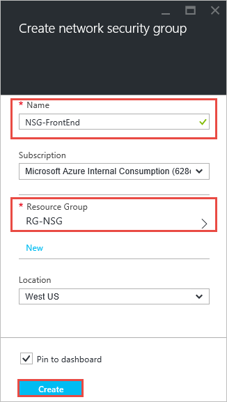
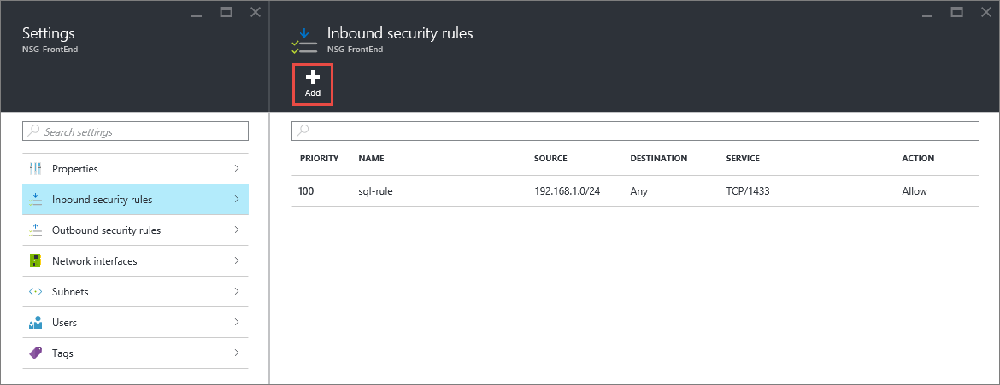
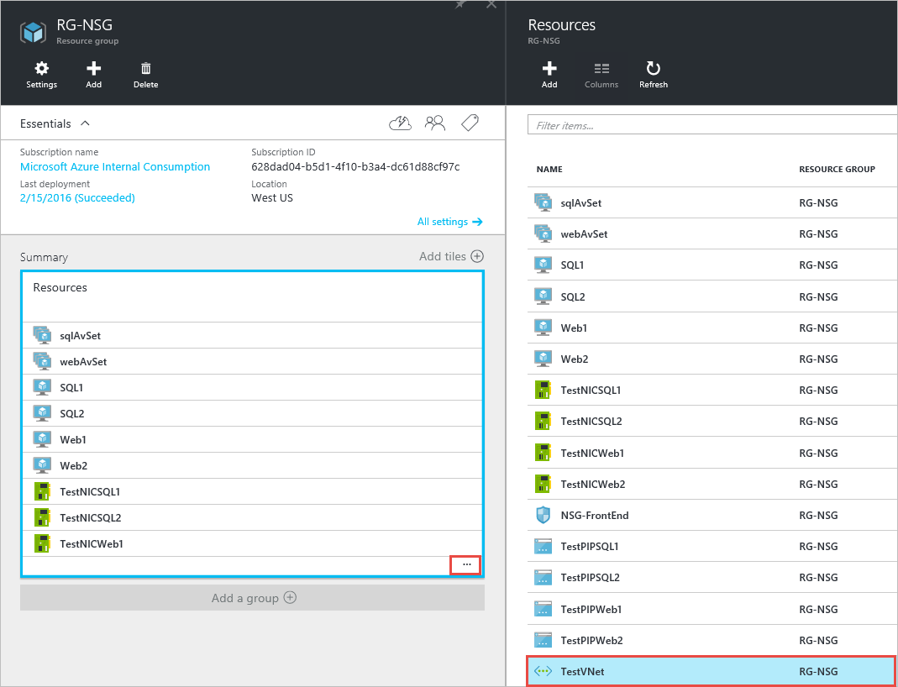
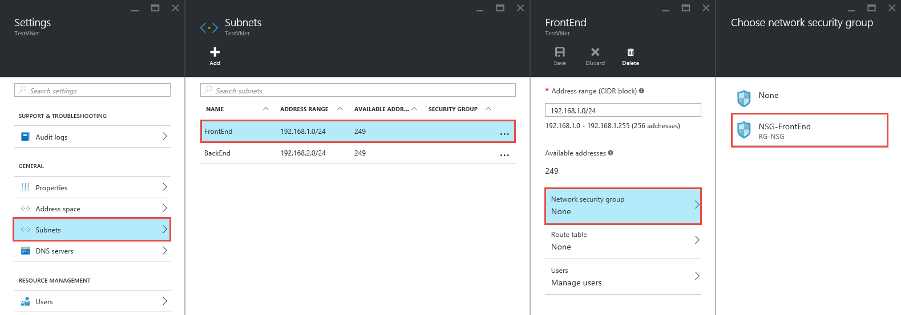
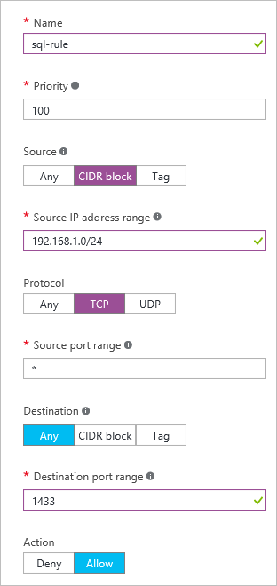
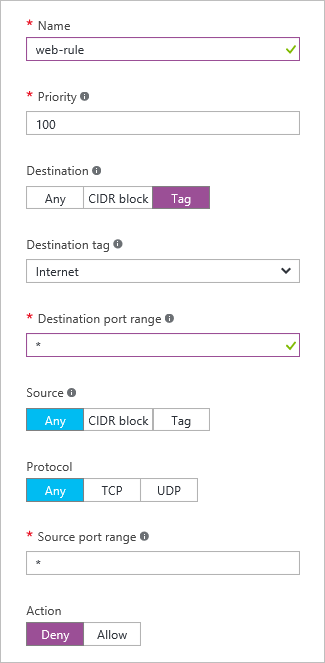

<!-- ARM: tested -->

<properties 
   pageTitle="如何使用 Azure 门户预览在 ARM 模式下创建 NSG | Azure"
   description="了解如何使用 Azure 门户预览在 ARM 模式下创建和部署 NSG"
   services="virtual-network"
   documentationCenter="na"
   authors="telmosampaio"
   manager="carmonm"
   editor="tysonn"
   tags="azure-resource-manager"
/>
<tags
	ms.service="virtual-network"
	ms.date="02/04/2016"
	wacn.date="07/04/2016"/>

# 如何使用 Azure 门户预览管理 NSG

[AZURE.INCLUDE [virtual-networks-create-nsg-selectors-arm-include](../includes/virtual-networks-create-nsg-selectors-arm-include.md)]

[AZURE.INCLUDE [virtual-networks-create-nsg-intro-include](../includes/virtual-networks-create-nsg-intro-include.md)]

[AZURE.INCLUDE [azure-arm-classic-important-include](../includes/azure-arm-classic-important-include.md)]本文介绍资源管理器部署模型。你还可以[在经典部署模型中创建 NSG](/documentation/articles/virtual-networks-create-nsg-classic-ps/)。

[AZURE.INCLUDE [virtual-networks-create-nsg-scenario-include](../includes/virtual-networks-create-nsg-scenario-include.md)]

下面的示例 PowerShell 命令需要一个已经基于上述方案创建的简单环境。如果你想要运行本文档中所显示的命令，首先通过部署[此模板](http://github.com/telmosampaio/azure-templates/tree/master/201-IaaS-WebFrontEnd-SQLBackEnd)构建测试环境，单击“部署至 Azure”，如有必要替换默认参数值，然后按照门户预览中的说明进行操作。下面的步骤使用 **RG-NSG** 作为模板部署到的资源组的名称。

## 创建 NSG-FrontEnd NSG

若要如上述方案所示创建 **NSG-FrontEnd** NSG，请按照以下步骤进行操作。

1. 从浏览器导航到 http://portal.azure.cn， 如有必要，请使用 Azure 帐户登录。
2. 单击“浏览 >”>“网络安全组”。

    

3. 在“网络安全组”边栏选项卡中，单击“添加”。
  
    

4. 在“创建网络安全组”边栏选项卡中，在 “RG-NSG” 资源组中创建名为 “NSG-FrontEnd” 的 NSG，然后单击“创建”。

	

## 在现有 NSG 中创建规则

若要从 Azure 门户预览在现有 NSG 中创建规则，请按照以下步骤进行操作。

2. 单击“浏览 >”>“网络安全组”。

3. 在 NSG 列表中，单击“NSG-FrontEnd”>“入站安全规则”

	

4. 在“入站安全规则”列表中，单击“添加”。

	

5. 在“添加入站安全规则”边栏选项卡中创建一个名为 “web-rule” 的规则，其优先级为 “200”，允许通过 “TCP” 访问端口 “80” 进入来自任何来源的任何 VM，然后单击“确定”。请注意，这些设置中大多数已为默认值。

	

6. 几秒钟后你将看到 NSG 中的新规则。

	

7. 重复到第 6 步以创建名为 “rdp-rule” 的入站规则，其优先级为 “250”，允许通过 “TCP” 经端口 “3389” 访问来自任何来源的任何 VM。

## 将 NSG 关联到 FrontEnd 子网

1. 单击“浏览 >”>“资源组”>“RG-NSG”。
2. 在“RG-NSG”边栏选项卡中，单击“...”>“TestVNet”。

	

3. 在“设置”边栏选项卡中，单击“子网”>“FrontEnd”>“网络安全组”>“NSG-FrontEnd”。

	

4. 在“FrontEnd”边栏选项卡中，单击“保存”。

	

## 创建 NSG-BackEnd NSG

若要创建 **NSG-BackEnd** NSG 并将它关联到 **BackEnd** 子网，请执行以下步骤。

1. 重复[创建 NSG-FrontEnd NSG](#Create-the-NSG-FrontEnd-NSG) 中的步骤以创建名为 *NSG-BackEnd* 的 NSG
2. 重复[在现有 NSG 中创建规则](#Create-rules-in-an-existing-NSG)中的步骤以创建下表中的**入站**规则。

	|入站规则|出站规则|
	|---|---|
	|||

3. 重复[将 NSG 关联到 FrontEnd 子网](#Associate-the-NSG-to-the-FrontEnd-subnet)中的步骤以将 **NSG-Backend** NSG 关联到 **BackEnd** 子网。

## 后续步骤

- 了解如何[管理现有 NSG](/documentation/articles/virtual-network-manage-nsg-arm-portal/)
- 为 NSG [启用日志记录](/documentation/articles/virtual-network-nsg-manage-log/)。

<!---HONumber=Mooncake_0516_2016-->