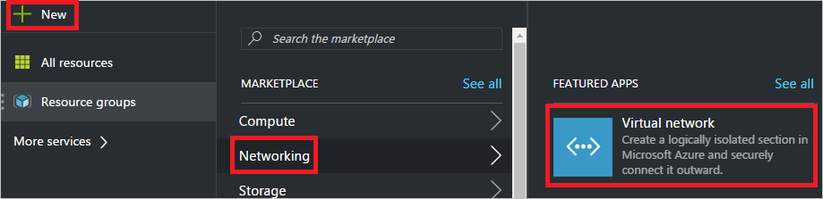
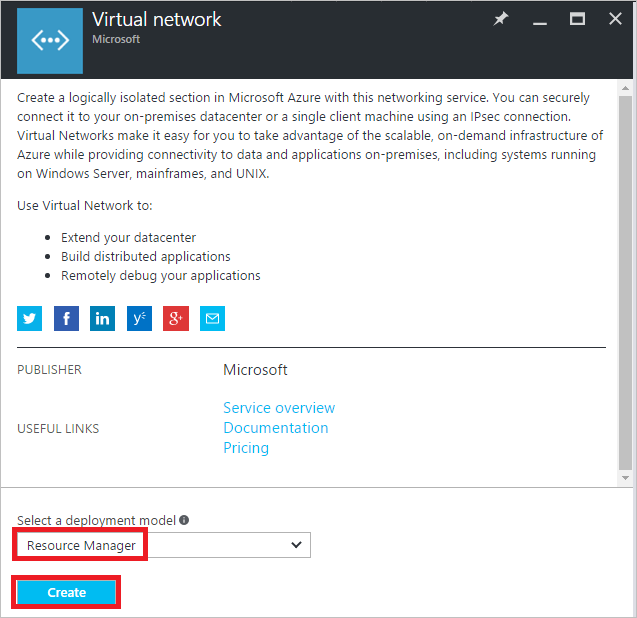
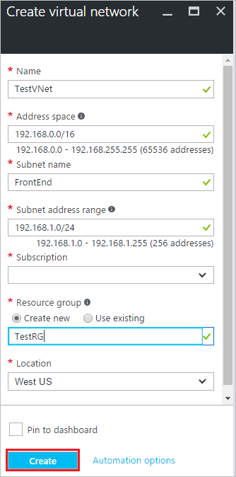
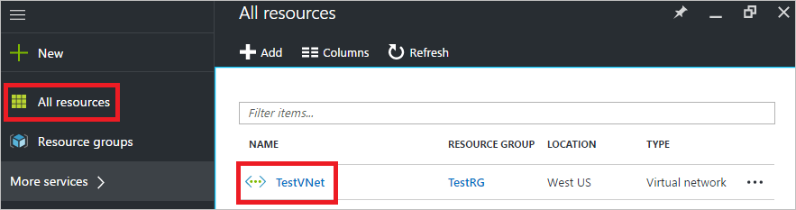
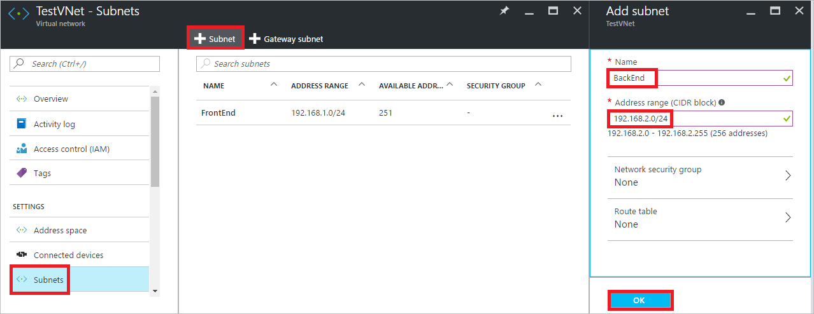
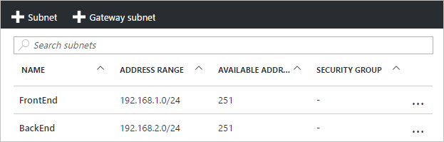

<properties
    pageTitle="使用 Azure 门户预览创建虚拟网络 | Azure"
    description="了解如何使用 Azure 门户预览创建虚拟网络 | Resource Manager。"
    services="virtual-network"
    documentationcenter=""
    author="jimdial"
    manager="carmonm"
    editor=""
    tags="azure-resource-manager" />  

<tags
    ms.assetid="4ad679a4-a959-4e48-a317-d9f5655a442b"
    ms.service="virtual-network"
    ms.devlang="na"
    ms.topic="hero-article"
    ms.tgt_pltfrm="na"
    ms.workload="infrastructure-services"
    ms.date="11/8/2016"
    wacn.date="12/26/2016"
    ms.author="jdial" />  

# 使用 Azure 门户预览创建虚拟网络

[AZURE.INCLUDE [virtual-networks-create-vnet-intro](../../includes/virtual-networks-create-vnet-intro-include.md)]

Azure 有两个部署模型：Azure Resource Manager 和经典模型。Azure 建议通过 Resource Manager 部署模型创建资源。若要深入了解这两个模型之间的差异，请阅读[了解 Azure 部署模型](/documentation/articles/resource-manager-deployment-model/)一文。
 
本文介绍如何使用 Azure 门户预览通过 Resource Manager 部署模型创建 VNet。还可以使用其他工具通过 Resource Manager 创建 VNet，或通过从以下列表中选择不同的选项使用经典部署模型创建 VNet：
> [AZURE.SELECTOR]
- [门户](/documentation/articles/virtual-networks-create-vnet-arm-pportal/)
- [PowerShell](/documentation/articles/virtual-networks-create-vnet-arm-ps/)
- [CLI](/documentation/articles/virtual-networks-create-vnet-arm-cli/)
- [门户（经典）](/documentation/articles/virtual-networks-create-vnet-classic-pportal/)
- [PowerShell（经典）](/documentation/articles/virtual-networks-create-vnet-classic-netcfg-ps/)
- [CLI（经典）](/documentation/articles/virtual-networks-create-vnet-classic-cli/)

[AZURE.INCLUDE [virtual-networks-create-vnet-scenario-include](../../includes/virtual-networks-create-vnet-scenario-include.md)]

## 创建虚拟网络

若要使用 Azure 门户预览创建虚拟网络，请完成以下步骤：

1. 从浏览器导航到 http://portal.azure.cn， 根据需要使用 Azure 帐户登录。
2. 单击“新建”>“网络”>“虚拟网络”，如下图所示：

	  

3. 在显示的“虚拟网络”边栏选项卡中，确保选中“Resource Manager”，然后单击“创建”，如下图所示：

	  

4. 在显示的“创建虚拟网络”边栏选项卡中，在“名称”中输入 *TestVNet* ；在“地址空间”中输入 *192.168.0.0/16* ；在“子网名称”中输入 *FrontEnd* ；在“子网地址范围”中输入 *192.168.1.0/24* ；在“资源组”中输入 *TestRG* ，选择“订阅”和“位置”，然后单击“创建”按钮，如下图所示：

	  

	或者可选择现有资源组。若要了解有关资源组的详细信息，请参阅 [Resource Manager 概述](/documentation/articles/resource-group-overview/#resource-groups)一文。还可选择其他位置。若要了解有关 Azure 位置和区域的详细信息，请阅读 [Azure 区域](https://azure.microsoft.com/regions)一文。

5. 该门户仅允许用户在创建 VNet 时创建一个子网。对于此方案，必须在创建 VNet 之后创建第二个子网。若要创建第二个子网，请单击“所有资源”，然后在“所有资源”边栏选项卡中单击“TestVNet”，如下图所示：

	  

6. 在显示的“TestVNet”边栏选项卡中，单击“子网”，然后单击“+Subnet”，在“名称”中输入 *BackEnd* ，在“添加子网”边栏选项卡的“地址范围”中输入 *192.168.2.0/24* ，然后单击“确定”，如下图所示：

	  

7. 已列出两个子网，如下图所示：
	
	  

本文介绍如何创建具有两个子网的虚拟网络，以便将其用于测试。在创建用于生产使用的虚拟网络之前，建议阅读[虚拟网络概述](/documentation/articles/virtual-networks-overview/)和[虚拟网络规划和设计](/documentation/articles/virtual-network-vnet-plan-design-arm/)文章，充分了解虚拟网络和所有设置。

## 后续步骤

了解如何连接：

- 通过阅读[创建 Windows VM](/documentation/articles/virtual-machines-windows-hero-tutorial/) 或[创建 Linux VM](/documentation/articles/virtual-machines-linux-quick-create-portal/) 文章，将虚拟机 (VM) 连接到虚拟网络。可选择将 VM 连接到现有 VNet 和子网，而不按文章中的步骤创建 VNet 和子网。
- 通过阅读[连接 VNet](/documentation/articles/vpn-gateway-howto-vnet-vnet-resource-manager-portal/) 一文将虚拟网络连接到其他虚拟网络。
- 使用站点到站点虚拟专用网络 (VPN) 或 ExpressRoute 线路将虚拟网络连接到本地网络。通过阅读[使用站点到站点 VPN 将 VNet 连接到本地网络](/documentation/articles/vpn-gateway-howto-multi-site-to-site-resource-manager-portal/)和[将 VNet 链接到 ExpressRoute 线路](/documentation/articles/expressroute-howto-linkvnet-portal-resource-manager/)文章，了解操作方法。

<!---HONumber=Mooncake_1219_2016-->