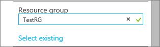
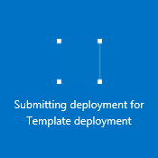

<properties
    pageTitle="使用 Resource Manager 模板创建虚拟网络 | Azure"
    description="了解如何使用模板创建虚拟网络 | Resource Manager。"
    services="virtual-network"
    documentationcenter=""
    author="jimdial"
    manager="carmonm"
    editor="tysonn"
    tags="azure-resource-manager" />
<tags 
    ms.assetid="69530861-2f97-4a6e-b336-a7baf2690044"
    ms.service="virtual-network"
    ms.devlang="na"
    ms.topic="article"
    ms.tgt_pltfrm="na"
    ms.workload="infrastructure-services"
    ms.date="03/15/2016"
    wacn.date="02/20/2017"
    ms.author="jdial" />

# 使用模板创建虚拟网络

[AZURE.INCLUDE [virtual-networks-create-vnet-intro](../../includes/virtual-networks-create-vnet-intro-include.md)]

Azure 有两个部署模型：Azure Resource Manager 和经典模型。Azure 建议通过 Resource Manager 部署模型创建资源。若要深入了解这两个模型之间的差异，请阅读[了解 Azure 部署模型](/documentation/articles/resource-manager-deployment-model/)一文。
 
本文介绍如何使用 Azure Resource Manager 模板通过 Resource Manager 部署模型创建 VNet。还可以使用其他工具通过 Resource Manager 创建 VNet，或通过从以下列表中选择不同的选项使用经典部署模型创建 VNet：
> [AZURE.SELECTOR]
- [门户](/documentation/articles/virtual-networks-create-vnet-arm-pportal/)
- [PowerShell](/documentation/articles/virtual-networks-create-vnet-arm-ps/)
- [CLI](/documentation/articles/virtual-networks-create-vnet-arm-cli/)
- [模板](/documentation/articles/virtual-networks-create-vnet-arm-template-click/)
- [门户（经典）](/documentation/articles/virtual-networks-create-vnet-classic-pportal/)
- [PowerShell（经典）](/documentation/articles/virtual-networks-create-vnet-classic-netcfg-ps/)
- [CLI（经典）](/documentation/articles/virtual-networks-create-vnet-classic-cli/)

可了解如何从 GitHub 下载并修改现有 ARM 模板，以及如何通过 GitHub、PowerShell 和 Azure CLI 部署该模板。

如果直接从 GitHub 部署 ARM 模板，而不进行任何更改，请跳到[从 GitHub 部署模板](#deploy-the-arm-template-by-using-click-to-deploy)。

[AZURE.INCLUDE [virtual-networks-create-vnet-scenario-include](../../includes/virtual-networks-create-vnet-scenario-include.md)]

## 下载 Azure Resource Manager 模板并对其进行了解
可以从 GitHub 下载用于创建 VNet 和两个子网的现有模板，进行任何所需的更改，然后重用该模板。若要执行此操作，请完成以下步骤：

1. 导航到[示例模板页](https://github.com/Azure/azure-quickstart-templates/tree/master/101-vnet-two-subnets)。
2. 单击 **azuredeploy.json**，然后单击 **RAW**。
3. 将该文件保存到你计算机上的本地文件夹。
4. 如果熟悉模板，请跳到步骤 7。
5. 打开刚保存的文件，并查看 **parameters** 下第 5 行中的内容。ARM 模板参数提供了在部署过程中可以填充的值的占位符。
   
   | 参数 | 说明 |
   | --- | --- |
   | **位置** | 将创建 VNet 的 Azure 区域 |
   | **vnetName** | 新 VNet 的名称 |
   | **addressPrefix** | VNet 的地址空间，CIDR 格式 |
   | **subnet1Name** | 第一个 VNet 的名称 |
   | **subnet1Prefix** | 第一个子网的 CIDR 块 |
   | **subnet2Name** | 第二个 VNet 的名称 |
   | **subnet2Prefix** | 第二个子网的 CIDR 块 |
   
   > [AZURE.IMPORTANT]
   在 GitHub 中维护的 Azure Resource Manager 模板可能随着时间的推移发生变化。请确保在使用该模板之前对其进行检查。
   > 
   > 
6. 查看 **resources** 下的内容，并注意以下项：
   
   * **type**。模板创建的资源的类型。在此实例中为 **Microsoft.Network/virtualNetworks**，表示 VNet。
   * **name**。资源的名称。请注意使用 **[parameters('vnetName')]**，这意味着在部署过程中将由用户或参数文件作为输入提供该名称。
   * **properties**。资源的属性列表。此模板在 VNet 创建期间使用地址空间和子网属性。
7. 导航回[示例模板页](https://github.com/Azure/azure-quickstart-templates/tree/master/101-vnet-two-subnets)。
8. 单击 **azuredeploy-paremeters.json**，然后单击 **RAW**。
9. 将该文件保存到你计算机上的本地文件夹。
10. 打开刚保存的文件并编辑参数的值。使用以下值来部署方案中所述的 VNet：

            {
              "location": {
                "value": "China North"
              },
              "vnetName": {
                  "value": "TestVNet"
              },
              "addressPrefix": {
                  "value": "192.168.0.0/16"
              },
              "subnet1Name": {
                  "value": "FrontEnd"
              },
              "subnet1Prefix": {
                "value": "192.168.1.0/24"
              },
              "subnet2Name": {
                  "value": "BackEnd"
              },
              "subnet2Prefix": {
                  "value": "192.168.2.0/24"
              }
            }

11. 保存文件。

## 使用 PowerShell 部署模板

完成以下步骤，以使用 PowerShell 部署下载的模板：

1. 通过完成[如何安装和配置 Azure PowerShell](/documentation/articles/powershell-install-configure/) 一文中的步骤来安装和配置 Azure PowerShell。
2. 运行以下命令来创建新资源组：

        New-AzureRmResourceGroup -Name TestRG -Location chinaeast

此命令在中国北部 Azure 区域创建一个名为 *TestRG* 的资源组。有关资源组的详细信息，请访问 [Azure 资源管理器概述](/documentation/articles/resource-group-overview/)。

	Expected output:

        ResourceGroupName : TestRG
        Location          : chinaeast
        ProvisioningState : Succeeded
        Tags              :
        Permissions       :
                            Actions  NotActions
                            =======  ==========
                            *
        ResourceId        : /subscriptions/[Id]/resourceGroups/TestRG

3. 运行以下命令，以使用之前下载并修改的模板和参数文件部署新 VNet：

        New-AzureRmResourceGroupDeployment -Name TestVNetDeployment -ResourceGroupName TestRG `
        -TemplateFile C:\ARM\azuredeploy.json -TemplateParameterFile C:\ARM\azuredeploy-parameters.json

预期输出：
   
        DeploymentName    : TestVNetDeployment
        ResourceGroupName : TestRG
        ProvisioningState : Succeeded
        Timestamp         : [Date and time]
        Mode              : Incremental
        TemplateLink      :
        Parameters        :
                            Name             Type                       Value
                            ===============  =========================  ==========
                            location         String                     China North
                            vnetName         String                     TestVNet
                            addressPrefix    String                     192.168.0.0/16
                            subnet1Prefix    String                     192.168.1.0/24
                            subnet1Name      String                     FrontEnd
                            subnet2Prefix    String                     192.168.2.0/24
                            subnet2Name      String                     BackEnd
   
        Outputs           :
4. 运行以下命令查看新 VNet 的属性：

        Get-AzureRmVirtualNetwork -ResourceGroupName TestRG -Name TestVNet

预期输出：

        Name              : TestVNet
        ResourceGroupName : TestRG
        Location          : chinaeast
        Id                : /subscriptions/[Id]/resourceGroups/TestRG/providers/Microsoft.Network/virtualNetworks/TestVNet
        Etag              : W/"[Id]"
        ProvisioningState : Succeeded
        Tags              :
        AddressSpace      : {
                              "AddressPrefixes": [
                                "192.168.0.0/16"
                              ]
                            }
        DhcpOptions       : {
                              "DnsServers": null
                            }
        NetworkInterfaces : null
        Subnets           : [
                              {
                                "Name": "FrontEnd",
                                "Etag": "W/\"[Id]\"",
                                "Id": "/subscriptions/[Id]/resourceGroups/TestRG/providers/Microsoft.Network/virtualNetworks/TestVNet/subnets/FrontEnd",
                                "AddressPrefix": "192.168.1.0/24",
                                "IpConfigurations": [],
                                "NetworkSecurityGroup": null,
                                "RouteTable": null,
                                "ProvisioningState": "Succeeded"
                              },
                              {
                                "Name": "BackEnd",
                                "Etag": "W/\"[Id]\"",
                                "Id": "/subscriptions/xxxxxxxx-xxxx-xxxx-xxxx-xxxxxxxxxxxx/resourceGroups/TestRG/providers/Microsoft.Network/virtualNetworks/TestVNet/subnets/BackEnd",
                                "AddressPrefix": "192.168.2.0/24",
                                "IpConfigurations": [],
                                "NetworkSecurityGroup": null,
                                "RouteTable": null,
                                "ProvisioningState": "Succeeded"
                              }
                            ]

##  通过单击部署方式部署模板

可重用上传到由 Microsoft 维护并对社区开放的 GitHub 存储库的预定义 Azure Resource Manager 模板。这些模板可直接从 GitHub 部署，也可下载并修改以满足你的需要。若要部署创建包含两个子网的 VNet 的模板，请完成以下步骤：

3. 单击**“部署到 Azure”**。如有必要，输入你的 Azure 登录凭据。

    
4. 在**“参数”**边栏选项卡中，输入要用于创建新 VNet 的值，然后单击**“确定”**。下图显示此方案的值：
   
      

5. 单击**“资源组”**并选择要将 VNet 添加到的资源组，或者单击**“新建”**将 VNet 添加到新资源组。下图显示了名为 **TestRG** 的新资源组的资源组设置：

      

6. 如有必要，请更改 VNet 的“订阅”和“位置”设置。
7. 如果你不想看到该 VNet 作为**启动板**中的磁贴，请禁用**“固定到启动板”**。
8. 单击“法律条款”，阅读条款，然后单击“购买”以表示同意。
9. 单击“创建”以创建该 VNet。
   
      

10. 部署完成后，在 Azure 门户预览中单击“更多服务”，接下来在显示的筛选框中键入“虚拟网络”，然后单击“虚拟网络”以查看“虚拟网络”边栏选项卡。在边栏选项卡中，单击“TestVNet”。在“TestVNet”边栏选项卡中，单击“子网”查看创建的子网，如下图所示：
    
       

## 后续步骤

了解如何连接：

- 通过阅读[创建 Windows VM](/documentation/articles/virtual-machines-windows-hero-tutorial/) 或[创建 Linux VM](/documentation/articles/virtual-machines-linux-quick-create-portal/) 文章，将虚拟机 (VM) 连接到虚拟网络。可选择将 VM 连接到现有 VNet 和子网，而不按文章中的步骤创建 VNet 和子网。
- 通过阅读[连接 VNet](/documentation/articles/vpn-gateway-vnet-vnet-rm-ps/) 一文将虚拟网络连接到其他虚拟网络。
- 使用站点到站点虚拟专用网络 (VPN) 或 ExpressRoute 线路将虚拟网络连接到本地网络。通过阅读[使用站点到站点 VPN 将 VNet 连接到本地网络](/documentation/articles/vpn-gateway-howto-multi-site-to-site-resource-manager-portal/)和[将 VNet 链接到 ExpressRoute 线路](/documentation/articles/expressroute-howto-linkvnet-arm/)文章，了解操作方法。

<!---HONumber=Mooncake_1219_2016-->