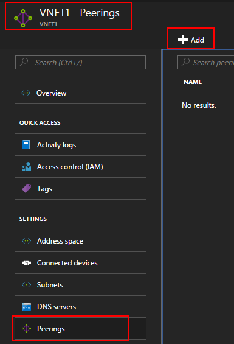
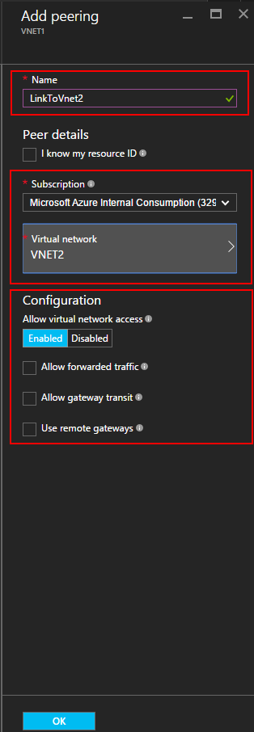
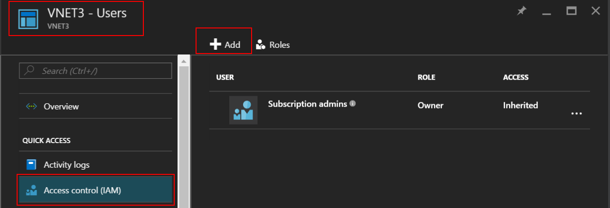
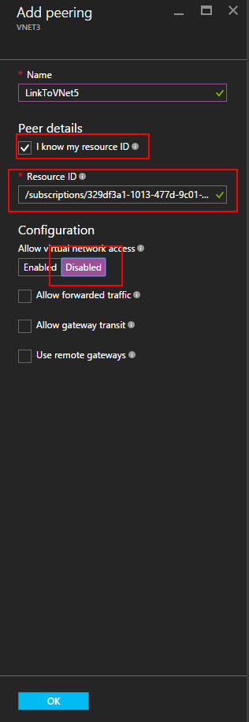
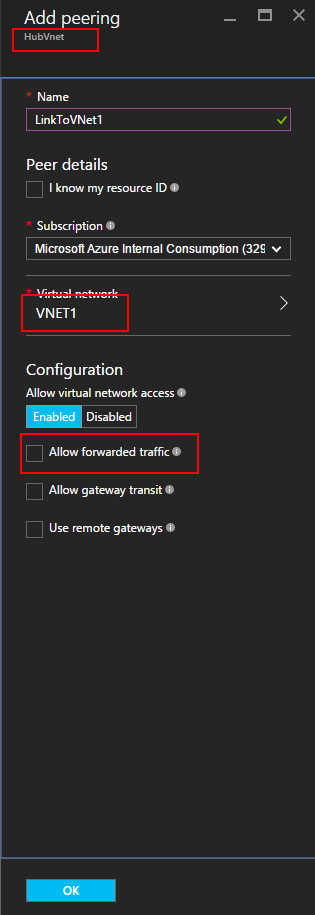
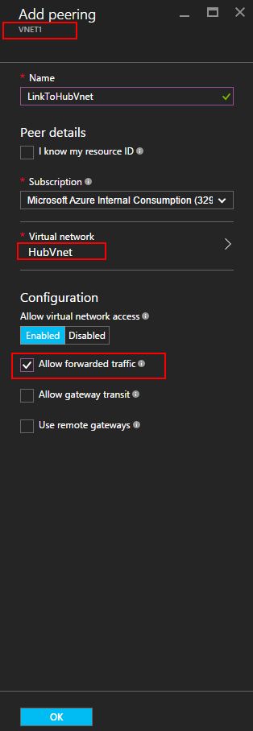

<properties
   pageTitle="使用 Azure 门户创建 VNet 对等互连 | Azure"
   description="了解如何在 Resource Manager 中使用 Azure 门户创建虚拟网络。"
   services="virtual-network"
   documentationCenter=""
   authors="NarayanAnnamalai"
   manager="jefco"
   editor=""
   tags="azure-resource-manager"/>

<tags
   ms.service="virtual-network"
   ms.devlang="na"
   ms.topic="hero-article"
   ms.tgt_pltfrm="na"
   ms.workload="infrastructure-services"
   ms.date="09/14/2016"
   wacn.date="12/07/2016"
   ms.author="narayanannamalai;annahar"/>

# 使用 Azure 门户创建虚拟网络对等互连

[AZURE.INCLUDE [virtual-networks-create-vnet-selectors-arm-include](../../includes/virtual-networks-create-vnetpeering-selectors-arm-include.md)]

[AZURE.INCLUDE [virtual-networks-create-vnet-intro](../../includes/virtual-networks-create-vnetpeering-intro-include.md)]

[AZURE.INCLUDE [virtual-networks-create-vnet-scenario-basic-include](../../includes/virtual-networks-create-vnetpeering-scenario-basic-include.md)]

若要通过 Azure 门户，基于上述方案创建 VNet 对等互连，请执行以下步骤。

1. 从浏览器导航到 http://portal.azure.cn， 如有必要，请使用 Azure 帐户登录。
2. 若要建立 VNET 对等互连，需要在两个 VNet 之间创建两个链接，每个方向各一个。可先创建 VNET1 到 VNET2 的 VNET 对等互连链接。在门户中，单击“浏览”> 选择“虚拟网络”。

	

3. 在“虚拟网络”边栏选项卡中，选择“VNET1”，再依次单击“对等互连”和“添加”。

	

4. 在“添加对等互连”边栏选项卡中，将对等互连链接命名为 LinkToVnet2，选择订阅和对等虚拟网络 VNET2，然后单击“确定”。

	

5. 该 VNET 对等互连链接创建完成后，就可以看到链接状态如下所示：

	

6. 接下来创建 VNET2 到 VNET1 的 VNET 对等互连链接。在“虚拟网络”边栏选项卡中，选择“VNET2”，再依次单击“对等互连”和“添加”。

	

7. 在“添加对等互连”边栏选项卡中，将对等互连链接命名为 LinkToVnet1，选择订阅和对等虚拟网络，然后单击“确定”。

	

8. 该 VNET 对等互连链接创建完成后，就可以看到链接状态如下所示：

	

9. 检查 LinkToVnet2 的状态，该状态现也变为“已连接”。

	  

    > [AZURE.NOTE] 仅当两个链接已连接在一起时，才会建立 VNET 对等互连。

每个链接有几个可配置属性：

|选项|说明|默认|
|:-----|:----------|:------|
|允许虚拟网络访问|是否将对等 VNet 的地址空间包括为 Virtual\_network 标记的一部分|是|
|允许转发的流量|允许接受或丢弃不是源自对等 VNet 的流量|否|
|允许网关传输|允许对等 VNet 使用你的 VNet 网关|否|
|使用远程网关|使用对等方的 VNet 网关。对等 VNet 必须已配置网关并且已选中“允许网关传输”。如果你已配置了网关，则无法使用此选项|否|

VNet 对等互连中的每个链接都具有上述这组属性。从门户中，可以单击 VNet 对等互连链接并更改任何可用的选项，单击“保存”以使更改生效。

[AZURE.INCLUDE [virtual-networks-create-vnet-scenario-crosssub-include](../../includes/virtual-networks-create-vnetpeering-scenario-crosssub-include.md)]

1. 从浏览器导航到 http://portal.azure.cn， 如有必要，请使用 Azure 帐户登录。
2. 在此示例中，我们将使用两个订阅 - 订阅 A 和订阅 B，以及各自的特权用户 - 用户 A 和用户 B
3. 在门户中，单击“浏览”，然后选择“虚拟网络”单击 VNET，并单击“添加”。

    

4. 在“添加访问权限”边栏选项卡上，单击以选择角色，并选择“网络参与者”，单击“添加用户”，键入用户 B 的登录名称，然后单击“确定”。

    

    这不是必须的，只要请求匹配，即使用户分别提出针对各个 Vnet 的对等互连请求，也可建立对等互连。添加另一个 VNet 的特权用户作为本地 VNet 用户可以更轻松地在门户中执行安装程序。

5. 然后通过订阅 B 的特权用户 B 登录到 Azure 门户。按照以上步骤将用户 A 添加为网络参与者。

      

    > [AZURE.NOTE] 可以在浏览器中同时注销和登录两个用户会话，确保成功启用授权。

6. 作为用户 A 登录到门户，导航到 VNET3 边栏选项卡，单击“对等互连”，勾选“我知道我的资源 ID”复选框并使用以下格式键入 VNET5 的资源 ID。

        /subscriptions/<Subscription- ID>/resourceGroups/<ResourceGroupName>/providers/Microsoft.Network/VirtualNetwork/<VNET name>

    

7. 作为用户 B 登录到门户，并按照上述步骤创建从 VNET5 到 VNet3 的对等互连链接。

      

8. 将建立对等互连，VNet3 中的任意虚拟机应能够与 VNet5 中的任意虚拟机进行通信。

[AZURE.INCLUDE [virtual-networks-create-vnet-scenario-transit-include](../../includes/virtual-networks-create-vnetpeering-scenario-transit-include.md)]

1. 建立从 HubVnet 到 VNET1 的 VNET 对等互连链接。请注意，没有为该链接选择“允许转发的流量”选项。

      

2. 可以创建从 VNET1 到 HubVnet 的对等互连链接。请注意，要选择“允许转发的流量”选项。

      

3. 对等互连建立后，可以参考此[文章](/documentation/articles/virtual-network-create-udr-arm-ps/)，定义用户定义的路由 (UDR)，以便通过虚拟设备重定向 VNet1 流量以使用其功能。在路由中指定下一个跃点地址时，可以在对等 VNet HubVNet 中将其设置为虚拟装置的 IP 地址。

[AZURE.INCLUDE [virtual-networks-create-vnet-scenario-asmtoarm-include](../../includes/virtual-networks-create-vnetpeering-scenario-asmtoarm-include.md)]

1. 从浏览器导航到 http://portal.azure.cn， 如有必要，请使用 Azure 帐户登录。

2. 若要在此方案中建立 VNET 对等互连，只需创建一个链接，从 Azure Resource Manager 中的虚拟网络连接到经典部署模型中的另一个虚拟网络。即，从 **VNET1** 连接到 **VNET2**。在门户中，单击“浏览”> 选择“虚拟网络”

3. 在“虚拟网络”边栏选项卡中，选择“VNET1”。单击“对等互连”，然后单击“添加”。

4. 在“添加对等互连”边栏选项卡中，为链接命名。在本例中命名为 **LinkToVNet2**。在“对等互连详细信息”下面，选择“经典”。

5. 然后选择订阅和对等虚拟网络 **VNET2**。然后，单击“确定”。

      

6. 创建此 VNet 对等链接后，两个虚拟网络将对等互连，随后会显示以下信息：

      

## 删除 VNet 对等互连

1.	从浏览器导航到 http://portal.azure.cn， 如有必要，请使用 Azure 帐户登录。
2.	转到“虚拟网络”边栏选项卡，单击“对等互连”，单击要删除的链接，单击“删除”按钮。

    

3. 删除 VNET 对等互连中的一个链接后，该对等链接状态将为断开。

    

4. 在此状态下，在对等链接状态更改为已启动之前无法重新创建链接。建议先删除这两个链接，然后再重新创建 VNet 对等互连。

<!---HONumber=Mooncake_1010_2016-->